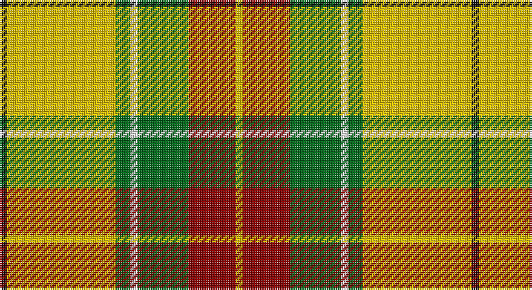

This page is one **sett** — a single exact thread-count. It belongs to the [tartan](/setts/k2ly30g4w2g14r13ly2/)
(the same proportion at any scale), whose colour order is pattern [KYGWGRY](/stripes/kygwgry/).

Sourced from house-of-tartan.  It is a [7 stripe tartan](/stripes/stripes7/).

Original link http://www.house-of-tartan.scotland.net/house/TartanViewjs.asp?colr=Def&tnam=1217

## Provenance

Earliest known date: 1982 Red Remony

## Thread count
K/4 Y60 G8 LN4 G28 DR26 Ya/4

One full sett is **260 threads**.

## Palette

Palette: <strong>Tartan Register</strong>
<table><thead><tr><th>Colour</th><th>Threads</th><th>Shade</th><th>Base</th><th>OKLCh</th></tr></thead><tbody><tr><td>K/</td><td style="text-align:right;font-variant-numeric:tabular-nums">4</td><td><code style="background-color:#101010;">#101010</code> <small style="color:#888">#101010</small></td><td>K <code style="background-color:#000000;">#000000</code></td><td><small style="color:#888">oklch(17.3% 0.000 89.9)</small></td></tr><tr><td>Y</td><td style="text-align:right;font-variant-numeric:tabular-nums">60</td><td><code style="background-color:#E8C000;">#E8C000</code> <small style="color:#888">#E8C000</small></td><td>Y <code style="background-color:#F2BF00;">#F2BF00</code></td><td><small style="color:#888">oklch(81.9% 0.168 93.7)</small></td></tr><tr><td>G</td><td style="text-align:right;font-variant-numeric:tabular-nums">8</td><td><code style="background-color:#006818;">#006818</code> <small style="color:#888">#006818</small></td><td>G <code style="background-color:#006100;">#006100</code></td><td><small style="color:#888">oklch(45.0% 0.142 145.0)</small></td></tr><tr><td>LN</td><td style="text-align:right;font-variant-numeric:tabular-nums">4</td><td><code style="background-color:#E0E0E0;">#E0E0E0</code> <small style="color:#888">#E0E0E0</small></td><td>W <code style="background-color:#F7F7F7;">#F7F7F7</code></td><td><small style="color:#888">oklch(90.7% 0.000 89.9)</small></td></tr><tr><td>G</td><td style="text-align:right;font-variant-numeric:tabular-nums">28</td><td><code style="background-color:#006818;">#006818</code> <small style="color:#888">#006818</small></td><td>G <code style="background-color:#006100;">#006100</code></td><td><small style="color:#888">oklch(45.0% 0.142 145.0)</small></td></tr><tr><td>DR</td><td style="text-align:right;font-variant-numeric:tabular-nums">26</td><td><code style="background-color:#880000;">#880000</code> <small style="color:#888">#880000</small></td><td>R <code style="background-color:#CC0000;">#CC0000</code></td><td><small style="color:#888">oklch(39.4% 0.162 29.2)</small></td></tr><tr><td>Ya/</td><td style="text-align:right;font-variant-numeric:tabular-nums">4</td><td><code style="background-color:#E8C000;">#E8C000</code> <small style="color:#888">#E8C000</small></td><td>Y <code style="background-color:#F2BF00;">#F2BF00</code></td><td><small style="color:#888">oklch(81.9% 0.168 93.7)</small></td></tr></tbody></table>

# Sample pattern

## Nearest tartans

The nearest existing variants by ΔTartan distance, with this tartan at the top so the swatches line up against it.

ΔTartan

Tartan

Sett

—

<a href="/ttd/edit/#slug=k2ly30g4w2g14r13ly2~x2">Red Rum Commemorative Tartan</a> <a class="nn-out" href="/variants/s7/k2ly30g4w2g14r13ly2~x2/" title="open its dictionary page">↗</a>

1.17

<a href="/ttd/edit/#slug=ly4g2ly2g2ly2g24k2r16w9db3~x2&amp;base=k2ly30g4w2g14r13ly2~x2">North West Territories</a> <a class="nn-out" href="/variants/s10/ly4g2ly2g2ly2g24k2r16w9db3~x2/" title="open its dictionary page">↗</a>

1.25

<a href="/ttd/edit/#slug=r2w2ly27g14ly2db14ly2~x2&amp;base=k2ly30g4w2g14r13ly2~x2">Fraser, Yellow</a> <a class="nn-out" href="/variants/s7/r2w2ly27g14ly2db14ly2~x2/" title="open its dictionary page">↗</a>

1.29

<a href="/ttd/edit/#slug=ly4r2ly21dt11w2o21lyi4~x2&amp;base=k2ly30g4w2g14r13ly2~x2">Barbour - Muted</a> <a class="nn-out" href="/variants/s7/ly4r2ly21dt11w2o21lyi4~x2/" title="open its dictionary page">↗</a>

1.34

<a href="/ttd/edit/#slug=k5lyi2dy7ly18dy2w2~x4&amp;base=k2ly30g4w2g14r13ly2~x2">Shepherd Piping (Personal)</a> <a class="nn-out" href="/variants/s6/k5lyi2dy7ly18dy2w2~x4/" title="open its dictionary page">↗</a>

1.38

<a href="/ttd/edit/#slug=r2w2ly27dg14ly2db14ly2~x2&amp;base=k2ly30g4w2g14r13ly2~x2">Fraser Yellow</a> <a class="nn-out" href="/variants/s7/r2w2ly27dg14ly2db14ly2~x2/" title="open its dictionary page">↗</a>

1.40

<a href="/ttd/edit/#slug=w2g27ly1lo7b5ly5r17ly6b1~x2&amp;base=k2ly30g4w2g14r13ly2~x2">Elystan Glodrydd (Welsh Tribe)</a> <a class="nn-out" href="/variants/s9/w2g27ly1lo7b5ly5r17ly6b1~x2/" title="open its dictionary page">↗</a>

1.47

<a href="/ttd/edit/#slug=dg1dy7dg7o2dy1ly15w1~x4&amp;base=k2ly30g4w2g14r13ly2~x2">Regalia</a> <a class="nn-out" href="/variants/s7/dg1dy7dg7o2dy1ly15w1~x4/" title="open its dictionary page">↗</a>

1.48

<a href="/ttd/edit/#slug=lo4g2lo2g2lo2g24k2r16w9db3~x2&amp;base=k2ly30g4w2g14r13ly2~x2">North West Territories</a> <a class="nn-out" href="/variants/s10/lo4g2lo2g2lo2g24k2r16w9db3~x2/" title="open its dictionary page">↗</a>

1.54

<a href="/ttd/edit/#slug=ly83k35w3g35k3ly10&amp;base=k2ly30g4w2g14r13ly2~x2">Brandon Manitoba Trade Tartan</a> <a class="nn-out" href="/variants/s6/ly83k35w3g35k3ly10/" title="open its dictionary page">↗</a>

1.56

<a href="/ttd/edit/#slug=r12g3ly4k2ly4g12ly2r3w1~x4&amp;base=k2ly30g4w2g14r13ly2~x2">Prince Charles Edward</a> <a class="nn-out" href="/variants/s9/r12g3ly4k2ly4g12ly2r3w1~x4/" title="open its dictionary page">↗</a>

## Neighbour map

Every grey dot is one of 14360 variants placed by the first two principal components of the ΔTartan feature space (44% of its variance). Red is this tartan; blue dots are its nearest — click one to open its page.

<svg viewBox="0 0 640 380" role="img" style="max-width:100%;height:auto;border:1px solid #e0e0e0;border-radius:4px;display:block" xmlns="http://www.w3.org/2000/svg"><image href="/nn/cloud.v1.png" width="640" height="380"/><a href="/variants/s10/ly4g2ly2g2ly2g24k2r16w9db3~x2/"><circle cx="161.0" cy="111.9" r="4" fill="#3465a4"><title>North West Territories</title></circle></a><a href="/variants/s7/r2w2ly27g14ly2db14ly2~x2/"><circle cx="227.8" cy="143.9" r="4" fill="#3465a4"><title>Fraser, Yellow</title></circle></a><a href="/variants/s7/ly4r2ly21dt11w2o21lyi4~x2/"><circle cx="147.8" cy="145.2" r="4" fill="#3465a4"><title>Barbour - Muted</title></circle></a><a href="/variants/s6/k5lyi2dy7ly18dy2w2~x4/"><circle cx="207.0" cy="162.7" r="4" fill="#3465a4"><title>Shepherd Piping (Personal)</title></circle></a><a href="/variants/s7/r2w2ly27dg14ly2db14ly2~x2/"><circle cx="223.1" cy="142.7" r="4" fill="#3465a4"><title>Fraser Yellow</title></circle></a><a href="/variants/s9/w2g27ly1lo7b5ly5r17ly6b1~x2/"><circle cx="168.9" cy="86.7" r="4" fill="#3465a4"><title>Elystan Glodrydd (Welsh Tribe)</title></circle></a><a href="/variants/s7/dg1dy7dg7o2dy1ly15w1~x4/"><circle cx="210.4" cy="145.1" r="4" fill="#3465a4"><title>Regalia</title></circle></a><a href="/variants/s10/lo4g2lo2g2lo2g24k2r16w9db3~x2/"><circle cx="171.3" cy="116.6" r="4" fill="#3465a4"><title>North West Territories</title></circle></a><a href="/variants/s6/ly83k35w3g35k3ly10/"><circle cx="241.5" cy="121.5" r="4" fill="#3465a4"><title>Brandon Manitoba Trade Tartan</title></circle></a><a href="/variants/s9/r12g3ly4k2ly4g12ly2r3w1~x4/"><circle cx="153.0" cy="149.0" r="4" fill="#3465a4"><title>Prince Charles Edward</title></circle></a><circle cx="193.8" cy="122.5" r="5" fill="#c00000"/></svg>

ID: /variants/s7/k2ly30g4w2g14r13ly2~x2/
