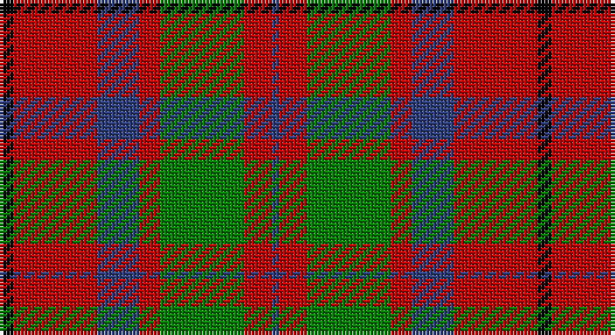

This page is one **sett** — a single exact thread-count. It belongs to the [tartan](/setts/k2r12db6r3g12r4db1/)
(the same proportion at any scale), whose colour order is pattern [BRGRBRK](/stripes/brgrbrk/).

Sourced from weddslist.  It is a [7 stripe tartan](/stripes/stripes7/).

Original link http://www.weddslist.com/cgi-bin/tartans/pg.pl?source=sts

## Thread count
K/4 R24 B12 R6 G24 R8 B/2

One full sett is **154 threads**.

## Palette

Palette: <strong>Ingles Buchan</strong> <small style="color:#888">(1 of 4 colours)</small>
<table><thead><tr><th>Colour</th><th>Threads</th><th>Shade</th><th>Base</th><th>OKLCh</th></tr></thead><tbody><tr><td>K/</td><td style="text-align:right;font-variant-numeric:tabular-nums">4</td><td><code style="background-color:#000000;">#000000</code> <small style="color:#888">#000000</small></td><td>K <code style="background-color:#000000;">#000000</code></td><td><small style="color:#888">oklch(0.0% 0.000 0.0)</small></td></tr><tr><td>R</td><td style="text-align:right;font-variant-numeric:tabular-nums">24</td><td><code style="background-color:#C00000;">#C00000</code> <small style="color:#888">#C00000</small></td><td>R <code style="background-color:#CC0000;">#CC0000</code></td><td><small style="color:#888">oklch(50.7% 0.208 29.2)</small></td></tr><tr><td>B</td><td style="text-align:right;font-variant-numeric:tabular-nums">12</td><td><code style="background-color:#304080;">#304080</code> <small style="color:#888">#304080</small></td><td>B <code style="background-color:#2A418A;">#2A418A</code></td><td><small style="color:#888">oklch(39.4% 0.109 270.2)</small></td></tr><tr><td>R</td><td style="text-align:right;font-variant-numeric:tabular-nums">6</td><td><code style="background-color:#C00000;">#C00000</code> <small style="color:#888">#C00000</small></td><td>R <code style="background-color:#CC0000;">#CC0000</code></td><td><small style="color:#888">oklch(50.7% 0.208 29.2)</small></td></tr><tr><td>G</td><td style="text-align:right;font-variant-numeric:tabular-nums">24</td><td><code style="background-color:#008000;">#008000</code> <small style="color:#888">#008000</small></td><td>G <code style="background-color:#006100;">#006100</code></td><td><small style="color:#888">oklch(52.0% 0.177 142.5)</small></td></tr><tr><td>R</td><td style="text-align:right;font-variant-numeric:tabular-nums">8</td><td><code style="background-color:#C00000;">#C00000</code> <small style="color:#888">#C00000</small></td><td>R <code style="background-color:#CC0000;">#CC0000</code></td><td><small style="color:#888">oklch(50.7% 0.208 29.2)</small></td></tr><tr><td>B/</td><td style="text-align:right;font-variant-numeric:tabular-nums">2</td><td><code style="background-color:#304080;">#304080</code> <small style="color:#888">#304080</small></td><td>B <code style="background-color:#2A418A;">#2A418A</code></td><td><small style="color:#888">oklch(39.4% 0.109 270.2)</small></td></tr></tbody></table>

# Sample pattern

## Nearest tartans

The nearest existing variants by ΔTartan distance, with this tartan at the top so the swatches line up against it.

ΔTartan

Tartan

Sett

—

<a href="/ttd/edit/#slug=k2r12db6r3g12r4db1~x2">MacBean, MacElvain</a> <a class="nn-out" href="/variants/s7/k2r12db6r3g12r4db1~x2/" title="open its dictionary page">↗</a>

0.58

<a href="/ttd/edit/#slug=dg28r4dp25w5r22dg27r4dp2~x2&amp;base=k2r12db6r3g12r4db1~x2">New Glasgow (Canada)</a> <a class="nn-out" href="/variants/s8/dg28r4dp25w5r22dg27r4dp2~x2/" title="open its dictionary page">↗</a>

0.62

<a href="/ttd/edit/#slug=k2r12db6r3dg12r4db1~x2&amp;base=k2r12db6r3g12r4db1~x2">MacBean/MacElvain</a> <a class="nn-out" href="/variants/s7/k2r12db6r3dg12r4db1~x2/" title="open its dictionary page">↗</a>

0.78

<a href="/ttd/edit/#slug=dp1r5g15r3dp9r10w1~x4&amp;base=k2r12db6r3g12r4db1~x2">Geddes</a> <a class="nn-out" href="/variants/s7/dp1r5g15r3dp9r10w1~x4/" title="open its dictionary page">↗</a>

0.81

<a href="/ttd/edit/#slug=r6g16r4db12r16t1r2~x2&amp;base=k2r12db6r3g12r4db1~x2">MacQuarrie 2</a> <a class="nn-out" href="/variants/s7/r6g16r4db12r16t1r2~x2/" title="open its dictionary page">↗</a>

0.85

<a href="/ttd/edit/#slug=r4k2r24k6db6g16r3~x2&amp;base=k2r12db6r3g12r4db1~x2">MacDuff</a> <a class="nn-out" href="/variants/s7/r4k2r24k6db6g16r3~x2/" title="open its dictionary page">↗</a>

0.87

<a href="/ttd/edit/#slug=r6dg16r4db12r16lb1r2~x2&amp;base=k2r12db6r3g12r4db1~x2">MacQuarrie LO</a> <a class="nn-out" href="/variants/s7/r6dg16r4db12r16lb1r2~x2/" title="open its dictionary page">↗</a>

0.91

<a href="/ttd/edit/#slug=t2k2r27dg27k12t12r27k2t2~x2&amp;base=k2r12db6r3g12r4db1~x2">MacNaughton</a> <a class="nn-out" href="/variants/s9/t2k2r27dg27k12t12r27k2t2~x2/" title="open its dictionary page">↗</a>

0.91

<a href="/ttd/edit/#slug=dp8r3ly1r3dg14r3ly1~x4&amp;base=k2r12db6r3g12r4db1~x2">Logan - 1819 (with yellow)</a> <a class="nn-out" href="/variants/s7/dp8r3ly1r3dg14r3ly1~x4/" title="open its dictionary page">↗</a>

0.91

<a href="/ttd/edit/#slug=dp8r3ly1r3g14r3ly1~x4&amp;base=k2r12db6r3g12r4db1~x2">Logan with Yellow</a> <a class="nn-out" href="/variants/s7/dp8r3ly1r3g14r3ly1~x4/" title="open its dictionary page">↗</a>

0.91

<a href="/ttd/edit/#slug=k2o20k8dg18o3w2~x2&amp;base=k2r12db6r3g12r4db1~x2">Celtic Combat</a> <a class="nn-out" href="/variants/s6/k2o20k8dg18o3w2~x2/" title="open its dictionary page">↗</a>

## Neighbour map

Every grey dot is one of 14360 variants placed by the first two principal components of the ΔTartan feature space (44% of its variance). Red is this tartan; blue dots are its nearest — click one to open its page.

<svg viewBox="0 0 640 380" role="img" style="max-width:100%;height:auto;border:1px solid #e0e0e0;border-radius:4px;display:block" xmlns="http://www.w3.org/2000/svg"><image href="/nn/cloud.v1.png" width="640" height="380"/><a href="/variants/s8/dg28r4dp25w5r22dg27r4dp2~x2/"><circle cx="249.0" cy="189.5" r="4" fill="#3465a4"><title>New Glasgow (Canada)</title></circle></a><a href="/variants/s7/k2r12db6r3dg12r4db1~x2/"><circle cx="259.2" cy="199.0" r="4" fill="#3465a4"><title>MacBean/MacElvain</title></circle></a><a href="/variants/s7/dp1r5g15r3dp9r10w1~x4/"><circle cx="242.8" cy="188.1" r="4" fill="#3465a4"><title>Geddes</title></circle></a><a href="/variants/s7/r6g16r4db12r16t1r2~x2/"><circle cx="287.9" cy="195.9" r="4" fill="#3465a4"><title>MacQuarrie 2</title></circle></a><a href="/variants/s7/r4k2r24k6db6g16r3~x2/"><circle cx="260.4" cy="179.1" r="4" fill="#3465a4"><title>MacDuff</title></circle></a><a href="/variants/s7/r6dg16r4db12r16lb1r2~x2/"><circle cx="267.5" cy="187.0" r="4" fill="#3465a4"><title>MacQuarrie LO</title></circle></a><a href="/variants/s9/t2k2r27dg27k12t12r27k2t2~x2/"><circle cx="251.4" cy="166.7" r="4" fill="#3465a4"><title>MacNaughton</title></circle></a><a href="/variants/s7/dp8r3ly1r3dg14r3ly1~x4/"><circle cx="248.0" cy="181.0" r="4" fill="#3465a4"><title>Logan - 1819 (with yellow)</title></circle></a><a href="/variants/s7/dp8r3ly1r3g14r3ly1~x4/"><circle cx="246.7" cy="178.7" r="4" fill="#3465a4"><title>Logan with Yellow</title></circle></a><a href="/variants/s6/k2o20k8dg18o3w2~x2/"><circle cx="236.7" cy="205.1" r="4" fill="#3465a4"><title>Celtic Combat</title></circle></a><circle cx="249.5" cy="197.5" r="5" fill="#c00000"/></svg>

ID: /variants/s7/k2r12db6r3g12r4db1~x2/
