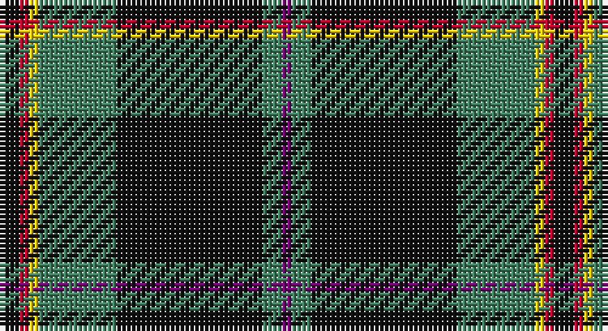

This page is one **sett** — a single exact thread-count. It belongs to the [tartan](/setts/k2r1ly1g8k15g2dp1/)
(the same proportion at any scale), whose colour order is pattern [BGKGYRK](/stripes/bgkgyrk/).

Part of the [Coalfields Regeneration Trust, The](/tartans/coalfields-regeneration-trust-the/) tartan — the named design grouping this sett with its other cloths.

Sourced from register-of-tartans.  It is a [7 stripe tartan](/stripes/stripes7/).

Original link https://www.tartanregister.gov.uk/tartanDetails.aspx?ref=11015

## Register references

External register numbers recorded for this tartan.

- Scottish Register of Tartans: [11015](https://www.tartanregister.gov.uk/tartanDetails.aspx?ref=11015)

## Thread count
K/4 R2 Y2 G16 K30 G4 P/2

One full sett is **114 threads**.

## Palette

Palette: <strong>Tartan Register</strong>
<table><thead><tr><th>Colour</th><th>Threads</th><th>Shade</th><th>Base</th><th>OKLCh</th></tr></thead><tbody><tr><td>K/</td><td style="text-align:right;font-variant-numeric:tabular-nums">4</td><td><code style="background-color:#101010;">#101010</code> <small style="color:#888">#101010</small></td><td>K <code style="background-color:#000000;">#000000</code></td><td><small style="color:#888">oklch(17.3% 0.000 89.9)</small></td></tr><tr><td>R</td><td style="text-align:right;font-variant-numeric:tabular-nums">2</td><td><code style="background-color:#C8002C;">#C8002C</code> <small style="color:#888">#C8002C</small></td><td>R <code style="background-color:#CC0000;">#CC0000</code></td><td><small style="color:#888">oklch(52.6% 0.212 22.0)</small></td></tr><tr><td>Y</td><td style="text-align:right;font-variant-numeric:tabular-nums">2</td><td><code style="background-color:#FCCC00;">#FCCC00</code> <small style="color:#888">#FCCC00</small></td><td>Y <code style="background-color:#F2BF00;">#F2BF00</code></td><td><small style="color:#888">oklch(86.2% 0.176 91.5)</small></td></tr><tr><td>G</td><td style="text-align:right;font-variant-numeric:tabular-nums">16</td><td><code style="background-color:#408060;">#408060</code> <small style="color:#888">#408060</small></td><td>G <code style="background-color:#006100;">#006100</code></td><td><small style="color:#888">oklch(54.8% 0.084 160.1)</small></td></tr><tr><td>K</td><td style="text-align:right;font-variant-numeric:tabular-nums">30</td><td><code style="background-color:#101010;">#101010</code> <small style="color:#888">#101010</small></td><td>K <code style="background-color:#000000;">#000000</code></td><td><small style="color:#888">oklch(17.3% 0.000 89.9)</small></td></tr><tr><td>G</td><td style="text-align:right;font-variant-numeric:tabular-nums">4</td><td><code style="background-color:#408060;">#408060</code> <small style="color:#888">#408060</small></td><td>G <code style="background-color:#006100;">#006100</code></td><td><small style="color:#888">oklch(54.8% 0.084 160.1)</small></td></tr><tr><td>P/</td><td style="text-align:right;font-variant-numeric:tabular-nums">2</td><td><code style="background-color:#780078;">#780078</code> <small style="color:#888">#780078</small></td><td>B <code style="background-color:#2A418A;">#2A418A</code></td><td><small style="color:#888">oklch(40.2% 0.185 328.4)</small></td></tr></tbody></table>

# Sample pattern

## Nearest tartans

The nearest existing variants by ΔTartan distance, with this tartan at the top so the swatches line up against it.

ΔTartan

Tartan

Sett

—

<a href="/ttd/edit/#slug=k2r1ly1g8k15g2dp1~x2">Coalfields Regeneration Trust, The</a> <a class="nn-out" href="/variants/s7/k2r1ly1g8k15g2dp1~x2/" title="open its dictionary page">↗</a>

0.50

<a href="/ttd/edit/#slug=k2r1ly1y8k15y2dp1~x4&amp;base=k2r1ly1g8k15g2dp1~x2">Coalfields Regeneration Trust, The</a> <a class="nn-out" href="/variants/s7/k2r1ly1y8k15y2dp1~x4/" title="open its dictionary page">↗</a>

0.84

<a href="/ttd/edit/#slug=r6dt4w2g27dt37ly2~x2&amp;base=k2r1ly1g8k15g2dp1~x2">Highlands of Durham (Corporate)</a> <a class="nn-out" href="/variants/s6/r6dt4w2g27dt37ly2~x2/" title="open its dictionary page">↗</a>

0.91

<a href="/ttd/edit/#slug=r3g14k2p2g14k36ly3~x2&amp;base=k2r1ly1g8k15g2dp1~x2">Vipont (Yellow line)</a> <a class="nn-out" href="/variants/s7/r3g14k2p2g14k36ly3~x2/" title="open its dictionary page">↗</a>

1.04

<a href="/ttd/edit/#slug=dg30db6r2db2ly2db15w2~x2&amp;base=k2r1ly1g8k15g2dp1~x2">Hydesville Tower (Corporate)</a> <a class="nn-out" href="/variants/s7/dg30db6r2db2ly2db15w2~x2/" title="open its dictionary page">↗</a>

1.04

<a href="/ttd/edit/#slug=dt37g27w2dt4r6dt4w2g27dt37ly2~x2&amp;base=k2r1ly1g8k15g2dp1~x2">Highlands of Durham</a> <a class="nn-out" href="/variants/s10/dt37g27w2dt4r6dt4w2g27dt37ly2~x2/" title="open its dictionary page">↗</a>

1.08

<a href="/ttd/edit/#slug=dt40dg3k3dg12w3dg3w3dg3r3~x2&amp;base=k2r1ly1g8k15g2dp1~x2">Todd</a> <a class="nn-out" href="/variants/s9/dt40dg3k3dg12w3dg3w3dg3r3~x2/" title="open its dictionary page">↗</a>

1.15

<a href="/ttd/edit/#slug=n6dp4n2w2n25k26ly4~x2&amp;base=k2r1ly1g8k15g2dp1~x2">New York State Troopers</a> <a class="nn-out" href="/variants/s7/n6dp4n2w2n25k26ly4~x2/" title="open its dictionary page">↗</a>

1.15

<a href="/ttd/edit/#slug=k37g27w2k4r6k4w2g27k37ly2~x2&amp;base=k2r1ly1g8k15g2dp1~x2">Highlands of Durham #2</a> <a class="nn-out" href="/variants/s10/k37g27w2k4r6k4w2g27k37ly2~x2/" title="open its dictionary page">↗</a>

1.16

<a href="/ttd/edit/#slug=k17dg48ly4r10lb12dg4&amp;base=k2r1ly1g8k15g2dp1~x2">Asheville Firefighters, The</a> <a class="nn-out" href="/variants/s6/k17dg48ly4r10lb12dg4/" title="open its dictionary page">↗</a>

1.20

<a href="/ttd/edit/#slug=dt14o1dt1o1dt6oi14w1oi1~x4&amp;base=k2r1ly1g8k15g2dp1~x2">Corrie</a> <a class="nn-out" href="/variants/s8/dt14o1dt1o1dt6oi14w1oi1~x4/" title="open its dictionary page">↗</a>

## Neighbour map

Every grey dot is one of 14360 variants placed by the first two principal components of the ΔTartan feature space (44% of its variance). Red is this tartan; blue dots are its nearest — click one to open its page.

<svg viewBox="0 0 640 380" role="img" style="max-width:100%;height:auto;border:1px solid #e0e0e0;border-radius:4px;display:block" xmlns="http://www.w3.org/2000/svg"><image href="/nn/cloud.v1.png" width="640" height="380"/><a href="/variants/s7/k2r1ly1y8k15y2dp1~x4/"><circle cx="310.0" cy="150.1" r="4" fill="#3465a4"><title>Coalfields Regeneration Trust, The</title></circle></a><a href="/variants/s6/r6dt4w2g27dt37ly2~x2/"><circle cx="301.0" cy="159.8" r="4" fill="#3465a4"><title>Highlands of Durham (Corporate)</title></circle></a><a href="/variants/s7/r3g14k2p2g14k36ly3~x2/"><circle cx="303.4" cy="161.5" r="4" fill="#3465a4"><title>Vipont (Yellow line)</title></circle></a><a href="/variants/s7/dg30db6r2db2ly2db15w2~x2/"><circle cx="306.8" cy="164.6" r="4" fill="#3465a4"><title>Hydesville Tower (Corporate)</title></circle></a><a href="/variants/s10/dt37g27w2dt4r6dt4w2g27dt37ly2~x2/"><circle cx="311.3" cy="149.3" r="4" fill="#3465a4"><title>Highlands of Durham</title></circle></a><a href="/variants/s9/dt40dg3k3dg12w3dg3w3dg3r3~x2/"><circle cx="303.9" cy="138.0" r="4" fill="#3465a4"><title>Todd</title></circle></a><a href="/variants/s7/n6dp4n2w2n25k26ly4~x2/"><circle cx="257.6" cy="167.8" r="4" fill="#3465a4"><title>New York State Troopers</title></circle></a><a href="/variants/s10/k37g27w2k4r6k4w2g27k37ly2~x2/"><circle cx="312.0" cy="154.2" r="4" fill="#3465a4"><title>Highlands of Durham #2</title></circle></a><a href="/variants/s6/k17dg48ly4r10lb12dg4/"><circle cx="261.5" cy="178.8" r="4" fill="#3465a4"><title>Asheville Firefighters, The</title></circle></a><a href="/variants/s8/dt14o1dt1o1dt6oi14w1oi1~x4/"><circle cx="325.0" cy="166.7" r="4" fill="#3465a4"><title>Corrie</title></circle></a><circle cx="319.6" cy="158.0" r="5" fill="#c00000"/></svg>

ID: /variants/s7/k2r1ly1g8k15g2dp1~x2/
