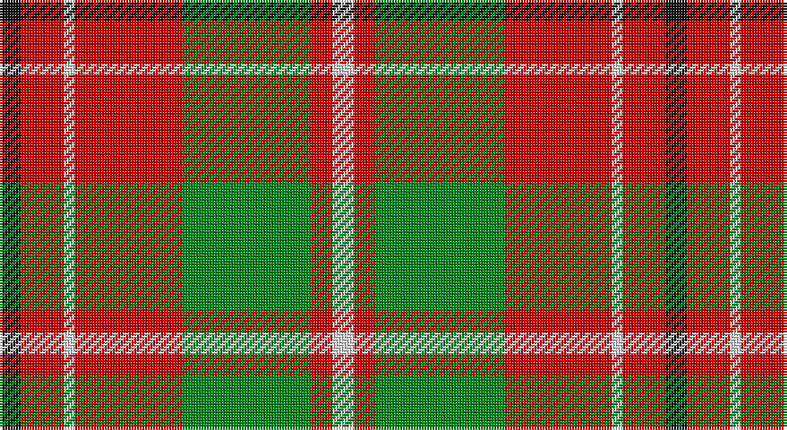

This page is one **sett** — a single exact thread-count. It belongs to the [tartan](/setts/k2r4w1r10g12r2w2/)
(the same proportion at any scale), whose colour order is pattern [KRWRGRW](/stripes/krwrgrw/).

Part of the [Starr](/tartans/starr/) tartan — the named design grouping this sett with its other cloths.

Sourced from tartans-authority.  It is a [7 stripe tartan](/stripes/stripes7/).

Original link http://www.tartansauthority.com/tartan-ferret/display/8223/

## Register references

External register numbers recorded for this tartan.

- Scottish Tartans Authority (ITI): 8223

## Thread count
K/8 R16 LN4 R40 G48 R8 LN/8

One full sett is **248 threads**.

## Palette

Palette: <strong>Tartan Register</strong> <small style="color:#888">(3 of 4 colours)</small>
<table><thead><tr><th>Colour</th><th>Threads</th><th>Shade</th><th>Base</th><th>OKLCh</th></tr></thead><tbody><tr><td>K/</td><td style="text-align:right;font-variant-numeric:tabular-nums">8</td><td><code style="background-color:#101010;">#101010</code> <small style="color:#888">#101010</small></td><td>K <code style="background-color:#000000;">#000000</code></td><td><small style="color:#888">oklch(17.3% 0.000 89.9)</small></td></tr><tr><td>R</td><td style="text-align:right;font-variant-numeric:tabular-nums">16</td><td><code style="background-color:#C80000;">#C80000</code> <small style="color:#888">#C80000</small></td><td>R <code style="background-color:#CC0000;">#CC0000</code></td><td><small style="color:#888">oklch(52.3% 0.215 29.2)</small></td></tr><tr><td>LN</td><td style="text-align:right;font-variant-numeric:tabular-nums">4</td><td><code style="background-color:#E0E0E0;">#E0E0E0</code> <small style="color:#888">#E0E0E0</small></td><td>W <code style="background-color:#F7F7F7;">#F7F7F7</code></td><td><small style="color:#888">oklch(90.7% 0.000 89.9)</small></td></tr><tr><td>R</td><td style="text-align:right;font-variant-numeric:tabular-nums">40</td><td><code style="background-color:#C80000;">#C80000</code> <small style="color:#888">#C80000</small></td><td>R <code style="background-color:#CC0000;">#CC0000</code></td><td><small style="color:#888">oklch(52.3% 0.215 29.2)</small></td></tr><tr><td>G</td><td style="text-align:right;font-variant-numeric:tabular-nums">48</td><td><code style="background-color:#00881C;">#00881C</code> <small style="color:#888">#00881C</small></td><td>G <code style="background-color:#006100;">#006100</code></td><td><small style="color:#888">oklch(54.4% 0.175 144.2)</small></td></tr><tr><td>R</td><td style="text-align:right;font-variant-numeric:tabular-nums">8</td><td><code style="background-color:#C80000;">#C80000</code> <small style="color:#888">#C80000</small></td><td>R <code style="background-color:#CC0000;">#CC0000</code></td><td><small style="color:#888">oklch(52.3% 0.215 29.2)</small></td></tr><tr><td>LN/</td><td style="text-align:right;font-variant-numeric:tabular-nums">8</td><td><code style="background-color:#E0E0E0;">#E0E0E0</code> <small style="color:#888">#E0E0E0</small></td><td>W <code style="background-color:#F7F7F7;">#F7F7F7</code></td><td><small style="color:#888">oklch(90.7% 0.000 89.9)</small></td></tr></tbody></table>

# Sample pattern

## Compared to the master

This cloth is one sett of its design; the master sett (the exemplar the design is anchored on) is below for comparison.

<figure style="margin:0"><figcaption style="color:#888;font-size:smaller">this sett</figcaption></figure>
<figure style="margin:0"><figcaption style="color:#888;font-size:smaller"><a href="/setts/w1lb4b4db3w3b20lb1/">master sett →</a></figcaption></figure>

## Nearest tartans

The nearest existing variants by ΔTartan distance, with this tartan at the top so the swatches line up against it.

ΔTartan

Tartan

Sett

—

<a href="/ttd/edit/#slug=k2r4w1r10g12r2w2~x4">Starr (1978) (Name)</a> <a class="nn-out" href="/variants/s7/k2r4w1r10g12r2w2~x4/" title="open its dictionary page">↗</a>

0.92

<a href="/ttd/edit/#slug=r15k1ly2db3r2k1ly15~x6&amp;base=k2r4w1r10g12r2w2~x4">Scrymgeour</a> <a class="nn-out" href="/variants/s7/r15k1ly2db3r2k1ly15~x6/" title="open its dictionary page">↗</a>

0.92

<a href="/ttd/edit/#slug=r15k1ly2db3r2k1ly15~x3&amp;base=k2r4w1r10g12r2w2~x4">Scrymgeour</a> <a class="nn-out" href="/variants/s7/r15k1ly2db3r2k1ly15~x3/" title="open its dictionary page">↗</a>

0.93

<a href="/ttd/edit/#slug=g28r7m7g14m7r48k4~x2&amp;base=k2r4w1r10g12r2w2~x4">MacNab 6</a> <a class="nn-out" href="/variants/s7/g28r7m7g14m7r48k4~x2/" title="open its dictionary page">↗</a>

0.93

<a href="/ttd/edit/#slug=k2r16g6r3g8w1~x2&amp;base=k2r4w1r10g12r2w2~x4">MacAulay</a> <a class="nn-out" href="/variants/s6/k2r16g6r3g8w1~x2/" title="open its dictionary page">↗</a>

0.94

<a href="/ttd/edit/#slug=k4r5k2lo21g8k2~x2&amp;base=k2r4w1r10g12r2w2~x4">MacDuck #2</a> <a class="nn-out" href="/variants/s6/k4r5k2lo21g8k2~x2/" title="open its dictionary page">↗</a>

0.95

<a href="/ttd/edit/#slug=g9r2g9r14k1w2~x2&amp;base=k2r4w1r10g12r2w2~x4">MacGregor of Balquidder (Logan)</a> <a class="nn-out" href="/variants/s6/g9r2g9r14k1w2~x2/" title="open its dictionary page">↗</a>

0.95

<a href="/ttd/edit/#slug=do5lo4do26loi26do4loi3w5~x2&amp;base=k2r4w1r10g12r2w2~x4">Elgin District Tartan</a> <a class="nn-out" href="/variants/s7/do5lo4do26loi26do4loi3w5~x2/" title="open its dictionary page">↗</a>

1.00

<a href="/ttd/edit/#slug=g9r2g9r14k1w2~x4&amp;base=k2r4w1r10g12r2w2~x4">MacGregor of Balquidder - 1831 (Clan</a> <a class="nn-out" href="/variants/s6/g9r2g9r14k1w2~x4/" title="open its dictionary page">↗</a>

1.02

<a href="/ttd/edit/#slug=db6lo25dy16k2db3~x2&amp;base=k2r4w1r10g12r2w2~x4">Prince of Orange #2</a> <a class="nn-out" href="/variants/s5/db6lo25dy16k2db3~x2/" title="open its dictionary page">↗</a>

1.02

<a href="/ttd/edit/#slug=db1r12g6ly1g6db1~x4&amp;base=k2r4w1r10g12r2w2~x4">Cetoloni (Personal)</a> <a class="nn-out" href="/variants/s6/db1r12g6ly1g6db1~x4/" title="open its dictionary page">↗</a>

## Neighbour map

Every grey dot is one of 14360 variants placed by the first two principal components of the ΔTartan feature space (44% of its variance). Red is this tartan; blue dots are its nearest — click one to open its page.

<svg viewBox="0 0 640 380" role="img" style="max-width:100%;height:auto;border:1px solid #e0e0e0;border-radius:4px;display:block" xmlns="http://www.w3.org/2000/svg"><image href="/nn/cloud.v1.png" width="640" height="380"/><a href="/variants/s7/r15k1ly2db3r2k1ly15~x6/"><circle cx="265.9" cy="149.7" r="4" fill="#3465a4"><title>Scrymgeour</title></circle></a><a href="/variants/s7/r15k1ly2db3r2k1ly15~x3/"><circle cx="265.9" cy="149.7" r="4" fill="#3465a4"><title>Scrymgeour</title></circle></a><a href="/variants/s7/g28r7m7g14m7r48k4~x2/"><circle cx="288.4" cy="187.6" r="4" fill="#3465a4"><title>MacNab 6</title></circle></a><a href="/variants/s6/k2r16g6r3g8w1~x2/"><circle cx="314.2" cy="181.6" r="4" fill="#3465a4"><title>MacAulay</title></circle></a><a href="/variants/s6/k4r5k2lo21g8k2~x2/"><circle cx="246.2" cy="182.2" r="4" fill="#3465a4"><title>MacDuck #2</title></circle></a><a href="/variants/s6/g9r2g9r14k1w2~x2/"><circle cx="297.2" cy="199.6" r="4" fill="#3465a4"><title>MacGregor of Balquidder (Logan)</title></circle></a><a href="/variants/s7/do5lo4do26loi26do4loi3w5~x2/"><circle cx="262.4" cy="189.3" r="4" fill="#3465a4"><title>Elgin District Tartan</title></circle></a><a href="/variants/s6/g9r2g9r14k1w2~x4/"><circle cx="288.3" cy="194.9" r="4" fill="#3465a4"><title>MacGregor of Balquidder - 1831 (Clan</title></circle></a><a href="/variants/s5/db6lo25dy16k2db3~x2/"><circle cx="276.5" cy="201.1" r="4" fill="#3465a4"><title>Prince of Orange #2</title></circle></a><a href="/variants/s6/db1r12g6ly1g6db1~x4/"><circle cx="287.5" cy="198.5" r="4" fill="#3465a4"><title>Cetoloni (Personal)</title></circle></a><circle cx="263.8" cy="177.8" r="5" fill="#c00000"/></svg>

ID: /variants/s7/k2r4w1r10g12r2w2~x4/
