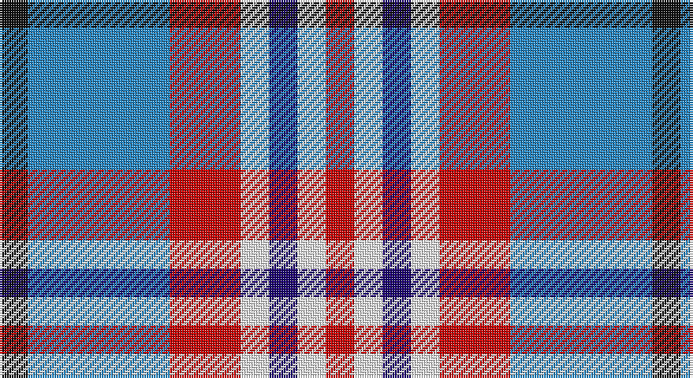

This page is one **sett** — a single exact thread-count. It belongs to the [tartan](/setts/k2t10r5w2db2w2r2/)
(the same proportion at any scale), whose colour order is pattern [KBRWBWR](/stripes/kbrwbwr/).

Part of the [U.S. Postal Service](/tartans/u-s-postal-service/) tartan — the named design grouping this sett with its other cloths.

Sourced from tartans-authority.  It is a [7 stripe tartan](/stripes/stripes7/).

Original link http://www.tartansauthority.com/tartan-ferret/display/4166/

## Register references

External register numbers recorded for this tartan.

- Scottish Tartans Authority (ITI): 4166

## Thread count
K/12 B60 R30 W12 DB12 W12 R/12

One full sett is **276 threads**.

## Palette

Palette: <strong>Tartan Register</strong>
<table><thead><tr><th>Colour</th><th>Threads</th><th>Shade</th><th>Base</th><th>OKLCh</th></tr></thead><tbody><tr><td>K/</td><td style="text-align:right;font-variant-numeric:tabular-nums">12</td><td><code style="background-color:#101010;">#101010</code> <small style="color:#888">#101010</small></td><td>K <code style="background-color:#000000;">#000000</code></td><td><small style="color:#888">oklch(17.3% 0.000 89.9)</small></td></tr><tr><td>B</td><td style="text-align:right;font-variant-numeric:tabular-nums">60</td><td><code style="background-color:#2888C4;">#2888C4</code> <small style="color:#888">#2888C4</small></td><td>B <code style="background-color:#2A418A;">#2A418A</code></td><td><small style="color:#888">oklch(60.1% 0.125 241.5)</small></td></tr><tr><td>R</td><td style="text-align:right;font-variant-numeric:tabular-nums">30</td><td><code style="background-color:#C80000;">#C80000</code> <small style="color:#888">#C80000</small></td><td>R <code style="background-color:#CC0000;">#CC0000</code></td><td><small style="color:#888">oklch(52.3% 0.215 29.2)</small></td></tr><tr><td>W</td><td style="text-align:right;font-variant-numeric:tabular-nums">12</td><td><code style="background-color:#FCFCFC;">#FCFCFC</code> <small style="color:#888">#FCFCFC</small></td><td>W <code style="background-color:#F7F7F7;">#F7F7F7</code></td><td><small style="color:#888">oklch(99.1% 0.000 89.9)</small></td></tr><tr><td>DB</td><td style="text-align:right;font-variant-numeric:tabular-nums">12</td><td><code style="background-color:#1C0070;">#1C0070</code> <small style="color:#888">#1C0070</small></td><td>B <code style="background-color:#2A418A;">#2A418A</code></td><td><small style="color:#888">oklch(26.3% 0.162 277.1)</small></td></tr><tr><td>W</td><td style="text-align:right;font-variant-numeric:tabular-nums">12</td><td><code style="background-color:#FCFCFC;">#FCFCFC</code> <small style="color:#888">#FCFCFC</small></td><td>W <code style="background-color:#F7F7F7;">#F7F7F7</code></td><td><small style="color:#888">oklch(99.1% 0.000 89.9)</small></td></tr><tr><td>R/</td><td style="text-align:right;font-variant-numeric:tabular-nums">12</td><td><code style="background-color:#C80000;">#C80000</code> <small style="color:#888">#C80000</small></td><td>R <code style="background-color:#CC0000;">#CC0000</code></td><td><small style="color:#888">oklch(52.3% 0.215 29.2)</small></td></tr></tbody></table>

# Sample pattern

## Compared to the master

This cloth is one sett of its design; the master sett (the exemplar the design is anchored on) is below for comparison.

<figure style="margin:0"><figcaption style="color:#888;font-size:smaller">this sett</figcaption></figure>
<figure style="margin:0"><figcaption style="color:#888;font-size:smaller"><a href="/setts/t10r5w2db2w2r2w2db2w2r5t10k2/">master sett →</a></figcaption></figure>

## Nearest tartans

The nearest existing variants by ΔTartan distance, with this tartan at the top so the swatches line up against it.

ΔTartan

Tartan

Sett

—

<a href="/ttd/edit/#slug=k2t10r5w2db2w2r2~x6">U.S. Postal Service (Corporate)</a> <a class="nn-out" href="/variants/s7/k2t10r5w2db2w2r2~x6/" title="open its dictionary page">↗</a>

0.94

<a href="/ttd/edit/#slug=db18w3db3w3r3w3k5ly12~x2&amp;base=k2t10r5w2db2w2r2~x6">Kile (Red line) (Personal)</a> <a class="nn-out" href="/variants/s8/db18w3db3w3r3w3k5ly12~x2/" title="open its dictionary page">↗</a>

1.10

<a href="/ttd/edit/#slug=db13w13db4ly2g8r3~x2&amp;base=k2t10r5w2db2w2r2~x6">Unidentified (Winterbottom)</a> <a class="nn-out" href="/variants/s6/db13w13db4ly2g8r3~x2/" title="open its dictionary page">↗</a>

1.12

<a href="/ttd/edit/#slug=r4db18ri4dg19w25r10w4~x2&amp;base=k2t10r5w2db2w2r2~x6">Fraser Red Dress</a> <a class="nn-out" href="/variants/s7/r4db18ri4dg19w25r10w4~x2/" title="open its dictionary page">↗</a>

1.13

<a href="/ttd/edit/#slug=k3db10ly5db16g3w16g5w3~x2&amp;base=k2t10r5w2db2w2r2~x6">Ship Hector, The (Commemorative)</a> <a class="nn-out" href="/variants/s8/k3db10ly5db16g3w16g5w3~x2/" title="open its dictionary page">↗</a>

1.14

<a href="/ttd/edit/#slug=r2db4r6db2lb6k1ly2~x2&amp;base=k2t10r5w2db2w2r2~x6">Unidentified Printing</a> <a class="nn-out" href="/variants/s7/r2db4r6db2lb6k1ly2~x2/" title="open its dictionary page">↗</a>

1.17

<a href="/ttd/edit/#slug=t10r5w2db2w2r2w2db2w2r5t10k2~x6&amp;base=k2t10r5w2db2w2r2~x6">U.S. Postal Service</a> <a class="nn-out" href="/variants/s12/t10r5w2db2w2r2w2db2w2r5t10k2~x6/" title="open its dictionary page">↗</a>

1.18

<a href="/ttd/edit/#slug=lb12k3lbi3k3lb13t6k17r3~x2&amp;base=k2t10r5w2db2w2r2~x6">Mitsukoshi (Corporate)</a> <a class="nn-out" href="/variants/s8/lb12k3lbi3k3lb13t6k17r3~x2/" title="open its dictionary page">↗</a>

1.18

<a href="/ttd/edit/#slug=w5g3r3g3r3db20r16w21k3~x2&amp;base=k2t10r5w2db2w2r2~x6">Oliver, dress</a> <a class="nn-out" href="/variants/s9/w5g3r3g3r3db20r16w21k3~x2/" title="open its dictionary page">↗</a>

1.19

<a href="/ttd/edit/#slug=k4db9ly6db22g4w20g6w4&amp;base=k2t10r5w2db2w2r2~x6">Ship Hector</a> <a class="nn-out" href="/variants/s8/k4db9ly6db22g4w20g6w4/" title="open its dictionary page">↗</a>

1.21

<a href="/ttd/edit/#slug=m3db15w13dy6db2dy2m2~x2&amp;base=k2t10r5w2db2w2r2~x6">Thompson Navy Trade Tartan</a> <a class="nn-out" href="/variants/s7/m3db15w13dy6db2dy2m2~x2/" title="open its dictionary page">↗</a>

## Neighbour map

Every grey dot is one of 14360 variants placed by the first two principal components of the ΔTartan feature space (44% of its variance). Red is this tartan; blue dots are its nearest — click one to open its page.

<svg viewBox="0 0 640 380" role="img" style="max-width:100%;height:auto;border:1px solid #e0e0e0;border-radius:4px;display:block" xmlns="http://www.w3.org/2000/svg"><image href="/nn/cloud.v1.png" width="640" height="380"/><a href="/variants/s8/db18w3db3w3r3w3k5ly12~x2/"><circle cx="120.9" cy="172.4" r="4" fill="#3465a4"><title>Kile (Red line) (Personal)</title></circle></a><a href="/variants/s6/db13w13db4ly2g8r3~x2/"><circle cx="113.0" cy="207.2" r="4" fill="#3465a4"><title>Unidentified (Winterbottom)</title></circle></a><a href="/variants/s7/r4db18ri4dg19w25r10w4~x2/"><circle cx="85.3" cy="192.2" r="4" fill="#3465a4"><title>Fraser Red Dress</title></circle></a><a href="/variants/s8/k3db10ly5db16g3w16g5w3~x2/"><circle cx="109.3" cy="190.4" r="4" fill="#3465a4"><title>Ship Hector, The (Commemorative)</title></circle></a><a href="/variants/s7/r2db4r6db2lb6k1ly2~x2/"><circle cx="83.9" cy="205.0" r="4" fill="#3465a4"><title>Unidentified Printing</title></circle></a><a href="/variants/s12/t10r5w2db2w2r2w2db2w2r5t10k2~x6/"><circle cx="124.8" cy="170.8" r="4" fill="#3465a4"><title>U.S. Postal Service</title></circle></a><a href="/variants/s8/lb12k3lbi3k3lb13t6k17r3~x2/"><circle cx="130.8" cy="191.1" r="4" fill="#3465a4"><title>Mitsukoshi (Corporate)</title></circle></a><a href="/variants/s9/w5g3r3g3r3db20r16w21k3~x2/"><circle cx="109.8" cy="155.6" r="4" fill="#3465a4"><title>Oliver, dress</title></circle></a><a href="/variants/s8/k4db9ly6db22g4w20g6w4/"><circle cx="114.7" cy="189.3" r="4" fill="#3465a4"><title>Ship Hector</title></circle></a><a href="/variants/s7/m3db15w13dy6db2dy2m2~x2/"><circle cx="159.0" cy="190.3" r="4" fill="#3465a4"><title>Thompson Navy Trade Tartan</title></circle></a><circle cx="118.4" cy="190.6" r="5" fill="#c00000"/></svg>

ID: /variants/s7/k2t10r5w2db2w2r2~x6/
