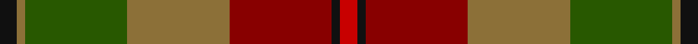
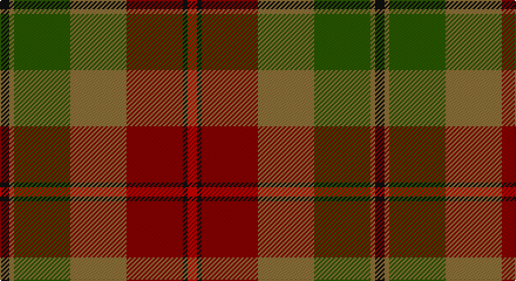

This page is one **sett** — a single exact thread-count. It belongs to the [tartan](/setts/k2y1dg12y12ri12k1r2/)
(the same proportion at any scale), whose colour order is pattern [KGGGRKR](/stripes/kgggrkr/).

Sourced from register-of-tartans.  It is a [7 stripe tartan](/stripes/stripes7/).

Original link https://www.tartanregister.gov.uk/tartanDetails.aspx?ref=3417

## Also known as

This cloth is also recorded under:

- PSD: Operation Iraqi Freedom (Milita

2 attestations — the source records this cloth was collapsed from (oldest owns this page)

<ul>
<li>01/01/2006 — PSD: Operation Iraqi Freedom (register-of-tartans, <a href="https://www.tartanregister.gov.uk/tartanDetails.aspx?ref=3417">record</a>)</li>
<li>2006 — PSD: Operation Iraqi Freedom (Milita (tartans-authority, <a href="http://www.tartansauthority.com/tartan-ferret/display/6877/">record</a>)</li>
</ul>

## Register references

External register numbers recorded for this tartan.

- Scottish Register of Tartans: [3417](https://www.tartanregister.gov.uk/tartanDetails.aspx?ref=3417)
- Scottish Tartans Authority (ITI): 6877

## Thread count
K/8 LT4 G48 LT48 DR48 K4 R/8

One full sett is **320 threads**.

## Palette

Palette: <strong>Tartan Register</strong>
<table><thead><tr><th>Colour</th><th>Threads</th><th>Shade</th><th>Base</th><th>OKLCh</th></tr></thead><tbody><tr><td>K/</td><td style="text-align:right;font-variant-numeric:tabular-nums">8</td><td><code style="background-color:#101010;">#101010</code> <small style="color:#888">#101010</small></td><td>K <code style="background-color:#000000;">#000000</code></td><td><small style="color:#888">oklch(17.3% 0.000 89.9)</small></td></tr><tr><td>LT</td><td style="text-align:right;font-variant-numeric:tabular-nums">4</td><td><code style="background-color:#8C7038;">#8C7038</code> <small style="color:#888">#8C7038</small></td><td>G <code style="background-color:#006100;">#006100</code></td><td><small style="color:#888">oklch(56.0% 0.082 83.0)</small></td></tr><tr><td>G</td><td style="text-align:right;font-variant-numeric:tabular-nums">48</td><td><code style="background-color:#285800;">#285800</code> <small style="color:#888">#285800</small></td><td>G <code style="background-color:#006100;">#006100</code></td><td><small style="color:#888">oklch(41.0% 0.122 135.8)</small></td></tr><tr><td>LT</td><td style="text-align:right;font-variant-numeric:tabular-nums">48</td><td><code style="background-color:#8C7038;">#8C7038</code> <small style="color:#888">#8C7038</small></td><td>G <code style="background-color:#006100;">#006100</code></td><td><small style="color:#888">oklch(56.0% 0.082 83.0)</small></td></tr><tr><td>DR</td><td style="text-align:right;font-variant-numeric:tabular-nums">48</td><td><code style="background-color:#880000;">#880000</code> <small style="color:#888">#880000</small></td><td>R <code style="background-color:#CC0000;">#CC0000</code></td><td><small style="color:#888">oklch(39.4% 0.162 29.2)</small></td></tr><tr><td>K</td><td style="text-align:right;font-variant-numeric:tabular-nums">4</td><td><code style="background-color:#101010;">#101010</code> <small style="color:#888">#101010</small></td><td>K <code style="background-color:#000000;">#000000</code></td><td><small style="color:#888">oklch(17.3% 0.000 89.9)</small></td></tr><tr><td>R/</td><td style="text-align:right;font-variant-numeric:tabular-nums">8</td><td><code style="background-color:#C80000;">#C80000</code> <small style="color:#888">#C80000</small></td><td>R <code style="background-color:#CC0000;">#CC0000</code></td><td><small style="color:#888">oklch(52.3% 0.215 29.2)</small></td></tr></tbody></table>

# Sample pattern

## Nearest tartans

The nearest existing variants by ΔTartan distance, with this tartan at the top so the swatches line up against it.

ΔTartan

Tartan

Sett

—

<a href="/ttd/edit/#slug=k2y1dg12y12ri12k1r2~x4">PSD: Operation Iraqi Freedom</a> <a class="nn-out" href="/variants/s7/k2y1dg12y12ri12k1r2~x4/" title="open its dictionary page">↗</a>

0.84

<a href="/ttd/edit/#slug=dy16r16lr3dg16o2r1o2dy6r2~x4&amp;base=k2y1dg12y12ri12k1r2~x4">Henry, W. A.</a> <a class="nn-out" href="/variants/s9/dy16r16lr3dg16o2r1o2dy6r2~x4/" title="open its dictionary page">↗</a>

1.31

<a href="/ttd/edit/#slug=g3dy32g4lb3g18dp18lo3~x2&amp;base=k2y1dg12y12ri12k1r2~x4">Wcwm 9275-1410</a> <a class="nn-out" href="/variants/s7/g3dy32g4lb3g18dp18lo3~x2/" title="open its dictionary page">↗</a>

1.38

<a href="/ttd/edit/#slug=k3r9k4dy9y3dy9k4g26k2y3~x2&amp;base=k2y1dg12y12ri12k1r2~x4">Cavan, County</a> <a class="nn-out" href="/variants/s10/k3r9k4dy9y3dy9k4g26k2y3~x2/" title="open its dictionary page">↗</a>

1.39

<a href="/ttd/edit/#slug=y25r2lb2db2lb2r13dy28db2r3~x2&amp;base=k2y1dg12y12ri12k1r2~x4">Brousseau (Personal)</a> <a class="nn-out" href="/variants/s9/y25r2lb2db2lb2r13dy28db2r3~x2/" title="open its dictionary page">↗</a>

1.42

<a href="/ttd/edit/#slug=r3dy16g10r3g3lb2g3r3~x2&amp;base=k2y1dg12y12ri12k1r2~x4">Scott Htg (Clan)</a> <a class="nn-out" href="/variants/s8/r3dy16g10r3g3lb2g3r3~x2/" title="open its dictionary page">↗</a>

1.42

<a href="/ttd/edit/#slug=r2dg3dy18r2dy2r21y6dg2y2dg24lo2~x2&amp;base=k2y1dg12y12ri12k1r2~x4">Methven</a> <a class="nn-out" href="/variants/s11/r2dg3dy18r2dy2r21y6dg2y2dg24lo2~x2/" title="open its dictionary page">↗</a>

1.42

<a href="/ttd/edit/#slug=dy9k2dy2r2g6k1lo1k1g6r3~x4&amp;base=k2y1dg12y12ri12k1r2~x4">MacAart (Personal)</a> <a class="nn-out" href="/variants/s10/dy9k2dy2r2g6k1lo1k1g6r3~x4/" title="open its dictionary page">↗</a>

1.43

<a href="/ttd/edit/#slug=o2dg3dy18o2dy2o21g2dg2g2dg24lo2~x2&amp;base=k2y1dg12y12ri12k1r2~x4">Methven</a> <a class="nn-out" href="/variants/s11/o2dg3dy18o2dy2o21g2dg2g2dg24lo2~x2/" title="open its dictionary page">↗</a>

1.43

<a href="/ttd/edit/#slug=dy22y22dr2lb6dr2lo2dr16g5dy8lb2~x2&amp;base=k2y1dg12y12ri12k1r2~x4">Bruce of Kinnaird (Vivienne Westwood Design)</a> <a class="nn-out" href="/variants/s10/dy22y22dr2lb6dr2lo2dr16g5dy8lb2~x2/" title="open its dictionary page">↗</a>

1.43

<a href="/ttd/edit/#slug=dy9k2dy2r2g6k1ly1k1g6r3~x2&amp;base=k2y1dg12y12ri12k1r2~x4">MacAart Family Tartan</a> <a class="nn-out" href="/variants/s10/dy9k2dy2r2g6k1ly1k1g6r3~x2/" title="open its dictionary page">↗</a>

## Neighbour map

Every grey dot is one of 14360 variants placed by the first two principal components of the ΔTartan feature space (44% of its variance). Red is this tartan; blue dots are its nearest — click one to open its page.

<svg viewBox="0 0 640 380" role="img" style="max-width:100%;height:auto;border:1px solid #e0e0e0;border-radius:4px;display:block" xmlns="http://www.w3.org/2000/svg"><image href="/nn/cloud.v1.png" width="640" height="380"/><a href="/variants/s9/dy16r16lr3dg16o2r1o2dy6r2~x4/"><circle cx="237.8" cy="183.3" r="4" fill="#3465a4"><title>Henry, W. A.</title></circle></a><a href="/variants/s7/g3dy32g4lb3g18dp18lo3~x2/"><circle cx="235.4" cy="199.9" r="4" fill="#3465a4"><title>Wcwm 9275-1410</title></circle></a><a href="/variants/s10/k3r9k4dy9y3dy9k4g26k2y3~x2/"><circle cx="206.5" cy="177.0" r="4" fill="#3465a4"><title>Cavan, County</title></circle></a><a href="/variants/s9/y25r2lb2db2lb2r13dy28db2r3~x2/"><circle cx="269.3" cy="172.9" r="4" fill="#3465a4"><title>Brousseau (Personal)</title></circle></a><a href="/variants/s8/r3dy16g10r3g3lb2g3r3~x2/"><circle cx="247.7" cy="227.3" r="4" fill="#3465a4"><title>Scott Htg (Clan)</title></circle></a><a href="/variants/s11/r2dg3dy18r2dy2r21y6dg2y2dg24lo2~x2/"><circle cx="251.4" cy="180.1" r="4" fill="#3465a4"><title>Methven</title></circle></a><a href="/variants/s10/dy9k2dy2r2g6k1lo1k1g6r3~x4/"><circle cx="217.3" cy="216.6" r="4" fill="#3465a4"><title>MacAart (Personal)</title></circle></a><a href="/variants/s11/o2dg3dy18o2dy2o21g2dg2g2dg24lo2~x2/"><circle cx="242.1" cy="159.5" r="4" fill="#3465a4"><title>Methven</title></circle></a><a href="/variants/s10/dy22y22dr2lb6dr2lo2dr16g5dy8lb2~x2/"><circle cx="170.0" cy="160.5" r="4" fill="#3465a4"><title>Bruce of Kinnaird (Vivienne Westwood Design)</title></circle></a><a href="/variants/s10/dy9k2dy2r2g6k1ly1k1g6r3~x2/"><circle cx="190.3" cy="199.4" r="4" fill="#3465a4"><title>MacAart Family Tartan</title></circle></a><circle cx="214.5" cy="201.7" r="5" fill="#c00000"/></svg>

ID: /variants/s7/k2y1dg12y12ri12k1r2~x4/
