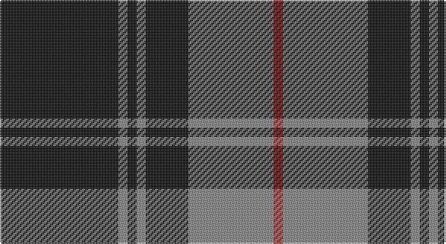

This page is one **sett** — a single exact thread-count. It belongs to the [tartan](/setts/k39o3k3o3k14o28r3/)
(the same proportion at any scale), whose colour order is pattern [KRKRKRR](/stripes/krkrkrr/).

Part of the [Moffat](/tartans/moffat/) tartan — the named design grouping this sett with its other cloths.

Sourced from register-of-tartans.  It is a [7 stripe tartan](/stripes/stripes7/).

Original link https://www.tartanregister.gov.uk/tartanDetails.aspx?ref=2975

## Provenance

Earliest known date: 1983 When Major Francis Moffat of that Ilk M.C. was recognised as Chief of the Name and House of Moffat, by Lord Lyon in 1983, after the family had been without a chief for 420 years, a family tartan based on the Douglas was introduced to commemorate early family connections.

## Also known as

This cloth is also recorded under:

- Moffat District

3 attestations — the source records this cloth was collapsed from (oldest owns this page)

<ul>
<li>01/01/1984 — Moffat (1984) (register-of-tartans, <a href="https://www.tartanregister.gov.uk/tartanDetails.aspx?ref=2975">record</a>)</li>
<li>1984 — Moffat (Clan) (tartans-authority, <a href="http://www.tartansauthority.com/tartan-ferret/display/1129/">record</a>)</li>
<li>undated — Moffat Family Tartan (house-of-tartan, <a href="http://www.house-of-tartan.scotland.net/house/TartanViewjs.asp?colr=Def&tnam=1129">record</a>)</li>
</ul>

## Register references

External register numbers recorded for this tartan.

- Scottish Register of Tartans: [2975](https://www.tartanregister.gov.uk/tartanDetails.aspx?ref=2975)
- Scottish Tartans Authority (ITI): 1129
- Scottish Tartans World Register: 1129

## Thread count
K/78 N6 K6 N6 K28 N56 R/6

One full sett is **288 threads**.

## Palette

Palette: <strong>Tartan Register</strong>
<table><thead><tr><th>Colour</th><th>Threads</th><th>Shade</th><th>Base</th><th>OKLCh</th></tr></thead><tbody><tr><td>K/</td><td style="text-align:right;font-variant-numeric:tabular-nums">78</td><td><code style="background-color:#101010;">#101010</code> <small style="color:#888">#101010</small></td><td>K <code style="background-color:#000000;">#000000</code></td><td><small style="color:#888">oklch(17.3% 0.000 89.9)</small></td></tr><tr><td>N</td><td style="text-align:right;font-variant-numeric:tabular-nums">6</td><td><code style="background-color:#888888;">#888888</code> <small style="color:#888">#888888</small></td><td>R <code style="background-color:#CC0000;">#CC0000</code></td><td><small style="color:#888">oklch(62.7% 0.000 89.9)</small></td></tr><tr><td>K</td><td style="text-align:right;font-variant-numeric:tabular-nums">6</td><td><code style="background-color:#101010;">#101010</code> <small style="color:#888">#101010</small></td><td>K <code style="background-color:#000000;">#000000</code></td><td><small style="color:#888">oklch(17.3% 0.000 89.9)</small></td></tr><tr><td>N</td><td style="text-align:right;font-variant-numeric:tabular-nums">6</td><td><code style="background-color:#888888;">#888888</code> <small style="color:#888">#888888</small></td><td>R <code style="background-color:#CC0000;">#CC0000</code></td><td><small style="color:#888">oklch(62.7% 0.000 89.9)</small></td></tr><tr><td>K</td><td style="text-align:right;font-variant-numeric:tabular-nums">28</td><td><code style="background-color:#101010;">#101010</code> <small style="color:#888">#101010</small></td><td>K <code style="background-color:#000000;">#000000</code></td><td><small style="color:#888">oklch(17.3% 0.000 89.9)</small></td></tr><tr><td>N</td><td style="text-align:right;font-variant-numeric:tabular-nums">56</td><td><code style="background-color:#888888;">#888888</code> <small style="color:#888">#888888</small></td><td>R <code style="background-color:#CC0000;">#CC0000</code></td><td><small style="color:#888">oklch(62.7% 0.000 89.9)</small></td></tr><tr><td>R/</td><td style="text-align:right;font-variant-numeric:tabular-nums">6</td><td><code style="background-color:#C80000;">#C80000</code> <small style="color:#888">#C80000</small></td><td>R <code style="background-color:#CC0000;">#CC0000</code></td><td><small style="color:#888">oklch(52.3% 0.215 29.2)</small></td></tr></tbody></table>

# Sample pattern

## Compared to the master

This cloth is one sett of its design; the master sett (the exemplar the design is anchored on) is below for comparison.

<figure style="margin:0"><figcaption style="color:#888;font-size:smaller">this sett</figcaption></figure>
<figure style="margin:0"><figcaption style="color:#888;font-size:smaller"><a href="/setts/dp4g3k1g3dp2g20k10r20dp2k2lo4/">master sett →</a></figcaption></figure>

## Nearest tartans

The nearest existing variants by ΔTartan distance, with this tartan at the top so the swatches line up against it.

ΔTartan

Tartan

Sett

—

<a href="/ttd/edit/#slug=k39o3k3o3k14o28r3~x2">Moffat (1984)</a> <a class="nn-out" href="/variants/s7/k39o3k3o3k14o28r3~x2/" title="open its dictionary page">↗</a>

0.60

<a href="/ttd/edit/#slug=k13o1k1o1k4o10ly1o1~x6&amp;base=k39o3k3o3k14o28r3~x2">West Point</a> <a class="nn-out" href="/variants/s8/k13o1k1o1k4o10ly1o1~x6/" title="open its dictionary page">↗</a>

0.65

<a href="/ttd/edit/#slug=k1o2k7o11k18ly2k1~x2&amp;base=k39o3k3o3k14o28r3~x2">DDB Canada (Fashion)</a> <a class="nn-out" href="/variants/s7/k1o2k7o11k18ly2k1~x2/" title="open its dictionary page">↗</a>

0.96

<a href="/ttd/edit/#slug=y5r3y35k28y4k11y2~x2&amp;base=k39o3k3o3k14o28r3~x2">Korner-Macpherson (Personal)</a> <a class="nn-out" href="/variants/s7/y5r3y35k28y4k11y2~x2/" title="open its dictionary page">↗</a>

0.98

<a href="/ttd/edit/#slug=k2o6k2o6k12r1~x4&amp;base=k39o3k3o3k14o28r3~x2">MacSween, Black (Personal)</a> <a class="nn-out" href="/variants/s6/k2o6k2o6k12r1~x4/" title="open its dictionary page">↗</a>

1.00

<a href="/ttd/edit/#slug=k2lb5k1lb1k10r1k1~x4&amp;base=k39o3k3o3k14o28r3~x2">Lundy Reform</a> <a class="nn-out" href="/variants/s7/k2lb5k1lb1k10r1k1~x4/" title="open its dictionary page">↗</a>

1.01

<a href="/ttd/edit/#slug=k10o1k2o1k4o10ly1o2~x4&amp;base=k39o3k3o3k14o28r3~x2">West Point Military Academy (Mil.)</a> <a class="nn-out" href="/variants/s8/k10o1k2o1k4o10ly1o2~x4/" title="open its dictionary page">↗</a>

1.04

<a href="/ttd/edit/#slug=t50k4t12k23lo4k4~x2&amp;base=k39o3k3o3k14o28r3~x2">Sligo Irish County Tartan</a> <a class="nn-out" href="/variants/s6/t50k4t12k23lo4k4~x2/" title="open its dictionary page">↗</a>

1.09

<a href="/ttd/edit/#slug=k37w9k3dg9w3~x2&amp;base=k39o3k3o3k14o28r3~x2">Glen Coe Trade Tartan</a> <a class="nn-out" href="/variants/s5/k37w9k3dg9w3~x2/" title="open its dictionary page">↗</a>

1.11

<a href="/ttd/edit/#slug=o58k22o8k17r5k14~x2&amp;base=k39o3k3o3k14o28r3~x2">Flynn</a> <a class="nn-out" href="/variants/s6/o58k22o8k17r5k14~x2/" title="open its dictionary page">↗</a>

1.11

<a href="/ttd/edit/#slug=k11w1k1w1k4o8r1~x8&amp;base=k39o3k3o3k14o28r3~x2">Dunfermline Athletic (2008) (Corp)</a> <a class="nn-out" href="/variants/s7/k11w1k1w1k4o8r1~x8/" title="open its dictionary page">↗</a>

## Neighbour map

Every grey dot is one of 14360 variants placed by the first two principal components of the ΔTartan feature space (44% of its variance). Red is this tartan; blue dots are its nearest — click one to open its page.

<svg viewBox="0 0 640 380" role="img" style="max-width:100%;height:auto;border:1px solid #e0e0e0;border-radius:4px;display:block" xmlns="http://www.w3.org/2000/svg"><image href="/nn/cloud.v1.png" width="640" height="380"/><a href="/variants/s8/k13o1k1o1k4o10ly1o1~x6/"><circle cx="350.9" cy="183.3" r="4" fill="#3465a4"><title>West Point</title></circle></a><a href="/variants/s7/k1o2k7o11k18ly2k1~x2/"><circle cx="394.7" cy="188.2" r="4" fill="#3465a4"><title>DDB Canada (Fashion)</title></circle></a><a href="/variants/s7/y5r3y35k28y4k11y2~x2/"><circle cx="346.9" cy="188.6" r="4" fill="#3465a4"><title>Korner-Macpherson (Personal)</title></circle></a><a href="/variants/s6/k2o6k2o6k12r1~x4/"><circle cx="327.4" cy="224.9" r="4" fill="#3465a4"><title>MacSween, Black (Personal)</title></circle></a><a href="/variants/s7/k2lb5k1lb1k10r1k1~x4/"><circle cx="376.1" cy="196.2" r="4" fill="#3465a4"><title>Lundy Reform</title></circle></a><a href="/variants/s8/k10o1k2o1k4o10ly1o2~x4/"><circle cx="309.0" cy="203.1" r="4" fill="#3465a4"><title>West Point Military Academy (Mil.)</title></circle></a><a href="/variants/s6/t50k4t12k23lo4k4~x2/"><circle cx="369.2" cy="198.3" r="4" fill="#3465a4"><title>Sligo Irish County Tartan</title></circle></a><a href="/variants/s5/k37w9k3dg9w3~x2/"><circle cx="372.6" cy="208.0" r="4" fill="#3465a4"><title>Glen Coe Trade Tartan</title></circle></a><a href="/variants/s6/o58k22o8k17r5k14~x2/"><circle cx="320.6" cy="215.7" r="4" fill="#3465a4"><title>Flynn</title></circle></a><a href="/variants/s7/k11w1k1w1k4o8r1~x8/"><circle cx="311.1" cy="183.5" r="4" fill="#3465a4"><title>Dunfermline Athletic (2008) (Corp)</title></circle></a><circle cx="372.2" cy="198.8" r="5" fill="#c00000"/></svg>

ID: /variants/s7/k39o3k3o3k14o28r3~x2/
