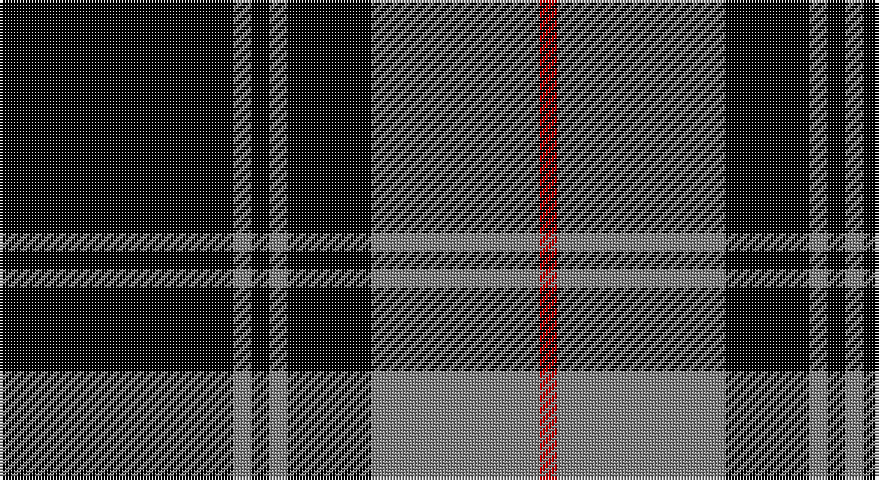

This page is one **sett** — a single exact thread-count. It belongs to the [tartan](/setts/k39y3k3y3k14y28r3/)
(the same proportion at any scale), whose colour order is pattern [KGKGKGR](/stripes/kgkgkgr/).

Part of the [Moffat](/tartans/moffat/) tartan — the named design grouping this sett with its other cloths.

Sourced from weddslist.  It is a [7 stripe tartan](/stripes/stripes7/).

Original link http://www.weddslist.com/cgi-bin/tartans/pg.pl?source=sts

## Also known as

This cloth is also recorded under:

- Moffat District

## Thread count
K/78 N6 K6 N6 K28 N56 R/6

One full sett is **288 threads**.

## Palette

Palette: <strong>Tartan Register</strong> <small style="color:#888">(2 of 3 colours)</small>
<table><thead><tr><th>Colour</th><th>Threads</th><th>Shade</th><th>Base</th><th>OKLCh</th></tr></thead><tbody><tr><td>K/</td><td style="text-align:right;font-variant-numeric:tabular-nums">78</td><td><code style="background-color:#000000;">#000000</code> <small style="color:#888">#000000</small></td><td>K <code style="background-color:#000000;">#000000</code></td><td><small style="color:#888">oklch(0.0% 0.000 0.0)</small></td></tr><tr><td>N</td><td style="text-align:right;font-variant-numeric:tabular-nums">6</td><td><code style="background-color:#808080;">#808080</code> <small style="color:#888">#808080</small></td><td>G <code style="background-color:#006100;">#006100</code></td><td><small style="color:#888">oklch(60.0% 0.000 89.9)</small></td></tr><tr><td>K</td><td style="text-align:right;font-variant-numeric:tabular-nums">6</td><td><code style="background-color:#000000;">#000000</code> <small style="color:#888">#000000</small></td><td>K <code style="background-color:#000000;">#000000</code></td><td><small style="color:#888">oklch(0.0% 0.000 0.0)</small></td></tr><tr><td>N</td><td style="text-align:right;font-variant-numeric:tabular-nums">6</td><td><code style="background-color:#808080;">#808080</code> <small style="color:#888">#808080</small></td><td>G <code style="background-color:#006100;">#006100</code></td><td><small style="color:#888">oklch(60.0% 0.000 89.9)</small></td></tr><tr><td>K</td><td style="text-align:right;font-variant-numeric:tabular-nums">28</td><td><code style="background-color:#000000;">#000000</code> <small style="color:#888">#000000</small></td><td>K <code style="background-color:#000000;">#000000</code></td><td><small style="color:#888">oklch(0.0% 0.000 0.0)</small></td></tr><tr><td>N</td><td style="text-align:right;font-variant-numeric:tabular-nums">56</td><td><code style="background-color:#808080;">#808080</code> <small style="color:#888">#808080</small></td><td>G <code style="background-color:#006100;">#006100</code></td><td><small style="color:#888">oklch(60.0% 0.000 89.9)</small></td></tr><tr><td>R/</td><td style="text-align:right;font-variant-numeric:tabular-nums">6</td><td><code style="background-color:#C00000;">#C00000</code> <small style="color:#888">#C00000</small></td><td>R <code style="background-color:#CC0000;">#CC0000</code></td><td><small style="color:#888">oklch(50.7% 0.208 29.2)</small></td></tr></tbody></table>

# Sample pattern

## Compared to the master

This cloth is one sett of its design; the master sett (the exemplar the design is anchored on) is below for comparison.

<figure style="margin:0"><figcaption style="color:#888;font-size:smaller">this sett</figcaption></figure>
<figure style="margin:0"><figcaption style="color:#888;font-size:smaller"><a href="/setts/dp4g3k1g3dp2g20k10r20dp2k2lo4/">master sett →</a></figcaption></figure>

## Nearest tartans

The nearest existing variants by ΔTartan distance, with this tartan at the top so the swatches line up against it.

ΔTartan

Tartan

Sett

—

<a href="/ttd/edit/#slug=k39y3k3y3k14y28r3~x2">Moffat</a> <a class="nn-out" href="/variants/s7/k39y3k3y3k14y28r3~x2/" title="open its dictionary page">↗</a>

0.61

<a href="/ttd/edit/#slug=k13y1k1y1k4y10ly1y1~x6&amp;base=k39y3k3y3k14y28r3~x2">West Point</a> <a class="nn-out" href="/variants/s8/k13y1k1y1k4y10ly1y1~x6/" title="open its dictionary page">↗</a>

0.95

<a href="/ttd/edit/#slug=n34k7n12k40n3k4lt3~x2&amp;base=k39y3k3y3k14y28r3~x2">TACC</a> <a class="nn-out" href="/variants/s7/n34k7n12k40n3k4lt3~x2/" title="open its dictionary page">↗</a>

1.03

<a href="/ttd/edit/#slug=k16y1k1y1k8y16k1y2~x2&amp;base=k39y3k3y3k14y28r3~x2">Douglas VS</a> <a class="nn-out" href="/variants/s8/k16y1k1y1k8y16k1y2~x2/" title="open its dictionary page">↗</a>

1.20

<a href="/ttd/edit/#slug=k39o3k3o3k14o28r3~x2&amp;base=k39y3k3y3k14y28r3~x2">Moffat (1984)</a> <a class="nn-out" href="/variants/s7/k39o3k3o3k14o28r3~x2/" title="open its dictionary page">↗</a>

1.22

<a href="/ttd/edit/#slug=k37w9k3dg9w3~x2&amp;base=k39y3k3y3k14y28r3~x2">Glen Coe Trade Tartan</a> <a class="nn-out" href="/variants/s5/k37w9k3dg9w3~x2/" title="open its dictionary page">↗</a>

1.23

<a href="/ttd/edit/#slug=k1o2k7o11k18ly2k1~x2&amp;base=k39y3k3y3k14y28r3~x2">DDB Canada (Fashion)</a> <a class="nn-out" href="/variants/s7/k1o2k7o11k18ly2k1~x2/" title="open its dictionary page">↗</a>

1.30

<a href="/ttd/edit/#slug=k9lr1k2lr1k4lr9k1lr2~x4&amp;base=k39y3k3y3k14y28r3~x2">Douglas, Grey Clan/Family Tartan</a> <a class="nn-out" href="/variants/s8/k9lr1k2lr1k4lr9k1lr2~x4/" title="open its dictionary page">↗</a>

1.35

<a href="/ttd/edit/#slug=k2lb5k1lb1k10r1k1~x4&amp;base=k39y3k3y3k14y28r3~x2">Lundy Reform</a> <a class="nn-out" href="/variants/s7/k2lb5k1lb1k10r1k1~x4/" title="open its dictionary page">↗</a>

1.36

<a href="/ttd/edit/#slug=k24o11k5o5k1o2~x4&amp;base=k39y3k3y3k14y28r3~x2">Black Isle Corporate Tartan</a> <a class="nn-out" href="/variants/s6/k24o11k5o5k1o2~x4/" title="open its dictionary page">↗</a>

1.39

<a href="/ttd/edit/#slug=k1b1y7k8b1k8b1y2b1k4b1~x4&amp;base=k39y3k3y3k14y28r3~x2">Priest</a> <a class="nn-out" href="/variants/s11/k1b1y7k8b1k8b1y2b1k4b1~x4/" title="open its dictionary page">↗</a>

## Neighbour map

Every grey dot is one of 14360 variants placed by the first two principal components of the ΔTartan feature space (44% of its variance). Red is this tartan; blue dots are its nearest — click one to open its page.

<svg viewBox="0 0 640 380" role="img" style="max-width:100%;height:auto;border:1px solid #e0e0e0;border-radius:4px;display:block" xmlns="http://www.w3.org/2000/svg"><image href="/nn/cloud.v1.png" width="640" height="380"/><a href="/variants/s8/k13y1k1y1k4y10ly1y1~x6/"><circle cx="337.2" cy="181.5" r="4" fill="#3465a4"><title>West Point</title></circle></a><a href="/variants/s7/n34k7n12k40n3k4lt3~x2/"><circle cx="314.4" cy="199.8" r="4" fill="#3465a4"><title>TACC</title></circle></a><a href="/variants/s8/k16y1k1y1k8y16k1y2~x2/"><circle cx="379.8" cy="197.8" r="4" fill="#3465a4"><title>Douglas VS</title></circle></a><a href="/variants/s7/k39o3k3o3k14o28r3~x2/"><circle cx="372.2" cy="198.8" r="4" fill="#3465a4"><title>Moffat (1984)</title></circle></a><a href="/variants/s5/k37w9k3dg9w3~x2/"><circle cx="372.6" cy="208.0" r="4" fill="#3465a4"><title>Glen Coe Trade Tartan</title></circle></a><a href="/variants/s7/k1o2k7o11k18ly2k1~x2/"><circle cx="394.7" cy="188.2" r="4" fill="#3465a4"><title>DDB Canada (Fashion)</title></circle></a><a href="/variants/s8/k9lr1k2lr1k4lr9k1lr2~x4/"><circle cx="326.6" cy="224.5" r="4" fill="#3465a4"><title>Douglas, Grey Clan/Family Tartan</title></circle></a><a href="/variants/s7/k2lb5k1lb1k10r1k1~x4/"><circle cx="376.1" cy="196.2" r="4" fill="#3465a4"><title>Lundy Reform</title></circle></a><a href="/variants/s6/k24o11k5o5k1o2~x4/"><circle cx="411.6" cy="200.5" r="4" fill="#3465a4"><title>Black Isle Corporate Tartan</title></circle></a><a href="/variants/s11/k1b1y7k8b1k8b1y2b1k4b1~x4/"><circle cx="306.3" cy="207.6" r="4" fill="#3465a4"><title>Priest</title></circle></a><circle cx="356.9" cy="196.9" r="5" fill="#c00000"/></svg>

ID: /variants/s7/k39y3k3y3k14y28r3~x2/
