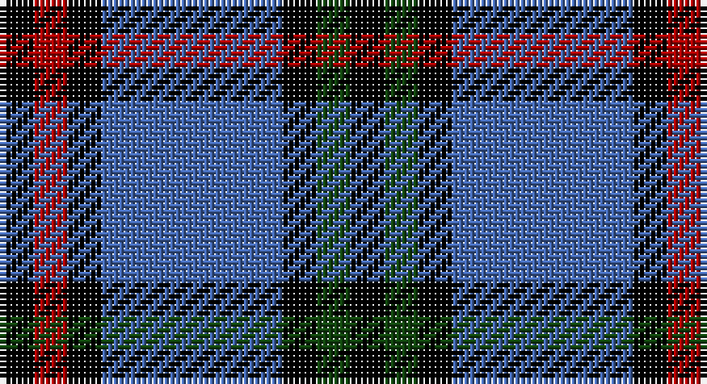

This page is one **sett** — a single exact thread-count. It belongs to the [tartan](/setts/k3dg3k3b16k3r3k3/)
(the same proportion at any scale), whose colour order is pattern [KGKBKRK](/stripes/kgkbkrk/).

Part of the [Eglinton](/tartans/eglinton/) tartan — the named design grouping this sett with its other cloths.

Sourced from weddslist.  It is a [7 stripe tartan](/stripes/stripes7/).

Original link http://www.weddslist.com/cgi-bin/tartans/pg.pl?source=tinsel

## Thread count
K/6 DR6 K6 B32 K6 DG6 K/6

One full sett is **124 threads**.

## Palette

Palette: <strong>Ingles Buchan</strong> <small style="color:#888">(1 of 4 colours)</small>
<table><thead><tr><th>Colour</th><th>Threads</th><th>Shade</th><th>Base</th><th>OKLCh</th></tr></thead><tbody><tr><td>K/</td><td style="text-align:right;font-variant-numeric:tabular-nums">6</td><td><code style="background-color:#000000;">#000000</code> <small style="color:#888">#000000</small></td><td>K <code style="background-color:#000000;">#000000</code></td><td><small style="color:#888">oklch(0.0% 0.000 0.0)</small></td></tr><tr><td>DR</td><td style="text-align:right;font-variant-numeric:tabular-nums">6</td><td><code style="background-color:#AA0000;">#AA0000</code> <small style="color:#888">#AA0000</small></td><td>R <code style="background-color:#CC0000;">#CC0000</code></td><td><small style="color:#888">oklch(46.3% 0.190 29.2)</small></td></tr><tr><td>K</td><td style="text-align:right;font-variant-numeric:tabular-nums">6</td><td><code style="background-color:#000000;">#000000</code> <small style="color:#888">#000000</small></td><td>K <code style="background-color:#000000;">#000000</code></td><td><small style="color:#888">oklch(0.0% 0.000 0.0)</small></td></tr><tr><td>B</td><td style="text-align:right;font-variant-numeric:tabular-nums">32</td><td><code style="background-color:#4367AE;">#4367AE</code> <small style="color:#888">#4367AE</small></td><td>B <code style="background-color:#2A418A;">#2A418A</code></td><td><small style="color:#888">oklch(52.2% 0.120 262.7)</small></td></tr><tr><td>K</td><td style="text-align:right;font-variant-numeric:tabular-nums">6</td><td><code style="background-color:#000000;">#000000</code> <small style="color:#888">#000000</small></td><td>K <code style="background-color:#000000;">#000000</code></td><td><small style="color:#888">oklch(0.0% 0.000 0.0)</small></td></tr><tr><td>DG</td><td style="text-align:right;font-variant-numeric:tabular-nums">6</td><td><code style="background-color:#11450D;">#11450D</code> <small style="color:#888">#11450D</small></td><td>G <code style="background-color:#006100;">#006100</code></td><td><small style="color:#888">oklch(34.4% 0.101 142.1)</small></td></tr><tr><td>K/</td><td style="text-align:right;font-variant-numeric:tabular-nums">6</td><td><code style="background-color:#000000;">#000000</code> <small style="color:#888">#000000</small></td><td>K <code style="background-color:#000000;">#000000</code></td><td><small style="color:#888">oklch(0.0% 0.000 0.0)</small></td></tr></tbody></table>

# Sample pattern

## Compared to the master

This cloth is one sett of its design; the master sett (the exemplar the design is anchored on) is below for comparison.

<figure style="margin:0"><figcaption style="color:#888;font-size:smaller">this sett</figcaption></figure>
<figure style="margin:0"><figcaption style="color:#888;font-size:smaller"><a href="/setts/k1r1k1db7k1g1k1/">master sett →</a></figcaption></figure>

## Nearest tartans

The nearest existing variants by ΔTartan distance, with this tartan at the top so the swatches line up against it.

ΔTartan

Tartan

Sett

—

<a href="/ttd/edit/#slug=k3dg3k3b16k3r3k3~x2">Eglinton</a> <a class="nn-out" href="/variants/s7/k3dg3k3b16k3r3k3~x2/" title="open its dictionary page">↗</a>

0.00

<a href="/ttd/edit/#slug=k3dg3k3b16k3r3k3&amp;base=k3dg3k3b16k3r3k3~x2">Eglinton</a> <a class="nn-out" href="/variants/s7/k3dg3k3b16k3r3k3/" title="open its dictionary page">↗</a>

0.71

<a href="/ttd/edit/#slug=k3r3k3t16k3g3k3~x2&amp;base=k3dg3k3b16k3r3k3~x2">Eglinton</a> <a class="nn-out" href="/variants/s7/k3r3k3t16k3g3k3~x2/" title="open its dictionary page">↗</a>

0.81

<a href="/ttd/edit/#slug=k4r5k4db28k4g5k4~x2&amp;base=k3dg3k3b16k3r3k3~x2">Montgomerie of Eglinton</a> <a class="nn-out" href="/variants/s7/k4r5k4db28k4g5k4~x2/" title="open its dictionary page">↗</a>

1.03

<a href="/ttd/edit/#slug=db2ly1db7w1k7w2~x6&amp;base=k3dg3k3b16k3r3k3~x2">Hawick Rugby Club (Corporate)</a> <a class="nn-out" href="/variants/s6/db2ly1db7w1k7w2~x6/" title="open its dictionary page">↗</a>

1.13

<a href="/variants/s10/db2ly1db7w1k7w2~x6/">Hawick Rugby Club</a>

1.14

<a href="/ttd/edit/#slug=n6db3n6db20k20db8w4~x2&amp;base=k3dg3k3b16k3r3k3~x2">Allianz Deutschland 2012</a> <a class="nn-out" href="/variants/s7/n6db3n6db20k20db8w4~x2/" title="open its dictionary page">↗</a>

1.16

<a href="/ttd/edit/#slug=r5db35k25db8ly10r5~x2&amp;base=k3dg3k3b16k3r3k3~x2">University of Notre Dame</a> <a class="nn-out" href="/variants/s6/r5db35k25db8ly10r5~x2/" title="open its dictionary page">↗</a>

1.31

<a href="/ttd/edit/#slug=k4dg5k4dp28k4r5k4&amp;base=k3dg3k3b16k3r3k3~x2">Montgomery</a> <a class="nn-out" href="/variants/s7/k4dg5k4dp28k4r5k4/" title="open its dictionary page">↗</a>

1.35

<a href="/ttd/edit/#slug=db28k3db6k3db6k20o28k3w6~x2&amp;base=k3dg3k3b16k3r3k3~x2">Forbes</a> <a class="nn-out" href="/variants/s9/db28k3db6k3db6k20o28k3w6~x2/" title="open its dictionary page">↗</a>

1.37

<a href="/ttd/edit/#slug=r5db25w5db3dg25db3~x2&amp;base=k3dg3k3b16k3r3k3~x2">Thayer USA</a> <a class="nn-out" href="/variants/s6/r5db25w5db3dg25db3~x2/" title="open its dictionary page">↗</a>

## Neighbour map

Every grey dot is one of 14360 variants placed by the first two principal components of the ΔTartan feature space (44% of its variance). Red is this tartan; blue dots are its nearest — click one to open its page.

<svg viewBox="0 0 640 380" role="img" style="max-width:100%;height:auto;border:1px solid #e0e0e0;border-radius:4px;display:block" xmlns="http://www.w3.org/2000/svg"><image href="/nn/cloud.v1.png" width="640" height="380"/><a href="/variants/s7/k3dg3k3b16k3r3k3/"><circle cx="212.0" cy="216.3" r="4" fill="#3465a4"><title>Eglinton</title></circle></a><a href="/variants/s7/k3r3k3t16k3g3k3~x2/"><circle cx="200.6" cy="209.4" r="4" fill="#3465a4"><title>Eglinton</title></circle></a><a href="/variants/s7/k4r5k4db28k4g5k4~x2/"><circle cx="263.5" cy="203.1" r="4" fill="#3465a4"><title>Montgomerie of Eglinton</title></circle></a><a href="/variants/s6/db2ly1db7w1k7w2~x6/"><circle cx="196.8" cy="218.7" r="4" fill="#3465a4"><title>Hawick Rugby Club (Corporate)</title></circle></a><a href="/variants/s10/db2ly1db7w1k7w2~x6/"><circle cx="195.0" cy="202.7" r="4" fill="#3465a4"><title>Hawick Rugby Club</title></circle></a><a href="/variants/s7/n6db3n6db20k20db8w4~x2/"><circle cx="199.7" cy="237.6" r="4" fill="#3465a4"><title>Allianz Deutschland 2012</title></circle></a><a href="/variants/s6/r5db35k25db8ly10r5~x2/"><circle cx="220.4" cy="222.4" r="4" fill="#3465a4"><title>University of Notre Dame</title></circle></a><a href="/variants/s7/k4dg5k4dp28k4r5k4/"><circle cx="268.2" cy="198.3" r="4" fill="#3465a4"><title>Montgomery</title></circle></a><a href="/variants/s9/db28k3db6k3db6k20o28k3w6~x2/"><circle cx="179.5" cy="186.5" r="4" fill="#3465a4"><title>Forbes</title></circle></a><a href="/variants/s6/r5db25w5db3dg25db3~x2/"><circle cx="250.0" cy="216.6" r="4" fill="#3465a4"><title>Thayer USA</title></circle></a><circle cx="212.0" cy="216.3" r="5" fill="#c00000"/></svg>

ID: /variants/s7/k3dg3k3b16k3r3k3~x2/
