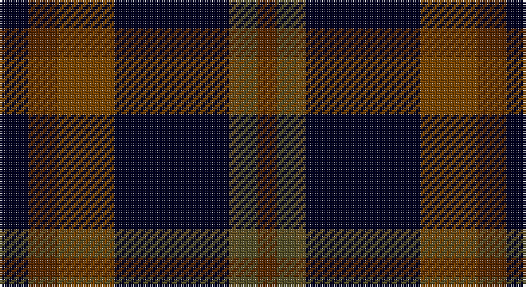

This page is one **sett** — a single exact thread-count. It belongs to the [tartan](/setts/k3dy3yi6k12y1dyi2dy2/)
(the same proportion at any scale), whose colour order is pattern [GGGKGGK](/stripes/gggkggk/).

Sourced from register-of-tartans.  It is a [7 stripe tartan](/stripes/stripes7/).

Original link https://www.tartanregister.gov.uk/tartanDetails.aspx?ref=10750

## Register references

External register numbers recorded for this tartan.

- Scottish Register of Tartans: [10750](https://www.tartanregister.gov.uk/tartanDetails.aspx?ref=10750)

## Thread count
K/12 T12 Ta24 K48 G4 Ga8 T/8

One full sett is **212 threads**.

## Palette

Palette: <strong>custom</strong>
<table><thead><tr><th>Colour</th><th>Threads</th><th>Shade</th><th>Base</th><th>OKLCh</th></tr></thead><tbody><tr><td>K/</td><td style="text-align:right;font-variant-numeric:tabular-nums">12</td><td><code style="background-color:#00011F;">#00011F</code> <small style="color:#888">#00011F</small></td><td>K <code style="background-color:#000000;">#000000</code></td><td><small style="color:#888">oklch(11.4% 0.071 264.2)</small></td></tr><tr><td>T</td><td style="text-align:right;font-variant-numeric:tabular-nums">12</td><td><code style="background-color:#572700;">#572700</code> <small style="color:#888">#572700</small></td><td>G <code style="background-color:#006100;">#006100</code></td><td><small style="color:#888">oklch(33.4% 0.085 52.6)</small></td></tr><tr><td>Ta</td><td style="text-align:right;font-variant-numeric:tabular-nums">24</td><td><code style="background-color:#794400;">#794400</code> <small style="color:#888">#794400</small></td><td>G <code style="background-color:#006100;">#006100</code></td><td><small style="color:#888">oklch(44.1% 0.101 62.8)</small></td></tr><tr><td>K</td><td style="text-align:right;font-variant-numeric:tabular-nums">48</td><td><code style="background-color:#00011F;">#00011F</code> <small style="color:#888">#00011F</small></td><td>K <code style="background-color:#000000;">#000000</code></td><td><small style="color:#888">oklch(11.4% 0.071 264.2)</small></td></tr><tr><td>G</td><td style="text-align:right;font-variant-numeric:tabular-nums">4</td><td><code style="background-color:#675223;">#675223</code> <small style="color:#888">#675223</small></td><td>G <code style="background-color:#006100;">#006100</code></td><td><small style="color:#888">oklch(45.0% 0.070 85.1)</small></td></tr><tr><td>Ga</td><td style="text-align:right;font-variant-numeric:tabular-nums">8</td><td><code style="background-color:#524E26;">#524E26</code> <small style="color:#888">#524E26</small></td><td>G <code style="background-color:#006100;">#006100</code></td><td><small style="color:#888">oklch(41.8% 0.059 103.5)</small></td></tr><tr><td>T/</td><td style="text-align:right;font-variant-numeric:tabular-nums">8</td><td><code style="background-color:#572700;">#572700</code> <small style="color:#888">#572700</small></td><td>G <code style="background-color:#006100;">#006100</code></td><td><small style="color:#888">oklch(33.4% 0.085 52.6)</small></td></tr></tbody></table>

# Sample pattern

## Nearest tartans

The nearest existing variants by ΔTartan distance, with this tartan at the top so the swatches line up against it.

ΔTartan

Tartan

Sett

—

<a href="/ttd/edit/#slug=k3dy3yi6k12y1dyi2dy2~x4">Joe Strummer Commemorative</a> <a class="nn-out" href="/variants/s7/k3dy3yi6k12y1dyi2dy2~x4/" title="open its dictionary page">↗</a>

0.80

<a href="/ttd/edit/#slug=k62db15b15dy20ly5db5k15~x2&amp;base=k3dy3yi6k12y1dyi2dy2~x4">Black Raven (Fashion)</a> <a class="nn-out" href="/variants/s7/k62db15b15dy20ly5db5k15~x2/" title="open its dictionary page">↗</a>

1.03

<a href="/ttd/edit/#slug=k62db15dp15o20ly5db5k15~x2&amp;base=k3dy3yi6k12y1dyi2dy2~x4">Black Raven</a> <a class="nn-out" href="/variants/s7/k62db15dp15o20ly5db5k15~x2/" title="open its dictionary page">↗</a>

1.17

<a href="/variants/s6/dg26ki3dg12k10dp15w2~x2/">Lossiemouth/Hersbruck</a>

1.22

<a href="/ttd/edit/#slug=dy6o2dy12k4dt14k1dy3ly2~x2&amp;base=k3dy3yi6k12y1dyi2dy2~x4">Mica, Green (Fashion)</a> <a class="nn-out" href="/variants/s8/dy6o2dy12k4dt14k1dy3ly2~x2/" title="open its dictionary page">↗</a>

1.23

<a href="/ttd/edit/#slug=lo6k5r4k48dy36loi6&amp;base=k3dy3yi6k12y1dyi2dy2~x4">Drambuie Hunting</a> <a class="nn-out" href="/variants/s6/lo6k5r4k48dy36loi6/" title="open its dictionary page">↗</a>

1.23

<a href="/ttd/edit/#slug=lo4k28r2do22t8do3~x2&amp;base=k3dy3yi6k12y1dyi2dy2~x4">Loch Long One Design</a> <a class="nn-out" href="/variants/s6/lo4k28r2do22t8do3~x2/" title="open its dictionary page">↗</a>

1.25

<a href="/ttd/edit/#slug=dg9g1dp2g1k4r1~x12&amp;base=k3dy3yi6k12y1dyi2dy2~x4">Gorman, George (Personal)</a> <a class="nn-out" href="/variants/s6/dg9g1dp2g1k4r1~x12/" title="open its dictionary page">↗</a>

1.28

<a href="/ttd/edit/#slug=k2w1k12g5db11r1~x2&amp;base=k3dy3yi6k12y1dyi2dy2~x4">New England (Fashion)</a> <a class="nn-out" href="/variants/s6/k2w1k12g5db11r1~x2/" title="open its dictionary page">↗</a>

1.28

<a href="/ttd/edit/#slug=k4r2k12db12k1lo2~x2&amp;base=k3dy3yi6k12y1dyi2dy2~x4">Robert Gordon University</a> <a class="nn-out" href="/variants/s6/k4r2k12db12k1lo2~x2/" title="open its dictionary page">↗</a>

1.30

<a href="/ttd/edit/#slug=dg15db20k2r4k2db20dg15k2ly2~x2&amp;base=k3dy3yi6k12y1dyi2dy2~x4">Manroth (Personal)</a> <a class="nn-out" href="/variants/s9/dg15db20k2r4k2db20dg15k2ly2~x2/" title="open its dictionary page">↗</a>

## Neighbour map

Every grey dot is one of 14360 variants placed by the first two principal components of the ΔTartan feature space (44% of its variance). Red is this tartan; blue dots are its nearest — click one to open its page.

<svg viewBox="0 0 640 380" role="img" style="max-width:100%;height:auto;border:1px solid #e0e0e0;border-radius:4px;display:block" xmlns="http://www.w3.org/2000/svg"><image href="/nn/cloud.v1.png" width="640" height="380"/><a href="/variants/s7/k62db15b15dy20ly5db5k15~x2/"><circle cx="304.5" cy="196.8" r="4" fill="#3465a4"><title>Black Raven (Fashion)</title></circle></a><a href="/variants/s7/k62db15dp15o20ly5db5k15~x2/"><circle cx="289.6" cy="186.7" r="4" fill="#3465a4"><title>Black Raven</title></circle></a><a href="/variants/s6/dg26ki3dg12k10dp15w2~x2/"><circle cx="301.9" cy="229.6" r="4" fill="#3465a4"><title>Lossiemouth/Hersbruck</title></circle></a><a href="/variants/s8/dy6o2dy12k4dt14k1dy3ly2~x2/"><circle cx="274.4" cy="195.5" r="4" fill="#3465a4"><title>Mica, Green (Fashion)</title></circle></a><a href="/variants/s6/lo6k5r4k48dy36loi6/"><circle cx="300.3" cy="190.7" r="4" fill="#3465a4"><title>Drambuie Hunting</title></circle></a><a href="/variants/s6/lo4k28r2do22t8do3~x2/"><circle cx="265.3" cy="202.2" r="4" fill="#3465a4"><title>Loch Long One Design</title></circle></a><a href="/variants/s6/dg9g1dp2g1k4r1~x12/"><circle cx="276.6" cy="222.7" r="4" fill="#3465a4"><title>Gorman, George (Personal)</title></circle></a><a href="/variants/s6/k2w1k12g5db11r1~x2/"><circle cx="238.3" cy="204.6" r="4" fill="#3465a4"><title>New England (Fashion)</title></circle></a><a href="/variants/s6/k4r2k12db12k1lo2~x2/"><circle cx="338.6" cy="238.5" r="4" fill="#3465a4"><title>Robert Gordon University</title></circle></a><a href="/variants/s9/dg15db20k2r4k2db20dg15k2ly2~x2/"><circle cx="270.4" cy="203.4" r="4" fill="#3465a4"><title>Manroth (Personal)</title></circle></a><circle cx="284.7" cy="206.9" r="5" fill="#c00000"/></svg>

ID: /variants/s7/k3dy3yi6k12y1dyi2dy2~x4/
