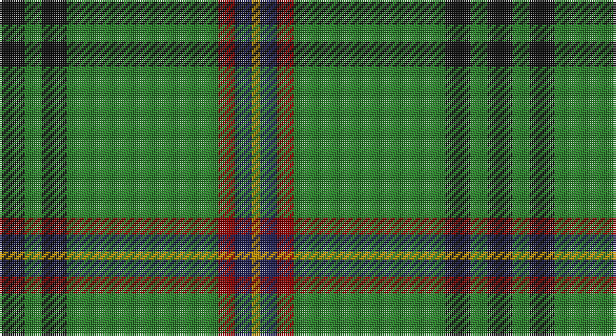

This page is one **sett** — a single exact thread-count. It belongs to the [tartan](/setts/k3g2k3g18r2db2lo1/)
(the same proportion at any scale), whose colour order is pattern [KGKGRBY](/stripes/kgkgrby/).

Sourced from tartans-authority.  It is a [7 stripe tartan](/stripes/stripes7/).

Original link http://www.tartansauthority.com/tartan-ferret/display/7566/

## Provenance

Earliest known date: 2008 The tartan has been designed to celebrate the wedding of Nathalie Selvon and Alex Bruce, to mark the beginning of a new family. The colours blend the histories of our two families. The red and green are from the Ancient Bruce and the yellow and blue are consistent with the flag of Mauritius, the country where the Selvon family trace their roots.

## Also known as

This cloth is also recorded under:

- Sevlon Bruce Personal

3 attestations — the source records this cloth was collapsed from (oldest owns this page)

<ul>
<li>March 2008 — Selvon-Bruce (Personal) (tartans-authority, <a href="http://www.tartansauthority.com/tartan-ferret/display/7566/">record</a>)</li>
<li>undated — Selvon-Bruce (Personal) (register-of-tartans, <a href="https://www.tartanregister.gov.uk/tartanDetails.aspx?ref=5592">record</a>)</li>
<li>undated — Sevlon Bruce Personal Tartan (house-of-tartan, <a href="http://www.house-of-tartan.scotland.net/house/TartanViewjs.asp?colr=Def&tnam=7566">record</a>)</li>
</ul>

## Register references

External register numbers recorded for this tartan.

- Scottish Register of Tartans: [5592](https://www.tartanregister.gov.uk/tartanDetails.aspx?ref=5592)
- Scottish Tartans Authority (ITI): 7566

## Thread count
K/12 G8 K12 G72 DR8 DB8 DY/4

One full sett is **232 threads**.

## Palette

Palette: <strong>Tartan Register</strong> <small style="color:#888">(4 of 5 colours)</small>
<table><thead><tr><th>Colour</th><th>Threads</th><th>Shade</th><th>Base</th><th>OKLCh</th></tr></thead><tbody><tr><td>K/</td><td style="text-align:right;font-variant-numeric:tabular-nums">12</td><td><code style="background-color:#101010;">#101010</code> <small style="color:#888">#101010</small></td><td>K <code style="background-color:#000000;">#000000</code></td><td><small style="color:#888">oklch(17.3% 0.000 89.9)</small></td></tr><tr><td>G</td><td style="text-align:right;font-variant-numeric:tabular-nums">8</td><td><code style="background-color:#288028;">#288028</code> <small style="color:#888">#288028</small></td><td>G <code style="background-color:#006100;">#006100</code></td><td><small style="color:#888">oklch(52.9% 0.149 143.1)</small></td></tr><tr><td>K</td><td style="text-align:right;font-variant-numeric:tabular-nums">12</td><td><code style="background-color:#101010;">#101010</code> <small style="color:#888">#101010</small></td><td>K <code style="background-color:#000000;">#000000</code></td><td><small style="color:#888">oklch(17.3% 0.000 89.9)</small></td></tr><tr><td>G</td><td style="text-align:right;font-variant-numeric:tabular-nums">72</td><td><code style="background-color:#288028;">#288028</code> <small style="color:#888">#288028</small></td><td>G <code style="background-color:#006100;">#006100</code></td><td><small style="color:#888">oklch(52.9% 0.149 143.1)</small></td></tr><tr><td>DR</td><td style="text-align:right;font-variant-numeric:tabular-nums">8</td><td><code style="background-color:#880000;">#880000</code> <small style="color:#888">#880000</small></td><td>R <code style="background-color:#CC0000;">#CC0000</code></td><td><small style="color:#888">oklch(39.4% 0.162 29.2)</small></td></tr><tr><td>DB</td><td style="text-align:right;font-variant-numeric:tabular-nums">8</td><td><code style="background-color:#1C1C50;">#1C1C50</code> <small style="color:#888">#1C1C50</small></td><td>B <code style="background-color:#2A418A;">#2A418A</code></td><td><small style="color:#888">oklch(26.2% 0.093 277.9)</small></td></tr><tr><td>DY/</td><td style="text-align:right;font-variant-numeric:tabular-nums">4</td><td><code style="background-color:#BC8C00;">#BC8C00</code> <small style="color:#888">#BC8C00</small></td><td>Y <code style="background-color:#F2BF00;">#F2BF00</code></td><td><small style="color:#888">oklch(66.8% 0.137 84.1)</small></td></tr></tbody></table>

# Sample pattern

## Nearest tartans

The nearest existing variants by ΔTartan distance, with this tartan at the top so the swatches line up against it.

ΔTartan

Tartan

Sett

—

<a href="/ttd/edit/#slug=k3g2k3g18r2db2lo1~x4">Selvon-Bruce (Personal)</a> <a class="nn-out" href="/variants/s7/k3g2k3g18r2db2lo1~x4/" title="open its dictionary page">↗</a>

0.63

<a href="/ttd/edit/#slug=g10loi3w2k2g8k22g43lo4~x2&amp;base=k3g2k3g18r2db2lo1~x4">Celtic Pride</a> <a class="nn-out" href="/variants/s8/g10loi3w2k2g8k22g43lo4~x2/" title="open its dictionary page">↗</a>

0.73

<a href="/ttd/edit/#slug=db6w3r3g55k10r3~x4&amp;base=k3g2k3g18r2db2lo1~x4">Military Medical Memorial (USA)</a> <a class="nn-out" href="/variants/s6/db6w3r3g55k10r3~x4/" title="open its dictionary page">↗</a>

0.99

<a href="/ttd/edit/#slug=k2w2db8k4g33r2g16w2~x2&amp;base=k3g2k3g18r2db2lo1~x4">Sarros (Personal) XX</a> <a class="nn-out" href="/variants/s8/k2w2db8k4g33r2g16w2~x2/" title="open its dictionary page">↗</a>

1.04

<a href="/ttd/edit/#slug=ly5g3ly3g53r7db5r13w4~x2&amp;base=k3g2k3g18r2db2lo1~x4">Hall (P.I.E.) (Personal)</a> <a class="nn-out" href="/variants/s8/ly5g3ly3g53r7db5r13w4~x2/" title="open its dictionary page">↗</a>

1.06

<a href="/ttd/edit/#slug=db17r3g55db3g4db3g4ly3w5~x2&amp;base=k3g2k3g18r2db2lo1~x4">Bundanoon (District)</a> <a class="nn-out" href="/variants/s9/db17r3g55db3g4db3g4ly3w5~x2/" title="open its dictionary page">↗</a>

1.06

<a href="/ttd/edit/#slug=r5w4dbi6db2g43db2dbi4r3~x2&amp;base=k3g2k3g18r2db2lo1~x4">Mullikin (2013)</a> <a class="nn-out" href="/variants/s8/r5w4dbi6db2g43db2dbi4r3~x2/" title="open its dictionary page">↗</a>

1.09

<a href="/ttd/edit/#slug=g4lb1db2r1g1r1db2lb1g14lo1~x4&amp;base=k3g2k3g18r2db2lo1~x4">Seattle (District)</a> <a class="nn-out" href="/variants/s10/g4lb1db2r1g1r1db2lb1g14lo1~x4/" title="open its dictionary page">↗</a>

1.09

<a href="/ttd/edit/#slug=g55p7r24g12db4ly3db4~x2&amp;base=k3g2k3g18r2db2lo1~x4">Crieff, and Strathearn</a> <a class="nn-out" href="/variants/s7/g55p7r24g12db4ly3db4~x2/" title="open its dictionary page">↗</a>

1.19

<a href="/ttd/edit/#slug=g55dp7r24g12db4ly3db4~x2&amp;base=k3g2k3g18r2db2lo1~x4">Crieff and Strathearn District Tartan</a> <a class="nn-out" href="/variants/s7/g55dp7r24g12db4ly3db4~x2/" title="open its dictionary page">↗</a>

1.20

<a href="/ttd/edit/#slug=dg60ly16m8t2o3~x2&amp;base=k3g2k3g18r2db2lo1~x4">Isle of Raasay</a> <a class="nn-out" href="/variants/s5/dg60ly16m8t2o3~x2/" title="open its dictionary page">↗</a>

## Neighbour map

Every grey dot is one of 14360 variants placed by the first two principal components of the ΔTartan feature space (44% of its variance). Red is this tartan; blue dots are its nearest — click one to open its page.

<svg viewBox="0 0 640 380" role="img" style="max-width:100%;height:auto;border:1px solid #e0e0e0;border-radius:4px;display:block" xmlns="http://www.w3.org/2000/svg"><image href="/nn/cloud.v1.png" width="640" height="380"/><a href="/variants/s8/g10loi3w2k2g8k22g43lo4~x2/"><circle cx="382.5" cy="151.4" r="4" fill="#3465a4"><title>Celtic Pride</title></circle></a><a href="/variants/s6/db6w3r3g55k10r3~x4/"><circle cx="410.7" cy="150.4" r="4" fill="#3465a4"><title>Military Medical Memorial (USA)</title></circle></a><a href="/variants/s8/k2w2db8k4g33r2g16w2~x2/"><circle cx="405.8" cy="156.2" r="4" fill="#3465a4"><title>Sarros (Personal) XX</title></circle></a><a href="/variants/s8/ly5g3ly3g53r7db5r13w4~x2/"><circle cx="344.4" cy="131.8" r="4" fill="#3465a4"><title>Hall (P.I.E.) (Personal)</title></circle></a><a href="/variants/s9/db17r3g55db3g4db3g4ly3w5~x2/"><circle cx="385.2" cy="128.0" r="4" fill="#3465a4"><title>Bundanoon (District)</title></circle></a><a href="/variants/s8/r5w4dbi6db2g43db2dbi4r3~x2/"><circle cx="366.6" cy="122.0" r="4" fill="#3465a4"><title>Mullikin (2013)</title></circle></a><a href="/variants/s10/g4lb1db2r1g1r1db2lb1g14lo1~x4/"><circle cx="382.3" cy="139.5" r="4" fill="#3465a4"><title>Seattle (District)</title></circle></a><a href="/variants/s7/g55p7r24g12db4ly3db4~x2/"><circle cx="357.8" cy="155.0" r="4" fill="#3465a4"><title>Crieff, and Strathearn</title></circle></a><a href="/variants/s7/g55dp7r24g12db4ly3db4~x2/"><circle cx="365.1" cy="158.3" r="4" fill="#3465a4"><title>Crieff and Strathearn District Tartan</title></circle></a><a href="/variants/s5/dg60ly16m8t2o3~x2/"><circle cx="424.2" cy="151.7" r="4" fill="#3465a4"><title>Isle of Raasay</title></circle></a><circle cx="378.6" cy="155.1" r="5" fill="#c00000"/></svg>

ID: /variants/s7/k3g2k3g18r2db2lo1~x4/
