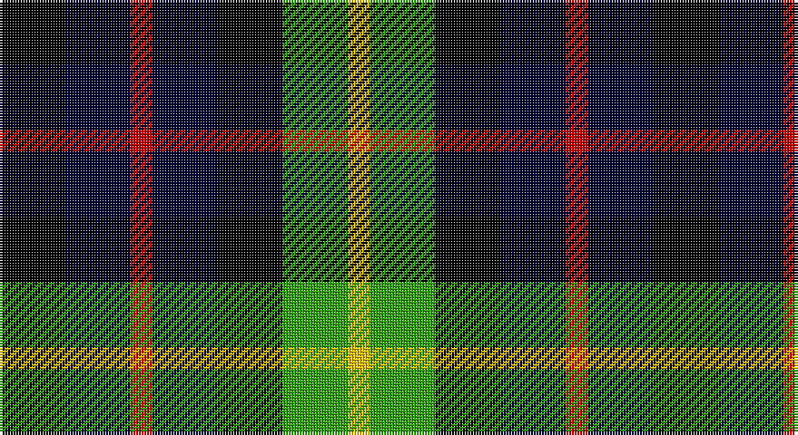

This page is one **sett** — a single exact thread-count. It belongs to the [tartan](/setts/k3ki3r1ki3k3g3ly1/)
(the same proportion at any scale), whose colour order is pattern [KKRKKGY](/stripes/kkrkkgy/).

Sourced from weddslist.  It is a [7 stripe tartan](/stripes/stripes7/).

Original link http://www.weddslist.com/cgi-bin/tartans/pg.pl?source=sts

## Thread count
K/24 DB24 R8 DB24 K24 G24 Y/8

One full sett is **240 threads**.

## Palette

Palette: <strong>Ingles Buchan</strong> <small style="color:#888">(1 of 5 colours)</small>
<table><thead><tr><th>Colour</th><th>Threads</th><th>Shade</th><th>Base</th><th>OKLCh</th></tr></thead><tbody><tr><td>K/</td><td style="text-align:right;font-variant-numeric:tabular-nums">24</td><td><code style="background-color:#000000;">#000000</code> <small style="color:#888">#000000</small></td><td>K <code style="background-color:#000000;">#000000</code></td><td><small style="color:#888">oklch(0.0% 0.000 0.0)</small></td></tr><tr><td>DB</td><td style="text-align:right;font-variant-numeric:tabular-nums">24</td><td><code style="background-color:#000030;">#000030</code> <small style="color:#888">#000030</small></td><td>K <code style="background-color:#000000;">#000000</code></td><td><small style="color:#888">oklch(14.0% 0.097 264.1)</small></td></tr><tr><td>R</td><td style="text-align:right;font-variant-numeric:tabular-nums">8</td><td><code style="background-color:#C00000;">#C00000</code> <small style="color:#888">#C00000</small></td><td>R <code style="background-color:#CC0000;">#CC0000</code></td><td><small style="color:#888">oklch(50.7% 0.208 29.2)</small></td></tr><tr><td>DB</td><td style="text-align:right;font-variant-numeric:tabular-nums">24</td><td><code style="background-color:#000030;">#000030</code> <small style="color:#888">#000030</small></td><td>K <code style="background-color:#000000;">#000000</code></td><td><small style="color:#888">oklch(14.0% 0.097 264.1)</small></td></tr><tr><td>K</td><td style="text-align:right;font-variant-numeric:tabular-nums">24</td><td><code style="background-color:#000000;">#000000</code> <small style="color:#888">#000000</small></td><td>K <code style="background-color:#000000;">#000000</code></td><td><small style="color:#888">oklch(0.0% 0.000 0.0)</small></td></tr><tr><td>G</td><td style="text-align:right;font-variant-numeric:tabular-nums">24</td><td><code style="background-color:#30A010;">#30A010</code> <small style="color:#888">#30A010</small></td><td>G <code style="background-color:#006100;">#006100</code></td><td><small style="color:#888">oklch(61.9% 0.195 140.5)</small></td></tr><tr><td>Y/</td><td style="text-align:right;font-variant-numeric:tabular-nums">8</td><td><code style="background-color:#F0C000;">#F0C000</code> <small style="color:#888">#F0C000</small></td><td>Y <code style="background-color:#F2BF00;">#F2BF00</code></td><td><small style="color:#888">oklch(82.7% 0.169 90.5)</small></td></tr></tbody></table>

# Sample pattern

## Nearest tartans

The nearest existing variants by ΔTartan distance, with this tartan at the top so the swatches line up against it.

ΔTartan

Tartan

Sett

—

<a href="/ttd/edit/#slug=k3ki3r1ki3k3g3ly1~x8">Montrose of Alabama</a> <a class="nn-out" href="/variants/s7/k3ki3r1ki3k3g3ly1~x8/" title="open its dictionary page">↗</a>

0.95

<a href="/ttd/edit/#slug=k3db3r1db3k3g3lo1~x8&amp;base=k3ki3r1ki3k3g3ly1~x8">Melrose of Alabama</a> <a class="nn-out" href="/variants/s7/k3db3r1db3k3g3lo1~x8/" title="open its dictionary page">↗</a>

1.34

<a href="/ttd/edit/#slug=g8k7db8r2db8k7g8k2~x2&amp;base=k3ki3r1ki3k3g3ly1~x8">Denholm</a> <a class="nn-out" href="/variants/s8/g8k7db8r2db8k7g8k2~x2/" title="open its dictionary page">↗</a>

1.36

<a href="/ttd/edit/#slug=r1k2dg4k1dg1k2db3k1w1~x6&amp;base=k3ki3r1ki3k3g3ly1~x8">MacKean dress</a> <a class="nn-out" href="/variants/s9/r1k2dg4k1dg1k2db3k1w1~x6/" title="open its dictionary page">↗</a>

1.42

<a href="/ttd/edit/#slug=k9g9ly2g9k9db9k3~x2&amp;base=k3ki3r1ki3k3g3ly1~x8">Campbell of Breadalbane (Clan)</a> <a class="nn-out" href="/variants/s7/k9g9ly2g9k9db9k3~x2/" title="open its dictionary page">↗</a>

1.44

<a href="/ttd/edit/#slug=dg3lb2k3dg8k8db8r2db3&amp;base=k3ki3r1ki3k3g3ly1~x8">Davidson Double</a> <a class="nn-out" href="/variants/s8/dg3lb2k3dg8k8db8r2db3/" title="open its dictionary page">↗</a>

1.44

<a href="/ttd/edit/#slug=k4dg4lb1dg4k4db4k1~x2&amp;base=k3ki3r1ki3k3g3ly1~x8">Graham of Montrose</a> <a class="nn-out" href="/variants/s7/k4dg4lb1dg4k4db4k1~x2/" title="open its dictionary page">↗</a>

1.47

<a href="/ttd/edit/#slug=k12g12w2g12k12p12r3~x2&amp;base=k3ki3r1ki3k3g3ly1~x8">Wilson's, No 120</a> <a class="nn-out" href="/variants/s7/k12g12w2g12k12p12r3~x2/" title="open its dictionary page">↗</a>

1.47

<a href="/ttd/edit/#slug=r2db5k5dg5lr2dg5k5lr2k2lr4k2lr2~x2&amp;base=k3ki3r1ki3k3g3ly1~x8">Valley Forge Pipe Band</a> <a class="nn-out" href="/variants/s12/r2db5k5dg5lr2dg5k5lr2k2lr4k2lr2~x2/" title="open its dictionary page">↗</a>

1.47

<a href="/ttd/edit/#slug=k1db3k3g3r1g3k3g1r1~x2&amp;base=k3ki3r1ki3k3g3ly1~x8">Unnamed, No 30</a> <a class="nn-out" href="/variants/s9/k1db3k3g3r1g3k3g1r1~x2/" title="open its dictionary page">↗</a>

1.49

<a href="/ttd/edit/#slug=r2db4k4g4lb1g4k4g4lb1~x4&amp;base=k3ki3r1ki3k3g3ly1~x8">Arrol</a> <a class="nn-out" href="/variants/s9/r2db4k4g4lb1g4k4g4lb1~x4/" title="open its dictionary page">↗</a>

## Neighbour map

Every grey dot is one of 14360 variants placed by the first two principal components of the ΔTartan feature space (44% of its variance). Red is this tartan; blue dots are its nearest — click one to open its page.

<svg viewBox="0 0 640 380" role="img" style="max-width:100%;height:auto;border:1px solid #e0e0e0;border-radius:4px;display:block" xmlns="http://www.w3.org/2000/svg"><image href="/nn/cloud.v1.png" width="640" height="380"/><a href="/variants/s7/k3db3r1db3k3g3lo1~x8/"><circle cx="51.3" cy="286.2" r="4" fill="#3465a4"><title>Melrose of Alabama</title></circle></a><a href="/variants/s8/g8k7db8r2db8k7g8k2~x2/"><circle cx="87.2" cy="286.0" r="4" fill="#3465a4"><title>Denholm</title></circle></a><a href="/variants/s9/r1k2dg4k1dg1k2db3k1w1~x6/"><circle cx="89.3" cy="235.4" r="4" fill="#3465a4"><title>MacKean dress</title></circle></a><a href="/variants/s7/k9g9ly2g9k9db9k3~x2/"><circle cx="129.0" cy="283.4" r="4" fill="#3465a4"><title>Campbell of Breadalbane (Clan)</title></circle></a><a href="/variants/s8/dg3lb2k3dg8k8db8r2db3/"><circle cx="66.4" cy="246.5" r="4" fill="#3465a4"><title>Davidson Double</title></circle></a><a href="/variants/s7/k4dg4lb1dg4k4db4k1~x2/"><circle cx="134.5" cy="293.7" r="4" fill="#3465a4"><title>Graham of Montrose</title></circle></a><a href="/variants/s7/k12g12w2g12k12p12r3~x2/"><circle cx="92.6" cy="237.1" r="4" fill="#3465a4"><title>Wilson's, No 120</title></circle></a><a href="/variants/s12/r2db5k5dg5lr2dg5k5lr2k2lr4k2lr2~x2/"><circle cx="14.0" cy="248.6" r="4" fill="#3465a4"><title>Valley Forge Pipe Band</title></circle></a><a href="/variants/s9/k1db3k3g3r1g3k3g1r1~x2/"><circle cx="82.9" cy="270.9" r="4" fill="#3465a4"><title>Unnamed, No 30</title></circle></a><a href="/variants/s9/r2db4k4g4lb1g4k4g4lb1~x4/"><circle cx="76.7" cy="251.9" r="4" fill="#3465a4"><title>Arrol</title></circle></a><circle cx="44.2" cy="281.4" r="5" fill="#c00000"/></svg>

ID: /variants/s7/k3ki3r1ki3k3g3ly1~x8/
