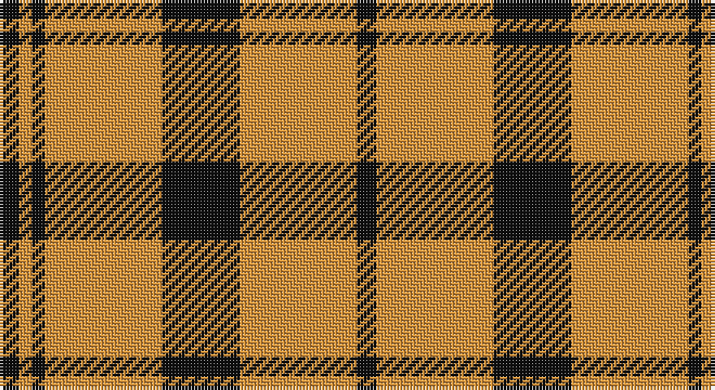

This page is one **sett** — a single exact thread-count. It belongs to the [tartan](/setts/k3lo18k12lo18k2lo2k3/)
(the same proportion at any scale), whose colour order is pattern [KYKYKYK](/stripes/kykykyk/).

Part of the [Kinloch Anderson Check](/tartans/kinloch-anderson-check/) tartan — the named design grouping this sett with its other cloths.

Sourced from tartans-authority.  It is a [7 stripe tartan](/stripes/stripes7/).

Original link http://www.tartansauthority.com/tartan-ferret/display/3003/

## Register references

External register numbers recorded for this tartan.

- Scottish Tartans Authority (ITI): 3003

## Thread count
K/6 Oa4 K4 Oa36 K24 O36 Ka/6

One full sett is **220 threads**.

## Palette

Palette: <strong>Tartan Register</strong>
<table><thead><tr><th>Colour</th><th>Threads</th><th>Shade</th><th>Base</th><th>OKLCh</th></tr></thead><tbody><tr><td>K/</td><td style="text-align:right;font-variant-numeric:tabular-nums">6</td><td><code style="background-color:#101010;">#101010</code> <small style="color:#888">#101010</small></td><td>K <code style="background-color:#000000;">#000000</code></td><td><small style="color:#888">oklch(17.3% 0.000 89.9)</small></td></tr><tr><td>Oa</td><td style="text-align:right;font-variant-numeric:tabular-nums">4</td><td><code style="background-color:#DC943C;">#DC943C</code> <small style="color:#888">#DC943C</small></td><td>Y <code style="background-color:#F2BF00;">#F2BF00</code></td><td><small style="color:#888">oklch(72.3% 0.133 67.9)</small></td></tr><tr><td>K</td><td style="text-align:right;font-variant-numeric:tabular-nums">4</td><td><code style="background-color:#101010;">#101010</code> <small style="color:#888">#101010</small></td><td>K <code style="background-color:#000000;">#000000</code></td><td><small style="color:#888">oklch(17.3% 0.000 89.9)</small></td></tr><tr><td>Oa</td><td style="text-align:right;font-variant-numeric:tabular-nums">36</td><td><code style="background-color:#DC943C;">#DC943C</code> <small style="color:#888">#DC943C</small></td><td>Y <code style="background-color:#F2BF00;">#F2BF00</code></td><td><small style="color:#888">oklch(72.3% 0.133 67.9)</small></td></tr><tr><td>K</td><td style="text-align:right;font-variant-numeric:tabular-nums">24</td><td><code style="background-color:#101010;">#101010</code> <small style="color:#888">#101010</small></td><td>K <code style="background-color:#000000;">#000000</code></td><td><small style="color:#888">oklch(17.3% 0.000 89.9)</small></td></tr><tr><td>O</td><td style="text-align:right;font-variant-numeric:tabular-nums">36</td><td><code style="background-color:#DC943C;">#DC943C</code> <small style="color:#888">#DC943C</small></td><td>Y <code style="background-color:#F2BF00;">#F2BF00</code></td><td><small style="color:#888">oklch(72.3% 0.133 67.9)</small></td></tr><tr><td>Ka/</td><td style="text-align:right;font-variant-numeric:tabular-nums">6</td><td><code style="background-color:#101010;">#101010</code> <small style="color:#888">#101010</small></td><td>K <code style="background-color:#000000;">#000000</code></td><td><small style="color:#888">oklch(17.3% 0.000 89.9)</small></td></tr></tbody></table>

# Sample pattern

## Compared to the master

This cloth is one sett of its design; the master sett (the exemplar the design is anchored on) is below for comparison.

<figure style="margin:0"><figcaption style="color:#888;font-size:smaller">this sett</figcaption></figure>
<figure style="margin:0"><figcaption style="color:#888;font-size:smaller"><a href="/setts/k18lo2k2lo3k2lo2k18lo12ly18dy3ly18lo9/">master sett →</a></figcaption></figure>

## Nearest tartans

The nearest existing variants by ΔTartan distance, with this tartan at the top so the swatches line up against it.

ΔTartan

Tartan

Sett

—

<a href="/ttd/edit/#slug=k3lo18k12lo18k2lo2k3~x2">Kinloch Anderson Check (Fashion)</a> <a class="nn-out" href="/variants/s7/k3lo18k12lo18k2lo2k3~x2/" title="open its dictionary page">↗</a>

1.04

<a href="/ttd/edit/#slug=dr2lo2dr15lo1w10o15lo2o2~x2&amp;base=k3lo18k12lo18k2lo2k3~x2">Bannockbane</a> <a class="nn-out" href="/variants/s8/dr2lo2dr15lo1w10o15lo2o2~x2/" title="open its dictionary page">↗</a>

1.05

<a href="/ttd/edit/#slug=t12lo75k22w12k22w16t8&amp;base=k3lo18k12lo18k2lo2k3~x2">Orange Fanaticos (Corporate)</a> <a class="nn-out" href="/variants/s7/t12lo75k22w12k22w16t8/" title="open its dictionary page">↗</a>

1.09

<a href="/ttd/edit/#slug=do2lo2do15lo1w10loi15lo2loi2~x2&amp;base=k3lo18k12lo18k2lo2k3~x2">Bannockbane Orange Stripes</a> <a class="nn-out" href="/variants/s8/do2lo2do15lo1w10loi15lo2loi2~x2/" title="open its dictionary page">↗</a>

1.11

<a href="/ttd/edit/#slug=do4r3do21r2w14o22r3o4~x2&amp;base=k3lo18k12lo18k2lo2k3~x2">Bannock Bane M.405</a> <a class="nn-out" href="/variants/s8/do4r3do21r2w14o22r3o4~x2/" title="open its dictionary page">↗</a>

1.19

<a href="/ttd/edit/#slug=k4w26k10lo8k3lo8k10r26w4~x2&amp;base=k3lo18k12lo18k2lo2k3~x2">Lord Laird</a> <a class="nn-out" href="/variants/s9/k4w26k10lo8k3lo8k10r26w4~x2/" title="open its dictionary page">↗</a>

1.19

<a href="/ttd/edit/#slug=do2r2do15r1w10dy15r2dy2~x2&amp;base=k3lo18k12lo18k2lo2k3~x2">Bannockbane Brown #1</a> <a class="nn-out" href="/variants/s8/do2r2do15r1w10dy15r2dy2~x2/" title="open its dictionary page">↗</a>

1.21

<a href="/ttd/edit/#slug=lb23k4lb4k4lb4k22o23lo5~x2&amp;base=k3lo18k12lo18k2lo2k3~x2">Aberlour</a> <a class="nn-out" href="/variants/s8/lb23k4lb4k4lb4k22o23lo5~x2/" title="open its dictionary page">↗</a>

1.21

<a href="/ttd/edit/#slug=ly2g7k6r12k1r1ly2~x4&amp;base=k3lo18k12lo18k2lo2k3~x2">Blackstock, dress</a> <a class="nn-out" href="/variants/s7/ly2g7k6r12k1r1ly2~x4/" title="open its dictionary page">↗</a>

1.22

<a href="/ttd/edit/#slug=r24w2ly3g16k16w2ly3~x2&amp;base=k3lo18k12lo18k2lo2k3~x2">MacLachlan Old Clan Tartan</a> <a class="nn-out" href="/variants/s7/r24w2ly3g16k16w2ly3~x2/" title="open its dictionary page">↗</a>

1.23

<a href="/ttd/edit/#slug=r36w3lo4g24w24k3lo6~x2&amp;base=k3lo18k12lo18k2lo2k3~x2">MacLachlan Dress</a> <a class="nn-out" href="/variants/s7/r36w3lo4g24w24k3lo6~x2/" title="open its dictionary page">↗</a>

## Neighbour map

Every grey dot is one of 14360 variants placed by the first two principal components of the ΔTartan feature space (44% of its variance). Red is this tartan; blue dots are its nearest — click one to open its page.

<svg viewBox="0 0 640 380" role="img" style="max-width:100%;height:auto;border:1px solid #e0e0e0;border-radius:4px;display:block" xmlns="http://www.w3.org/2000/svg"><image href="/nn/cloud.v1.png" width="640" height="380"/><a href="/variants/s8/dr2lo2dr15lo1w10o15lo2o2~x2/"><circle cx="185.4" cy="150.3" r="4" fill="#3465a4"><title>Bannockbane</title></circle></a><a href="/variants/s7/t12lo75k22w12k22w16t8/"><circle cx="197.7" cy="173.0" r="4" fill="#3465a4"><title>Orange Fanaticos (Corporate)</title></circle></a><a href="/variants/s8/do2lo2do15lo1w10loi15lo2loi2~x2/"><circle cx="184.8" cy="151.9" r="4" fill="#3465a4"><title>Bannockbane Orange Stripes</title></circle></a><a href="/variants/s8/do4r3do21r2w14o22r3o4~x2/"><circle cx="184.6" cy="172.0" r="4" fill="#3465a4"><title>Bannock Bane M.405</title></circle></a><a href="/variants/s9/k4w26k10lo8k3lo8k10r26w4~x2/"><circle cx="106.4" cy="167.2" r="4" fill="#3465a4"><title>Lord Laird</title></circle></a><a href="/variants/s8/do2r2do15r1w10dy15r2dy2~x2/"><circle cx="193.3" cy="157.9" r="4" fill="#3465a4"><title>Bannockbane Brown #1</title></circle></a><a href="/variants/s8/lb23k4lb4k4lb4k22o23lo5~x2/"><circle cx="130.3" cy="193.0" r="4" fill="#3465a4"><title>Aberlour</title></circle></a><a href="/variants/s7/ly2g7k6r12k1r1ly2~x4/"><circle cx="189.7" cy="169.2" r="4" fill="#3465a4"><title>Blackstock, dress</title></circle></a><a href="/variants/s7/r24w2ly3g16k16w2ly3~x2/"><circle cx="154.4" cy="155.6" r="4" fill="#3465a4"><title>MacLachlan Old Clan Tartan</title></circle></a><a href="/variants/s7/r36w3lo4g24w24k3lo6~x2/"><circle cx="139.4" cy="147.3" r="4" fill="#3465a4"><title>MacLachlan Dress</title></circle></a><circle cx="160.8" cy="182.7" r="5" fill="#c00000"/></svg>

ID: /variants/s7/k3lo18k12lo18k2lo2k3~x2/
