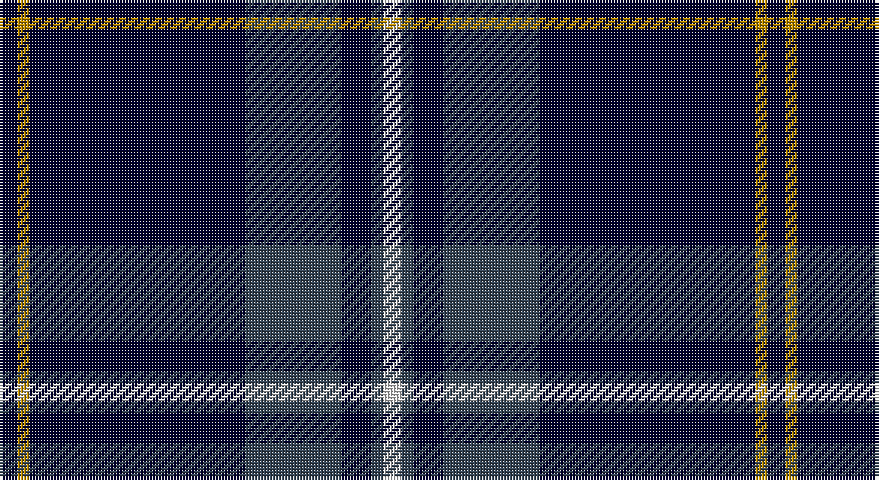

This page is one **sett** — a single exact thread-count. It belongs to the [tartan](/setts/k3lo2k36dt16k5dt2w3/)
(the same proportion at any scale), whose colour order is pattern [KYKBKBW](/stripes/kykbkbw/).

Sourced from tartans-authority.  It is a [7 stripe tartan](/stripes/stripes7/).

Original link http://www.tartansauthority.com/tartan-ferret/display/7881/

## Register references

External register numbers recorded for this tartan.

- Scottish Register of Tartans: [7881](https://www.tartanregister.gov.uk/tartanDetails?ref=7881)
- Scottish Tartans Authority (ITI): 7881

## Thread count
DB/6 DY4 DB72 N32 DB10 N4 LN/6

One full sett is **256 threads**.

## Palette

Palette: <strong>Tartan Register</strong> <small style="color:#888">(2 of 4 colours)</small>
<table><thead><tr><th>Colour</th><th>Threads</th><th>Shade</th><th>Base</th><th>OKLCh</th></tr></thead><tbody><tr><td>DB/</td><td style="text-align:right;font-variant-numeric:tabular-nums">6</td><td><code style="background-color:#00002C;">#00002C</code> <small style="color:#888">#00002C</small></td><td>K <code style="background-color:#000000;">#000000</code></td><td><small style="color:#888">oklch(13.2% 0.092 264.1)</small></td></tr><tr><td>DY</td><td style="text-align:right;font-variant-numeric:tabular-nums">4</td><td><code style="background-color:#BC8C00;">#BC8C00</code> <small style="color:#888">#BC8C00</small></td><td>Y <code style="background-color:#F2BF00;">#F2BF00</code></td><td><small style="color:#888">oklch(66.8% 0.137 84.1)</small></td></tr><tr><td>DB</td><td style="text-align:right;font-variant-numeric:tabular-nums">72</td><td><code style="background-color:#00002C;">#00002C</code> <small style="color:#888">#00002C</small></td><td>K <code style="background-color:#000000;">#000000</code></td><td><small style="color:#888">oklch(13.2% 0.092 264.1)</small></td></tr><tr><td>N</td><td style="text-align:right;font-variant-numeric:tabular-nums">32</td><td><code style="background-color:#344454;">#344454</code> <small style="color:#888">#344454</small></td><td>B <code style="background-color:#2A418A;">#2A418A</code></td><td><small style="color:#888">oklch(38.0% 0.034 248.7)</small></td></tr><tr><td>DB</td><td style="text-align:right;font-variant-numeric:tabular-nums">10</td><td><code style="background-color:#00002C;">#00002C</code> <small style="color:#888">#00002C</small></td><td>K <code style="background-color:#000000;">#000000</code></td><td><small style="color:#888">oklch(13.2% 0.092 264.1)</small></td></tr><tr><td>N</td><td style="text-align:right;font-variant-numeric:tabular-nums">4</td><td><code style="background-color:#344454;">#344454</code> <small style="color:#888">#344454</small></td><td>B <code style="background-color:#2A418A;">#2A418A</code></td><td><small style="color:#888">oklch(38.0% 0.034 248.7)</small></td></tr><tr><td>LN/</td><td style="text-align:right;font-variant-numeric:tabular-nums">6</td><td><code style="background-color:#E0E0E0;">#E0E0E0</code> <small style="color:#888">#E0E0E0</small></td><td>W <code style="background-color:#F7F7F7;">#F7F7F7</code></td><td><small style="color:#888">oklch(90.7% 0.000 89.9)</small></td></tr></tbody></table>

# Sample pattern

## Nearest tartans

The nearest existing variants by ΔTartan distance, with this tartan at the top so the swatches line up against it.

ΔTartan

Tartan

Sett

—

<a href="/ttd/edit/#slug=k3lo2k36dt16k5dt2w3~x2">Pride of Nova Scotia (Corporate)</a> <a class="nn-out" href="/variants/s7/k3lo2k36dt16k5dt2w3~x2/" title="open its dictionary page">↗</a>

1.03

<a href="/ttd/edit/#slug=k1lo2k3db12k18w1~x2&amp;base=k3lo2k36dt16k5dt2w3~x2">Jon's Theme (Fashion)</a> <a class="nn-out" href="/variants/s6/k1lo2k3db12k18w1~x2/" title="open its dictionary page">↗</a>

1.07

<a href="/ttd/edit/#slug=k60r3k5r3lr18o3~x2&amp;base=k3lo2k36dt16k5dt2w3~x2">Ailsa, Navy (Fashion)</a> <a class="nn-out" href="/variants/s6/k60r3k5r3lr18o3~x2/" title="open its dictionary page">↗</a>

1.08

<a href="/ttd/edit/#slug=k1ly2k3n12k18w1~x2&amp;base=k3lo2k36dt16k5dt2w3~x2">Jon's Theme</a> <a class="nn-out" href="/variants/s6/k1ly2k3n12k18w1~x2/" title="open its dictionary page">↗</a>

1.29

<a href="/ttd/edit/#slug=db23w1db1w1db8g22r1db3~x4&amp;base=k3lo2k36dt16k5dt2w3~x2">Roxburgh, Green (District)</a> <a class="nn-out" href="/variants/s8/db23w1db1w1db8g22r1db3~x4/" title="open its dictionary page">↗</a>

1.36

<a href="/variants/s5/ki61w4k11db5m5~x2/">Edinburgh Crystal</a>

1.41

<a href="/ttd/edit/#slug=db32o4dt12db2dt4db2dt2y16db67o6&amp;base=k3lo2k36dt16k5dt2w3~x2">Calum's Cabin</a> <a class="nn-out" href="/variants/s10/db32o4dt12db2dt4db2dt2y16db67o6/" title="open its dictionary page">↗</a>

1.41

<a href="/ttd/edit/#slug=db4r14dp6r5db12dg8db70m4&amp;base=k3lo2k36dt16k5dt2w3~x2">Loretto School</a> <a class="nn-out" href="/variants/s8/db4r14dp6r5db12dg8db70m4/" title="open its dictionary page">↗</a>

1.42

<a href="/variants/s7/r4ki9dg9k40r2k2w2~x2/">Genet, Edmond Charles 'Citizen' (Personal)</a>

1.49

<a href="/ttd/edit/#slug=db47g14dr5o2r3g7~x2&amp;base=k3lo2k36dt16k5dt2w3~x2">Round Table of Britain and Ireland, RtbI.</a> <a class="nn-out" href="/variants/s6/db47g14dr5o2r3g7~x2/" title="open its dictionary page">↗</a>

1.49

<a href="/ttd/edit/#slug=k28r1k2r1k8db24g2db3~x2&amp;base=k3lo2k36dt16k5dt2w3~x2">Home, or Hume</a> <a class="nn-out" href="/variants/s8/k28r1k2r1k8db24g2db3~x2/" title="open its dictionary page">↗</a>

## Neighbour map

Every grey dot is one of 14360 variants placed by the first two principal components of the ΔTartan feature space (44% of its variance). Red is this tartan; blue dots are its nearest — click one to open its page.

<svg viewBox="0 0 640 380" role="img" style="max-width:100%;height:auto;border:1px solid #e0e0e0;border-radius:4px;display:block" xmlns="http://www.w3.org/2000/svg"><image href="/nn/cloud.v1.png" width="640" height="380"/><a href="/variants/s6/k1lo2k3db12k18w1~x2/"><circle cx="373.9" cy="194.9" r="4" fill="#3465a4"><title>Jon's Theme (Fashion)</title></circle></a><a href="/variants/s6/k60r3k5r3lr18o3~x2/"><circle cx="435.8" cy="160.8" r="4" fill="#3465a4"><title>Ailsa, Navy (Fashion)</title></circle></a><a href="/variants/s6/k1ly2k3n12k18w1~x2/"><circle cx="366.0" cy="187.5" r="4" fill="#3465a4"><title>Jon's Theme</title></circle></a><a href="/variants/s8/db23w1db1w1db8g22r1db3~x4/"><circle cx="374.5" cy="158.4" r="4" fill="#3465a4"><title>Roxburgh, Green (District)</title></circle></a><a href="/variants/s5/ki61w4k11db5m5~x2/"><circle cx="433.5" cy="185.8" r="4" fill="#3465a4"><title>Edinburgh Crystal</title></circle></a><a href="/variants/s10/db32o4dt12db2dt4db2dt2y16db67o6/"><circle cx="461.7" cy="138.1" r="4" fill="#3465a4"><title>Calum's Cabin</title></circle></a><a href="/variants/s8/db4r14dp6r5db12dg8db70m4/"><circle cx="410.7" cy="138.3" r="4" fill="#3465a4"><title>Loretto School</title></circle></a><a href="/variants/s7/r4ki9dg9k40r2k2w2~x2/"><circle cx="358.1" cy="147.4" r="4" fill="#3465a4"><title>Genet, Edmond Charles 'Citizen' (Personal)</title></circle></a><a href="/variants/s6/db47g14dr5o2r3g7~x2/"><circle cx="359.5" cy="155.6" r="4" fill="#3465a4"><title>Round Table of Britain and Ireland, RtbI.</title></circle></a><a href="/variants/s8/k28r1k2r1k8db24g2db3~x2/"><circle cx="368.1" cy="153.3" r="4" fill="#3465a4"><title>Home, or Hume</title></circle></a><circle cx="413.7" cy="178.0" r="5" fill="#c00000"/></svg>

ID: /variants/s7/k3lo2k36dt16k5dt2w3~x2/
