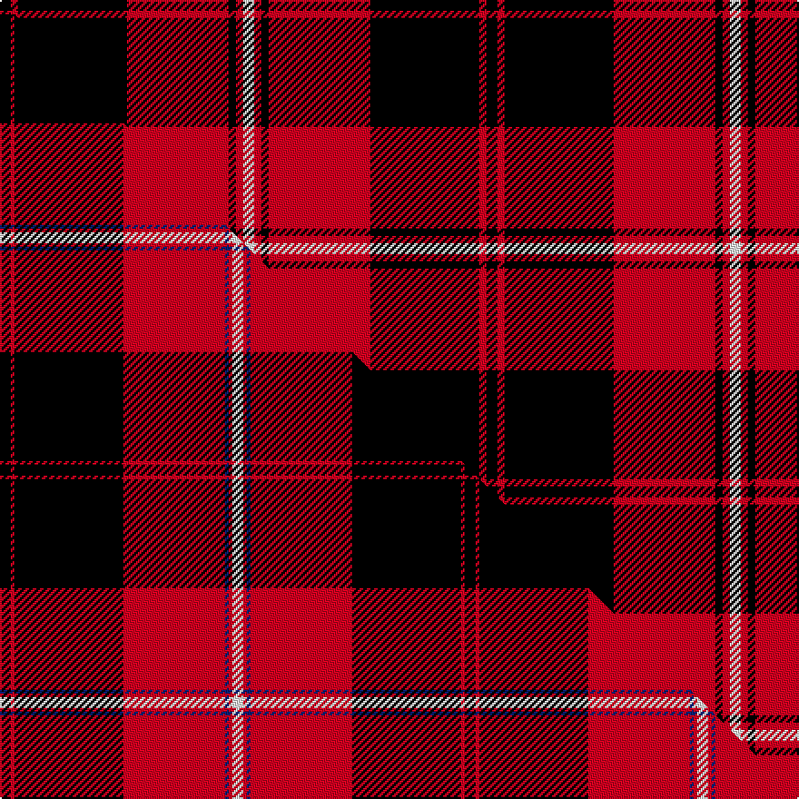

This page is one **sett** — a single exact thread-count. It belongs to the [tartan](/setts/k3r2k30r28k2r2w3/)
(the same proportion at any scale), whose colour order is pattern [KRKRKRW](/stripes/krkrkrw/).

Part of the [Cunningham](/tartans/cunningham/) tartan — the named design grouping this sett with its other cloths.

Sourced from register-of-tartans.  It is a [7 stripe tartan](/stripes/stripes7/).

Original link https://www.tartanregister.gov.uk/tartanDetails.aspx?ref=843

2 attestations — the source records this cloth was collapsed from (oldest owns this page)

<ul>
<li>01/01/1880 — Cunningham #2 (register-of-tartans, <a href="https://www.tartanregister.gov.uk/tartanDetails.aspx?ref=843">record</a>)  <em>The Cunninghams were a Lowland family and thus would not have had a tartan but the Sobieski Stewarts 'invented' one for them in their 1842 Vestiarium Scoticum. Stripes straddling the white are given in Vestiarium Scoticum (#844) as 'blew' and so published by both D.C. Stewart and Jamie Scarlett MBE. However, in practice most weavers produce them as black as shown here at #4644 (original Scottish Tartans Authority reference). In March 2004 the Scottish Tartans Authority received digital photos of all the Clans Originaux woven samples. In the Cunningham sample the red lines are slightly further apart and the guard lines appear to be black. Cunningham was one of the names adopted by the MacGregors when the clan was broken and scattered and this pattern and the Ramsay were based on the old black and red MacGregor sett. Lochcarron swatch in archives.</em></li>
<li>pre 1880 — Cunningham (Clan) (tartans-authority, <a href="http://www.tartansauthority.com/tartan-ferret/display/4644/">record</a>)  <em>maccaskill</em></li>
</ul>

## Register references

External register numbers recorded for this tartan.

- Scottish Register of Tartans: [843](https://www.tartanregister.gov.uk/tartanDetails.aspx?ref=843)
- Scottish Tartans Authority (ITI): 4644

## Thread count
K/6 R4 K60 R56 K4 R4 W/6

One full sett is **268 threads**.

## Palette
<table><thead><tr><th>Colour</th><th>Shade</th><th>OKLCh</th></tr></thead><tbody><tr><td>K</td><td><code style="background-color:#000000;">#000000</code> <small style="color:#888">#000000</small></td><td><small style="color:#888">oklch(0.0% 0.000 0.0)</small></td></tr><tr><td>W</td><td><code style="background-color:#F7F7F7;">#F7F7F7</code> <small style="color:#888">#F7F7F7</small></td><td><small style="color:#888">oklch(97.6% 0.000 89.9)</small></td></tr><tr><td>R</td><td><code style="background-color:#D60020;">#D60020</code> <small style="color:#888">#D60020</small></td><td><small style="color:#888">oklch(55.2% 0.224 25.5)</small></td></tr></tbody></table>

# Sample pattern

## Compared to the master

This cloth is one sett of its design; the master sett (the exemplar the design is anchored on) is below for comparison.

Its **ΔTartan distance** from the master is **1.36** — the same measure the nearest-tartans table ranks by (0 is identical; a re-scale of the same cloth is near 0, a recolour or a different proportion further).

<figure class="master-compare" style="margin:0">

this sett
master sett ★

<figcaption style="color:#888;font-size:smaller">One weave of this sett against the <a href="/setts/k3r1k30r28db1r1w3/">master sett ★</a>, split on the diagonal: a shared proportion runs seamlessly across it with only the shades shifting; a different proportion breaks on it.</figcaption>
</figure>

## Nearest variants

The nearest existing variants by ΔTartan distance, with this cloth at the top so the swatches line up against it.

ΔTartan

Threads

Variant

Sett

—

268

<a href="/variants/s7/k3r2k30r28k2r2w3~x2/">Cunningham #2</a>

<a href="/ttd/edit/#slug=k3r1k30r28k1r1w3~x2&amp;base=k3r2k30r28k2r2w3~x2" title="compare in the TTD">0.49</a>

256

<a href="/variants/s7/k3r1k30r28k1r1w3~x2/">Cunningham</a>

<a href="/ttd/edit/#slug=k3r1k16r16k1r3~x4&amp;base=k3r2k30r28k2r2w3~x2" title="compare in the TTD">0.53</a>

296

<a href="/variants/s6/k3r1k16r16k1r3~x4/">The Mary Erskine</a>

<a href="/ttd/edit/#slug=k6r3k28r28k3r6~x2&amp;base=k3r2k30r28k2r2w3~x2" title="compare in the TTD">0.73</a>

272

<a href="/variants/s6/k6r3k28r28k3r6~x2/">Erskine, Black &amp; Red (Clan)</a>

<a href="/ttd/edit/#slug=k6r1k24r28k1r4~x2&amp;base=k3r2k30r28k2r2w3~x2" title="compare in the TTD">0.84</a>

236

<a href="/variants/s6/k6r1k24r28k1r4~x2/">Aragon (Erskine)</a>

<a href="/ttd/edit/#slug=k23r3k1r12~x4&amp;base=k3r2k30r28k2r2w3~x2" title="compare in the TTD">1.00</a>

172

<a href="/variants/s4/k23r3k1r12~x4/">Ewing</a>

<a href="/ttd/edit/#slug=k2r12k2r12k33r2~x2&amp;base=k3r2k30r28k2r2w3~x2" title="compare in the TTD">1.02</a>

244

<a href="/variants/s6/k2r12k2r12k33r2~x2/">Cameron Black &amp; Red (Dress)</a>

<a href="/ttd/edit/#slug=k3r1k30r28db1r1w3~x2&amp;base=k3r2k30r28k2r2w3~x2" title="compare in the TTD">1.49</a>

256

<a href="/variants/s7/k3r1k30r28db1r1w3~x2/">Cunningham #3</a>

<a href="/ttd/edit/#slug=k4w2k28r30k1r3~x2&amp;base=k3r2k30r28k2r2w3~x2" title="compare in the TTD">1.64</a>

258

<a href="/variants/s6/k4w2k28r30k1r3~x2/">Ramsay of Dalhousie</a>

<a href="/ttd/edit/#slug=r6w3r17k3r3k25r3~x2&amp;base=k3r2k30r28k2r2w3~x2" title="compare in the TTD">1.65</a>

222

<a href="/variants/s7/r6w3r17k3r3k25r3~x2/">Bon Accord</a>

<a href="/ttd/edit/#slug=k4r33k24w3k4r3~x2&amp;base=k3r2k30r28k2r2w3~x2" title="compare in the TTD">1.68</a>

270

<a href="/variants/s6/k4r33k24w3k4r3~x2/">Monmouth College</a>

## Neighbour map

Every grey dot is one of 13620 variants placed by the first two principal components of the ΔTartan feature space (42% of its variance). Red is this tartan; blue dots are its nearest — click one to open its page.

<svg viewBox="0 0 640 380" role="img" style="max-width:100%;height:auto;border:1px solid #e0e0e0;border-radius:4px;display:block" xmlns="http://www.w3.org/2000/svg"><image href="/nn/cloud.v1.png" width="640" height="380"/><a href="/variants/s7/k3r1k30r28k1r1w3~x2/"><circle cx="318.3" cy="109.2" r="4" fill="#3465a4"><title>Cunningham</title></circle></a><a href="/variants/s6/k3r1k16r16k1r3~x4/"><circle cx="323.1" cy="170.9" r="4" fill="#3465a4"><title>The Mary Erskine</title></circle></a><a href="/variants/s6/k6r3k28r28k3r6~x2/"><circle cx="300.9" cy="197.8" r="4" fill="#3465a4"><title>Erskine, Black &amp; Red (Clan)</title></circle></a><a href="/variants/s6/k6r1k24r28k1r4~x2/"><circle cx="347.4" cy="147.2" r="4" fill="#3465a4"><title>Aragon (Erskine)</title></circle></a><a href="/variants/s4/k23r3k1r12~x4/"><circle cx="368.8" cy="148.7" r="4" fill="#3465a4"><title>Ewing</title></circle></a><a href="/variants/s6/k2r12k2r12k33r2~x2/"><circle cx="357.4" cy="165.4" r="4" fill="#3465a4"><title>Cameron Black &amp; Red (Dress)</title></circle></a><a href="/variants/s7/k3r1k30r28db1r1w3~x2/"><circle cx="292.7" cy="96.3" r="4" fill="#3465a4"><title>Cunningham #3</title></circle></a><a href="/variants/s6/k4w2k28r30k1r3~x2/"><circle cx="313.5" cy="126.6" r="4" fill="#3465a4"><title>Ramsay of Dalhousie</title></circle></a><a href="/variants/s7/r6w3r17k3r3k25r3~x2/"><circle cx="253.2" cy="177.6" r="4" fill="#3465a4"><title>Bon Accord</title></circle></a><a href="/variants/s6/k4r33k24w3k4r3~x2/"><circle cx="280.2" cy="168.1" r="4" fill="#3465a4"><title>Monmouth College</title></circle></a><circle cx="291.7" cy="139.5" r="5" fill="#c00000"/><text x="320" y="376" text-anchor="middle" font-size="11" fill="#999">ground</text><text x="11" y="190" text-anchor="middle" font-size="11" fill="#999" transform="rotate(-90 11 190)">complexity</text></svg>

ID: /variants/s7/k3r2k30r28k2r2w3~x2/
