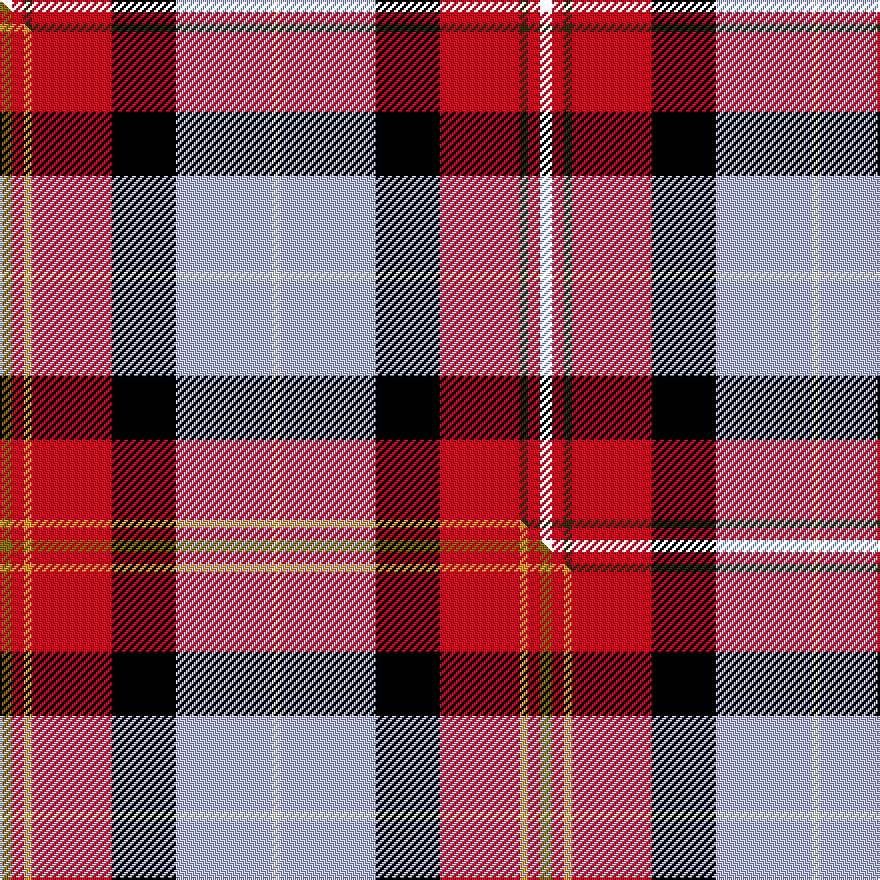

This is one **variant** — a specific cloth: this exact thread count and colourway, with its own
provenance below. It is one weaving of the [sett](/setts/k3r3dy2r20k16lb24w2/) (the scale-free proportion — the
same cloth at any scale or shade), whose colour order is pattern [KRGRKWW](/stripes/krgrkww/).

Part of the [Oor Wullie](/tartans/o/oo/oor-wullie/) tartan — the named design grouping this sett with its other cloths.

Sourced from house-of-tartan.  It is a [7 stripe tartan](/stripes/stripes7/).

Original link [http://www.house-of-tartan.scotland.net/house/TartanViewjs.asp?colr=Def&tnam=10356](http://www.house-of-tartan.scotland.net/house/TartanViewjs.asp?colr=Def&tnam=10356)

## Provenance

Earliest known date: August 2010 Oor Wullie's tartan is based on the Black Watch which was his Uncle Wattie's regiment and in this new design the red is from the hackle on their famous bonnets. The silver grey is for Wullie's iconic bucket and for his faithful pet, Jeemie the moose. The black is for his mentor PC Murdoch and for Wullie's dungarees, the yellow is for his tousled gold locks that never see a comb. The three lines on the yellow are for his best pals Fat Bob, Soapy Soutar and Wee Eck. The black and white are for the newsprint of The Sunday Post in which Wullie and his pals have lived for 75 years.

Dataset <small>— provenance for this record, inherited from the source manifest</small>

<dl class="dataset-prov">
<dt>source</dt><dd><a href="/sources/house-of-tartan/">House of Tartan</a></dd>
<dt>data captured from</dt><dd><a href="https://github.com/thetartan/tartan-database/blob/master/data/house-of-tartan/data.csv">https://github.com/thetartan/tartan-database/blob/master/data/house-of-tartan/data.csv</a></dd>
<dt>data date</dt><dd>August 2010 <small>(this record)</small></dd>
<dt>licence</dt><dd><a href="https://creativecommons.org/licenses/by-nc-nd/4.0/">CC BY-NC-ND 4.0</a></dd>
</dl>

Capture chain <small>— the hands this data passed through, oldest first; each capture carries its own licence</small>

<ol class="capture-chain">
<li><a href="http://www.house-of-tartan.scotland.net/">House of Tartan</a> <small>the weaver/retailer's database — the site is now offline; the URL is kept as the ultimate source's identity</small></li>
<li><a href="https://github.com/thetartan/tartan-database">thetartan/tartan-database</a> <small>2016-2017</small> · <a href="https://creativecommons.org/licenses/by-nc-nd/4.0/">CC BY-NC-ND 4.0</a> <small>Levko Kravets's frozen compilation — the capture we vendored, and where its CC licence text came from</small></li>
<li>this dictionary <small>captured 2026-06-10 · commit 5bf86c7566</small> <small>each re-capture is a git commit to data/sources</small></li>
</ol>

## Thread count
K/6 R6 DY4 R40 K32 LB48 W/4

One full sett is **270 threads**.

## Palette
<table><thead><tr><th>Colour</th><th>Shade</th><th>OKLCh</th></tr></thead><tbody><tr><td>DY</td><td><code style="background-color:#3A2B0D;">#3A2B0D</code> <small style="color:#888">#3A2B0D</small></td><td><small style="color:#888">oklch(30.0% 0.049 82.0)</small></td></tr><tr><td>G</td><td><code style="background-color:#008B2A;">#008B2A</code> <small style="color:#888">#008B2A</small></td><td><small style="color:#888">oklch(55.4% 0.170 145.9)</small></td></tr><tr><td>K</td><td><code style="background-color:#000000;">#000000</code> <small style="color:#888">#000000</small></td><td><small style="color:#888">oklch(0.0% 0.000 0.0)</small></td></tr><tr><td>W</td><td><code style="background-color:#F7F7F7;">#F7F7F7</code> <small style="color:#888">#F7F7F7</small></td><td><small style="color:#888">oklch(97.6% 0.000 89.9)</small></td></tr><tr><td>LB</td><td><code style="background-color:#B5BBDE;">#B5BBDE</code> <small style="color:#888">#B5BBDE</small></td><td><small style="color:#888">oklch(79.9% 0.050 277.6)</small></td></tr><tr><td>LO</td><td><code style="background-color:#FF9C34;">#FF9C34</code> <small style="color:#888">#FF9C34</small></td><td><small style="color:#888">oklch(77.9% 0.161 61.8)</small></td></tr><tr><td>R</td><td><code style="background-color:#D60020;">#D60020</code> <small style="color:#888">#D60020</small></td><td><small style="color:#888">oklch(55.2% 0.224 25.5)</small></td></tr><tr><td>Y</td><td><code style="background-color:#8B6E00;">#8B6E00</code> <small style="color:#888">#8B6E00</small></td><td><small style="color:#888">oklch(55.1% 0.113 90.4)</small></td></tr></tbody></table>

# Sample pattern

## Compared to the master

This cloth is one sett of its design; the master sett (the exemplar the design is anchored on) is below for comparison.

Its **ΔTartan distance** from the master is **1.47** — the same measure the nearest-tartans table ranks by (0 is identical; a re-scale of the same cloth is near 0, a recolour or a different proportion further).

<figure class="master-compare" style="margin:0">

this sett
master sett ★

<figcaption style="color:#888;font-size:smaller">One weave of this sett against the <a href="/setts/y3r3lo2r20k16lb24w2/">master sett ★</a>, split on the diagonal: a shared proportion runs seamlessly across it with only the shades shifting; a different proportion breaks on it.</figcaption>
</figure>

## Nearest tartan variants

The nearest existing variants by ΔTartan distance, with this cloth at the top so the swatches line up against it.

ΔTartan

Threads

Variant

Sett

—

270

<a href="/variants/s7/k3r3dy2r20k16lb24w2~x2/">Oor Wullie Corporate Tartan</a>

<a href="/ttd/edit/#slug=ly3r3dy2r20k16lb24w2~x2&amp;base=k3r3dy2r20k16lb24w2~x2" title="compare in the TTD">1.17</a>

270

<a href="/variants/s7/ly3r3dy2r20k16lb24w2~x2/">Oor Wullie (Corporate)</a>

<a href="/ttd/edit/#slug=y3r3lo2r20k16lb24w2~x2&amp;base=k3r3dy2r20k16lb24w2~x2" title="compare in the TTD">1.47</a>

270

<a href="/variants/s7/y3r3lo2r20k16lb24w2~x2/">Oor Wullie (DC Thomson)</a>

<a href="/ttd/edit/#slug=r6lb3dp24y2k23w23k2w6~x2&amp;base=k3r3dy2r20k16lb24w2~x2" title="compare in the TTD">2.00</a>

332

<a href="/variants/s8/r6lb3dp24y2k23w23k2w6~x2/">Culloden Dress</a>

<a href="/ttd/edit/#slug=r6lb3dp20y2k20w20k2w5~x2&amp;base=k3r3dy2r20k16lb24w2~x2" title="compare in the TTD">2.10</a>

290

<a href="/variants/s8/r6lb3dp20y2k20w20k2w5~x2/">Humming Bird (Fashion)</a>

<a href="/ttd/edit/#slug=dg3g3r22k5db22dy2w2~x2~dg1806142-g2408144&amp;base=k3r3dy2r20k16lb24w2~x2" title="compare in the TTD">2.55</a>

226

<a href="/variants/s7/dg3g3r22k5db22dy2w2~x2~dg1806142-g2408144/">MacLeod Soc. of Scotland, (Comm)</a>

<a href="/ttd/edit/#slug=k4db12lb3db4g8lo2r24db4r4~x2&amp;base=k3r3dy2r20k16lb24w2~x2" title="compare in the TTD">2.55</a>

244

<a href="/variants/s9/k4db12lb3db4g8lo2r24db4r4~x2/">MacCreary (Personal)</a>

<a href="/ttd/edit/#slug=w3t12k12r20g2~x2&amp;base=k3r3dy2r20k16lb24w2~x2" title="compare in the TTD">2.56</a>

186

<a href="/variants/s5/w3t12k12r20g2~x2/">Baillie of Polkemmet Red</a>

<a href="/ttd/edit/#slug=r3n2r25o12k25w2lb2~x2~n1900000-o2500000&amp;base=k3r3dy2r20k16lb24w2~x2" title="compare in the TTD">2.57</a>

274

<a href="/variants/s7/r3n2r25o12k25w2lb2~x2~n1900000-o2500000/">Bombeiros Voluntarios De Galicia (Co</a>

<a href="/ttd/edit/#slug=w3db12k12r20g2~x2&amp;base=k3r3dy2r20k16lb24w2~x2" title="compare in the TTD">2.60</a>

186

<a href="/variants/s5/w3db12k12r20g2~x2/">Baillie of Polkemett</a>

<a href="/ttd/edit/#slug=r30db12k6g12y2g3w2~x2&amp;base=k3r3dy2r20k16lb24w2~x2" title="compare in the TTD">2.78</a>

204

<a href="/variants/s7/r30db12k6g12y2g3w2~x2/">Hewitt</a>

## Neighbour map

Every grey dot is one of 13621 variants placed by the first two principal components of the ΔTartan feature space (42% of its variance). Red is this tartan; blue dots are its nearest — click one to open its page. The map is a flat projection of a many-dimensional space — [how to read it](/posts/neighbourhood-maps/).

<svg viewBox="0 0 640 380" role="img" style="max-width:100%;height:auto;border:1px solid #e0e0e0;border-radius:4px;display:block" xmlns="http://www.w3.org/2000/svg"><image href="/nn/cloud.v1.png" width="640" height="380"/><a href="/variants/s7/ly3r3dy2r20k16lb24w2~x2/"><circle cx="107.2" cy="138.1" r="4" fill="#3465a4"><title>Oor Wullie (Corporate)</title></circle></a><a href="/variants/s7/y3r3lo2r20k16lb24w2~x2/"><circle cx="109.5" cy="138.9" r="4" fill="#3465a4"><title>Oor Wullie (DC Thomson)</title></circle></a><a href="/variants/s8/r6lb3dp24y2k23w23k2w6~x2/"><circle cx="84.2" cy="138.2" r="4" fill="#3465a4"><title>Culloden Dress</title></circle></a><a href="/variants/s8/r6lb3dp20y2k20w20k2w5~x2/"><circle cx="72.0" cy="148.0" r="4" fill="#3465a4"><title>Humming Bird (Fashion)</title></circle></a><a href="/variants/s7/dg3g3r22k5db22dy2w2~x2~dg1806142-g2408144/"><circle cx="130.5" cy="124.3" r="4" fill="#3465a4"><title>MacLeod Soc. of Scotland, (Comm)</title></circle></a><a href="/variants/s9/k4db12lb3db4g8lo2r24db4r4~x2/"><circle cx="161.5" cy="132.2" r="4" fill="#3465a4"><title>MacCreary (Personal)</title></circle></a><a href="/variants/s5/w3t12k12r20g2~x2/"><circle cx="138.2" cy="191.4" r="4" fill="#3465a4"><title>Baillie of Polkemmet Red</title></circle></a><a href="/variants/s7/r3n2r25o12k25w2lb2~x2~n1900000-o2500000/"><circle cx="143.8" cy="126.7" r="4" fill="#3465a4"><title>Bombeiros Voluntarios De Galicia (Co</title></circle></a><a href="/variants/s5/w3db12k12r20g2~x2/"><circle cx="140.6" cy="189.5" r="4" fill="#3465a4"><title>Baillie of Polkemett</title></circle></a><a href="/variants/s7/r30db12k6g12y2g3w2~x2/"><circle cx="178.1" cy="131.2" r="4" fill="#3465a4"><title>Hewitt</title></circle></a><circle cx="105.6" cy="137.2" r="5" fill="#c00000"/><text x="320" y="376" text-anchor="middle" font-size="11" fill="#999">ground</text><text x="11" y="190" text-anchor="middle" font-size="11" fill="#999" transform="rotate(-90 11 190)">complexity</text></svg>

ID: /variants/s7/k3r3dy2r20k16lb24w2~x2/
