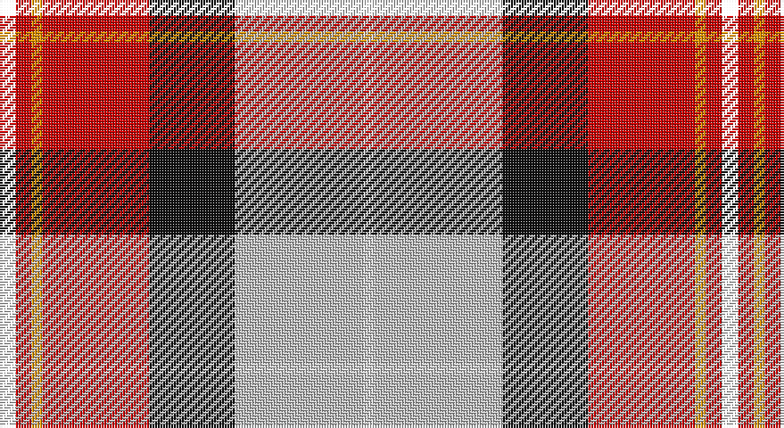

This page is one **sett** — a single exact thread-count. It belongs to the [tartan](/setts/k3r3lo2r20ki16lb24w2/)
(the same proportion at any scale), whose colour order is pattern [KRYRKWW](/stripes/kryrkww/).

Part of the [Oor Wullie](/tartans/oor-wullie/) tartan — the named design grouping this sett with its other cloths.

Sourced from house-of-tartan.  It is a [7 stripe tartan](/stripes/stripes7/).

Original link http://www.house-of-tartan.scotland.net/house/TartanViewjs.asp?colr=Def&tnam=10356

## Provenance

Earliest known date: August 2010 Oor Wullie's tartan is based on the Black Watch which was his Uncle Wattie's regiment and in this new design the red is from the hackle on their famous bonnets. The silver grey is for Wullie's iconic bucket and for his faithful pet, Jeemie the moose. The black is for his mentor PC Murdoch and for Wullie's dungarees, the yellow is for his tousled gold locks that never see a comb. The three lines on the yellow are for his best pals Fat Bob, Soapy Soutar and Wee Eck. The black and white are for the newsprint of The Sunday Post in which Wullie and his pals have lived for 75 years.

## Thread count
YY/6 R6 DY4 R40 K32 N48 LN/4

One full sett is **270 threads**.

## Palette

Palette: <strong>Tartan Register</strong> <small style="color:#888">(6 of 8 colours)</small>
<table><thead><tr><th>Colour</th><th>Threads</th><th>Shade</th><th>Base</th><th>OKLCh</th></tr></thead><tbody><tr><td>/</td><td style="text-align:right;font-variant-numeric:tabular-nums">6</td><td><code style="background-color:;"></code> <small style="color:#888"></small></td><td> <code style="background-color:;"></code></td><td><small style="color:#888"></small></td></tr><tr><td>R</td><td style="text-align:right;font-variant-numeric:tabular-nums">6</td><td><code style="background-color:#C80000;">#C80000</code> <small style="color:#888">#C80000</small></td><td>R <code style="background-color:#CC0000;">#CC0000</code></td><td><small style="color:#888">oklch(52.3% 0.215 29.2)</small></td></tr><tr><td>DY</td><td style="text-align:right;font-variant-numeric:tabular-nums">4</td><td><code style="background-color:#F09400;">#F09400</code> <small style="color:#888">#F09400</small></td><td>Y <code style="background-color:#F2BF00;">#F2BF00</code></td><td><small style="color:#888">oklch(74.5% 0.165 66.9)</small></td></tr><tr><td>R</td><td style="text-align:right;font-variant-numeric:tabular-nums">40</td><td><code style="background-color:#C80000;">#C80000</code> <small style="color:#888">#C80000</small></td><td>R <code style="background-color:#CC0000;">#CC0000</code></td><td><small style="color:#888">oklch(52.3% 0.215 29.2)</small></td></tr><tr><td>K</td><td style="text-align:right;font-variant-numeric:tabular-nums">32</td><td><code style="background-color:#101010;">#101010</code> <small style="color:#888">#101010</small></td><td>K <code style="background-color:#000000;">#000000</code></td><td><small style="color:#888">oklch(17.3% 0.000 89.9)</small></td></tr><tr><td>N</td><td style="text-align:right;font-variant-numeric:tabular-nums">48</td><td><code style="background-color:#C0C0C0;">#C0C0C0</code> <small style="color:#888">#C0C0C0</small></td><td>W <code style="background-color:#F7F7F7;">#F7F7F7</code></td><td><small style="color:#888">oklch(80.8% 0.000 89.9)</small></td></tr><tr><td>LN/</td><td style="text-align:right;font-variant-numeric:tabular-nums">4</td><td><code style="background-color:#E0E0E0;">#E0E0E0</code> <small style="color:#888">#E0E0E0</small></td><td>W <code style="background-color:#F7F7F7;">#F7F7F7</code></td><td><small style="color:#888">oklch(90.7% 0.000 89.9)</small></td></tr></tbody></table>

# Sample pattern

## Compared to the master

This cloth is one sett of its design; the master sett (the exemplar the design is anchored on) is below for comparison.

<figure style="margin:0"><figcaption style="color:#888;font-size:smaller">this sett</figcaption></figure>
<figure style="margin:0"><figcaption style="color:#888;font-size:smaller"><a href="/setts/ly3r3lo2r20k16wi24w2/">master sett →</a></figcaption></figure>

## Nearest tartans

The nearest existing variants by ΔTartan distance, with this tartan at the top so the swatches line up against it.

ΔTartan

Tartan

Sett

—

<a href="/ttd/edit/#slug=k3r3lo2r20ki16lb24w2~x2">Oor Wullie Corporate Tartan</a> <a class="nn-out" href="/variants/s7/k3r3lo2r20ki16lb24w2~x2/" title="open its dictionary page">↗</a>

0.39

<a href="/ttd/edit/#slug=lyi3r3ly2r20k16lb24w2~x2&amp;base=k3r3lo2r20ki16lb24w2~x2">Oor Wullie (Corporate)</a> <a class="nn-out" href="/variants/s7/lyi3r3ly2r20k16lb24w2~x2/" title="open its dictionary page">↗</a>

0.99

<a href="/ttd/edit/#slug=t4w4t4w5k8g2r19lo1~x2&amp;base=k3r3lo2r20ki16lb24w2~x2">Edinburgh Napier University (Corp.)</a> <a class="nn-out" href="/variants/s8/t4w4t4w5k8g2r19lo1~x2/" title="open its dictionary page">↗</a>

1.00

<a href="/ttd/edit/#slug=r6t3m20ly2k20w20k2w5~x2&amp;base=k3r3lo2r20ki16lb24w2~x2">Humming Bird (Fashion)</a> <a class="nn-out" href="/variants/s8/r6t3m20ly2k20w20k2w5~x2/" title="open its dictionary page">↗</a>

1.03

<a href="/variants/s7/ly3r3lo2r20k16wi24w2~x2/">Oor Wullie (DC Thomson)</a>

1.07

<a href="/ttd/edit/#slug=ly6k2r15g5r8k12w24t2w4t2~x2&amp;base=k3r3lo2r20ki16lb24w2~x2">Gillies, dress Red</a> <a class="nn-out" href="/variants/s10/ly6k2r15g5r8k12w24t2w4t2~x2/" title="open its dictionary page">↗</a>

1.11

<a href="/ttd/edit/#slug=dg20r3y3r15w19dg3t2~x2&amp;base=k3r3lo2r20ki16lb24w2~x2">Glasgow</a> <a class="nn-out" href="/variants/s7/dg20r3y3r15w19dg3t2~x2/" title="open its dictionary page">↗</a>

1.18

<a href="/ttd/edit/#slug=r2w12y1k12o12k1~x2&amp;base=k3r3lo2r20ki16lb24w2~x2">Dutch Dress</a> <a class="nn-out" href="/variants/s6/r2w12y1k12o12k1~x2/" title="open its dictionary page">↗</a>

1.20

<a href="/ttd/edit/#slug=r3n2r25o12k25w2lb2~x2&amp;base=k3r3lo2r20ki16lb24w2~x2">Bombeiros Voluntarios De Galicia (Co</a> <a class="nn-out" href="/variants/s7/r3n2r25o12k25w2lb2~x2/" title="open its dictionary page">↗</a>

1.21

<a href="/ttd/edit/#slug=r2w12t1k12lo12k1~x2&amp;base=k3r3lo2r20ki16lb24w2~x2">Dutch, dress</a> <a class="nn-out" href="/variants/s6/r2w12t1k12lo12k1~x2/" title="open its dictionary page">↗</a>

1.26

<a href="/ttd/edit/#slug=r26t7p8ly3r3w3g20p10w2~x2&amp;base=k3r3lo2r20ki16lb24w2~x2">Wilson's, No 227</a> <a class="nn-out" href="/variants/s9/r26t7p8ly3r3w3g20p10w2~x2/" title="open its dictionary page">↗</a>

## Neighbour map

Every grey dot is one of 14360 variants placed by the first two principal components of the ΔTartan feature space (44% of its variance). Red is this tartan; blue dots are its nearest — click one to open its page.

<svg viewBox="0 0 640 380" role="img" style="max-width:100%;height:auto;border:1px solid #e0e0e0;border-radius:4px;display:block" xmlns="http://www.w3.org/2000/svg"><image href="/nn/cloud.v1.png" width="640" height="380"/><a href="/variants/s7/lyi3r3ly2r20k16lb24w2~x2/"><circle cx="128.5" cy="128.5" r="4" fill="#3465a4"><title>Oor Wullie (Corporate)</title></circle></a><a href="/variants/s8/t4w4t4w5k8g2r19lo1~x2/"><circle cx="160.8" cy="107.6" r="4" fill="#3465a4"><title>Edinburgh Napier University (Corp.)</title></circle></a><a href="/variants/s8/r6t3m20ly2k20w20k2w5~x2/"><circle cx="90.2" cy="134.3" r="4" fill="#3465a4"><title>Humming Bird (Fashion)</title></circle></a><a href="/variants/s7/ly3r3lo2r20k16wi24w2~x2/"><circle cx="119.2" cy="118.1" r="4" fill="#3465a4"><title>Oor Wullie (DC Thomson)</title></circle></a><a href="/variants/s10/ly6k2r15g5r8k12w24t2w4t2~x2/"><circle cx="92.1" cy="112.0" r="4" fill="#3465a4"><title>Gillies, dress Red</title></circle></a><a href="/variants/s7/dg20r3y3r15w19dg3t2~x2/"><circle cx="133.9" cy="158.8" r="4" fill="#3465a4"><title>Glasgow</title></circle></a><a href="/variants/s6/r2w12y1k12o12k1~x2/"><circle cx="131.6" cy="163.1" r="4" fill="#3465a4"><title>Dutch Dress</title></circle></a><a href="/variants/s7/r3n2r25o12k25w2lb2~x2/"><circle cx="185.7" cy="136.1" r="4" fill="#3465a4"><title>Bombeiros Voluntarios De Galicia (Co</title></circle></a><a href="/variants/s6/r2w12t1k12lo12k1~x2/"><circle cx="120.1" cy="155.0" r="4" fill="#3465a4"><title>Dutch, dress</title></circle></a><a href="/variants/s9/r26t7p8ly3r3w3g20p10w2~x2/"><circle cx="145.1" cy="132.3" r="4" fill="#3465a4"><title>Wilson's, No 227</title></circle></a><circle cx="127.2" cy="129.6" r="5" fill="#c00000"/></svg>

ID: /variants/s7/k3r3lo2r20ki16lb24w2~x2/
