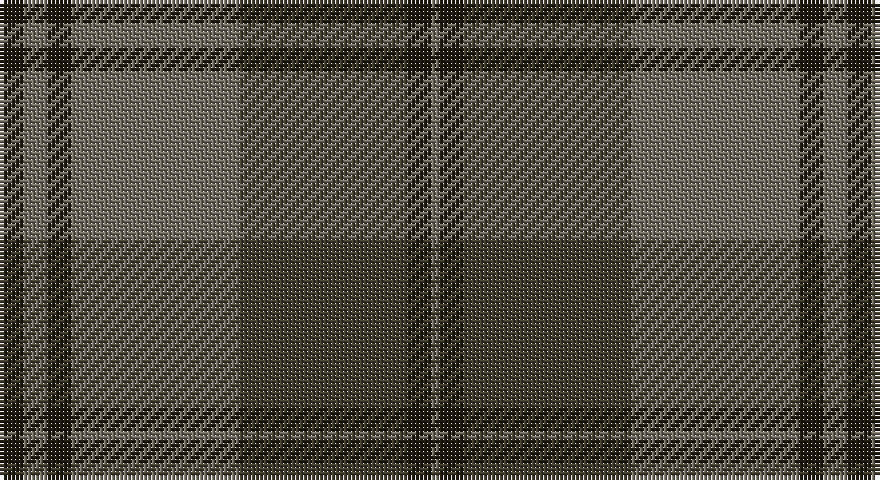

This page is one **sett** — a single exact thread-count. It belongs to the [tartan](/setts/k3y3k3y21dy21k3y1/)
(the same proportion at any scale), whose colour order is pattern [GKGGKGK](/stripes/gkggkgk/).

Part of the [Granite City](/tartans/granite-city/) tartan — the named design grouping this sett with its other cloths.

Sourced from house-of-tartan.  It is a [7 stripe tartan](/stripes/stripes7/).

Original link http://www.house-of-tartan.scotland.net/house/TartanViewjs.asp?colr=Def&tnam=7459

## Provenance

Earliest known date: pre 2007 Produced for Mike King of Philip King Tailoring Ltd, Aberdeen. Previously recorded by the STA as 'Granite City'. Thought to have been produced for Mike King of Aberdeen. . It is believed that Lochcarron of Scotland have now (Jan 2008) trademarked the word ‘Granite’ when used in connection with tartans.

## Also known as

This cloth is also recorded under:

- Silver Granite

## Thread count
K/6 N6 K6 N42 T42 K6 N/2

One full sett is **212 threads**.

## Palette

Palette: <strong>custom</strong>
<table><thead><tr><th>Colour</th><th>Threads</th><th>Shade</th><th>Base</th><th>OKLCh</th></tr></thead><tbody><tr><td>K/</td><td style="text-align:right;font-variant-numeric:tabular-nums">6</td><td><code style="background-color:#1E1A10;">#1E1A10</code> <small style="color:#888">#1E1A10</small></td><td>K <code style="background-color:#000000;">#000000</code></td><td><small style="color:#888">oklch(21.9% 0.019 88.7)</small></td></tr><tr><td>N</td><td style="text-align:right;font-variant-numeric:tabular-nums">6</td><td><code style="background-color:#716D61;">#716D61</code> <small style="color:#888">#716D61</small></td><td>G <code style="background-color:#006100;">#006100</code></td><td><small style="color:#888">oklch(53.5% 0.019 91.7)</small></td></tr><tr><td>K</td><td style="text-align:right;font-variant-numeric:tabular-nums">6</td><td><code style="background-color:#1E1A10;">#1E1A10</code> <small style="color:#888">#1E1A10</small></td><td>K <code style="background-color:#000000;">#000000</code></td><td><small style="color:#888">oklch(21.9% 0.019 88.7)</small></td></tr><tr><td>N</td><td style="text-align:right;font-variant-numeric:tabular-nums">42</td><td><code style="background-color:#716D61;">#716D61</code> <small style="color:#888">#716D61</small></td><td>G <code style="background-color:#006100;">#006100</code></td><td><small style="color:#888">oklch(53.5% 0.019 91.7)</small></td></tr><tr><td>T</td><td style="text-align:right;font-variant-numeric:tabular-nums">42</td><td><code style="background-color:#413C2E;">#413C2E</code> <small style="color:#888">#413C2E</small></td><td>G <code style="background-color:#006100;">#006100</code></td><td><small style="color:#888">oklch(35.7% 0.024 90.7)</small></td></tr><tr><td>K</td><td style="text-align:right;font-variant-numeric:tabular-nums">6</td><td><code style="background-color:#1E1A10;">#1E1A10</code> <small style="color:#888">#1E1A10</small></td><td>K <code style="background-color:#000000;">#000000</code></td><td><small style="color:#888">oklch(21.9% 0.019 88.7)</small></td></tr><tr><td>N/</td><td style="text-align:right;font-variant-numeric:tabular-nums">2</td><td><code style="background-color:#716D61;">#716D61</code> <small style="color:#888">#716D61</small></td><td>G <code style="background-color:#006100;">#006100</code></td><td><small style="color:#888">oklch(53.5% 0.019 91.7)</small></td></tr></tbody></table>

# Sample pattern

## Compared to the master

This cloth is one sett of its design; the master sett (the exemplar the design is anchored on) is below for comparison.

<figure style="margin:0"><figcaption style="color:#888;font-size:smaller">this sett</figcaption></figure>
<figure style="margin:0"><figcaption style="color:#888;font-size:smaller"><a href="/setts/k3n3k3n21ni21k3ni3lr1/">master sett →</a></figcaption></figure>

## Nearest tartans

The nearest existing variants by ΔTartan distance, with this tartan at the top so the swatches line up against it.

ΔTartan

Tartan

Sett

—

<a href="/ttd/edit/#slug=k3y3k3y21dy21k3y1~x2">Granite City (Silver Granite) Fashion Tartan</a> <a class="nn-out" href="/variants/s7/k3y3k3y21dy21k3y1~x2/" title="open its dictionary page">↗</a>

1.18

<a href="/ttd/edit/#slug=k5dy5k5dy34n33k6n5o2&amp;base=k3y3k3y21dy21k3y1~x2">Brave for Men (Fashion)</a> <a class="nn-out" href="/variants/s8/k5dy5k5dy34n33k6n5o2/" title="open its dictionary page">↗</a>

1.51

<a href="/ttd/edit/#slug=dg20db2dg2db2dg2db8dr24db2dr3~x2&amp;base=k3y3k3y21dy21k3y1~x2">Lindsay</a> <a class="nn-out" href="/variants/s9/dg20db2dg2db2dg2db8dr24db2dr3~x2/" title="open its dictionary page">↗</a>

1.51

<a href="/ttd/edit/#slug=dg20db2dg2db2dg2db8dr24db2dr3&amp;base=k3y3k3y21dy21k3y1~x2">Lindsay</a> <a class="nn-out" href="/variants/s9/dg20db2dg2db2dg2db8dr24db2dr3/" title="open its dictionary page">↗</a>

1.55

<a href="/ttd/edit/#slug=do3o2r1do2n6do6n4do6o22r3~x4&amp;base=k3y3k3y21dy21k3y1~x2">Southdown Grey</a> <a class="nn-out" href="/variants/s10/do3o2r1do2n6do6n4do6o22r3~x4/" title="open its dictionary page">↗</a>

1.56

<a href="/ttd/edit/#slug=dg10r2y2r6y16r1y2r1y3r6~x4&amp;base=k3y3k3y21dy21k3y1~x2">Nithsdale</a> <a class="nn-out" href="/variants/s10/dg10r2y2r6y16r1y2r1y3r6~x4/" title="open its dictionary page">↗</a>

1.61

<a href="/ttd/edit/#slug=dp32dg16o14k4o6dp7k2~x2&amp;base=k3y3k3y21dy21k3y1~x2">Aisteach</a> <a class="nn-out" href="/variants/s7/dp32dg16o14k4o6dp7k2~x2/" title="open its dictionary page">↗</a>

1.62

<a href="/ttd/edit/#slug=dy28g2dy4db18g23db2g3lo4~x2&amp;base=k3y3k3y21dy21k3y1~x2">Eastern Western Motor Group, Dalbraith</a> <a class="nn-out" href="/variants/s8/dy28g2dy4db18g23db2g3lo4~x2/" title="open its dictionary page">↗</a>

1.66

<a href="/ttd/edit/#slug=dy9n4dy2n4dy2n30dy9n4t14lo2~x2&amp;base=k3y3k3y21dy21k3y1~x2">Hanna of Leith (yellow line)</a> <a class="nn-out" href="/variants/s10/dy9n4dy2n4dy2n30dy9n4t14lo2~x2/" title="open its dictionary page">↗</a>

1.67

<a href="/ttd/edit/#slug=r3y33g10r3g3r3g3r8y10r3~x2&amp;base=k3y3k3y21dy21k3y1~x2">Gray (Name)</a> <a class="nn-out" href="/variants/s10/r3y33g10r3g3r3g3r8y10r3~x2/" title="open its dictionary page">↗</a>

1.74

<a href="/ttd/edit/#slug=db20dy2db2dy2db2dy6g15dy2~x2&amp;base=k3y3k3y21dy21k3y1~x2">Gammell (Brown) (Personal)</a> <a class="nn-out" href="/variants/s8/db20dy2db2dy2db2dy6g15dy2~x2/" title="open its dictionary page">↗</a>

## Neighbour map

Every grey dot is one of 14360 variants placed by the first two principal components of the ΔTartan feature space (44% of its variance). Red is this tartan; blue dots are its nearest — click one to open its page.

<svg viewBox="0 0 640 380" role="img" style="max-width:100%;height:auto;border:1px solid #e0e0e0;border-radius:4px;display:block" xmlns="http://www.w3.org/2000/svg"><image href="/nn/cloud.v1.png" width="640" height="380"/><a href="/variants/s8/k5dy5k5dy34n33k6n5o2/"><circle cx="356.4" cy="216.1" r="4" fill="#3465a4"><title>Brave for Men (Fashion)</title></circle></a><a href="/variants/s9/dg20db2dg2db2dg2db8dr24db2dr3~x2/"><circle cx="351.2" cy="231.0" r="4" fill="#3465a4"><title>Lindsay</title></circle></a><a href="/variants/s9/dg20db2dg2db2dg2db8dr24db2dr3/"><circle cx="351.2" cy="231.0" r="4" fill="#3465a4"><title>Lindsay</title></circle></a><a href="/variants/s10/do3o2r1do2n6do6n4do6o22r3~x4/"><circle cx="331.3" cy="177.3" r="4" fill="#3465a4"><title>Southdown Grey</title></circle></a><a href="/variants/s10/dg10r2y2r6y16r1y2r1y3r6~x4/"><circle cx="391.6" cy="231.3" r="4" fill="#3465a4"><title>Nithsdale</title></circle></a><a href="/variants/s7/dp32dg16o14k4o6dp7k2~x2/"><circle cx="351.7" cy="236.0" r="4" fill="#3465a4"><title>Aisteach</title></circle></a><a href="/variants/s8/dy28g2dy4db18g23db2g3lo4~x2/"><circle cx="289.5" cy="219.4" r="4" fill="#3465a4"><title>Eastern Western Motor Group, Dalbraith</title></circle></a><a href="/variants/s10/dy9n4dy2n4dy2n30dy9n4t14lo2~x2/"><circle cx="396.7" cy="215.9" r="4" fill="#3465a4"><title>Hanna of Leith (yellow line)</title></circle></a><a href="/variants/s10/r3y33g10r3g3r3g3r8y10r3~x2/"><circle cx="413.0" cy="225.2" r="4" fill="#3465a4"><title>Gray (Name)</title></circle></a><a href="/variants/s8/db20dy2db2dy2db2dy6g15dy2~x2/"><circle cx="340.6" cy="239.6" r="4" fill="#3465a4"><title>Gammell (Brown) (Personal)</title></circle></a><circle cx="396.0" cy="224.6" r="5" fill="#c00000"/></svg>

ID: /variants/s7/k3y3k3y21dy21k3y1~x2/
