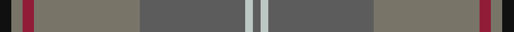
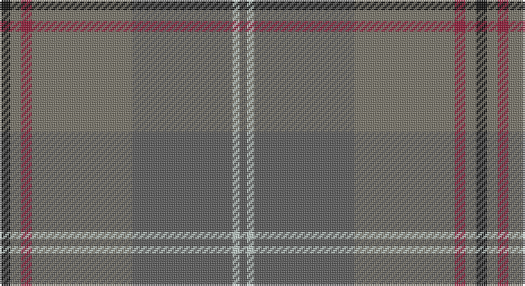

This page is one **sett** — a single exact thread-count. It belongs to the [tartan](/setts/k3y3r3y28n28lb2n2/)
(the same proportion at any scale), whose colour order is pattern [BWBGRGK](/stripes/bwbgrgk/).

Sourced from tartans-authority.  It is a [7 stripe tartan](/stripes/stripes7/).

Original link http://www.tartansauthority.com/tartan-ferret/display/7170/

## Register references

External register numbers recorded for this tartan.

- Scottish Tartans Authority (ITI): 7170

## Thread count
K/6 Nb6 DR6 Nb56 N56 Na4 N/4

One full sett is **266 threads**.

## Palette

Palette: <strong>Tartan Register</strong> <small style="color:#888">(2 of 5 colours)</small>
<table><thead><tr><th>Colour</th><th>Threads</th><th>Shade</th><th>Base</th><th>OKLCh</th></tr></thead><tbody><tr><td>K/</td><td style="text-align:right;font-variant-numeric:tabular-nums">6</td><td><code style="background-color:#101010;">#101010</code> <small style="color:#888">#101010</small></td><td>K <code style="background-color:#000000;">#000000</code></td><td><small style="color:#888">oklch(17.3% 0.000 89.9)</small></td></tr><tr><td>Nb</td><td style="text-align:right;font-variant-numeric:tabular-nums">6</td><td><code style="background-color:#787468;">#787468</code> <small style="color:#888">#787468</small></td><td>G <code style="background-color:#006100;">#006100</code></td><td><small style="color:#888">oklch(55.9% 0.019 91.7)</small></td></tr><tr><td>DR</td><td style="text-align:right;font-variant-numeric:tabular-nums">6</td><td><code style="background-color:#901C38;">#901C38</code> <small style="color:#888">#901C38</small></td><td>R <code style="background-color:#CC0000;">#CC0000</code></td><td><small style="color:#888">oklch(43.2% 0.150 13.1)</small></td></tr><tr><td>Nb</td><td style="text-align:right;font-variant-numeric:tabular-nums">56</td><td><code style="background-color:#787468;">#787468</code> <small style="color:#888">#787468</small></td><td>G <code style="background-color:#006100;">#006100</code></td><td><small style="color:#888">oklch(55.9% 0.019 91.7)</small></td></tr><tr><td>N</td><td style="text-align:right;font-variant-numeric:tabular-nums">56</td><td><code style="background-color:#5C5C5C;">#5C5C5C</code> <small style="color:#888">#5C5C5C</small></td><td>B <code style="background-color:#2A418A;">#2A418A</code></td><td><small style="color:#888">oklch(47.5% 0.000 89.9)</small></td></tr><tr><td>Na</td><td style="text-align:right;font-variant-numeric:tabular-nums">4</td><td><code style="background-color:#BCC8C4;">#BCC8C4</code> <small style="color:#888">#BCC8C4</small></td><td>W <code style="background-color:#F7F7F7;">#F7F7F7</code></td><td><small style="color:#888">oklch(82.2% 0.014 174.1)</small></td></tr><tr><td>N/</td><td style="text-align:right;font-variant-numeric:tabular-nums">4</td><td><code style="background-color:#5C5C5C;">#5C5C5C</code> <small style="color:#888">#5C5C5C</small></td><td>B <code style="background-color:#2A418A;">#2A418A</code></td><td><small style="color:#888">oklch(47.5% 0.000 89.9)</small></td></tr></tbody></table>

# Sample pattern

## Nearest tartans

The nearest existing variants by ΔTartan distance, with this tartan at the top so the swatches line up against it.

ΔTartan

Tartan

Sett

—

<a href="/ttd/edit/#slug=k3y3r3y28n28lb2n2~x2">Isle of Cumbrae (Corporate)</a> <a class="nn-out" href="/variants/s7/k3y3r3y28n28lb2n2~x2/" title="open its dictionary page">↗</a>

1.45

<a href="/variants/s8/k3n3k3n21ni21k3ni3lr1~x2/">Granite City (Fashion)</a>

1.57

<a href="/variants/s10/o5n3o22r3n6ni17r2ni4r2ni4~x2/">Clyde</a>

1.59

<a href="/ttd/edit/#slug=o52ly2n24r3lo26n4~x2&amp;base=k3y3r3y28n28lb2n2~x2">Outlander #1</a> <a class="nn-out" href="/variants/s6/o52ly2n24r3lo26n4~x2/" title="open its dictionary page">↗</a>

1.83

<a href="/ttd/edit/#slug=dy9n4dy2n4dy2n30dy9n4t14lo2~x2&amp;base=k3y3r3y28n28lb2n2~x2">Hanna of Leith (yellow line)</a> <a class="nn-out" href="/variants/s10/dy9n4dy2n4dy2n30dy9n4t14lo2~x2/" title="open its dictionary page">↗</a>

1.84

<a href="/ttd/edit/#slug=y52ly2n24r3lo26n4~x2&amp;base=k3y3r3y28n28lb2n2~x2">Outlander #1</a> <a class="nn-out" href="/variants/s6/y52ly2n24r3lo26n4~x2/" title="open its dictionary page">↗</a>

1.86

<a href="/ttd/edit/#slug=do1n2g6n1do3t1n12do1n1g1~x4&amp;base=k3y3r3y28n28lb2n2~x2">Wicklow, County (District)</a> <a class="nn-out" href="/variants/s10/do1n2g6n1do3t1n12do1n1g1~x4/" title="open its dictionary page">↗</a>

1.92

<a href="/variants/s9/lb2dg2ni1dg30n10ni20dg1ni2lo1~x2/">Scottish Borderland (Fashion)</a>

1.94

<a href="/ttd/edit/#slug=k2y7k1y9dy21o2dy1o1dy2~x2&amp;base=k3y3r3y28n28lb2n2~x2">Historic Scotland Corporate Tartan</a> <a class="nn-out" href="/variants/s9/k2y7k1y9dy21o2dy1o1dy2~x2/" title="open its dictionary page">↗</a>

1.99

<a href="/ttd/edit/#slug=y16oi2y2o2y2oi2y2do6n10y3~x2&amp;base=k3y3r3y28n28lb2n2~x2">Annan (Fashion)</a> <a class="nn-out" href="/variants/s10/y16oi2y2o2y2oi2y2do6n10y3~x2/" title="open its dictionary page">↗</a>

2.01

<a href="/ttd/edit/#slug=oi80o8oi4dy4lr4dy45n8&amp;base=k3y3r3y28n28lb2n2~x2">Isaia (Fashion)</a> <a class="nn-out" href="/variants/s7/oi80o8oi4dy4lr4dy45n8/" title="open its dictionary page">↗</a>

## Neighbour map

Every grey dot is one of 14360 variants placed by the first two principal components of the ΔTartan feature space (44% of its variance). Red is this tartan; blue dots are its nearest — click one to open its page.

<svg viewBox="0 0 640 380" role="img" style="max-width:100%;height:auto;border:1px solid #e0e0e0;border-radius:4px;display:block" xmlns="http://www.w3.org/2000/svg"><image href="/nn/cloud.v1.png" width="640" height="380"/><a href="/variants/s8/k3n3k3n21ni21k3ni3lr1~x2/"><circle cx="395.4" cy="224.9" r="4" fill="#3465a4"><title>Granite City (Fashion)</title></circle></a><a href="/variants/s10/o5n3o22r3n6ni17r2ni4r2ni4~x2/"><circle cx="338.3" cy="236.9" r="4" fill="#3465a4"><title>Clyde</title></circle></a><a href="/variants/s6/o52ly2n24r3lo26n4~x2/"><circle cx="409.1" cy="221.0" r="4" fill="#3465a4"><title>Outlander #1</title></circle></a><a href="/variants/s10/dy9n4dy2n4dy2n30dy9n4t14lo2~x2/"><circle cx="396.7" cy="215.9" r="4" fill="#3465a4"><title>Hanna of Leith (yellow line)</title></circle></a><a href="/variants/s6/y52ly2n24r3lo26n4~x2/"><circle cx="424.2" cy="230.2" r="4" fill="#3465a4"><title>Outlander #1</title></circle></a><a href="/variants/s10/do1n2g6n1do3t1n12do1n1g1~x4/"><circle cx="455.8" cy="245.1" r="4" fill="#3465a4"><title>Wicklow, County (District)</title></circle></a><a href="/variants/s9/lb2dg2ni1dg30n10ni20dg1ni2lo1~x2/"><circle cx="415.0" cy="184.6" r="4" fill="#3465a4"><title>Scottish Borderland (Fashion)</title></circle></a><a href="/variants/s9/k2y7k1y9dy21o2dy1o1dy2~x2/"><circle cx="457.2" cy="212.8" r="4" fill="#3465a4"><title>Historic Scotland Corporate Tartan</title></circle></a><a href="/variants/s10/y16oi2y2o2y2oi2y2do6n10y3~x2/"><circle cx="348.0" cy="222.7" r="4" fill="#3465a4"><title>Annan (Fashion)</title></circle></a><a href="/variants/s7/oi80o8oi4dy4lr4dy45n8/"><circle cx="441.7" cy="184.3" r="4" fill="#3465a4"><title>Isaia (Fashion)</title></circle></a><circle cx="396.2" cy="221.9" r="5" fill="#c00000"/></svg>

ID: /variants/s7/k3y3r3y28n28lb2n2~x2/
