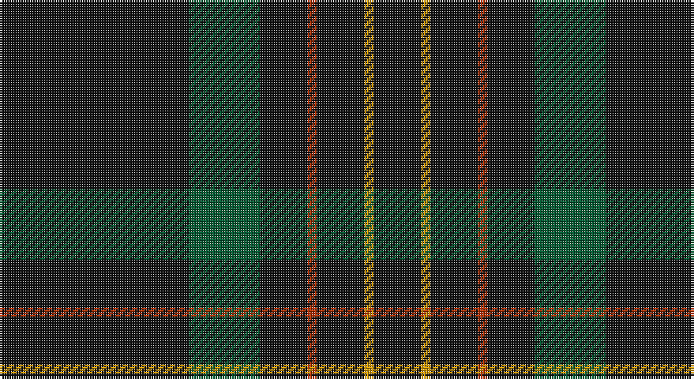

This page is one **sett** — a single exact thread-count. It belongs to the [tartan](/setts/k40dg15k10r2k10lo2k10/)
(the same proportion at any scale), whose colour order is pattern [KGKRKYK](/stripes/kgkrkyk/).

Sourced from tartans-authority.  It is a [7 stripe tartan](/stripes/stripes7/).

Original link http://www.tartansauthority.com/tartan-ferret/display/3235/

## Also known as

This cloth is also recorded under:

- Langhein, Alex

## Register references

External register numbers recorded for this tartan.

- Scottish Tartans Authority (ITI): 3235

## Thread count
K/80 G30 K20 R4 K20 DY4 K/20

One full sett is **256 threads**.

## Palette

Palette: <strong>Tartan Register</strong> <small style="color:#888">(2 of 4 colours)</small>
<table><thead><tr><th>Colour</th><th>Threads</th><th>Shade</th><th>Base</th><th>OKLCh</th></tr></thead><tbody><tr><td>K/</td><td style="text-align:right;font-variant-numeric:tabular-nums">80</td><td><code style="background-color:#101010;">#101010</code> <small style="color:#888">#101010</small></td><td>K <code style="background-color:#000000;">#000000</code></td><td><small style="color:#888">oklch(17.3% 0.000 89.9)</small></td></tr><tr><td>G</td><td style="text-align:right;font-variant-numeric:tabular-nums">30</td><td><code style="background-color:#005830;">#005830</code> <small style="color:#888">#005830</small></td><td>G <code style="background-color:#006100;">#006100</code></td><td><small style="color:#888">oklch(40.4% 0.100 155.2)</small></td></tr><tr><td>K</td><td style="text-align:right;font-variant-numeric:tabular-nums">20</td><td><code style="background-color:#101010;">#101010</code> <small style="color:#888">#101010</small></td><td>K <code style="background-color:#000000;">#000000</code></td><td><small style="color:#888">oklch(17.3% 0.000 89.9)</small></td></tr><tr><td>R</td><td style="text-align:right;font-variant-numeric:tabular-nums">4</td><td><code style="background-color:#B03000;">#B03000</code> <small style="color:#888">#B03000</small></td><td>R <code style="background-color:#CC0000;">#CC0000</code></td><td><small style="color:#888">oklch(50.3% 0.171 36.3)</small></td></tr><tr><td>K</td><td style="text-align:right;font-variant-numeric:tabular-nums">20</td><td><code style="background-color:#101010;">#101010</code> <small style="color:#888">#101010</small></td><td>K <code style="background-color:#000000;">#000000</code></td><td><small style="color:#888">oklch(17.3% 0.000 89.9)</small></td></tr><tr><td>DY</td><td style="text-align:right;font-variant-numeric:tabular-nums">4</td><td><code style="background-color:#D09800;">#D09800</code> <small style="color:#888">#D09800</small></td><td>Y <code style="background-color:#F2BF00;">#F2BF00</code></td><td><small style="color:#888">oklch(71.4% 0.147 82.1)</small></td></tr><tr><td>K/</td><td style="text-align:right;font-variant-numeric:tabular-nums">20</td><td><code style="background-color:#101010;">#101010</code> <small style="color:#888">#101010</small></td><td>K <code style="background-color:#000000;">#000000</code></td><td><small style="color:#888">oklch(17.3% 0.000 89.9)</small></td></tr></tbody></table>

# Sample pattern

## Nearest tartans

The nearest existing variants by ΔTartan distance, with this tartan at the top so the swatches line up against it.

ΔTartan

Tartan

Sett

—

<a href="/ttd/edit/#slug=k40dg15k10r2k10lo2k10~x2">Langhein, Alex (Personal)</a> <a class="nn-out" href="/variants/s7/k40dg15k10r2k10lo2k10~x2/" title="open its dictionary page">↗</a>

0.79

<a href="/ttd/edit/#slug=k40dg15k10r2k10lo2k10lo2~x2&amp;base=k40dg15k10r2k10lo2k10~x2">Langhein, Alex (Personal)</a> <a class="nn-out" href="/variants/s8/k40dg15k10r2k10lo2k10lo2~x2/" title="open its dictionary page">↗</a>

0.99

<a href="/ttd/edit/#slug=k40dg15k10r2k10ly2k10~x2&amp;base=k40dg15k10r2k10lo2k10~x2">Langhein Family Tartan</a> <a class="nn-out" href="/variants/s7/k40dg15k10r2k10ly2k10~x2/" title="open its dictionary page">↗</a>

1.39

<a href="/ttd/edit/#slug=dt74m9dt4r5dt4m9dt37db9~x2&amp;base=k40dg15k10r2k10lo2k10~x2">Rikaco Vintage</a> <a class="nn-out" href="/variants/s8/dt74m9dt4r5dt4m9dt37db9~x2/" title="open its dictionary page">↗</a>

1.44

<a href="/ttd/edit/#slug=k10n2k2n8k40r4k5ri2~x2&amp;base=k40dg15k10r2k10lo2k10~x2">Laird Abdullah (Personal)</a> <a class="nn-out" href="/variants/s8/k10n2k2n8k40r4k5ri2~x2/" title="open its dictionary page">↗</a>

1.54

<a href="/ttd/edit/#slug=k40dg15k10r2k10lo2~x2&amp;base=k40dg15k10r2k10lo2k10~x2">Kalkofen (Name)</a> <a class="nn-out" href="/variants/s6/k40dg15k10r2k10lo2~x2/" title="open its dictionary page">↗</a>

1.60

<a href="/ttd/edit/#slug=dt32r3dt4k2lo3~x2&amp;base=k40dg15k10r2k10lo2k10~x2">MacLaine of Lochbuie Hunting</a> <a class="nn-out" href="/variants/s5/dt32r3dt4k2lo3~x2/" title="open its dictionary page">↗</a>

1.65

<a href="/ttd/edit/#slug=k3g2k20r2k12g2k4g2k6g2~x2&amp;base=k40dg15k10r2k10lo2k10~x2">Renwick</a> <a class="nn-out" href="/variants/s10/k3g2k20r2k12g2k4g2k6g2~x2/" title="open its dictionary page">↗</a>

1.69

<a href="/ttd/edit/#slug=db1r1k12g1~x4&amp;base=k40dg15k10r2k10lo2k10~x2">MacNathair Sgianach</a> <a class="nn-out" href="/variants/s4/db1r1k12g1~x4/" title="open its dictionary page">↗</a>

1.74

<a href="/ttd/edit/#slug=k24n18k11n4k11n18k53r4&amp;base=k40dg15k10r2k10lo2k10~x2">Spirit of Glyndwr Gold (Fashion)</a> <a class="nn-out" href="/variants/s8/k24n18k11n4k11n18k53r4/" title="open its dictionary page">↗</a>

1.78

<a href="/ttd/edit/#slug=k49o8k4n6oi4n6k4o8k49oi2&amp;base=k40dg15k10r2k10lo2k10~x2">Harley Davidson</a> <a class="nn-out" href="/variants/s10/k49o8k4n6oi4n6k4o8k49oi2/" title="open its dictionary page">↗</a>

## Neighbour map

Every grey dot is one of 14360 variants placed by the first two principal components of the ΔTartan feature space (44% of its variance). Red is this tartan; blue dots are its nearest — click one to open its page.

<svg viewBox="0 0 640 380" role="img" style="max-width:100%;height:auto;border:1px solid #e0e0e0;border-radius:4px;display:block" xmlns="http://www.w3.org/2000/svg"><image href="/nn/cloud.v1.png" width="640" height="380"/><a href="/variants/s8/k40dg15k10r2k10lo2k10lo2~x2/"><circle cx="544.0" cy="213.2" r="4" fill="#3465a4"><title>Langhein, Alex (Personal)</title></circle></a><a href="/variants/s7/k40dg15k10r2k10ly2k10~x2/"><circle cx="568.2" cy="233.5" r="4" fill="#3465a4"><title>Langhein Family Tartan</title></circle></a><a href="/variants/s8/dt74m9dt4r5dt4m9dt37db9~x2/"><circle cx="538.7" cy="182.9" r="4" fill="#3465a4"><title>Rikaco Vintage</title></circle></a><a href="/variants/s8/k10n2k2n8k40r4k5ri2~x2/"><circle cx="537.7" cy="174.3" r="4" fill="#3465a4"><title>Laird Abdullah (Personal)</title></circle></a><a href="/variants/s6/k40dg15k10r2k10lo2~x2/"><circle cx="566.0" cy="243.4" r="4" fill="#3465a4"><title>Kalkofen (Name)</title></circle></a><a href="/variants/s5/dt32r3dt4k2lo3~x2/"><circle cx="584.8" cy="213.0" r="4" fill="#3465a4"><title>MacLaine of Lochbuie Hunting</title></circle></a><a href="/variants/s10/k3g2k20r2k12g2k4g2k6g2~x2/"><circle cx="561.7" cy="237.4" r="4" fill="#3465a4"><title>Renwick</title></circle></a><a href="/variants/s4/db1r1k12g1~x4/"><circle cx="566.7" cy="238.1" r="4" fill="#3465a4"><title>MacNathair Sgianach</title></circle></a><a href="/variants/s8/k24n18k11n4k11n18k53r4/"><circle cx="460.6" cy="240.0" r="4" fill="#3465a4"><title>Spirit of Glyndwr Gold (Fashion)</title></circle></a><a href="/variants/s10/k49o8k4n6oi4n6k4o8k49oi2/"><circle cx="507.3" cy="155.0" r="4" fill="#3465a4"><title>Harley Davidson</title></circle></a><circle cx="547.6" cy="220.6" r="5" fill="#c00000"/></svg>

ID: /variants/s7/k40dg15k10r2k10lo2k10~x2/
