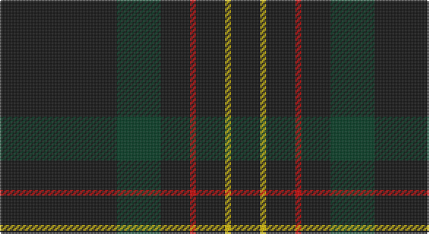

This page is one **sett** — a single exact thread-count. It belongs to the [tartan](/setts/k40dg15k10r2k10ly2k10/)
(the same proportion at any scale), whose colour order is pattern [KGKRKYK](/stripes/kgkrkyk/).

Sourced from house-of-tartan.  It is a [7 stripe tartan](/stripes/stripes7/).

Original link http://www.house-of-tartan.scotland.net/house/TartanViewjs.asp?colr=Def&tnam=3235

## Provenance

Earliest known date: April 2002 Based on Black Watch Sett

## Thread count
K/80 DG30 K20 Ra4 K20 Y4 K/20

One full sett is **256 threads**.

## Palette

Palette: <strong>Tartan Register</strong> <small style="color:#888">(6 of 7 colours)</small>
<table><thead><tr><th>Colour</th><th>Threads</th><th>Shade</th><th>Base</th><th>OKLCh</th></tr></thead><tbody><tr><td>K/</td><td style="text-align:right;font-variant-numeric:tabular-nums">80</td><td><code style="background-color:#101010;">#101010</code> <small style="color:#888">#101010</small></td><td>K <code style="background-color:#000000;">#000000</code></td><td><small style="color:#888">oklch(17.3% 0.000 89.9)</small></td></tr><tr><td>DG</td><td style="text-align:right;font-variant-numeric:tabular-nums">30</td><td><code style="background-color:#003820;">#003820</code> <small style="color:#888">#003820</small></td><td>G <code style="background-color:#006100;">#006100</code></td><td><small style="color:#888">oklch(30.0% 0.070 158.3)</small></td></tr><tr><td>K</td><td style="text-align:right;font-variant-numeric:tabular-nums">20</td><td><code style="background-color:#101010;">#101010</code> <small style="color:#888">#101010</small></td><td>K <code style="background-color:#000000;">#000000</code></td><td><small style="color:#888">oklch(17.3% 0.000 89.9)</small></td></tr><tr><td>Ra</td><td style="text-align:right;font-variant-numeric:tabular-nums">4</td><td><code style="background-color:#C80000;">#C80000</code> <small style="color:#888">#C80000</small></td><td>R <code style="background-color:#CC0000;">#CC0000</code></td><td><small style="color:#888">oklch(52.3% 0.215 29.2)</small></td></tr><tr><td>K</td><td style="text-align:right;font-variant-numeric:tabular-nums">20</td><td><code style="background-color:#101010;">#101010</code> <small style="color:#888">#101010</small></td><td>K <code style="background-color:#000000;">#000000</code></td><td><small style="color:#888">oklch(17.3% 0.000 89.9)</small></td></tr><tr><td>Y</td><td style="text-align:right;font-variant-numeric:tabular-nums">4</td><td><code style="background-color:#E8C000;">#E8C000</code> <small style="color:#888">#E8C000</small></td><td>Y <code style="background-color:#F2BF00;">#F2BF00</code></td><td><small style="color:#888">oklch(81.9% 0.168 93.7)</small></td></tr><tr><td>K/</td><td style="text-align:right;font-variant-numeric:tabular-nums">20</td><td><code style="background-color:#101010;">#101010</code> <small style="color:#888">#101010</small></td><td>K <code style="background-color:#000000;">#000000</code></td><td><small style="color:#888">oklch(17.3% 0.000 89.9)</small></td></tr></tbody></table>

# Sample pattern

## Nearest tartans

The nearest existing variants by ΔTartan distance, with this tartan at the top so the swatches line up against it.

ΔTartan

Tartan

Sett

—

<a href="/ttd/edit/#slug=k40dg15k10r2k10ly2k10~x2">Langhein Family Tartan</a> <a class="nn-out" href="/variants/s7/k40dg15k10r2k10ly2k10~x2/" title="open its dictionary page">↗</a>

0.65

<a href="/ttd/edit/#slug=k40dg15k10r2k10lo2k10lo2~x2&amp;base=k40dg15k10r2k10ly2k10~x2">Langhein, Alex (Personal)</a> <a class="nn-out" href="/variants/s8/k40dg15k10r2k10lo2k10lo2~x2/" title="open its dictionary page">↗</a>

0.72

<a href="/ttd/edit/#slug=k40dg15k10r2k10lo2~x2&amp;base=k40dg15k10r2k10ly2k10~x2">Kalkofen (Name)</a> <a class="nn-out" href="/variants/s6/k40dg15k10r2k10lo2~x2/" title="open its dictionary page">↗</a>

0.99

<a href="/ttd/edit/#slug=k40dg15k10r2k10lo2k10~x2&amp;base=k40dg15k10r2k10ly2k10~x2">Langhein, Alex (Personal)</a> <a class="nn-out" href="/variants/s7/k40dg15k10r2k10lo2k10~x2/" title="open its dictionary page">↗</a>

1.49

<a href="/ttd/edit/#slug=dt68t7dt16k16lo4~x2&amp;base=k40dg15k10r2k10ly2k10~x2">Burnetts &amp; Struth</a> <a class="nn-out" href="/variants/s5/dt68t7dt16k16lo4~x2/" title="open its dictionary page">↗</a>

1.75

<a href="/variants/s10/k40dg15k10r2k10lo2~x2/">Kalkofen</a>

1.75

<a href="/ttd/edit/#slug=k100dp8o4k4o4dp8k25db10o4&amp;base=k40dg15k10r2k10ly2k10~x2">CI (Corporate)</a> <a class="nn-out" href="/variants/s9/k100dp8o4k4o4dp8k25db10o4/" title="open its dictionary page">↗</a>

1.83

<a href="/ttd/edit/#slug=dt40dg3dp4dt28lo2lr2dt7~x2&amp;base=k40dg15k10r2k10ly2k10~x2">Pisniak (Personal)</a> <a class="nn-out" href="/variants/s7/dt40dg3dp4dt28lo2lr2dt7~x2/" title="open its dictionary page">↗</a>

1.87

<a href="/ttd/edit/#slug=dg31lo1dg18db18r1~x2&amp;base=k40dg15k10r2k10ly2k10~x2">Miramichi</a> <a class="nn-out" href="/variants/s5/dg31lo1dg18db18r1~x2/" title="open its dictionary page">↗</a>

1.90

<a href="/ttd/edit/#slug=k22n17k2n4k2n2k37n4k2r3~x2&amp;base=k40dg15k10r2k10ly2k10~x2">Witches' Blood, The</a> <a class="nn-out" href="/variants/s10/k22n17k2n4k2n2k37n4k2r3~x2/" title="open its dictionary page">↗</a>

1.94

<a href="/ttd/edit/#slug=dt32r3dt4k2lo3~x2&amp;base=k40dg15k10r2k10ly2k10~x2">MacLaine of Lochbuie Hunting</a> <a class="nn-out" href="/variants/s5/dt32r3dt4k2lo3~x2/" title="open its dictionary page">↗</a>

## Neighbour map

Every grey dot is one of 14360 variants placed by the first two principal components of the ΔTartan feature space (44% of its variance). Red is this tartan; blue dots are its nearest — click one to open its page.

<svg viewBox="0 0 640 380" role="img" style="max-width:100%;height:auto;border:1px solid #e0e0e0;border-radius:4px;display:block" xmlns="http://www.w3.org/2000/svg"><image href="/nn/cloud.v1.png" width="640" height="380"/><a href="/variants/s8/k40dg15k10r2k10lo2k10lo2~x2/"><circle cx="544.0" cy="213.2" r="4" fill="#3465a4"><title>Langhein, Alex (Personal)</title></circle></a><a href="/variants/s6/k40dg15k10r2k10lo2~x2/"><circle cx="566.0" cy="243.4" r="4" fill="#3465a4"><title>Kalkofen (Name)</title></circle></a><a href="/variants/s7/k40dg15k10r2k10lo2k10~x2/"><circle cx="547.6" cy="220.6" r="4" fill="#3465a4"><title>Langhein, Alex (Personal)</title></circle></a><a href="/variants/s5/dt68t7dt16k16lo4~x2/"><circle cx="550.9" cy="245.0" r="4" fill="#3465a4"><title>Burnetts &amp; Struth</title></circle></a><a href="/variants/s10/k40dg15k10r2k10lo2~x2/"><circle cx="511.0" cy="230.5" r="4" fill="#3465a4"><title>Kalkofen</title></circle></a><a href="/variants/s9/k100dp8o4k4o4dp8k25db10o4/"><circle cx="586.9" cy="173.0" r="4" fill="#3465a4"><title>CI (Corporate)</title></circle></a><a href="/variants/s7/dt40dg3dp4dt28lo2lr2dt7~x2/"><circle cx="626.0" cy="204.4" r="4" fill="#3465a4"><title>Pisniak (Personal)</title></circle></a><a href="/variants/s5/dg31lo1dg18db18r1~x2/"><circle cx="537.2" cy="245.2" r="4" fill="#3465a4"><title>Miramichi</title></circle></a><a href="/variants/s10/k22n17k2n4k2n2k37n4k2r3~x2/"><circle cx="514.3" cy="206.8" r="4" fill="#3465a4"><title>Witches' Blood, The</title></circle></a><a href="/variants/s5/dt32r3dt4k2lo3~x2/"><circle cx="584.8" cy="213.0" r="4" fill="#3465a4"><title>MacLaine of Lochbuie Hunting</title></circle></a><circle cx="568.2" cy="233.5" r="5" fill="#c00000"/></svg>

ID: /variants/s7/k40dg15k10r2k10ly2k10~x2/
