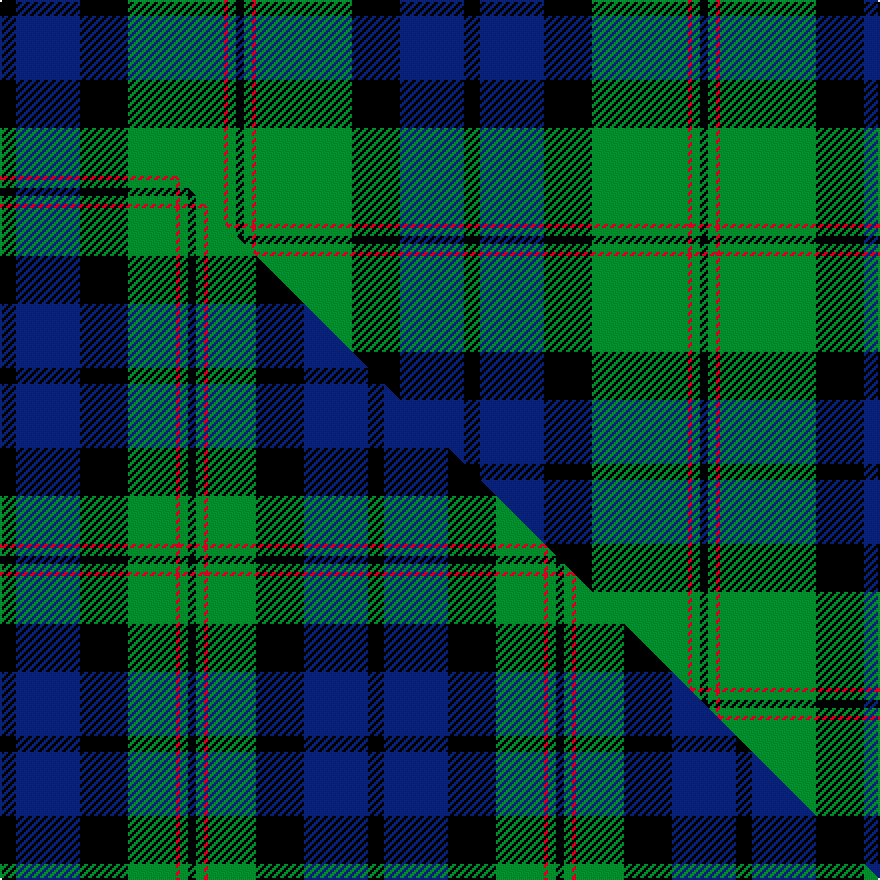

This is one **variant** — a specific cloth: this exact thread count and colourway, with its own
provenance below. It is one weaving of the [sett](/setts/k4db16k12g24r1g2k2/) (the scale-free proportion — the
same cloth at any scale or shade), whose colour order is pattern [KBKGRGK](/stripes/kbkgrgk/).

Part of the [Dundas](/tartans/d/du/dundas/) tartan — the named design grouping this sett with its other cloths.

Sourced from house-of-tartan.  It is a [7 stripe tartan](/stripes/stripes7/).

Original link [http://www.house-of-tartan.scotland.net/house/TartanViewjs.asp?colr=Def&tnam=1041](http://www.house-of-tartan.scotland.net/house/TartanViewjs.asp?colr=Def&tnam=1041)

## Provenance

Earliest known date: 1842 The Dundas tartan originated in the Vestiarium Scoticum (1842). The design has the traditional green, black, blue background of the Highland military tartans with twin red stripes on the green. Dundas's played an important role in restoring the Highland way of life after the penalties imposed as a result of the '45 rebellion. It was Henry Dundas, who in 1784, introduced the bill to parliament restoring estates forfieted to the Crown after the uprising, following the repeal on the wearing of tartan in 1782. The Chief today is Sir David Dundas of Dundas, Bart. Appears in Edgars 'Old and Rare'

4 attestations — the source records this cloth was collapsed from (oldest owns this page)

<ul>
<li>1842 — Dundas Clan Tartan (house-of-tartan, <a href="http://www.house-of-tartan.scotland.net/house/TartanViewjs.asp?colr=Def&tnam=1041">record</a>) </li>
<li>undated — Dundas (weddslist, <a href="http://www.weddslist.com/cgi-bin/tartans/pg.pl?source=rb">record</a>) </li>
<li>undated — Dundas (weddslist, <a href="http://www.weddslist.com/cgi-bin/tartans/pg.pl?source=tinsel">record</a>) </li>
<li>undated — Dundas (weddslist, <a href="http://www.weddslist.com/cgi-bin/tartans/pg.pl?source=x">record</a>) </li>
</ul>

Dataset <small>— provenance for this record, inherited from the source manifest</small>

<dl class="dataset-prov">
<dt>source</dt><dd><a href="/sources/house-of-tartan/">House of Tartan</a></dd>
<dt>data captured from</dt><dd><a href="https://github.com/thetartan/tartan-database/blob/master/data/house-of-tartan/data.csv">https://github.com/thetartan/tartan-database/blob/master/data/house-of-tartan/data.csv</a></dd>
<dt>data date</dt><dd>1842 <small>(this record)</small></dd>
<dt>licence</dt><dd><a href="https://creativecommons.org/licenses/by-nc-nd/4.0/">CC BY-NC-ND 4.0</a></dd>
</dl>

Capture chain <small>— the hands this data passed through, oldest first; each capture carries its own licence</small>

<ol class="capture-chain">
<li><a href="http://www.house-of-tartan.scotland.net/">House of Tartan</a> <small>the weaver/retailer's database — the site is now offline; the URL is kept as the ultimate source's identity</small></li>
<li><a href="https://github.com/thetartan/tartan-database">thetartan/tartan-database</a> <small>2016-2017</small> · <a href="https://creativecommons.org/licenses/by-nc-nd/4.0/">CC BY-NC-ND 4.0</a> <small>Levko Kravets's frozen compilation — the capture we vendored, and where its CC licence text came from</small></li>
<li>this dictionary <small>captured 2026-06-10 · commit 5bf86c7566</small> <small>each re-capture is a git commit to data/sources</small></li>
</ol>

## Thread count
K/8 DB32 K24 G48 R2 G4 K/4

One full sett is **232 threads**.

## Palette
<table><thead><tr><th>Colour</th><th>Shade</th><th>OKLCh</th></tr></thead><tbody><tr><td>DB</td><td><code style="background-color:#082077;">#082077</code> <small style="color:#888">#082077</small></td><td><small style="color:#888">oklch(30.0% 0.149 265.1)</small></td></tr><tr><td>G</td><td><code style="background-color:#008B2A;">#008B2A</code> <small style="color:#888">#008B2A</small></td><td><small style="color:#888">oklch(55.4% 0.170 145.9)</small></td></tr><tr><td>K</td><td><code style="background-color:#000000;">#000000</code> <small style="color:#888">#000000</small></td><td><small style="color:#888">oklch(0.0% 0.000 0.0)</small></td></tr><tr><td>R</td><td><code style="background-color:#D60020;">#D60020</code> <small style="color:#888">#D60020</small></td><td><small style="color:#888">oklch(55.2% 0.224 25.5)</small></td></tr></tbody></table>

# Sample pattern

## Compared to the master

This cloth is one sett of its design; the master sett (the exemplar the design is anchored on) is below for comparison.

Its **ΔTartan distance** from the master is **0.41** — the same measure the nearest-tartans table ranks by (0 is identical; a re-scale of the same cloth is near 0, a recolour or a different proportion further).

<figure class="master-compare" style="margin:0">

this sett
master sett ★

<figcaption style="color:#888;font-size:smaller">One weave of this sett against the <a href="/setts/k4db16k12g12r1g2k2/">master sett ★</a>, split on the diagonal: a shared proportion runs seamlessly across it with only the shades shifting; a different proportion breaks on it.</figcaption>
</figure>

## Nearest tartan variants

The nearest existing variants by ΔTartan distance, with this cloth at the top so the swatches line up against it.

ΔTartan

Threads

Variant

Sett

—

232

<a href="/variants/s7/k4db16k12g24r1g2k2~x2/">Dundas Clan Tartan</a>

<a href="/ttd/edit/#slug=k4db16k12g12r1g2k2~x2&amp;base=k4db16k12g24r1g2k2~x2" title="compare in the TTD">0.41</a>

184

<a href="/variants/s7/k4db16k12g12r1g2k2~x2/">Dundas #2</a>

<a href="/ttd/edit/#slug=g30db4g2k20db18r1db4~x2&amp;base=k4db16k12g24r1g2k2~x2" title="compare in the TTD">1.51</a>

248

<a href="/variants/s7/g30db4g2k20db18r1db4~x2/">MacTaggert</a>

<a href="/ttd/edit/#slug=r7g3r2g33k31db31k3db3&amp;base=k4db16k12g24r1g2k2~x2" title="compare in the TTD">1.75</a>

216

<a href="/variants/s8/r7g3r2g33k31db31k3db3/">Baird (Old) Clan Tartan</a>

<a href="/ttd/edit/#slug=db24k8g8r2g8k1y2&amp;base=k4db16k12g24r1g2k2~x2" title="compare in the TTD">1.75</a>

80

<a href="/variants/s7/db24k8g8r2g8k1y2/">MacLaren</a>

<a href="/ttd/edit/#slug=db24k8g8r2g8k1y2~x2&amp;base=k4db16k12g24r1g2k2~x2" title="compare in the TTD">1.75</a>

160

<a href="/variants/s7/db24k8g8r2g8k1y2~x2/">MacLaren Clan Tartan</a>

<a href="/ttd/edit/#slug=db24k8g8r2g8k1w2&amp;base=k4db16k12g24r1g2k2~x2" title="compare in the TTD">1.75</a>

80

<a href="/variants/s7/db24k8g8r2g8k1w2/">Fergusson</a>

<a href="/ttd/edit/#slug=db24k8g8r2g8k1w2~x2&amp;base=k4db16k12g24r1g2k2~x2" title="compare in the TTD">1.75</a>

160

<a href="/variants/s7/db24k8g8r2g8k1w2~x2/">Ferguson of Athol Clan Tartan</a>

<a href="/ttd/edit/#slug=g12k1g2dr1g2k10db10lo1~x4&amp;base=k4db16k12g24r1g2k2~x2" title="compare in the TTD">1.80</a>

260

<a href="/variants/s8/g12k1g2dr1g2k10db10lo1~x4/">Guelph, City Of</a>

<a href="/ttd/edit/#slug=g16lb2g1k12db12k1~x2&amp;base=k4db16k12g24r1g2k2~x2" title="compare in the TTD">1.85</a>

142

<a href="/variants/s6/g16lb2g1k12db12k1~x2/">Graham of Menteith</a>

<a href="/ttd/edit/#slug=k2r1g15k15db15y1k2~x2&amp;base=k4db16k12g24r1g2k2~x2" title="compare in the TTD">1.90</a>

196

<a href="/variants/s7/k2r1g15k15db15y1k2~x2/">MacCaskill Family Tartan</a>

## Neighbour map

Every grey dot is one of 13621 variants placed by the first two principal components of the ΔTartan feature space (42% of its variance). Red is this tartan; blue dots are its nearest — click one to open its page.

<svg viewBox="0 0 640 380" role="img" style="max-width:100%;height:auto;border:1px solid #e0e0e0;border-radius:4px;display:block" xmlns="http://www.w3.org/2000/svg"><image href="/nn/cloud.v1.png" width="640" height="380"/><a href="/variants/s7/k4db16k12g12r1g2k2~x2/"><circle cx="174.3" cy="172.9" r="4" fill="#3465a4"><title>Dundas #2</title></circle></a><a href="/variants/s7/g30db4g2k20db18r1db4~x2/"><circle cx="223.2" cy="146.5" r="4" fill="#3465a4"><title>MacTaggert</title></circle></a><a href="/variants/s8/r7g3r2g33k31db31k3db3/"><circle cx="159.1" cy="157.7" r="4" fill="#3465a4"><title>Baird (Old) Clan Tartan</title></circle></a><a href="/variants/s7/db24k8g8r2g8k1y2/"><circle cx="222.8" cy="137.8" r="4" fill="#3465a4"><title>MacLaren</title></circle></a><a href="/variants/s7/db24k8g8r2g8k1y2~x2/"><circle cx="222.8" cy="137.8" r="4" fill="#3465a4"><title>MacLaren Clan Tartan</title></circle></a><a href="/variants/s7/db24k8g8r2g8k1w2/"><circle cx="211.4" cy="134.3" r="4" fill="#3465a4"><title>Fergusson</title></circle></a><a href="/variants/s7/db24k8g8r2g8k1w2~x2/"><circle cx="211.4" cy="134.3" r="4" fill="#3465a4"><title>Ferguson of Athol Clan Tartan</title></circle></a><a href="/variants/s8/g12k1g2dr1g2k10db10lo1~x4/"><circle cx="164.8" cy="159.2" r="4" fill="#3465a4"><title>Guelph, City Of</title></circle></a><a href="/variants/s6/g16lb2g1k12db12k1~x2/"><circle cx="181.9" cy="181.6" r="4" fill="#3465a4"><title>Graham of Menteith</title></circle></a><a href="/variants/s7/k2r1g15k15db15y1k2~x2/"><circle cx="158.4" cy="151.9" r="4" fill="#3465a4"><title>MacCaskill Family Tartan</title></circle></a><circle cx="212.1" cy="147.0" r="5" fill="#c00000"/><text x="320" y="376" text-anchor="middle" font-size="11" fill="#999">ground</text><text x="11" y="190" text-anchor="middle" font-size="11" fill="#999" transform="rotate(-90 11 190)">complexity</text></svg>

ID: /variants/s7/k4db16k12g24r1g2k2~x2/
