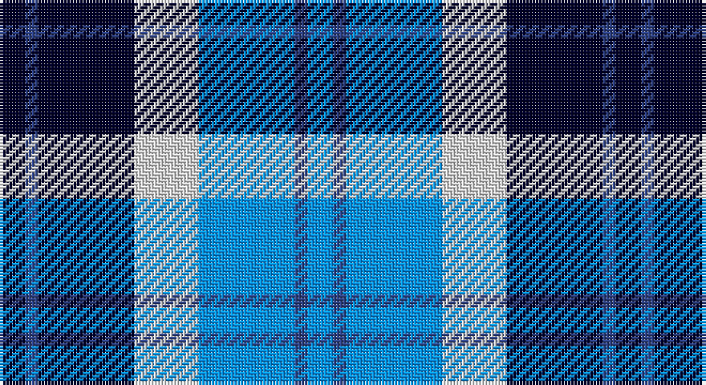

This page is one **sett** — a single exact thread-count. It belongs to the [tartan](/setts/k4db2k15w10b15db2b4/)
(the same proportion at any scale), whose colour order is pattern [BBBWKBK](/stripes/bbbwkbk/).

Part of the [Strathclyde](/tartans/strathclyde/) tartan — the named design grouping this sett with its other cloths.

Sourced from register-of-tartans.  It is a [7 stripe tartan](/stripes/stripes7/).

Original link https://www.tartanregister.gov.uk/tartanDetails.aspx?ref=3979

## Also known as

This cloth is also recorded under:

- Strathclyde blue

2 attestations — the source records this cloth was collapsed from (oldest owns this page)

<ul>
<li>undated — Strathclyde (register-of-tartans, <a href="https://www.tartanregister.gov.uk/tartanDetails.aspx?ref=3979">record</a>)</li>
<li>undated — Strathclyde (weddslist, <a href="http://www.weddslist.com/cgi-bin/tartans/pg.pl?source=sts">record</a>)</li>
</ul>

## Register references

External register numbers recorded for this tartan.

- Scottish Register of Tartans: [3979](https://www.tartanregister.gov.uk/tartanDetails.aspx?ref=3979)
- Scottish Tartans World Register: 30

## Thread count
DB/8 Ba4 DB30 LN20 B30 Ba4 B/8

One full sett is **192 threads**.

## Palette

Palette: <strong>Tartan Register</strong> <small style="color:#888">(3 of 4 colours)</small>
<table><thead><tr><th>Colour</th><th>Threads</th><th>Shade</th><th>Base</th><th>OKLCh</th></tr></thead><tbody><tr><td>DB/</td><td style="text-align:right;font-variant-numeric:tabular-nums">8</td><td><code style="background-color:#000028;">#000028</code> <small style="color:#888">#000028</small></td><td>K <code style="background-color:#000000;">#000000</code></td><td><small style="color:#888">oklch(12.5% 0.087 264.1)</small></td></tr><tr><td>Ba</td><td style="text-align:right;font-variant-numeric:tabular-nums">4</td><td><code style="background-color:#2C4084;">#2C4084</code> <small style="color:#888">#2C4084</small></td><td>B <code style="background-color:#2A418A;">#2A418A</code></td><td><small style="color:#888">oklch(39.4% 0.117 268.3)</small></td></tr><tr><td>DB</td><td style="text-align:right;font-variant-numeric:tabular-nums">30</td><td><code style="background-color:#000028;">#000028</code> <small style="color:#888">#000028</small></td><td>K <code style="background-color:#000000;">#000000</code></td><td><small style="color:#888">oklch(12.5% 0.087 264.1)</small></td></tr><tr><td>LN</td><td style="text-align:right;font-variant-numeric:tabular-nums">20</td><td><code style="background-color:#E0E0E0;">#E0E0E0</code> <small style="color:#888">#E0E0E0</small></td><td>W <code style="background-color:#F7F7F7;">#F7F7F7</code></td><td><small style="color:#888">oklch(90.7% 0.000 89.9)</small></td></tr><tr><td>B</td><td style="text-align:right;font-variant-numeric:tabular-nums">30</td><td><code style="background-color:#0596FA;">#0596FA</code> <small style="color:#888">#0596FA</small></td><td>B <code style="background-color:#2A418A;">#2A418A</code></td><td><small style="color:#888">oklch(66.0% 0.180 248.9)</small></td></tr><tr><td>Ba</td><td style="text-align:right;font-variant-numeric:tabular-nums">4</td><td><code style="background-color:#2C4084;">#2C4084</code> <small style="color:#888">#2C4084</small></td><td>B <code style="background-color:#2A418A;">#2A418A</code></td><td><small style="color:#888">oklch(39.4% 0.117 268.3)</small></td></tr><tr><td>B/</td><td style="text-align:right;font-variant-numeric:tabular-nums">8</td><td><code style="background-color:#0596FA;">#0596FA</code> <small style="color:#888">#0596FA</small></td><td>B <code style="background-color:#2A418A;">#2A418A</code></td><td><small style="color:#888">oklch(66.0% 0.180 248.9)</small></td></tr></tbody></table>

# Sample pattern

## Nearest tartans

The nearest existing variants by ΔTartan distance, with this tartan at the top so the swatches line up against it.

ΔTartan

Tartan

Sett

—

<a href="/ttd/edit/#slug=k4db2k15w10b15db2b4~x2">Strathclyde</a> <a class="nn-out" href="/variants/s7/k4db2k15w10b15db2b4~x2/" title="open its dictionary page">↗</a>

0.91

<a href="/ttd/edit/#slug=b1lb6db1b3k3b1~x8&amp;base=k4db2k15w10b15db2b4~x2">Thompson (Dance)</a> <a class="nn-out" href="/variants/s6/b1lb6db1b3k3b1~x8/" title="open its dictionary page">↗</a>

0.91

<a href="/variants/s7/k2b16w2ki16w15k2w2~x2/">Strathclyde</a>

1.19

<a href="/ttd/edit/#slug=ly2b9r2db6ly1r1~x4&amp;base=k4db2k15w10b15db2b4~x2">Lauder Primary School</a> <a class="nn-out" href="/variants/s6/ly2b9r2db6ly1r1~x4/" title="open its dictionary page">↗</a>

1.27

<a href="/ttd/edit/#slug=db2b9r1db5g5lb2~x4&amp;base=k4db2k15w10b15db2b4~x2">American Express</a> <a class="nn-out" href="/variants/s6/db2b9r1db5g5lb2~x4/" title="open its dictionary page">↗</a>

1.28

<a href="/ttd/edit/#slug=db2lb4k2lb1db4k1db1g1~x4&amp;base=k4db2k15w10b15db2b4~x2">Culloden - 1977 (Fashion)</a> <a class="nn-out" href="/variants/s8/db2lb4k2lb1db4k1db1g1~x4/" title="open its dictionary page">↗</a>

1.31

<a href="/ttd/edit/#slug=dbi1g7dbi7db2w6dbi1w1~x4&amp;base=k4db2k15w10b15db2b4~x2">Blue Boy, The (Fashion)</a> <a class="nn-out" href="/variants/s7/dbi1g7dbi7db2w6dbi1w1~x4/" title="open its dictionary page">↗</a>

1.41

<a href="/ttd/edit/#slug=k4lo2k13lo1w8b13lo2b4~x2&amp;base=k4db2k15w10b15db2b4~x2">Bannockbane Blue #1</a> <a class="nn-out" href="/variants/s8/k4lo2k13lo1w8b13lo2b4~x2/" title="open its dictionary page">↗</a>

1.54

<a href="/ttd/edit/#slug=k3lo1lb9lo1db9k3t1~x4&amp;base=k4db2k15w10b15db2b4~x2">St. Francis Xavier University</a> <a class="nn-out" href="/variants/s7/k3lo1lb9lo1db9k3t1~x4/" title="open its dictionary page">↗</a>

1.55

<a href="/ttd/edit/#slug=b9r1db5g5lb2g5db5r1b9db2~x4&amp;base=k4db2k15w10b15db2b4~x2">American Express Corporate Tartan</a> <a class="nn-out" href="/variants/s10/b9r1db5g5lb2g5db5r1b9db2~x4/" title="open its dictionary page">↗</a>

1.56

<a href="/ttd/edit/#slug=b24k4r3g24k4ly3~x2&amp;base=k4db2k15w10b15db2b4~x2">(1) Skene</a> <a class="nn-out" href="/variants/s6/b24k4r3g24k4ly3~x2/" title="open its dictionary page">↗</a>

## Neighbour map

Every grey dot is one of 14360 variants placed by the first two principal components of the ΔTartan feature space (44% of its variance). Red is this tartan; blue dots are its nearest — click one to open its page.

<svg viewBox="0 0 640 380" role="img" style="max-width:100%;height:auto;border:1px solid #e0e0e0;border-radius:4px;display:block" xmlns="http://www.w3.org/2000/svg"><image href="/nn/cloud.v1.png" width="640" height="380"/><a href="/variants/s6/b1lb6db1b3k3b1~x8/"><circle cx="134.2" cy="216.0" r="4" fill="#3465a4"><title>Thompson (Dance)</title></circle></a><a href="/variants/s7/k2b16w2ki16w15k2w2~x2/"><circle cx="128.7" cy="189.2" r="4" fill="#3465a4"><title>Strathclyde</title></circle></a><a href="/variants/s6/ly2b9r2db6ly1r1~x4/"><circle cx="177.9" cy="195.9" r="4" fill="#3465a4"><title>Lauder Primary School</title></circle></a><a href="/variants/s6/db2b9r1db5g5lb2~x4/"><circle cx="129.1" cy="209.7" r="4" fill="#3465a4"><title>American Express</title></circle></a><a href="/variants/s8/db2lb4k2lb1db4k1db1g1~x4/"><circle cx="124.0" cy="237.0" r="4" fill="#3465a4"><title>Culloden - 1977 (Fashion)</title></circle></a><a href="/variants/s7/dbi1g7dbi7db2w6dbi1w1~x4/"><circle cx="115.9" cy="203.8" r="4" fill="#3465a4"><title>Blue Boy, The (Fashion)</title></circle></a><a href="/variants/s8/k4lo2k13lo1w8b13lo2b4~x2/"><circle cx="148.8" cy="173.3" r="4" fill="#3465a4"><title>Bannockbane Blue #1</title></circle></a><a href="/variants/s7/k3lo1lb9lo1db9k3t1~x4/"><circle cx="110.6" cy="169.7" r="4" fill="#3465a4"><title>St. Francis Xavier University</title></circle></a><a href="/variants/s10/b9r1db5g5lb2g5db5r1b9db2~x4/"><circle cx="136.5" cy="195.7" r="4" fill="#3465a4"><title>American Express Corporate Tartan</title></circle></a><a href="/variants/s6/b24k4r3g24k4ly3~x2/"><circle cx="152.3" cy="189.7" r="4" fill="#3465a4"><title>(1) Skene</title></circle></a><circle cx="129.3" cy="208.9" r="5" fill="#c00000"/></svg>

ID: /variants/s7/k4db2k15w10b15db2b4~x2/
