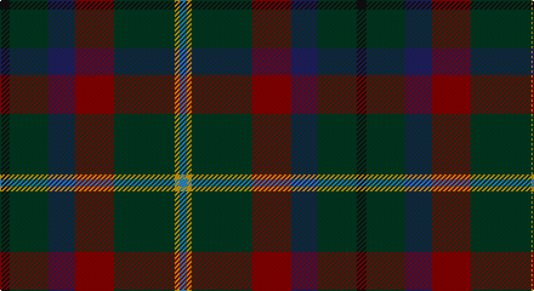

This page is one **sett** — a single exact thread-count. It belongs to the [tartan](/setts/k4dg16db11r16dg25lo2t3/)
(the same proportion at any scale), whose colour order is pattern [BYGRBGK](/stripes/bygrbgk/).

Sourced from tartans-authority.  It is a [7 stripe tartan](/stripes/stripes7/).

Original link http://www.tartansauthority.com/tartan-ferret/display/2270/

## Register references

External register numbers recorded for this tartan.

- Scottish Tartans Authority (ITI): 2270

## Thread count
K/8 DG32 DB22 DR32 DG50 DY4 B/6

One full sett is **294 threads**.

## Palette

Palette: <strong>Tartan Register</strong> <small style="color:#888">(5 of 6 colours)</small>
<table><thead><tr><th>Colour</th><th>Threads</th><th>Shade</th><th>Base</th><th>OKLCh</th></tr></thead><tbody><tr><td>K/</td><td style="text-align:right;font-variant-numeric:tabular-nums">8</td><td><code style="background-color:#101010;">#101010</code> <small style="color:#888">#101010</small></td><td>K <code style="background-color:#000000;">#000000</code></td><td><small style="color:#888">oklch(17.3% 0.000 89.9)</small></td></tr><tr><td>DG</td><td style="text-align:right;font-variant-numeric:tabular-nums">32</td><td><code style="background-color:#003820;">#003820</code> <small style="color:#888">#003820</small></td><td>G <code style="background-color:#006100;">#006100</code></td><td><small style="color:#888">oklch(30.0% 0.070 158.3)</small></td></tr><tr><td>DB</td><td style="text-align:right;font-variant-numeric:tabular-nums">22</td><td><code style="background-color:#202060;">#202060</code> <small style="color:#888">#202060</small></td><td>B <code style="background-color:#2A418A;">#2A418A</code></td><td><small style="color:#888">oklch(28.9% 0.111 276.9)</small></td></tr><tr><td>DR</td><td style="text-align:right;font-variant-numeric:tabular-nums">32</td><td><code style="background-color:#880000;">#880000</code> <small style="color:#888">#880000</small></td><td>R <code style="background-color:#CC0000;">#CC0000</code></td><td><small style="color:#888">oklch(39.4% 0.162 29.2)</small></td></tr><tr><td>DG</td><td style="text-align:right;font-variant-numeric:tabular-nums">50</td><td><code style="background-color:#003820;">#003820</code> <small style="color:#888">#003820</small></td><td>G <code style="background-color:#006100;">#006100</code></td><td><small style="color:#888">oklch(30.0% 0.070 158.3)</small></td></tr><tr><td>DY</td><td style="text-align:right;font-variant-numeric:tabular-nums">4</td><td><code style="background-color:#D09800;">#D09800</code> <small style="color:#888">#D09800</small></td><td>Y <code style="background-color:#F2BF00;">#F2BF00</code></td><td><small style="color:#888">oklch(71.4% 0.147 82.1)</small></td></tr><tr><td>B/</td><td style="text-align:right;font-variant-numeric:tabular-nums">6</td><td><code style="background-color:#2888C4;">#2888C4</code> <small style="color:#888">#2888C4</small></td><td>B <code style="background-color:#2A418A;">#2A418A</code></td><td><small style="color:#888">oklch(60.1% 0.125 241.5)</small></td></tr></tbody></table>

# Sample pattern

## Nearest tartans

The nearest existing variants by ΔTartan distance, with this tartan at the top so the swatches line up against it.

ΔTartan

Tartan

Sett

—

<a href="/ttd/edit/#slug=k4dg16db11r16dg25lo2t3~x2">Mayo, County (District)</a> <a class="nn-out" href="/variants/s7/k4dg16db11r16dg25lo2t3~x2/" title="open its dictionary page">↗</a>

1.20

<a href="/variants/s12/k4dg16db11r16dg25lo2t3~x2/">Mayo, County</a>

1.24

<a href="/ttd/edit/#slug=k4g16db11r16g25ly2gi3~x2&amp;base=k4dg16db11r16dg25lo2t3~x2">Mayo Irish County Tartan</a> <a class="nn-out" href="/variants/s7/k4g16db11r16g25ly2gi3~x2/" title="open its dictionary page">↗</a>

1.29

<a href="/ttd/edit/#slug=dy6o2dy12k4dt14k1dy3ly2~x2&amp;base=k4dg16db11r16dg25lo2t3~x2">Mica, Green (Fashion)</a> <a class="nn-out" href="/variants/s8/dy6o2dy12k4dt14k1dy3ly2~x2/" title="open its dictionary page">↗</a>

1.37

<a href="/ttd/edit/#slug=dt20dg6dt6lb2dg20r8dg6r4dg10lr3~x2&amp;base=k4dg16db11r16dg25lo2t3~x2">MacConnell</a> <a class="nn-out" href="/variants/s10/dt20dg6dt6lb2dg20r8dg6r4dg10lr3~x2/" title="open its dictionary page">↗</a>

1.46

<a href="/variants/s8/db6w1y6dy12r2~x4/">Vass (Personal)</a>

1.48

<a href="/ttd/edit/#slug=db2dy18dg10dy1k10dy2dg10dy18w2~x2&amp;base=k4dg16db11r16dg25lo2t3~x2">Duchess of York (Fashion)</a> <a class="nn-out" href="/variants/s9/db2dy18dg10dy1k10dy2dg10dy18w2~x2/" title="open its dictionary page">↗</a>

1.51

<a href="/ttd/edit/#slug=g15lo1do2db5k4dg5~x6&amp;base=k4dg16db11r16dg25lo2t3~x2">Dobson (Palm Bay) (Personal)</a> <a class="nn-out" href="/variants/s6/g15lo1do2db5k4dg5~x6/" title="open its dictionary page">↗</a>

1.51

<a href="/ttd/edit/#slug=dt18dp1dt12k14g14r2~x2&amp;base=k4dg16db11r16dg25lo2t3~x2">Mackison</a> <a class="nn-out" href="/variants/s6/dt18dp1dt12k14g14r2~x2/" title="open its dictionary page">↗</a>

1.52

<a href="/ttd/edit/#slug=r3db22k11dg32ly3~x2&amp;base=k4dg16db11r16dg25lo2t3~x2">Cultoquhey Hotel Corporate Tartan</a> <a class="nn-out" href="/variants/s5/r3db22k11dg32ly3~x2/" title="open its dictionary page">↗</a>

1.53

<a href="/ttd/edit/#slug=dg42lo2y16db7do16r5~x2&amp;base=k4dg16db11r16dg25lo2t3~x2">Waterford, County</a> <a class="nn-out" href="/variants/s6/dg42lo2y16db7do16r5~x2/" title="open its dictionary page">↗</a>

## Neighbour map

Every grey dot is one of 14360 variants placed by the first two principal components of the ΔTartan feature space (44% of its variance). Red is this tartan; blue dots are its nearest — click one to open its page.

<svg viewBox="0 0 640 380" role="img" style="max-width:100%;height:auto;border:1px solid #e0e0e0;border-radius:4px;display:block" xmlns="http://www.w3.org/2000/svg"><image href="/nn/cloud.v1.png" width="640" height="380"/><a href="/variants/s12/k4dg16db11r16dg25lo2t3~x2/"><circle cx="292.3" cy="201.0" r="4" fill="#3465a4"><title>Mayo, County</title></circle></a><a href="/variants/s7/k4g16db11r16g25ly2gi3~x2/"><circle cx="257.0" cy="194.1" r="4" fill="#3465a4"><title>Mayo Irish County Tartan</title></circle></a><a href="/variants/s8/dy6o2dy12k4dt14k1dy3ly2~x2/"><circle cx="274.4" cy="195.5" r="4" fill="#3465a4"><title>Mica, Green (Fashion)</title></circle></a><a href="/variants/s10/dt20dg6dt6lb2dg20r8dg6r4dg10lr3~x2/"><circle cx="279.0" cy="225.7" r="4" fill="#3465a4"><title>MacConnell</title></circle></a><a href="/variants/s8/db6w1y6dy12r2~x4/"><circle cx="292.8" cy="212.0" r="4" fill="#3465a4"><title>Vass (Personal)</title></circle></a><a href="/variants/s9/db2dy18dg10dy1k10dy2dg10dy18w2~x2/"><circle cx="333.8" cy="201.6" r="4" fill="#3465a4"><title>Duchess of York (Fashion)</title></circle></a><a href="/variants/s6/g15lo1do2db5k4dg5~x6/"><circle cx="266.4" cy="207.9" r="4" fill="#3465a4"><title>Dobson (Palm Bay) (Personal)</title></circle></a><a href="/variants/s6/dt18dp1dt12k14g14r2~x2/"><circle cx="293.2" cy="236.4" r="4" fill="#3465a4"><title>Mackison</title></circle></a><a href="/variants/s5/r3db22k11dg32ly3~x2/"><circle cx="271.5" cy="244.1" r="4" fill="#3465a4"><title>Cultoquhey Hotel Corporate Tartan</title></circle></a><a href="/variants/s6/dg42lo2y16db7do16r5~x2/"><circle cx="302.3" cy="191.8" r="4" fill="#3465a4"><title>Waterford, County</title></circle></a><circle cx="285.1" cy="212.2" r="5" fill="#c00000"/></svg>

ID: /variants/s7/k4dg16db11r16dg25lo2t3~x2/
