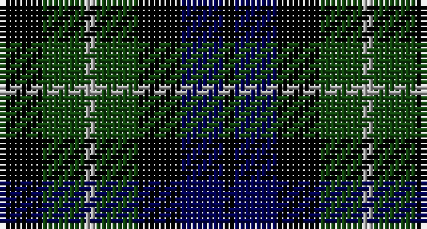

This page is one **sett** — a single exact thread-count. It belongs to the [tartan](/setts/k4dg4lr1dg4k4db4k1/)
(the same proportion at any scale), whose colour order is pattern [KBKGYGK](/stripes/kbkgygk/).

Part of the [Graham of Montrose](/tartans/graham-of-montrose/) tartan — the named design grouping this sett with its other cloths.

Sourced from weddslist.  It is a [7 stripe tartan](/stripes/stripes7/).

Original link http://www.weddslist.com/cgi-bin/tartans/pg.pl?source=tinsel

## Also known as

This cloth is also recorded under:

- Graham of Montrose #2
- Graham of Montrose #3
- Graham of Montrose Red

2 attestations — the source records this cloth was collapsed from (oldest owns this page)

<ul>
<li>undated — Graham of Montrose (weddslist, <a href="http://www.weddslist.com/cgi-bin/tartans/pg.pl?source=tinsel">record</a>)</li>
<li>undated — Graham of Montrose (weddslist, <a href="http://www.weddslist.com/cgi-bin/tartans/pg.pl?source=x">record</a>)</li>
</ul>

## Thread count
K/8 DG8 N2 DG8 K8 DB8 K/2

One full sett is **78 threads**.

## Palette

Palette: <strong>Ingles Buchan</strong> <small style="color:#888">(1 of 4 colours)</small>
<table><thead><tr><th>Colour</th><th>Threads</th><th>Shade</th><th>Base</th><th>OKLCh</th></tr></thead><tbody><tr><td>K/</td><td style="text-align:right;font-variant-numeric:tabular-nums">8</td><td><code style="background-color:#000000;">#000000</code> <small style="color:#888">#000000</small></td><td>K <code style="background-color:#000000;">#000000</code></td><td><small style="color:#888">oklch(0.0% 0.000 0.0)</small></td></tr><tr><td>DG</td><td style="text-align:right;font-variant-numeric:tabular-nums">8</td><td><code style="background-color:#11450D;">#11450D</code> <small style="color:#888">#11450D</small></td><td>G <code style="background-color:#006100;">#006100</code></td><td><small style="color:#888">oklch(34.4% 0.101 142.1)</small></td></tr><tr><td>N</td><td style="text-align:right;font-variant-numeric:tabular-nums">2</td><td><code style="background-color:#AAAAAA;">#AAAAAA</code> <small style="color:#888">#AAAAAA</small></td><td>Y <code style="background-color:#F2BF00;">#F2BF00</code></td><td><small style="color:#888">oklch(73.8% 0.000 89.9)</small></td></tr><tr><td>DG</td><td style="text-align:right;font-variant-numeric:tabular-nums">8</td><td><code style="background-color:#11450D;">#11450D</code> <small style="color:#888">#11450D</small></td><td>G <code style="background-color:#006100;">#006100</code></td><td><small style="color:#888">oklch(34.4% 0.101 142.1)</small></td></tr><tr><td>K</td><td style="text-align:right;font-variant-numeric:tabular-nums">8</td><td><code style="background-color:#000000;">#000000</code> <small style="color:#888">#000000</small></td><td>K <code style="background-color:#000000;">#000000</code></td><td><small style="color:#888">oklch(0.0% 0.000 0.0)</small></td></tr><tr><td>DB</td><td style="text-align:right;font-variant-numeric:tabular-nums">8</td><td><code style="background-color:#000052;">#000052</code> <small style="color:#888">#000052</small></td><td>B <code style="background-color:#2A418A;">#2A418A</code></td><td><small style="color:#888">oklch(19.8% 0.137 264.1)</small></td></tr><tr><td>K/</td><td style="text-align:right;font-variant-numeric:tabular-nums">2</td><td><code style="background-color:#000000;">#000000</code> <small style="color:#888">#000000</small></td><td>K <code style="background-color:#000000;">#000000</code></td><td><small style="color:#888">oklch(0.0% 0.000 0.0)</small></td></tr></tbody></table>

# Sample pattern

## Compared to the master

This cloth is one sett of its design; the master sett (the exemplar the design is anchored on) is below for comparison.

<figure style="margin:0"><figcaption style="color:#888;font-size:smaller">this sett</figcaption></figure>
<figure style="margin:0"><figcaption style="color:#888;font-size:smaller"><a href="/setts/db9k9g9w2g9k9g9w2g9k9db9k3/">master sett →</a></figcaption></figure>

## Nearest tartans

The nearest existing variants by ΔTartan distance, with this tartan at the top so the swatches line up against it.

ΔTartan

Tartan

Sett

—

<a href="/ttd/edit/#slug=k4dg4lr1dg4k4db4k1~x2">Graham of Montrose</a> <a class="nn-out" href="/variants/s7/k4dg4lr1dg4k4db4k1~x2/" title="open its dictionary page">↗</a>

0.27

<a href="/ttd/edit/#slug=k9dg9ly2dg9k9db9k3~x2&amp;base=k4dg4lr1dg4k4db4k1~x2">Campbell of Breadalbane</a> <a class="nn-out" href="/variants/s7/k9dg9ly2dg9k9db9k3~x2/" title="open its dictionary page">↗</a>

0.40

<a href="/ttd/edit/#slug=k4dg4lb1dg4k4db4k1~x2&amp;base=k4dg4lr1dg4k4db4k1~x2">Graham of Montrose</a> <a class="nn-out" href="/variants/s7/k4dg4lb1dg4k4db4k1~x2/" title="open its dictionary page">↗</a>

0.49

<a href="/ttd/edit/#slug=k9dg9ly2dg9k9db9k3&amp;base=k4dg4lr1dg4k4db4k1~x2">Campbell Breadalbane</a> <a class="nn-out" href="/variants/s7/k9dg9ly2dg9k9db9k3/" title="open its dictionary page">↗</a>

0.89

<a href="/ttd/edit/#slug=db4dg6lr1dg6k6db6k2~x2&amp;base=k4dg4lr1dg4k4db4k1~x2">MacNiel of Colonsay</a> <a class="nn-out" href="/variants/s7/db4dg6lr1dg6k6db6k2~x2/" title="open its dictionary page">↗</a>

0.89

<a href="/ttd/edit/#slug=db4dg6lb1dg6k6db6k2~x2&amp;base=k4dg4lr1dg4k4db4k1~x2">MacNeil of Colonsay</a> <a class="nn-out" href="/variants/s7/db4dg6lb1dg6k6db6k2~x2/" title="open its dictionary page">↗</a>

0.97

<a href="/ttd/edit/#slug=k9g9ly2g9k9db9k3~x2&amp;base=k4dg4lr1dg4k4db4k1~x2">Campbell of Breadalbane (Clan)</a> <a class="nn-out" href="/variants/s7/k9g9ly2g9k9db9k3~x2/" title="open its dictionary page">↗</a>

1.12

<a href="/ttd/edit/#slug=db12k16g14k5g14k16db12g4~x2&amp;base=k4dg4lr1dg4k4db4k1~x2">Norwich No.064</a> <a class="nn-out" href="/variants/s8/db12k16g14k5g14k16db12g4~x2/" title="open its dictionary page">↗</a>

1.16

<a href="/ttd/edit/#slug=g8k7db8r2db8k7g8k2~x2&amp;base=k4dg4lr1dg4k4db4k1~x2">Denholm</a> <a class="nn-out" href="/variants/s8/g8k7db8r2db8k7g8k2~x2/" title="open its dictionary page">↗</a>

1.25

<a href="/ttd/edit/#slug=k9g9w2g9k9db9k3~x2&amp;base=k4dg4lr1dg4k4db4k1~x2">Graham of Montrose - 1850 (Clan)</a> <a class="nn-out" href="/variants/s7/k9g9w2g9k9db9k3~x2/" title="open its dictionary page">↗</a>

1.38

<a href="/ttd/edit/#slug=k11dg12k2dg12k12dp12w3~x2&amp;base=k4dg4lr1dg4k4db4k1~x2">Wilson's No 97</a> <a class="nn-out" href="/variants/s7/k11dg12k2dg12k12dp12w3~x2/" title="open its dictionary page">↗</a>

## Neighbour map

Every grey dot is one of 14360 variants placed by the first two principal components of the ΔTartan feature space (44% of its variance). Red is this tartan; blue dots are its nearest — click one to open its page.

<svg viewBox="0 0 640 380" role="img" style="max-width:100%;height:auto;border:1px solid #e0e0e0;border-radius:4px;display:block" xmlns="http://www.w3.org/2000/svg"><image href="/nn/cloud.v1.png" width="640" height="380"/><a href="/variants/s7/k9dg9ly2dg9k9db9k3~x2/"><circle cx="155.4" cy="299.0" r="4" fill="#3465a4"><title>Campbell of Breadalbane</title></circle></a><a href="/variants/s7/k4dg4lb1dg4k4db4k1~x2/"><circle cx="134.5" cy="293.7" r="4" fill="#3465a4"><title>Graham of Montrose</title></circle></a><a href="/variants/s7/k9dg9ly2dg9k9db9k3/"><circle cx="143.2" cy="292.9" r="4" fill="#3465a4"><title>Campbell Breadalbane</title></circle></a><a href="/variants/s7/db4dg6lr1dg6k6db6k2~x2/"><circle cx="161.3" cy="287.5" r="4" fill="#3465a4"><title>MacNiel of Colonsay</title></circle></a><a href="/variants/s7/db4dg6lb1dg6k6db6k2~x2/"><circle cx="145.7" cy="280.2" r="4" fill="#3465a4"><title>MacNeil of Colonsay</title></circle></a><a href="/variants/s7/k9g9ly2g9k9db9k3~x2/"><circle cx="129.0" cy="283.4" r="4" fill="#3465a4"><title>Campbell of Breadalbane (Clan)</title></circle></a><a href="/variants/s8/db12k16g14k5g14k16db12g4~x2/"><circle cx="138.0" cy="308.6" r="4" fill="#3465a4"><title>Norwich No.064</title></circle></a><a href="/variants/s8/g8k7db8r2db8k7g8k2~x2/"><circle cx="87.2" cy="286.0" r="4" fill="#3465a4"><title>Denholm</title></circle></a><a href="/variants/s7/k9g9w2g9k9db9k3~x2/"><circle cx="148.3" cy="290.3" r="4" fill="#3465a4"><title>Graham of Montrose - 1850 (Clan)</title></circle></a><a href="/variants/s7/k11dg12k2dg12k12dp12w3~x2/"><circle cx="165.1" cy="276.2" r="4" fill="#3465a4"><title>Wilson's No 97</title></circle></a><circle cx="145.9" cy="299.0" r="5" fill="#c00000"/></svg>

ID: /variants/s7/k4dg4lr1dg4k4db4k1~x2/
