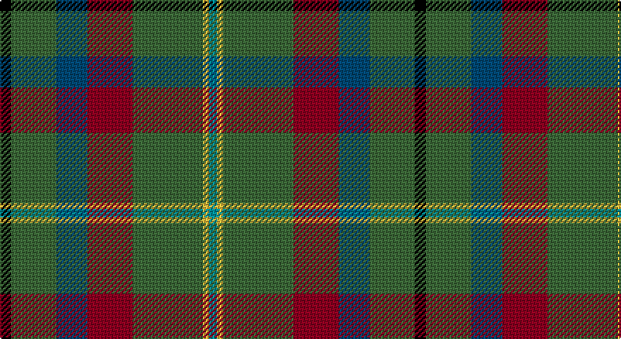

This page is one **sett** — a single exact thread-count. It belongs to the [tartan](/setts/k4g16db11r16g25ly2gi3/)
(the same proportion at any scale), whose colour order is pattern [GYGRBGK](/stripes/gygrbgk/).

Sourced from house-of-tartan.  It is a [7 stripe tartan](/stripes/stripes7/).

Original link http://www.house-of-tartan.scotland.net/house/TartanViewjs.asp?colr=Def&tnam=2270

## Provenance

Earliest known date: 1994 One of a series of Irish District tartans designed by Polly Wittering of the House of Edgar, with colours reminiscent of the Country with soft warm colours dominating.

## Thread count
K/8 G32 DB22 DR32 G50 Y4 B/6

One full sett is **294 threads**.

## Palette

Palette: <strong>Ingles Buchan</strong> <small style="color:#888">(1 of 6 colours)</small>
<table><thead><tr><th>Colour</th><th>Threads</th><th>Shade</th><th>Base</th><th>OKLCh</th></tr></thead><tbody><tr><td>K/</td><td style="text-align:right;font-variant-numeric:tabular-nums">8</td><td><code style="background-color:#000000;">#000000</code> <small style="color:#888">#000000</small></td><td>K <code style="background-color:#000000;">#000000</code></td><td><small style="color:#888">oklch(0.0% 0.000 0.0)</small></td></tr><tr><td>G</td><td style="text-align:right;font-variant-numeric:tabular-nums">32</td><td><code style="background-color:#3C6838;">#3C6838</code> <small style="color:#888">#3C6838</small></td><td>G <code style="background-color:#006100;">#006100</code></td><td><small style="color:#888">oklch(47.2% 0.089 142.2)</small></td></tr><tr><td>DB</td><td style="text-align:right;font-variant-numeric:tabular-nums">22</td><td><code style="background-color:#004874;">#004874</code> <small style="color:#888">#004874</small></td><td>B <code style="background-color:#2A418A;">#2A418A</code></td><td><small style="color:#888">oklch(38.8% 0.097 244.6)</small></td></tr><tr><td>DR</td><td style="text-align:right;font-variant-numeric:tabular-nums">32</td><td><code style="background-color:#8C0020;">#8C0020</code> <small style="color:#888">#8C0020</small></td><td>R <code style="background-color:#CC0000;">#CC0000</code></td><td><small style="color:#888">oklch(40.5% 0.163 20.3)</small></td></tr><tr><td>G</td><td style="text-align:right;font-variant-numeric:tabular-nums">50</td><td><code style="background-color:#3C6838;">#3C6838</code> <small style="color:#888">#3C6838</small></td><td>G <code style="background-color:#006100;">#006100</code></td><td><small style="color:#888">oklch(47.2% 0.089 142.2)</small></td></tr><tr><td>Y</td><td style="text-align:right;font-variant-numeric:tabular-nums">4</td><td><code style="background-color:#F4BC3C;">#F4BC3C</code> <small style="color:#888">#F4BC3C</small></td><td>Y <code style="background-color:#F2BF00;">#F2BF00</code></td><td><small style="color:#888">oklch(82.5% 0.151 83.7)</small></td></tr><tr><td>B/</td><td style="text-align:right;font-variant-numeric:tabular-nums">6</td><td><code style="background-color:#00909C;">#00909C</code> <small style="color:#888">#00909C</small></td><td>G <code style="background-color:#006100;">#006100</code></td><td><small style="color:#888">oklch(59.6% 0.102 205.2)</small></td></tr></tbody></table>

# Sample pattern

## Nearest tartans

The nearest existing variants by ΔTartan distance, with this tartan at the top so the swatches line up against it.

ΔTartan

Tartan

Sett

—

<a href="/ttd/edit/#slug=k4g16db11r16g25ly2gi3~x2">Mayo Irish County Tartan</a> <a class="nn-out" href="/variants/s7/k4g16db11r16g25ly2gi3~x2/" title="open its dictionary page">↗</a>

1.20

<a href="/ttd/edit/#slug=dg12g6r1dg6g4dp8ly2w2~x4&amp;base=k4g16db11r16g25ly2gi3~x2">Connelly, James (Personal)</a> <a class="nn-out" href="/variants/s8/dg12g6r1dg6g4dp8ly2w2~x4/" title="open its dictionary page">↗</a>

1.24

<a href="/ttd/edit/#slug=k4dg16db11r16dg25lo2t3~x2&amp;base=k4g16db11r16g25ly2gi3~x2">Mayo, County (District)</a> <a class="nn-out" href="/variants/s7/k4dg16db11r16dg25lo2t3~x2/" title="open its dictionary page">↗</a>

1.27

<a href="/ttd/edit/#slug=g25r4db25r13g25ly2t6~x2&amp;base=k4g16db11r16g25ly2gi3~x2">Rotary</a> <a class="nn-out" href="/variants/s7/g25r4db25r13g25ly2t6~x2/" title="open its dictionary page">↗</a>

1.31

<a href="/ttd/edit/#slug=w4r13g54dg22k4y20g48r13w4&amp;base=k4g16db11r16g25ly2gi3~x2">Wynberg Boys' High School</a> <a class="nn-out" href="/variants/s9/w4r13g54dg22k4y20g48r13w4/" title="open its dictionary page">↗</a>

1.33

<a href="/ttd/edit/#slug=r3y13db13ly2dg34w3~x2&amp;base=k4g16db11r16g25ly2gi3~x2">Glencross, Tynron (Name)</a> <a class="nn-out" href="/variants/s6/r3y13db13ly2dg34w3~x2/" title="open its dictionary page">↗</a>

1.34

<a href="/ttd/edit/#slug=dy6o2dy12k4dt14k1dy3ly2~x2&amp;base=k4g16db11r16g25ly2gi3~x2">Mica, Green (Fashion)</a> <a class="nn-out" href="/variants/s8/dy6o2dy12k4dt14k1dy3ly2~x2/" title="open its dictionary page">↗</a>

1.39

<a href="/ttd/edit/#slug=g26db3g12k10dp15w2~x2&amp;base=k4g16db11r16g25ly2gi3~x2">Lossiemouth/Hersbruck</a> <a class="nn-out" href="/variants/s6/g26db3g12k10dp15w2~x2/" title="open its dictionary page">↗</a>

1.42

<a href="/ttd/edit/#slug=n8ly2n22dg6r2lb10dg12n3~x2&amp;base=k4g16db11r16g25ly2gi3~x2">Bahamas</a> <a class="nn-out" href="/variants/s8/n8ly2n22dg6r2lb10dg12n3~x2/" title="open its dictionary page">↗</a>

1.44

<a href="/ttd/edit/#slug=g8k2g13r4g12dp22g5ly3~x2&amp;base=k4g16db11r16g25ly2gi3~x2">Taylor Family Tartan</a> <a class="nn-out" href="/variants/s8/g8k2g13r4g12dp22g5ly3~x2/" title="open its dictionary page">↗</a>

1.45

<a href="/ttd/edit/#slug=r3w2y7n25k8y15dg2~x2&amp;base=k4g16db11r16g25ly2gi3~x2">Allman-Jones (Personal)</a> <a class="nn-out" href="/variants/s7/r3w2y7n25k8y15dg2~x2/" title="open its dictionary page">↗</a>

## Neighbour map

Every grey dot is one of 14360 variants placed by the first two principal components of the ΔTartan feature space (44% of its variance). Red is this tartan; blue dots are its nearest — click one to open its page.

<svg viewBox="0 0 640 380" role="img" style="max-width:100%;height:auto;border:1px solid #e0e0e0;border-radius:4px;display:block" xmlns="http://www.w3.org/2000/svg"><image href="/nn/cloud.v1.png" width="640" height="380"/><a href="/variants/s8/dg12g6r1dg6g4dp8ly2w2~x4/"><circle cx="186.6" cy="194.6" r="4" fill="#3465a4"><title>Connelly, James (Personal)</title></circle></a><a href="/variants/s7/k4dg16db11r16dg25lo2t3~x2/"><circle cx="285.1" cy="212.2" r="4" fill="#3465a4"><title>Mayo, County (District)</title></circle></a><a href="/variants/s7/g25r4db25r13g25ly2t6~x2/"><circle cx="242.5" cy="205.5" r="4" fill="#3465a4"><title>Rotary</title></circle></a><a href="/variants/s9/w4r13g54dg22k4y20g48r13w4/"><circle cx="266.8" cy="162.5" r="4" fill="#3465a4"><title>Wynberg Boys' High School</title></circle></a><a href="/variants/s6/r3y13db13ly2dg34w3~x2/"><circle cx="259.2" cy="165.3" r="4" fill="#3465a4"><title>Glencross, Tynron (Name)</title></circle></a><a href="/variants/s8/dy6o2dy12k4dt14k1dy3ly2~x2/"><circle cx="274.4" cy="195.5" r="4" fill="#3465a4"><title>Mica, Green (Fashion)</title></circle></a><a href="/variants/s6/g26db3g12k10dp15w2~x2/"><circle cx="275.1" cy="208.3" r="4" fill="#3465a4"><title>Lossiemouth/Hersbruck</title></circle></a><a href="/variants/s8/n8ly2n22dg6r2lb10dg12n3~x2/"><circle cx="248.8" cy="196.4" r="4" fill="#3465a4"><title>Bahamas</title></circle></a><a href="/variants/s8/g8k2g13r4g12dp22g5ly3~x2/"><circle cx="274.1" cy="194.5" r="4" fill="#3465a4"><title>Taylor Family Tartan</title></circle></a><a href="/variants/s7/r3w2y7n25k8y15dg2~x2/"><circle cx="213.8" cy="174.7" r="4" fill="#3465a4"><title>Allman-Jones (Personal)</title></circle></a><circle cx="257.0" cy="194.1" r="5" fill="#c00000"/></svg>

ID: /variants/s7/k4g16db11r16g25ly2gi3~x2/
