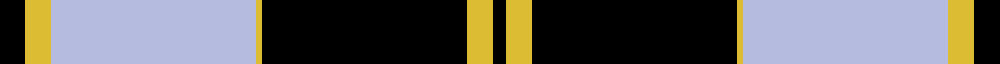

This page is one **sett** — a single exact thread-count. It belongs to the [tartan](/setts/k4ly4lb32ly1k32ly4k2/)
(the same proportion at any scale), whose colour order is pattern [KYKYWYK](/stripes/kykywyk/).

Sourced from register-of-tartans.  It is a [7 stripe tartan](/stripes/stripes7/).

Original link [https://www.tartanregister.gov.uk/tartanDetails.aspx?ref=1411](https://www.tartanregister.gov.uk/tartanDetails.aspx?ref=1411)

2 attestations — the source records this cloth was collapsed from (oldest owns this page)

<ul>
<li>01/01/1984 — Gleneagles Gold (Dalgleish) (register-of-tartans, <a href="https://www.tartanregister.gov.uk/tartanDetails.aspx?ref=1411">record</a>)  <em>Designed and woven by D.C. Dalgliesh Ltd Selkirk for Gleneagles Hotel Perthshire, c1988 a Trade sett. A new design was produced in 1989.</em></li>
<li>1984 — Gleneagles Gold (Corporate) (tartans-authority, <a href="https://www.tartanregister.gov.uk/tartanDetails.aspx?ref=1269">record</a>)  <em>By Dalgleish. STS notes say "A new design was produced in 1989." but does not say which. No further details.</em></li>
</ul>

Dataset <small>— provenance for this record, inherited from the source manifest</small>

<dl class="dataset-prov">
<dt>source</dt><dd><a href="/sources/register-of-tartans/">Scottish Register of Tartans</a></dd>
<dt>data captured from</dt><dd><a href="https://github.com/thetartan/tartan-database/blob/master/data/register-of-tartans/data.csv">https://github.com/thetartan/tartan-database/blob/master/data/register-of-tartans/data.csv</a></dd>
<dt>data date</dt><dd>1984 <small>(this record)</small></dd>
<dt>licence</dt><dd><a href="https://www.tartanregister.gov.uk/copyright">Crown copyright</a></dd>
</dl>

Capture chain <small>— the hands this data passed through, oldest first; each capture carries its own licence</small>

<ol class="capture-chain">
<li><a href="https://www.tartanregister.gov.uk/">Scottish Register of Tartans</a> · <a href="https://www.tartanregister.gov.uk/copyright">Crown copyright</a> <small>the living register — still published by National Records of Scotland</small></li>
<li><a href="https://github.com/thetartan/tartan-database">thetartan/tartan-database</a> <small>2016-2017</small> · <a href="https://creativecommons.org/licenses/by-nc-nd/4.0/">CC BY-NC-ND 4.0</a> <small>Levko Kravets's frozen compilation — the capture we vendored, and where its CC licence text came from</small></li>
<li>this dictionary <small>captured 2026-06-10 · commit 5bf86c7566</small> <small>each re-capture is a git commit to data/sources</small></li>
</ol>

## Register references

External register numbers recorded for this tartan.

- Scottish Register of Tartans: [1411](https://www.tartanregister.gov.uk/tartanDetails.aspx?ref=1411)
- Scottish Tartans Authority (ITI): 1269
- Scottish Tartans World Register: 1269

## Thread count
K/16 LY16 LB128 LY4 K128 LY16 K/8

One full sett is **608 threads**.

## Palette
<table><thead><tr><th>Colour</th><th>Shade</th><th>OKLCh</th></tr></thead><tbody><tr><td>LY</td><td><code style="background-color:#DCBC32;">#DCBC32</code> <small style="color:#888">#DCBC32</small></td><td><small style="color:#888">oklch(80.0% 0.150 95.2)</small></td></tr><tr><td>K</td><td><code style="background-color:#000000;">#000000</code> <small style="color:#888">#000000</small></td><td><small style="color:#888">oklch(0.0% 0.000 0.0)</small></td></tr><tr><td>LB</td><td><code style="background-color:#B5BBDE;">#B5BBDE</code> <small style="color:#888">#B5BBDE</small></td><td><small style="color:#888">oklch(79.9% 0.050 277.6)</small></td></tr></tbody></table>

# Sample pattern

## Nearest tartan variants

The nearest existing variants by ΔTartan distance, with this cloth at the top so the swatches line up against it.

ΔTartan

Threads

Variant

Sett

—

608

<a href="/variants/s7/k4ly4lb32ly1k32ly4k2~x4/">Gleneagles Gold (Dalgleish)</a>

<a href="/ttd/edit/#slug=k4ly18db44k3ly10k4&amp;base=k4ly4lb32ly1k32ly4k2~x4" title="compare in the TTD">1.25</a>

158

<a href="/variants/s6/k4ly18db44k3ly10k4/">Stutterheim (Corporate)</a>

<a href="/ttd/edit/#slug=k4y4w35y1k36y4k2~x2&amp;base=k4ly4lb32ly1k32ly4k2~x4" title="compare in the TTD">1.51</a>

332

<a href="/variants/s7/k4y4w35y1k36y4k2~x2/">Gleneagles, Hotel</a>

<a href="/ttd/edit/#slug=t52k28lr5k3lr2k10~x2&amp;base=k4ly4lb32ly1k32ly4k2~x4" title="compare in the TTD">1.81</a>

276

<a href="/variants/s6/t52k28lr5k3lr2k10~x2/">St. Andrews, Earl of (District)</a>

<a href="/ttd/edit/#slug=r3t14y2k2t14k36y2k2y2~x2&amp;base=k4ly4lb32ly1k32ly4k2~x4" title="compare in the TTD">1.99</a>

298

<a href="/variants/s9/r3t14y2k2t14k36y2k2y2~x2/">Ewbank</a>

<a href="/ttd/edit/#slug=k4o4w35o1k36o4k2~x2&amp;base=k4ly4lb32ly1k32ly4k2~x4" title="compare in the TTD">2.27</a>

332

<a href="/variants/s7/k4o4w35o1k36o4k2~x2/">Gleneagles</a>

<a href="/ttd/edit/#slug=k4y1k20t20k1t4~x4&amp;base=k4ly4lb32ly1k32ly4k2~x4" title="compare in the TTD">2.34</a>

368

<a href="/variants/s6/k4y1k20t20k1t4~x4/">Oakleigh (Corporate)</a>

<a href="/ttd/edit/#slug=dr3k1t27k27w3~x2&amp;base=k4ly4lb32ly1k32ly4k2~x4" title="compare in the TTD">2.51</a>

232

<a href="/variants/s5/dr3k1t27k27w3~x2/">Bro-Spirit of Northmen (Corporate)</a>

<a href="/ttd/edit/#slug=k2n2w4n6w27n15k42n2w2&amp;base=k4ly4lb32ly1k32ly4k2~x4" title="compare in the TTD">2.62</a>

200

<a href="/variants/s9/k2n2w4n6w27n15k42n2w2/">Swansea City AFC</a>

<a href="/ttd/edit/#slug=k4ly2k13ly1y21ly2y4~x2~ly3307090-y2400000&amp;base=k4ly4lb32ly1k32ly4k2~x4" title="compare in the TTD">2.64</a>

172

<a href="/variants/s7/k4ly2k13ly1y21ly2y4~x2~ly3307090-y2400000/">Bannockbane Grey #3</a>

<a href="/ttd/edit/#slug=k4lb2k28t30k1t3~x2&amp;base=k4ly4lb32ly1k32ly4k2~x4" title="compare in the TTD">2.72</a>

258

<a href="/variants/s6/k4lb2k28t30k1t3~x2/">Ramsay Blue Hunting</a>

## Neighbour map

Every grey dot is one of 13621 variants placed by the first two principal components of the ΔTartan feature space (42% of its variance). Red is this tartan; blue dots are its nearest — click one to open its page.

<svg viewBox="0 0 640 380" role="img" style="max-width:100%;height:auto;border:1px solid #e0e0e0;border-radius:4px;display:block" xmlns="http://www.w3.org/2000/svg"><image href="/nn/cloud.v1.png" width="640" height="380"/><a href="/variants/s6/k4ly18db44k3ly10k4/"><circle cx="270.3" cy="167.4" r="4" fill="#3465a4"><title>Stutterheim (Corporate)</title></circle></a><a href="/variants/s7/k4y4w35y1k36y4k2~x2/"><circle cx="274.9" cy="113.2" r="4" fill="#3465a4"><title>Gleneagles, Hotel</title></circle></a><a href="/variants/s6/t52k28lr5k3lr2k10~x2/"><circle cx="305.3" cy="151.3" r="4" fill="#3465a4"><title>St. Andrews, Earl of (District)</title></circle></a><a href="/variants/s9/r3t14y2k2t14k36y2k2y2~x2/"><circle cx="265.9" cy="120.7" r="4" fill="#3465a4"><title>Ewbank</title></circle></a><a href="/variants/s7/k4o4w35o1k36o4k2~x2/"><circle cx="274.9" cy="112.2" r="4" fill="#3465a4"><title>Gleneagles</title></circle></a><a href="/variants/s6/k4y1k20t20k1t4~x4/"><circle cx="299.7" cy="165.8" r="4" fill="#3465a4"><title>Oakleigh (Corporate)</title></circle></a><a href="/variants/s5/dr3k1t27k27w3~x2/"><circle cx="258.9" cy="150.2" r="4" fill="#3465a4"><title>Bro-Spirit of Northmen (Corporate)</title></circle></a><a href="/variants/s9/k2n2w4n6w27n15k42n2w2/"><circle cx="226.6" cy="133.4" r="4" fill="#3465a4"><title>Swansea City AFC</title></circle></a><a href="/variants/s7/k4ly2k13ly1y21ly2y4~x2~ly3307090-y2400000/"><circle cx="288.9" cy="152.1" r="4" fill="#3465a4"><title>Bannockbane Grey #3</title></circle></a><a href="/variants/s6/k4lb2k28t30k1t3~x2/"><circle cx="311.9" cy="145.9" r="4" fill="#3465a4"><title>Ramsay Blue Hunting</title></circle></a><circle cx="270.1" cy="121.1" r="5" fill="#c00000"/><text x="320" y="376" text-anchor="middle" font-size="11" fill="#999">ground</text><text x="11" y="190" text-anchor="middle" font-size="11" fill="#999" transform="rotate(-90 11 190)">complexity</text></svg>

ID: /variants/s7/k4ly4lb32ly1k32ly4k2~x4/
