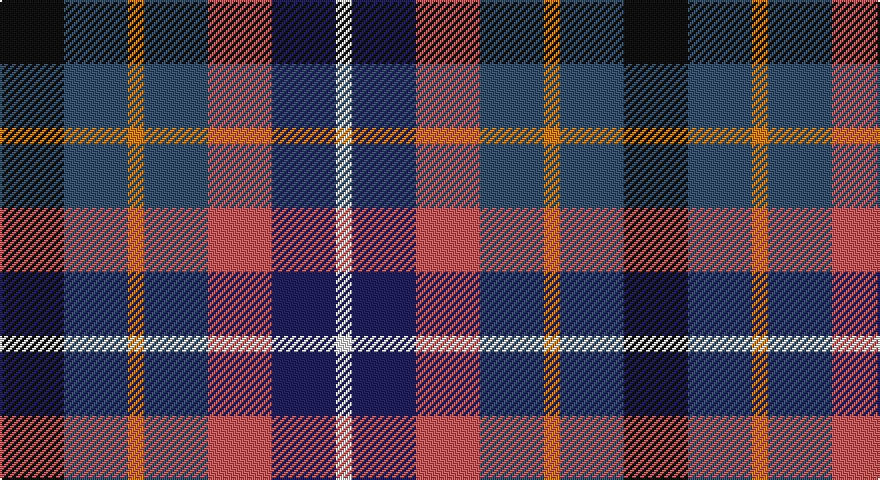

This page is one **sett** — a single exact thread-count. It belongs to the [tartan](/setts/k4n4lo1n4r4db4w1/)
(the same proportion at any scale), whose colour order is pattern [KBYBRBW](/stripes/kbybrbw/).

Sourced from house-of-tartan.  It is a [7 stripe tartan](/stripes/stripes7/).

Original link http://www.house-of-tartan.scotland.net/house/TartanViewjs.asp?colr=Def&tnam=6711

## Provenance

Earliest known date: 1991 The Blackdown Hills on the Devon/Somerset border were designated as an Area of Outstanding Natural Beauty (AONB) in 1991 and this tartan was designed to celebrate that occasion. Designed at Coldharbour Mill at Cullompton in Devon.

## Thread count
K/32 B32 O8 B32 DO32 DB32 W/8

One full sett is **312 threads**.

## Palette

Palette: <strong>Tartan Register</strong> <small style="color:#888">(5 of 8 colours)</small>
<table><thead><tr><th>Colour</th><th>Threads</th><th>Shade</th><th>Base</th><th>OKLCh</th></tr></thead><tbody><tr><td>K/</td><td style="text-align:right;font-variant-numeric:tabular-nums">32</td><td><code style="background-color:#101010;">#101010</code> <small style="color:#888">#101010</small></td><td>K <code style="background-color:#000000;">#000000</code></td><td><small style="color:#888">oklch(17.3% 0.000 89.9)</small></td></tr><tr><td>B</td><td style="text-align:right;font-variant-numeric:tabular-nums">32</td><td><code style="background-color:#34506C;">#34506C</code> <small style="color:#888">#34506C</small></td><td>B <code style="background-color:#2A418A;">#2A418A</code></td><td><small style="color:#888">oklch(42.2% 0.058 249.3)</small></td></tr><tr><td>O</td><td style="text-align:right;font-variant-numeric:tabular-nums">8</td><td><code style="background-color:#D87C00;">#D87C00</code> <small style="color:#888">#D87C00</small></td><td>Y <code style="background-color:#F2BF00;">#F2BF00</code></td><td><small style="color:#888">oklch(67.3% 0.155 61.8)</small></td></tr><tr><td>B</td><td style="text-align:right;font-variant-numeric:tabular-nums">32</td><td><code style="background-color:#34506C;">#34506C</code> <small style="color:#888">#34506C</small></td><td>B <code style="background-color:#2A418A;">#2A418A</code></td><td><small style="color:#888">oklch(42.2% 0.058 249.3)</small></td></tr><tr><td>DO</td><td style="text-align:right;font-variant-numeric:tabular-nums">32</td><td><code style="background-color:#C85858;">#C85858</code> <small style="color:#888">#C85858</small></td><td>R <code style="background-color:#CC0000;">#CC0000</code></td><td><small style="color:#888">oklch(60.2% 0.144 22.4)</small></td></tr><tr><td>DB</td><td style="text-align:right;font-variant-numeric:tabular-nums">32</td><td><code style="background-color:#202060;">#202060</code> <small style="color:#888">#202060</small></td><td>B <code style="background-color:#2A418A;">#2A418A</code></td><td><small style="color:#888">oklch(28.9% 0.111 276.9)</small></td></tr><tr><td>W/</td><td style="text-align:right;font-variant-numeric:tabular-nums">8</td><td><code style="background-color:#F8F8F8;">#F8F8F8</code> <small style="color:#888">#F8F8F8</small></td><td>W <code style="background-color:#F7F7F7;">#F7F7F7</code></td><td><small style="color:#888">oklch(97.9% 0.000 89.9)</small></td></tr></tbody></table>

# Sample pattern

## Nearest tartans

The nearest existing variants by ΔTartan distance, with this tartan at the top so the swatches line up against it.

ΔTartan

Tartan

Sett

—

<a href="/ttd/edit/#slug=k4n4lo1n4r4db4w1~x8">Blackdown Hills Corporate Tartan</a> <a class="nn-out" href="/variants/s7/k4n4lo1n4r4db4w1~x8/" title="open its dictionary page">↗</a>

0.57

<a href="/ttd/edit/#slug=o5db4ly1db4k4dy4w1~x4&amp;base=k4n4lo1n4r4db4w1~x8">Devon Companion</a> <a class="nn-out" href="/variants/s7/o5db4ly1db4k4dy4w1~x4/" title="open its dictionary page">↗</a>

0.59

<a href="/ttd/edit/#slug=o5db4ly1db4k4dr4w1~x4&amp;base=k4n4lo1n4r4db4w1~x8">Devon Companion District Tartan</a> <a class="nn-out" href="/variants/s7/o5db4ly1db4k4dr4w1~x4/" title="open its dictionary page">↗</a>

1.21

<a href="/ttd/edit/#slug=r14w5dt20k10t10dt10~x2&amp;base=k4n4lo1n4r4db4w1~x8">Gandy of Myrton (Name)</a> <a class="nn-out" href="/variants/s6/r14w5dt20k10t10dt10~x2/" title="open its dictionary page">↗</a>

1.26

<a href="/ttd/edit/#slug=db4t8k2t5lb2t5dg8dr7dg2dr7dg3~x2&amp;base=k4n4lo1n4r4db4w1~x8">DunBroch</a> <a class="nn-out" href="/variants/s11/db4t8k2t5lb2t5dg8dr7dg2dr7dg3~x2/" title="open its dictionary page">↗</a>

1.28

<a href="/ttd/edit/#slug=db20k3g18r12t4r12db15ly4~x2&amp;base=k4n4lo1n4r4db4w1~x8">Sustainability (Fashion)</a> <a class="nn-out" href="/variants/s8/db20k3g18r12t4r12db15ly4~x2/" title="open its dictionary page">↗</a>

1.28

<a href="/ttd/edit/#slug=lo2db4k1db4m4lo4db1~x8&amp;base=k4n4lo1n4r4db4w1~x8">Isle of Gigha (District)</a> <a class="nn-out" href="/variants/s7/lo2db4k1db4m4lo4db1~x8/" title="open its dictionary page">↗</a>

1.29

<a href="/ttd/edit/#slug=r9dt6db13dt21y18w4~x2&amp;base=k4n4lo1n4r4db4w1~x8">Fox-Eves Wedding</a> <a class="nn-out" href="/variants/s6/r9dt6db13dt21y18w4~x2/" title="open its dictionary page">↗</a>

1.29

<a href="/ttd/edit/#slug=y5db4ly1db4k4o4w1~x4&amp;base=k4n4lo1n4r4db4w1~x8">Devon, Companion</a> <a class="nn-out" href="/variants/s7/y5db4ly1db4k4o4w1~x4/" title="open its dictionary page">↗</a>

1.37

<a href="/ttd/edit/#slug=b2db3k1db3o3g4r1~x8&amp;base=k4n4lo1n4r4db4w1~x8">New York City</a> <a class="nn-out" href="/variants/s7/b2db3k1db3o3g4r1~x8/" title="open its dictionary page">↗</a>

1.41

<a href="/ttd/edit/#slug=g3dp7t11db3dy8w2db3t3~x2&amp;base=k4n4lo1n4r4db4w1~x8">Scotia Trade Tartan</a> <a class="nn-out" href="/variants/s8/g3dp7t11db3dy8w2db3t3~x2/" title="open its dictionary page">↗</a>

## Neighbour map

Every grey dot is one of 14360 variants placed by the first two principal components of the ΔTartan feature space (44% of its variance). Red is this tartan; blue dots are its nearest — click one to open its page.

<svg viewBox="0 0 640 380" role="img" style="max-width:100%;height:auto;border:1px solid #e0e0e0;border-radius:4px;display:block" xmlns="http://www.w3.org/2000/svg"><image href="/nn/cloud.v1.png" width="640" height="380"/><a href="/variants/s7/o5db4ly1db4k4dy4w1~x4/"><circle cx="52.9" cy="231.6" r="4" fill="#3465a4"><title>Devon Companion</title></circle></a><a href="/variants/s7/o5db4ly1db4k4dr4w1~x4/"><circle cx="55.2" cy="233.3" r="4" fill="#3465a4"><title>Devon Companion District Tartan</title></circle></a><a href="/variants/s6/r14w5dt20k10t10dt10~x2/"><circle cx="103.8" cy="268.6" r="4" fill="#3465a4"><title>Gandy of Myrton (Name)</title></circle></a><a href="/variants/s11/db4t8k2t5lb2t5dg8dr7dg2dr7dg3~x2/"><circle cx="55.5" cy="223.5" r="4" fill="#3465a4"><title>DunBroch</title></circle></a><a href="/variants/s8/db20k3g18r12t4r12db15ly4~x2/"><circle cx="121.1" cy="204.1" r="4" fill="#3465a4"><title>Sustainability (Fashion)</title></circle></a><a href="/variants/s7/lo2db4k1db4m4lo4db1~x8/"><circle cx="115.1" cy="251.2" r="4" fill="#3465a4"><title>Isle of Gigha (District)</title></circle></a><a href="/variants/s6/r9dt6db13dt21y18w4~x2/"><circle cx="123.0" cy="255.8" r="4" fill="#3465a4"><title>Fox-Eves Wedding</title></circle></a><a href="/variants/s7/y5db4ly1db4k4o4w1~x4/"><circle cx="37.8" cy="228.3" r="4" fill="#3465a4"><title>Devon, Companion</title></circle></a><a href="/variants/s7/b2db3k1db3o3g4r1~x8/"><circle cx="76.6" cy="265.1" r="4" fill="#3465a4"><title>New York City</title></circle></a><a href="/variants/s8/g3dp7t11db3dy8w2db3t3~x2/"><circle cx="86.2" cy="212.3" r="4" fill="#3465a4"><title>Scotia Trade Tartan</title></circle></a><circle cx="59.0" cy="246.4" r="5" fill="#c00000"/></svg>

ID: /variants/s7/k4n4lo1n4r4db4w1~x8/
