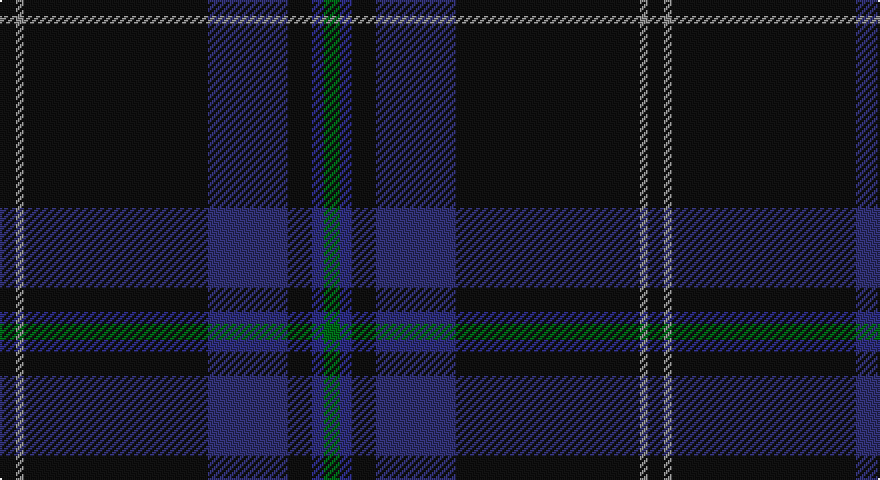

This page is one **sett** — a single exact thread-count. It belongs to the [tartan](/setts/k4o2k46dbi20k6db3g4/)
(the same proportion at any scale), whose colour order is pattern [GBKBKRK](/stripes/gbkbkrk/).

Sourced from tartans-authority.  It is a [7 stripe tartan](/stripes/stripes7/).

Original link http://www.tartansauthority.com/tartan-ferret/display/6686/

## Register references

External register numbers recorded for this tartan.

- Scottish Tartans Authority (ITI): 6686

## Thread count
K/8 N4 K92 DBa40 K12 DB6 G/8

One full sett is **324 threads**.

## Palette

Palette: <strong>Tartan Register</strong> <small style="color:#888">(4 of 5 colours)</small>
<table><thead><tr><th>Colour</th><th>Threads</th><th>Shade</th><th>Base</th><th>OKLCh</th></tr></thead><tbody><tr><td>K/</td><td style="text-align:right;font-variant-numeric:tabular-nums">8</td><td><code style="background-color:#101010;">#101010</code> <small style="color:#888">#101010</small></td><td>K <code style="background-color:#000000;">#000000</code></td><td><small style="color:#888">oklch(17.3% 0.000 89.9)</small></td></tr><tr><td>N</td><td style="text-align:right;font-variant-numeric:tabular-nums">4</td><td><code style="background-color:#888888;">#888888</code> <small style="color:#888">#888888</small></td><td>R <code style="background-color:#CC0000;">#CC0000</code></td><td><small style="color:#888">oklch(62.7% 0.000 89.9)</small></td></tr><tr><td>K</td><td style="text-align:right;font-variant-numeric:tabular-nums">92</td><td><code style="background-color:#101010;">#101010</code> <small style="color:#888">#101010</small></td><td>K <code style="background-color:#000000;">#000000</code></td><td><small style="color:#888">oklch(17.3% 0.000 89.9)</small></td></tr><tr><td>DBa</td><td style="text-align:right;font-variant-numeric:tabular-nums">40</td><td><code style="background-color:#303070;">#303070</code> <small style="color:#888">#303070</small></td><td>B <code style="background-color:#2A418A;">#2A418A</code></td><td><small style="color:#888">oklch(34.7% 0.108 279.2)</small></td></tr><tr><td>K</td><td style="text-align:right;font-variant-numeric:tabular-nums">12</td><td><code style="background-color:#101010;">#101010</code> <small style="color:#888">#101010</small></td><td>K <code style="background-color:#000000;">#000000</code></td><td><small style="color:#888">oklch(17.3% 0.000 89.9)</small></td></tr><tr><td>DB</td><td style="text-align:right;font-variant-numeric:tabular-nums">6</td><td><code style="background-color:#2C2C80;">#2C2C80</code> <small style="color:#888">#2C2C80</small></td><td>B <code style="background-color:#2A418A;">#2A418A</code></td><td><small style="color:#888">oklch(35.0% 0.138 276.6)</small></td></tr><tr><td>G/</td><td style="text-align:right;font-variant-numeric:tabular-nums">8</td><td><code style="background-color:#006818;">#006818</code> <small style="color:#888">#006818</small></td><td>G <code style="background-color:#006100;">#006100</code></td><td><small style="color:#888">oklch(45.0% 0.142 145.0)</small></td></tr></tbody></table>

# Sample pattern

## Nearest tartans

The nearest existing variants by ΔTartan distance, with this tartan at the top so the swatches line up against it.

ΔTartan

Tartan

Sett

—

<a href="/ttd/edit/#slug=k4o2k46dbi20k6db3g4~x2">Silver Thistle (Fashion)</a> <a class="nn-out" href="/variants/s7/k4o2k46dbi20k6db3g4~x2/" title="open its dictionary page">↗</a>

1.01

<a href="/ttd/edit/#slug=dp3dt42k2dg17dt9dp3w2~x2&amp;base=k4o2k46dbi20k6db3g4~x2">Barrance, Paul and Kelly (Personal)</a> <a class="nn-out" href="/variants/s7/dp3dt42k2dg17dt9dp3w2~x2/" title="open its dictionary page">↗</a>

1.11

<a href="/ttd/edit/#slug=db47dg14dp5do2r3dg7~x2&amp;base=k4o2k46dbi20k6db3g4~x2">Round Table (1997)</a> <a class="nn-out" href="/variants/s6/db47dg14dp5do2r3dg7~x2/" title="open its dictionary page">↗</a>

1.14

<a href="/variants/s12/k4o2k46dbi20k6db3g4~x2/">Silver Thistle</a>

1.35

<a href="/ttd/edit/#slug=r4dg10lo1lb1dt4lb1dt25r2~x2&amp;base=k4o2k46dbi20k6db3g4~x2">Raymond of Doune</a> <a class="nn-out" href="/variants/s8/r4dg10lo1lb1dt4lb1dt25r2~x2/" title="open its dictionary page">↗</a>

1.42

<a href="/ttd/edit/#slug=k8r2k13ly2dg48db6~x2&amp;base=k4o2k46dbi20k6db3g4~x2">Green Swamp Youth Campers</a> <a class="nn-out" href="/variants/s6/k8r2k13ly2dg48db6~x2/" title="open its dictionary page">↗</a>

1.42

<a href="/ttd/edit/#slug=dt30lb2k6db3r3~x4&amp;base=k4o2k46dbi20k6db3g4~x2">Edinburgh Crystal</a> <a class="nn-out" href="/variants/s5/dt30lb2k6db3r3~x4/" title="open its dictionary page">↗</a>

1.42

<a href="/ttd/edit/#slug=t6dti3n10db2dti2dt45lr2~x2&amp;base=k4o2k46dbi20k6db3g4~x2">Vonarb, Alfred (Personal)</a> <a class="nn-out" href="/variants/s7/t6dti3n10db2dti2dt45lr2~x2/" title="open its dictionary page">↗</a>

1.56

<a href="/ttd/edit/#slug=k28r1k2r1k8db24dg2db3~x2&amp;base=k4o2k46dbi20k6db3g4~x2">Home or Hume (Vestiarium Scoticum)</a> <a class="nn-out" href="/variants/s8/k28r1k2r1k8db24dg2db3~x2/" title="open its dictionary page">↗</a>

1.63

<a href="/ttd/edit/#slug=lo4dp2db30k3dp8db5dp1r2~x2&amp;base=k4o2k46dbi20k6db3g4~x2">Royal British Legion Scotland (Corp)</a> <a class="nn-out" href="/variants/s8/lo4dp2db30k3dp8db5dp1r2~x2/" title="open its dictionary page">↗</a>

1.65

<a href="/ttd/edit/#slug=dt58o3y16r3lo2y7dt29r3o2~x2&amp;base=k4o2k46dbi20k6db3g4~x2">Aberdeen Mither Kirk (St Nicholas)</a> <a class="nn-out" href="/variants/s9/dt58o3y16r3lo2y7dt29r3o2~x2/" title="open its dictionary page">↗</a>

## Neighbour map

Every grey dot is one of 14360 variants placed by the first two principal components of the ΔTartan feature space (44% of its variance). Red is this tartan; blue dots are its nearest — click one to open its page.

<svg viewBox="0 0 640 380" role="img" style="max-width:100%;height:auto;border:1px solid #e0e0e0;border-radius:4px;display:block" xmlns="http://www.w3.org/2000/svg"><image href="/nn/cloud.v1.png" width="640" height="380"/><a href="/variants/s7/dp3dt42k2dg17dt9dp3w2~x2/"><circle cx="450.4" cy="186.2" r="4" fill="#3465a4"><title>Barrance, Paul and Kelly (Personal)</title></circle></a><a href="/variants/s6/db47dg14dp5do2r3dg7~x2/"><circle cx="442.1" cy="192.3" r="4" fill="#3465a4"><title>Round Table (1997)</title></circle></a><a href="/variants/s12/k4o2k46dbi20k6db3g4~x2/"><circle cx="474.5" cy="172.6" r="4" fill="#3465a4"><title>Silver Thistle</title></circle></a><a href="/variants/s8/r4dg10lo1lb1dt4lb1dt25r2~x2/"><circle cx="416.0" cy="162.6" r="4" fill="#3465a4"><title>Raymond of Doune</title></circle></a><a href="/variants/s6/k8r2k13ly2dg48db6~x2/"><circle cx="438.1" cy="192.8" r="4" fill="#3465a4"><title>Green Swamp Youth Campers</title></circle></a><a href="/variants/s5/dt30lb2k6db3r3~x4/"><circle cx="443.7" cy="200.8" r="4" fill="#3465a4"><title>Edinburgh Crystal</title></circle></a><a href="/variants/s7/t6dti3n10db2dti2dt45lr2~x2/"><circle cx="434.5" cy="154.3" r="4" fill="#3465a4"><title>Vonarb, Alfred (Personal)</title></circle></a><a href="/variants/s8/k28r1k2r1k8db24dg2db3~x2/"><circle cx="424.2" cy="178.3" r="4" fill="#3465a4"><title>Home or Hume (Vestiarium Scoticum)</title></circle></a><a href="/variants/s8/lo4dp2db30k3dp8db5dp1r2~x2/"><circle cx="450.6" cy="154.1" r="4" fill="#3465a4"><title>Royal British Legion Scotland (Corp)</title></circle></a><a href="/variants/s9/dt58o3y16r3lo2y7dt29r3o2~x2/"><circle cx="515.2" cy="165.0" r="4" fill="#3465a4"><title>Aberdeen Mither Kirk (St Nicholas)</title></circle></a><circle cx="474.6" cy="187.6" r="5" fill="#c00000"/></svg>

ID: /variants/s7/k4o2k46dbi20k6db3g4~x2/
