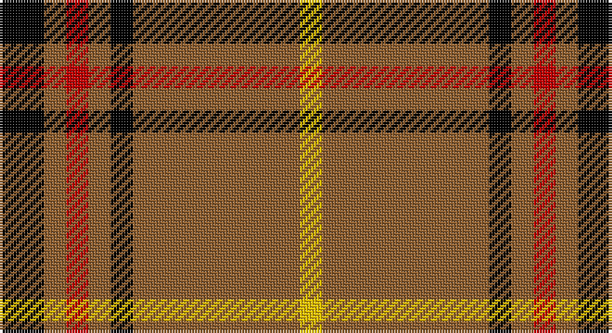

This page is one **sett** — a single exact thread-count. It belongs to the [tartan](/setts/k4o2r2o2k2o15ly2/)
(the same proportion at any scale), whose colour order is pattern [KRRRKRY](/stripes/krrrkry/).

Part of the [Welsh National](/tartans/welsh-national/) tartan — the named design grouping this sett with its other cloths.

Sourced from weddslist.  It is a [7 stripe tartan](/stripes/stripes7/).

Original link http://www.weddslist.com/cgi-bin/tartans/pg.pl?source=sts

## Also known as

This cloth is also recorded under:

- Welsh National #2
- Welsh National #3
- Welsh, National

## Thread count
K/16 LT8 R8 LT8 K8 LT60 Y/8

One full sett is **208 threads**.

## Palette

Palette: <strong>Ingles Buchan</strong> <small style="color:#888">(1 of 4 colours)</small>
<table><thead><tr><th>Colour</th><th>Threads</th><th>Shade</th><th>Base</th><th>OKLCh</th></tr></thead><tbody><tr><td>K/</td><td style="text-align:right;font-variant-numeric:tabular-nums">16</td><td><code style="background-color:#000000;">#000000</code> <small style="color:#888">#000000</small></td><td>K <code style="background-color:#000000;">#000000</code></td><td><small style="color:#888">oklch(0.0% 0.000 0.0)</small></td></tr><tr><td>LT</td><td style="text-align:right;font-variant-numeric:tabular-nums">8</td><td><code style="background-color:#906030;">#906030</code> <small style="color:#888">#906030</small></td><td>R <code style="background-color:#CC0000;">#CC0000</code></td><td><small style="color:#888">oklch(53.1% 0.089 63.7)</small></td></tr><tr><td>R</td><td style="text-align:right;font-variant-numeric:tabular-nums">8</td><td><code style="background-color:#C00000;">#C00000</code> <small style="color:#888">#C00000</small></td><td>R <code style="background-color:#CC0000;">#CC0000</code></td><td><small style="color:#888">oklch(50.7% 0.208 29.2)</small></td></tr><tr><td>LT</td><td style="text-align:right;font-variant-numeric:tabular-nums">8</td><td><code style="background-color:#906030;">#906030</code> <small style="color:#888">#906030</small></td><td>R <code style="background-color:#CC0000;">#CC0000</code></td><td><small style="color:#888">oklch(53.1% 0.089 63.7)</small></td></tr><tr><td>K</td><td style="text-align:right;font-variant-numeric:tabular-nums">8</td><td><code style="background-color:#000000;">#000000</code> <small style="color:#888">#000000</small></td><td>K <code style="background-color:#000000;">#000000</code></td><td><small style="color:#888">oklch(0.0% 0.000 0.0)</small></td></tr><tr><td>LT</td><td style="text-align:right;font-variant-numeric:tabular-nums">60</td><td><code style="background-color:#906030;">#906030</code> <small style="color:#888">#906030</small></td><td>R <code style="background-color:#CC0000;">#CC0000</code></td><td><small style="color:#888">oklch(53.1% 0.089 63.7)</small></td></tr><tr><td>Y/</td><td style="text-align:right;font-variant-numeric:tabular-nums">8</td><td><code style="background-color:#F0C000;">#F0C000</code> <small style="color:#888">#F0C000</small></td><td>Y <code style="background-color:#F2BF00;">#F2BF00</code></td><td><small style="color:#888">oklch(82.7% 0.169 90.5)</small></td></tr></tbody></table>

# Sample pattern

## Compared to the master

This cloth is one sett of its design; the master sett (the exemplar the design is anchored on) is below for comparison.

<figure style="margin:0"><figcaption style="color:#888;font-size:smaller">this sett</figcaption></figure>
<figure style="margin:0"><figcaption style="color:#888;font-size:smaller"><a href="/setts/k4dy2r2dy2k2dy15lo2/">master sett →</a></figcaption></figure>

## Nearest tartans

The nearest existing variants by ΔTartan distance, with this tartan at the top so the swatches line up against it.

ΔTartan

Tartan

Sett

—

<a href="/ttd/edit/#slug=k4o2r2o2k2o15ly2~x4">Welsh, National</a> <a class="nn-out" href="/variants/s7/k4o2r2o2k2o15ly2~x4/" title="open its dictionary page">↗</a>

1.40

<a href="/ttd/edit/#slug=g3lo3k10lo26k3lo3~x2&amp;base=k4o2r2o2k2o15ly2~x4">Volkswagen Orange Trim</a> <a class="nn-out" href="/variants/s6/g3lo3k10lo26k3lo3~x2/" title="open its dictionary page">↗</a>

1.40

<a href="/ttd/edit/#slug=lo26k10lo3g3lo3k3~x6&amp;base=k4o2r2o2k2o15ly2~x4">Volkswagen Orange Trim (Fashion)</a> <a class="nn-out" href="/variants/s6/lo26k10lo3g3lo3k3~x6/" title="open its dictionary page">↗</a>

1.49

<a href="/ttd/edit/#slug=dy38w9dy3k9w3~x2&amp;base=k4o2r2o2k2o15ly2~x4">Loch Tummel</a> <a class="nn-out" href="/variants/s5/dy38w9dy3k9w3~x2/" title="open its dictionary page">↗</a>

1.55

<a href="/ttd/edit/#slug=dg32r12dg6r6k2w3~x2&amp;base=k4o2r2o2k2o15ly2~x4">Princess Margaret Rose</a> <a class="nn-out" href="/variants/s6/dg32r12dg6r6k2w3~x2/" title="open its dictionary page">↗</a>

1.58

<a href="/ttd/edit/#slug=k5lo25k10r3k10lo25w5~x2&amp;base=k4o2r2o2k2o15ly2~x4">Richmond de Ellel (Personal)</a> <a class="nn-out" href="/variants/s7/k5lo25k10r3k10lo25w5~x2/" title="open its dictionary page">↗</a>

1.63

<a href="/ttd/edit/#slug=r6k3w3k3w3k34r6g5r6k5~x2&amp;base=k4o2r2o2k2o15ly2~x4">Woodberry Forest School (Corporate)</a> <a class="nn-out" href="/variants/s10/r6k3w3k3w3k34r6g5r6k5~x2/" title="open its dictionary page">↗</a>

1.63

<a href="/ttd/edit/#slug=dg50r5dg8w10dg8db8dg8lo21~x2&amp;base=k4o2r2o2k2o15ly2~x4">St Patrick's Krewe</a> <a class="nn-out" href="/variants/s8/dg50r5dg8w10dg8db8dg8lo21~x2/" title="open its dictionary page">↗</a>

1.66

<a href="/ttd/edit/#slug=o1k1o11k1o5k1oi3k5w2oi1~x4&amp;base=k4o2r2o2k2o15ly2~x4">Braemar, or Blair Atholl</a> <a class="nn-out" href="/variants/s10/o1k1o11k1o5k1oi3k5w2oi1~x4/" title="open its dictionary page">↗</a>

1.66

<a href="/ttd/edit/#slug=r6g4r24k4r6k4r12g12w3g6&amp;base=k4o2r2o2k2o15ly2~x4">Morrison, Ancient</a> <a class="nn-out" href="/variants/s10/r6g4r24k4r6k4r12g12w3g6/" title="open its dictionary page">↗</a>

1.67

<a href="/ttd/edit/#slug=dg9lb4dg15r17k5r7k5r32dg5&amp;base=k4o2r2o2k2o15ly2~x4">Morrison LC</a> <a class="nn-out" href="/variants/s9/dg9lb4dg15r17k5r7k5r32dg5/" title="open its dictionary page">↗</a>

## Neighbour map

Every grey dot is one of 14360 variants placed by the first two principal components of the ΔTartan feature space (44% of its variance). Red is this tartan; blue dots are its nearest — click one to open its page.

<svg viewBox="0 0 640 380" role="img" style="max-width:100%;height:auto;border:1px solid #e0e0e0;border-radius:4px;display:block" xmlns="http://www.w3.org/2000/svg"><image href="/nn/cloud.v1.png" width="640" height="380"/><a href="/variants/s6/g3lo3k10lo26k3lo3~x2/"><circle cx="385.2" cy="196.1" r="4" fill="#3465a4"><title>Volkswagen Orange Trim</title></circle></a><a href="/variants/s6/lo26k10lo3g3lo3k3~x6/"><circle cx="385.2" cy="196.1" r="4" fill="#3465a4"><title>Volkswagen Orange Trim (Fashion)</title></circle></a><a href="/variants/s5/dy38w9dy3k9w3~x2/"><circle cx="381.5" cy="193.6" r="4" fill="#3465a4"><title>Loch Tummel</title></circle></a><a href="/variants/s6/dg32r12dg6r6k2w3~x2/"><circle cx="372.0" cy="181.4" r="4" fill="#3465a4"><title>Princess Margaret Rose</title></circle></a><a href="/variants/s7/k5lo25k10r3k10lo25w5~x2/"><circle cx="287.4" cy="205.0" r="4" fill="#3465a4"><title>Richmond de Ellel (Personal)</title></circle></a><a href="/variants/s10/r6k3w3k3w3k34r6g5r6k5~x2/"><circle cx="324.7" cy="150.8" r="4" fill="#3465a4"><title>Woodberry Forest School (Corporate)</title></circle></a><a href="/variants/s8/dg50r5dg8w10dg8db8dg8lo21~x2/"><circle cx="293.5" cy="165.6" r="4" fill="#3465a4"><title>St Patrick's Krewe</title></circle></a><a href="/variants/s10/o1k1o11k1o5k1oi3k5w2oi1~x4/"><circle cx="269.5" cy="160.2" r="4" fill="#3465a4"><title>Braemar, or Blair Atholl</title></circle></a><a href="/variants/s10/r6g4r24k4r6k4r12g12w3g6/"><circle cx="286.9" cy="185.9" r="4" fill="#3465a4"><title>Morrison, Ancient</title></circle></a><a href="/variants/s9/dg9lb4dg15r17k5r7k5r32dg5/"><circle cx="280.4" cy="189.6" r="4" fill="#3465a4"><title>Morrison LC</title></circle></a><circle cx="344.2" cy="182.9" r="5" fill="#c00000"/></svg>

ID: /variants/s7/k4o2r2o2k2o15ly2~x4/
