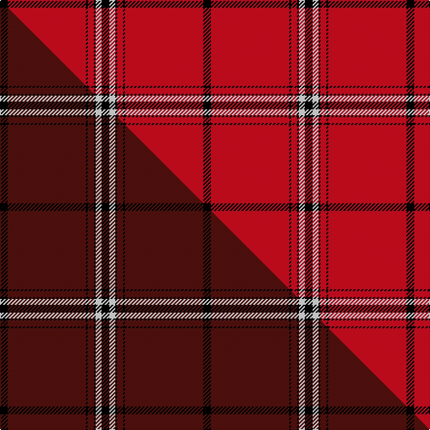

This page is one **sett** — a single exact thread-count. It belongs to the [tartan](/setts/k4r40k1r3k1w3k4/)
(the same proportion at any scale), whose colour order is pattern [KRKRKWK](/stripes/krkrkwk/).

Part of the [Salt Lake County](/tartans/salt-lake-county/) tartan — the named design grouping this sett with its other cloths.

Sourced from tartans-authority.  It is a [7 stripe tartan](/stripes/stripes7/).

Original link http://www.tartansauthority.com/tartan-ferret/display/2394/

## Register references

External register numbers recorded for this tartan.

- Scottish Tartans Authority (ITI): 2394

## Thread count
K/8 R80 K2 R6 K2 W6 K/8

One full sett is **208 threads**.

## Palette
<table><thead><tr><th>Colour</th><th>Shade</th><th>OKLCh</th></tr></thead><tbody><tr><td>R</td><td><code style="background-color:#D60020;">#D60020</code> <small style="color:#888">#D60020</small></td><td><small style="color:#888">oklch(55.2% 0.224 25.5)</small></td></tr><tr><td>K</td><td><code style="background-color:#000000;">#000000</code> <small style="color:#888">#000000</small></td><td><small style="color:#888">oklch(0.0% 0.000 0.0)</small></td></tr><tr><td>W</td><td><code style="background-color:#F7F7F7;">#F7F7F7</code> <small style="color:#888">#F7F7F7</small></td><td><small style="color:#888">oklch(97.6% 0.000 89.9)</small></td></tr></tbody></table>

# Sample pattern

## Compared to the master

This cloth is one sett of its design; the master sett (the exemplar the design is anchored on) is below for comparison.

Its **ΔTartan distance** from the master is **2.55** — the same measure the nearest-tartans table ranks by (0 is identical; a re-scale of the same cloth is near 0, a recolour or a different proportion further).

<figure class="master-compare" style="margin:0">

this sett
master sett ★

<figcaption style="color:#888;font-size:smaller">One weave of this sett against the <a href="/setts/k4dr40k1dr3k1w3k4/">master sett ★</a>, split on the diagonal: a shared proportion runs seamlessly across it with only the shades shifting; a different proportion breaks on it.</figcaption>
</figure>

## Nearest variants

The nearest existing variants by ΔTartan distance, with this cloth at the top so the swatches line up against it.

ΔTartan

Threads

Variant

Sett

—

208

<a href="/variants/s7/k4r40k1r3k1w3k4~x2/">Salt Lake County (District)</a>

<a href="/ttd/edit/#slug=r20k1ly3k1r60k30r48k4~x2&amp;base=k4r40k1r3k1w3k4~x2" title="compare in the TTD">1.91</a>

620

<a href="/variants/s8/r20k1ly3k1r60k30r48k4~x2/">Barkwell (Personal)</a>

<a href="/ttd/edit/#slug=y4k1r30k15r24k2r4k1~x4&amp;base=k4r40k1r3k1w3k4~x2" title="compare in the TTD">1.94</a>

628

<a href="/variants/s8/y4k1r30k15r24k2r4k1~x4/">Oilmens (Corporate)</a>

<a href="/ttd/edit/#slug=r51n2r6k10r2k4n3k3~x2~r2310029&amp;base=k4r40k1r3k1w3k4~x2" title="compare in the TTD">2.00</a>

216

<a href="/variants/s8/r51n2r6k10r2k4n3k3~x2~r2310029/">Virgin</a>

<a href="/ttd/edit/#slug=r51n2r6k10r2k4n3k3~x2&amp;base=k4r40k1r3k1w3k4~x2" title="compare in the TTD">2.00</a>

216

<a href="/variants/s8/r51n2r6k10r2k4n3k3~x2/">Virgin (Corporate)</a>

<a href="/ttd/edit/#slug=k4r4ly2r41k4r4k12w2~x2&amp;base=k4r40k1r3k1w3k4~x2" title="compare in the TTD">2.08</a>

280

<a href="/variants/s8/k4r4ly2r41k4r4k12w2~x2/">Aberdeen F. C. (2002) (Sports)</a>

<a href="/ttd/edit/#slug=k4r4y2r41k4r4k12w2~x2&amp;base=k4r40k1r3k1w3k4~x2" title="compare in the TTD">2.08</a>

280

<a href="/variants/s8/k4r4y2r41k4r4k12w2~x2/">Aberdeen Football Club (2002)</a>

<a href="/ttd/edit/#slug=k22w1k12r43w1~x2&amp;base=k4r40k1r3k1w3k4~x2" title="compare in the TTD">2.13</a>

270

<a href="/variants/s5/k22w1k12r43w1~x2/">Knights Templar Hunting</a>

<a href="/ttd/edit/#slug=k5r40k4w2k4r10w4r5w1~x2&amp;base=k4r40k1r3k1w3k4~x2" title="compare in the TTD">2.20</a>

288

<a href="/variants/s9/k5r40k4w2k4r10w4r5w1~x2/">Southern Illinois University (Corp.)</a>

<a href="/ttd/edit/#slug=r80w7k2w2k2r3k7r2b12k2~x2&amp;base=k4r40k1r3k1w3k4~x2" title="compare in the TTD">2.41</a>

312

<a href="/variants/s10/r80w7k2w2k2r3k7r2b12k2~x2/">Masai Shuka 05 (Artefact)</a>

<a href="/ttd/edit/#slug=k2r1k2r14w1r1w1~x8&amp;base=k4r40k1r3k1w3k4~x2" title="compare in the TTD">2.59</a>

328

<a href="/variants/s7/k2r1k2r14w1r1w1~x8/">White Stripes Dress, (Corporate)</a>

## Neighbour map

Every grey dot is one of 13620 variants placed by the first two principal components of the ΔTartan feature space (42% of its variance). Red is this tartan; blue dots are its nearest — click one to open its page.

<svg viewBox="0 0 640 380" role="img" style="max-width:100%;height:auto;border:1px solid #e0e0e0;border-radius:4px;display:block" xmlns="http://www.w3.org/2000/svg"><image href="/nn/cloud.v1.png" width="640" height="380"/><a href="/variants/s8/r20k1ly3k1r60k30r48k4~x2/"><circle cx="479.8" cy="96.0" r="4" fill="#3465a4"><title>Barkwell (Personal)</title></circle></a><a href="/variants/s8/y4k1r30k15r24k2r4k1~x4/"><circle cx="426.6" cy="114.9" r="4" fill="#3465a4"><title>Oilmens (Corporate)</title></circle></a><a href="/variants/s8/r51n2r6k10r2k4n3k3~x2~r2310029/"><circle cx="448.2" cy="92.5" r="4" fill="#3465a4"><title>Virgin</title></circle></a><a href="/variants/s8/r51n2r6k10r2k4n3k3~x2/"><circle cx="453.5" cy="94.6" r="4" fill="#3465a4"><title>Virgin (Corporate)</title></circle></a><a href="/variants/s8/k4r4ly2r41k4r4k12w2~x2/"><circle cx="373.0" cy="96.0" r="4" fill="#3465a4"><title>Aberdeen F. C. (2002) (Sports)</title></circle></a><a href="/variants/s8/k4r4y2r41k4r4k12w2~x2/"><circle cx="374.9" cy="96.5" r="4" fill="#3465a4"><title>Aberdeen Football Club (2002)</title></circle></a><a href="/variants/s5/k22w1k12r43w1~x2/"><circle cx="382.6" cy="108.3" r="4" fill="#3465a4"><title>Knights Templar Hunting</title></circle></a><a href="/variants/s9/k5r40k4w2k4r10w4r5w1~x2/"><circle cx="447.8" cy="79.1" r="4" fill="#3465a4"><title>Southern Illinois University (Corp.)</title></circle></a><a href="/variants/s10/r80w7k2w2k2r3k7r2b12k2~x2/"><circle cx="438.3" cy="42.9" r="4" fill="#3465a4"><title>Masai Shuka 05 (Artefact)</title></circle></a><a href="/variants/s7/k2r1k2r14w1r1w1~x8/"><circle cx="418.1" cy="124.7" r="4" fill="#3465a4"><title>White Stripes Dress, (Corporate)</title></circle></a><circle cx="492.8" cy="74.2" r="5" fill="#c00000"/><text x="320" y="376" text-anchor="middle" font-size="11" fill="#999">ground</text><text x="11" y="190" text-anchor="middle" font-size="11" fill="#999" transform="rotate(-90 11 190)">complexity</text></svg>

ID: /variants/s7/k4r40k1r3k1w3k4~x2/
