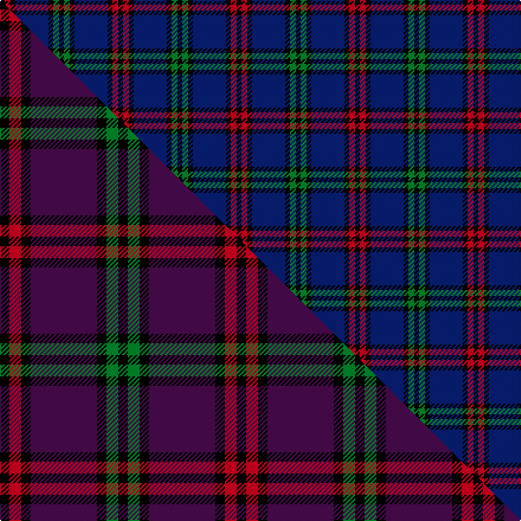

This is one **variant** — a specific cloth: this exact thread count and colourway, with its own
provenance below. It is one weaving of the [sett](/setts/k4r5k4db28k4g5k4/) (the scale-free proportion — the
same cloth at any scale or shade), whose colour order is pattern [KGKBKRK](/stripes/kgkbkrk/).

Part of the [Montgomery](/tartans/montgomery/) tartan — the named design grouping this sett with its other cloths.

Sourced from weddslist.  It is a [7 stripe tartan](/stripes/stripes7/).

Original link [http://www.weddslist.com/cgi-bin/tartans/pg.pl?source=rb](http://www.weddslist.com/cgi-bin/tartans/pg.pl?source=rb)

Dataset <small>— provenance for this record, inherited from the source manifest</small>

<dl class="dataset-prov">
<dt>source</dt><dd><a href="/sources/weddslist/">Weddslist</a></dd>
<dt>data captured from</dt><dd><a href="https://github.com/thetartan/tartan-database/blob/master/data/weddslist/data.csv">https://github.com/thetartan/tartan-database/blob/master/data/weddslist/data.csv</a></dd>
<dt>data date</dt><dd>2016-11-17 <small>(dataset default)</small></dd>
<dt>licence</dt><dd><a href="https://creativecommons.org/licenses/by-nc-nd/4.0/">CC BY-NC-ND 4.0</a></dd>
</dl>

Capture chain <small>— the hands this data passed through, oldest first; each capture carries its own licence</small>

<ol class="capture-chain">
<li><a href="https://www.weddslist.com/tartans/">Weddslist</a> <small>the living privately compiled reference</small></li>
<li><a href="https://github.com/thetartan/tartan-database">thetartan/tartan-database</a> <small>2016-2017</small> · <a href="https://creativecommons.org/licenses/by-nc-nd/4.0/">CC BY-NC-ND 4.0</a> <small>Levko Kravets's frozen compilation — the capture we vendored, and where its CC licence text came from</small></li>
<li>this dictionary <small>captured 2026-06-10 · commit 5bf86c7566</small> <small>each re-capture is a git commit to data/sources</small></li>
</ol>

## Thread count
K/4 R5 K4 DB28 K4 G5 K/4

One full sett is **100 threads**.

## Palette
<table><thead><tr><th>Colour</th><th>Shade</th><th>OKLCh</th></tr></thead><tbody><tr><td>G</td><td><code style="background-color:#008B2A;">#008B2A</code> <small style="color:#888">#008B2A</small></td><td><small style="color:#888">oklch(55.4% 0.170 145.9)</small></td></tr><tr><td>K</td><td><code style="background-color:#000000;">#000000</code> <small style="color:#888">#000000</small></td><td><small style="color:#888">oklch(0.0% 0.000 0.0)</small></td></tr><tr><td>DB</td><td><code style="background-color:#082077;">#082077</code> <small style="color:#888">#082077</small></td><td><small style="color:#888">oklch(30.0% 0.149 265.1)</small></td></tr><tr><td>R</td><td><code style="background-color:#D60020;">#D60020</code> <small style="color:#888">#D60020</small></td><td><small style="color:#888">oklch(55.2% 0.224 25.5)</small></td></tr></tbody></table>

# Sample pattern

## Compared to the master

This cloth is one sett of its design; the master sett (the exemplar the design is anchored on) is below for comparison.

Its **ΔTartan distance** from the master is **1.40** — the same measure the nearest-tartans table ranks by (0 is identical; a re-scale of the same cloth is near 0, a recolour or a different proportion further).

<figure class="master-compare" style="margin:0">

this sett
master sett ★

<figcaption style="color:#888;font-size:smaller">One weave of this sett against the <a href="/setts/k4r5k4dp28k4g5k4/">master sett ★</a>, split on the diagonal: a shared proportion runs seamlessly across it with only the shades shifting; a different proportion breaks on it.</figcaption>
</figure>

## Nearest tartan variants

The nearest existing variants by ΔTartan distance, with this cloth at the top so the swatches line up against it.

ΔTartan

Threads

Variant

Sett

—

100

<a href="/variants/s7/k4r5k4db28k4g5k4/">Montgomery</a>

<a href="/ttd/edit/#slug=k4r5k4db28k4g5k4~x2&amp;base=k4r5k4db28k4g5k4" title="compare in the TTD">0.00</a>

200

<a href="/variants/s7/k4r5k4db28k4g5k4~x2/">Montgomerie of Eglinton Family Tartan</a>

<a href="/ttd/edit/#slug=k1r1k1db7k1g1k1~x8&amp;base=k4r5k4db28k4g5k4" title="compare in the TTD">0.05</a>

192

<a href="/variants/s7/k1r1k1db7k1g1k1~x8/">Eglinton</a>

<a href="/ttd/edit/#slug=k1g8k9r1k1r1k9db8r1~x6&amp;base=k4r5k4db28k4g5k4" title="compare in the TTD">1.39</a>

456

<a href="/variants/s9/k1g8k9r1k1r1k9db8r1~x6/">Guthrie Family Tartan</a>

<a href="/ttd/edit/#slug=k4r5k4dp28k4g5k4~x2&amp;base=k4r5k4db28k4g5k4" title="compare in the TTD">1.40</a>

200

<a href="/variants/s7/k4r5k4dp28k4g5k4~x2/">Montgomrie/Montgomery of Eglinton</a>

<a href="/ttd/edit/#slug=k6y2k16lb6k3db18k2~x2&amp;base=k4r5k4db28k4g5k4" title="compare in the TTD">1.79</a>

196

<a href="/variants/s7/k6y2k16lb6k3db18k2~x2/">Carrick High School</a>

<a href="/ttd/edit/#slug=k3db30k8w8k2r3~x2&amp;base=k4r5k4db28k4g5k4" title="compare in the TTD">1.94</a>

204

<a href="/variants/s6/k3db30k8w8k2r3~x2/">Hydro-Electric</a>

<a href="/ttd/edit/#slug=r1k1db10k1dp4k9y1~x4&amp;base=k4r5k4db28k4g5k4" title="compare in the TTD">2.12</a>

208

<a href="/variants/s7/r1k1db10k1dp4k9y1~x4/">Graeme High School Homecoming 2009</a>

<a href="/ttd/edit/#slug=k3dg11k3b11k18o3~x2&amp;base=k4r5k4db28k4g5k4" title="compare in the TTD">2.14</a>

184

<a href="/variants/s6/k3dg11k3b11k18o3~x2/">The Harbour Town, Hilton Head</a>

<a href="/ttd/edit/#slug=k42w5k5dg16k5db21~x2&amp;base=k4r5k4db28k4g5k4" title="compare in the TTD">2.25</a>

250

<a href="/variants/s6/k42w5k5dg16k5db21~x2/">Givens (Arizona)</a>

<a href="/ttd/edit/#slug=db4y2db17k2r4k2db3k11db3~x2&amp;base=k4r5k4db28k4g5k4" title="compare in the TTD">2.26</a>

178

<a href="/variants/s9/db4y2db17k2r4k2db3k11db3~x2/">Stone of Destiny</a>

## Neighbour map

Every grey dot is one of 13621 variants placed by the first two principal components of the ΔTartan feature space (42% of its variance). Red is this tartan; blue dots are its nearest — click one to open its page.

<svg viewBox="0 0 640 380" role="img" style="max-width:100%;height:auto;border:1px solid #e0e0e0;border-radius:4px;display:block" xmlns="http://www.w3.org/2000/svg"><image href="/nn/cloud.v1.png" width="640" height="380"/><a href="/variants/s7/k4r5k4db28k4g5k4~x2/"><circle cx="243.5" cy="179.5" r="4" fill="#3465a4"><title>Montgomerie of Eglinton Family Tartan</title></circle></a><a href="/variants/s7/k1r1k1db7k1g1k1~x8/"><circle cx="264.4" cy="176.7" r="4" fill="#3465a4"><title>Eglinton</title></circle></a><a href="/variants/s9/k1g8k9r1k1r1k9db8r1~x6/"><circle cx="207.2" cy="173.2" r="4" fill="#3465a4"><title>Guthrie Family Tartan</title></circle></a><a href="/variants/s7/k4r5k4dp28k4g5k4~x2/"><circle cx="254.1" cy="175.5" r="4" fill="#3465a4"><title>Montgomrie/Montgomery of Eglinton</title></circle></a><a href="/variants/s7/k6y2k16lb6k3db18k2~x2/"><circle cx="219.4" cy="184.5" r="4" fill="#3465a4"><title>Carrick High School</title></circle></a><a href="/variants/s6/k3db30k8w8k2r3~x2/"><circle cx="259.9" cy="149.0" r="4" fill="#3465a4"><title>Hydro-Electric</title></circle></a><a href="/variants/s7/r1k1db10k1dp4k9y1~x4/"><circle cx="212.3" cy="172.0" r="4" fill="#3465a4"><title>Graeme High School Homecoming 2009</title></circle></a><a href="/variants/s6/k3dg11k3b11k18o3~x2/"><circle cx="190.1" cy="222.5" r="4" fill="#3465a4"><title>The Harbour Town, Hilton Head</title></circle></a><a href="/variants/s6/k42w5k5dg16k5db21~x2/"><circle cx="252.0" cy="197.3" r="4" fill="#3465a4"><title>Givens (Arizona)</title></circle></a><a href="/variants/s9/db4y2db17k2r4k2db3k11db3~x2/"><circle cx="278.7" cy="177.1" r="4" fill="#3465a4"><title>Stone of Destiny</title></circle></a><circle cx="243.5" cy="179.5" r="5" fill="#c00000"/><text x="320" y="376" text-anchor="middle" font-size="11" fill="#999">ground</text><text x="11" y="190" text-anchor="middle" font-size="11" fill="#999" transform="rotate(-90 11 190)">complexity</text></svg>

ID: /variants/s7/k4r5k4db28k4g5k4/
