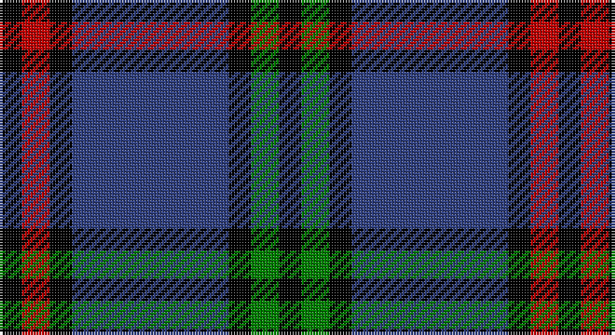

This page is one **sett** — a single exact thread-count. It belongs to the [tartan](/setts/k4r5k4db28k4g5k4/)
(the same proportion at any scale), whose colour order is pattern [KGKBKRK](/stripes/kgkbkrk/).

Part of the [Montgomery](/tartans/montgomery/) tartan — the named design grouping this sett with its other cloths.

Sourced from weddslist.  It is a [7 stripe tartan](/stripes/stripes7/).

Original link http://www.weddslist.com/cgi-bin/tartans/pg.pl?source=sts

## Provenance

Earliest known date: 1893 D W Stewart, author of Old and Rare Scottish Tartans (1893), was of the opinion that this sett could be traced back to 1707 when it was adopted by the Montgomeries Earls of Eglinton. See Eglinton District.

## Also known as

This cloth is also recorded under:

- Montgomerie of Eglinton
- Montgomrie/Montgomery of Eglinton

2 attestations — the source records this cloth was collapsed from (oldest owns this page)

<ul>
<li>undated — Montgomerie of Eglinton (weddslist, <a href="http://www.weddslist.com/cgi-bin/tartans/pg.pl?source=sts">record</a>)</li>
<li>undated — Montgomerie of Eglinton Family Tartan (house-of-tartan, <a href="http://www.house-of-tartan.scotland.net/house/TartanViewjs.asp?colr=Def&tnam=1082">record</a>)</li>
</ul>

## Thread count
K/8 R10 K8 B56 K8 G10 K/8

One full sett is **200 threads**.

## Palette

Palette: <strong>Ingles Buchan</strong> <small style="color:#888">(1 of 4 colours)</small>
<table><thead><tr><th>Colour</th><th>Threads</th><th>Shade</th><th>Base</th><th>OKLCh</th></tr></thead><tbody><tr><td>K/</td><td style="text-align:right;font-variant-numeric:tabular-nums">8</td><td><code style="background-color:#000000;">#000000</code> <small style="color:#888">#000000</small></td><td>K <code style="background-color:#000000;">#000000</code></td><td><small style="color:#888">oklch(0.0% 0.000 0.0)</small></td></tr><tr><td>R</td><td style="text-align:right;font-variant-numeric:tabular-nums">10</td><td><code style="background-color:#C00000;">#C00000</code> <small style="color:#888">#C00000</small></td><td>R <code style="background-color:#CC0000;">#CC0000</code></td><td><small style="color:#888">oklch(50.7% 0.208 29.2)</small></td></tr><tr><td>K</td><td style="text-align:right;font-variant-numeric:tabular-nums">8</td><td><code style="background-color:#000000;">#000000</code> <small style="color:#888">#000000</small></td><td>K <code style="background-color:#000000;">#000000</code></td><td><small style="color:#888">oklch(0.0% 0.000 0.0)</small></td></tr><tr><td>B</td><td style="text-align:right;font-variant-numeric:tabular-nums">56</td><td><code style="background-color:#304080;">#304080</code> <small style="color:#888">#304080</small></td><td>B <code style="background-color:#2A418A;">#2A418A</code></td><td><small style="color:#888">oklch(39.4% 0.109 270.2)</small></td></tr><tr><td>K</td><td style="text-align:right;font-variant-numeric:tabular-nums">8</td><td><code style="background-color:#000000;">#000000</code> <small style="color:#888">#000000</small></td><td>K <code style="background-color:#000000;">#000000</code></td><td><small style="color:#888">oklch(0.0% 0.000 0.0)</small></td></tr><tr><td>G</td><td style="text-align:right;font-variant-numeric:tabular-nums">10</td><td><code style="background-color:#008000;">#008000</code> <small style="color:#888">#008000</small></td><td>G <code style="background-color:#006100;">#006100</code></td><td><small style="color:#888">oklch(52.0% 0.177 142.5)</small></td></tr><tr><td>K/</td><td style="text-align:right;font-variant-numeric:tabular-nums">8</td><td><code style="background-color:#000000;">#000000</code> <small style="color:#888">#000000</small></td><td>K <code style="background-color:#000000;">#000000</code></td><td><small style="color:#888">oklch(0.0% 0.000 0.0)</small></td></tr></tbody></table>

# Sample pattern

## Compared to the master

This cloth is one sett of its design; the master sett (the exemplar the design is anchored on) is below for comparison.

<figure style="margin:0"><figcaption style="color:#888;font-size:smaller">this sett</figcaption></figure>
<figure style="margin:0"><figcaption style="color:#888;font-size:smaller"><a href="/setts/g6db2g1/">master sett →</a></figcaption></figure>

## Nearest tartans

The nearest existing variants by ΔTartan distance, with this tartan at the top so the swatches line up against it.

ΔTartan

Tartan

Sett

—

<a href="/ttd/edit/#slug=k4r5k4db28k4g5k4~x2">Montgomerie of Eglinton</a> <a class="nn-out" href="/variants/s7/k4r5k4db28k4g5k4~x2/" title="open its dictionary page">↗</a>

0.81

<a href="/ttd/edit/#slug=k3dg3k3b16k3r3k3~x2&amp;base=k4r5k4db28k4g5k4~x2">Eglinton</a> <a class="nn-out" href="/variants/s7/k3dg3k3b16k3r3k3~x2/" title="open its dictionary page">↗</a>

0.81

<a href="/ttd/edit/#slug=k3dg3k3b16k3r3k3&amp;base=k4r5k4db28k4g5k4~x2">Eglinton</a> <a class="nn-out" href="/variants/s7/k3dg3k3b16k3r3k3/" title="open its dictionary page">↗</a>

1.00

<a href="/ttd/edit/#slug=k4dg5k4dp28k4r5k4&amp;base=k4r5k4db28k4g5k4~x2">Montgomery</a> <a class="nn-out" href="/variants/s7/k4dg5k4dp28k4r5k4/" title="open its dictionary page">↗</a>

1.17

<a href="/ttd/edit/#slug=k3g3k20r2k2r2db20g3db3~x2&amp;base=k4r5k4db28k4g5k4~x2">Hume, or Home</a> <a class="nn-out" href="/variants/s9/k3g3k20r2k2r2db20g3db3~x2/" title="open its dictionary page">↗</a>

1.20

<a href="/ttd/edit/#slug=k3r3k3t16k3g3k3~x2&amp;base=k4r5k4db28k4g5k4~x2">Eglinton</a> <a class="nn-out" href="/variants/s7/k3r3k3t16k3g3k3~x2/" title="open its dictionary page">↗</a>

1.22

<a href="/ttd/edit/#slug=k3db2ly3k2ly5db18g3k3g2db3~x2&amp;base=k4r5k4db28k4g5k4~x2">St Andrews University Corporate Tartan</a> <a class="nn-out" href="/variants/s10/k3db2ly3k2ly5db18g3k3g2db3~x2/" title="open its dictionary page">↗</a>

1.23

<a href="/ttd/edit/#slug=k4dg5k4n28k4r5k4~x2&amp;base=k4r5k4db28k4g5k4~x2">Montgomery</a> <a class="nn-out" href="/variants/s7/k4dg5k4n28k4r5k4~x2/" title="open its dictionary page">↗</a>

1.23

<a href="/ttd/edit/#slug=k4dg5k4n28k4r5k4&amp;base=k4r5k4db28k4g5k4~x2">Montgomery</a> <a class="nn-out" href="/variants/s7/k4dg5k4n28k4r5k4/" title="open its dictionary page">↗</a>

1.24

<a href="/ttd/edit/#slug=k5w5k5t11k3y17k30t3~x2&amp;base=k4r5k4db28k4g5k4~x2">Australian Police</a> <a class="nn-out" href="/variants/s8/k5w5k5t11k3y17k30t3~x2/" title="open its dictionary page">↗</a>

1.27

<a href="/ttd/edit/#slug=k15lb3k3w4k3lb3k15db4k4db30k4~x2&amp;base=k4r5k4db28k4g5k4~x2">Shalom (Fashion)</a> <a class="nn-out" href="/variants/s11/k15lb3k3w4k3lb3k15db4k4db30k4~x2/" title="open its dictionary page">↗</a>

## Neighbour map

Every grey dot is one of 14360 variants placed by the first two principal components of the ΔTartan feature space (44% of its variance). Red is this tartan; blue dots are its nearest — click one to open its page.

<svg viewBox="0 0 640 380" role="img" style="max-width:100%;height:auto;border:1px solid #e0e0e0;border-radius:4px;display:block" xmlns="http://www.w3.org/2000/svg"><image href="/nn/cloud.v1.png" width="640" height="380"/><a href="/variants/s7/k3dg3k3b16k3r3k3~x2/"><circle cx="212.0" cy="216.3" r="4" fill="#3465a4"><title>Eglinton</title></circle></a><a href="/variants/s7/k3dg3k3b16k3r3k3/"><circle cx="212.0" cy="216.3" r="4" fill="#3465a4"><title>Eglinton</title></circle></a><a href="/variants/s7/k4dg5k4dp28k4r5k4/"><circle cx="268.2" cy="198.3" r="4" fill="#3465a4"><title>Montgomery</title></circle></a><a href="/variants/s9/k3g3k20r2k2r2db20g3db3~x2/"><circle cx="238.2" cy="177.8" r="4" fill="#3465a4"><title>Hume, or Home</title></circle></a><a href="/variants/s7/k3r3k3t16k3g3k3~x2/"><circle cx="200.6" cy="209.4" r="4" fill="#3465a4"><title>Eglinton</title></circle></a><a href="/variants/s10/k3db2ly3k2ly5db18g3k3g2db3~x2/"><circle cx="246.3" cy="173.5" r="4" fill="#3465a4"><title>St Andrews University Corporate Tartan</title></circle></a><a href="/variants/s7/k4dg5k4n28k4r5k4~x2/"><circle cx="272.7" cy="199.8" r="4" fill="#3465a4"><title>Montgomery</title></circle></a><a href="/variants/s7/k4dg5k4n28k4r5k4/"><circle cx="272.7" cy="199.8" r="4" fill="#3465a4"><title>Montgomery</title></circle></a><a href="/variants/s8/k5w5k5t11k3y17k30t3~x2/"><circle cx="257.4" cy="189.8" r="4" fill="#3465a4"><title>Australian Police</title></circle></a><a href="/variants/s11/k15lb3k3w4k3lb3k15db4k4db30k4~x2/"><circle cx="279.8" cy="181.0" r="4" fill="#3465a4"><title>Shalom (Fashion)</title></circle></a><circle cx="263.5" cy="203.1" r="5" fill="#c00000"/></svg>

ID: /variants/s7/k4r5k4db28k4g5k4~x2/
