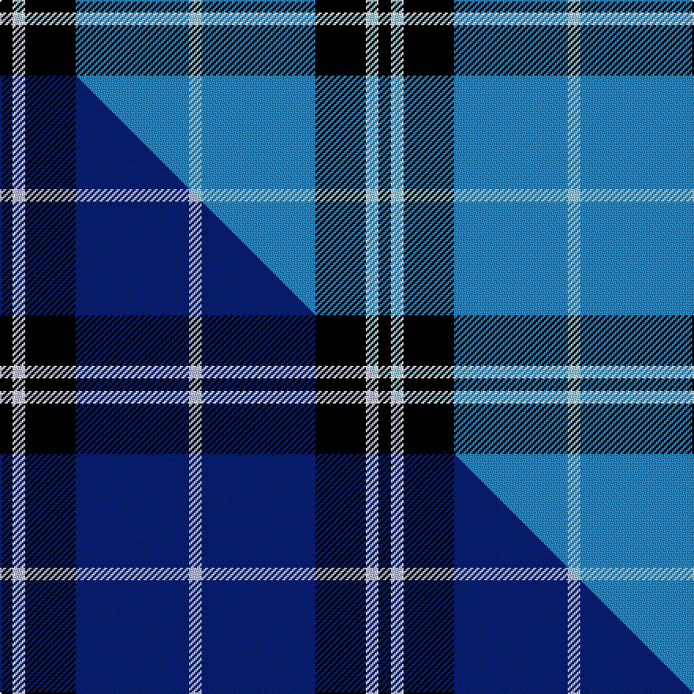

This is one **variant** — a specific cloth: this exact thread count and colourway, with its own
provenance below. It is one weaving of the [sett](/setts/k4w1lb2w1k16t36lb4/) (the scale-free proportion — the
same cloth at any scale or shade), whose colour order is pattern [KWWWKBW](/stripes/kwwwkbw/).

Part of the [NHS Grampian](/tartans/n/nh/nhs-grampian/) tartan — the named design grouping this sett with its other cloths.

Sourced from tartans-authority.  It is a [7 stripe tartan](/stripes/stripes7/).

Original link [https://www.tartanregister.gov.uk/tartanDetails.aspx?ref=6219](https://www.tartanregister.gov.uk/tartanDetails.aspx?ref=6219)

Dataset <small>— provenance for this record, inherited from the source manifest</small>

<dl class="dataset-prov">
<dt>source</dt><dd><a href="/sources/tartans-authority/">Scottish Tartans Authority</a></dd>
<dt>data captured from</dt><dd><a href="https://github.com/thetartan/tartan-database/blob/master/data/tartans-authority/data.csv">https://github.com/thetartan/tartan-database/blob/master/data/tartans-authority/data.csv</a></dd>
<dt>data date</dt><dd>July 2002 <small>(this record)</small></dd>
<dt>licence</dt><dd><a href="https://creativecommons.org/licenses/by-nc-nd/4.0/">CC BY-NC-ND 4.0</a></dd>
</dl>

Capture chain <small>— the hands this data passed through, oldest first; each capture carries its own licence</small>

<ol class="capture-chain">
<li><a href="https://www.tartansauthority.com/">Scottish Tartans Authority</a> <small>the heritage body's archive — its tartan-ferret record browser is retired (links repaired to the SRT, above)</small></li>
<li><a href="https://github.com/thetartan/tartan-database">thetartan/tartan-database</a> <small>2016-2017</small> · <a href="https://creativecommons.org/licenses/by-nc-nd/4.0/">CC BY-NC-ND 4.0</a> <small>Levko Kravets's frozen compilation — the capture we vendored, and where its CC licence text came from</small></li>
<li>this dictionary <small>captured 2026-06-10 · commit 5bf86c7566</small> <small>each re-capture is a git commit to data/sources</small></li>
</ol>

## Register references

External register numbers recorded for this tartan.

- Scottish Tartans Authority (ITI): 6219

## Thread count
K/8 W2 LB4 W2 K32 T72 LB/8

One full sett is **240 threads**.

## Palette
<table><thead><tr><th>Colour</th><th>Shade</th><th>OKLCh</th></tr></thead><tbody><tr><td>T</td><td><code style="background-color:#2888C4;">#2888C4</code> <small style="color:#888">#2888C4</small></td><td><small style="color:#888">oklch(60.1% 0.125 241.5)</small></td></tr><tr><td>K</td><td><code style="background-color:#000000;">#000000</code> <small style="color:#888">#000000</small></td><td><small style="color:#888">oklch(0.0% 0.000 0.0)</small></td></tr><tr><td>LB</td><td><code style="background-color:#98C8E8;">#98C8E8</code> <small style="color:#888">#98C8E8</small></td><td><small style="color:#888">oklch(81.0% 0.068 237.9)</small></td></tr><tr><td>W</td><td><code style="background-color:#F7F7F7;">#F7F7F7</code> <small style="color:#888">#F7F7F7</small></td><td><small style="color:#888">oklch(97.6% 0.000 89.9)</small></td></tr></tbody></table>

# Sample pattern

## Compared to the master

This cloth is one sett of its design; the master sett (the exemplar the design is anchored on) is below for comparison.

Its **ΔTartan distance** from the master is **0.21** — the same measure the nearest-tartans table ranks by (0 is identical; a re-scale of the same cloth is near 0, a recolour or a different proportion further).

<figure class="master-compare" style="margin:0">

this sett
master sett ★

<figcaption style="color:#888;font-size:smaller">One weave of this sett against the <a href="/setts/k4w1lb2w1k16db36lb4/">master sett ★</a>, split on the diagonal: a shared proportion runs seamlessly across it with only the shades shifting; a different proportion breaks on it.</figcaption>
</figure>

## Nearest tartan variants

The nearest existing variants by ΔTartan distance, with this cloth at the top so the swatches line up against it.

ΔTartan

Threads

Variant

Sett

—

240

<a href="/variants/s7/k4w1lb2w1k16t36lb4~x2~lb3203246-t2405244/">NHS Grampian (Corporate)</a>

<a href="/ttd/edit/#slug=k4w1lb2w1k16db36lb4~x2&amp;base=k4w1lb2w1k16t36lb4~x2~lb3203246-t2405244" title="compare in the TTD">0.21</a>

240

<a href="/variants/s7/k4w1lb2w1k16db36lb4~x2/">NHS Grampian</a>

<a href="/ttd/edit/#slug=k8ly2dp6ly2k36db84w7&amp;base=k4w1lb2w1k16t36lb4~x2~lb3203246-t2405244" title="compare in the TTD">1.40</a>

275

<a href="/variants/s7/k8ly2dp6ly2k36db84w7/">Grahame Laurie Band (Corporate)</a>

<a href="/ttd/edit/#slug=db36k10g3r3g6k1y2~x2&amp;base=k4w1lb2w1k16t36lb4~x2~lb3203246-t2405244" title="compare in the TTD">1.71</a>

168

<a href="/variants/s7/db36k10g3r3g6k1y2~x2/">MacLaurin of Brioch</a>

<a href="/ttd/edit/#slug=k4w1dp5w1k20db37w4db4~x2&amp;base=k4w1lb2w1k16t36lb4~x2~lb3203246-t2405244" title="compare in the TTD">1.74</a>

288

<a href="/variants/s8/k4w1dp5w1k20db37w4db4~x2/">Finnie (Personal)</a>

<a href="/ttd/edit/#slug=y2k9w3k9db35w2~x2&amp;base=k4w1lb2w1k16t36lb4~x2~lb3203246-t2405244" title="compare in the TTD">1.75</a>

232

<a href="/variants/s6/y2k9w3k9db35w2~x2/">Hannah (Personal)</a>

<a href="/ttd/edit/#slug=dr3k1t27k27w3~x2&amp;base=k4w1lb2w1k16t36lb4~x2~lb3203246-t2405244" title="compare in the TTD">1.78</a>

232

<a href="/variants/s5/dr3k1t27k27w3~x2/">Bro-Spirit of Northmen (Corporate)</a>

<a href="/ttd/edit/#slug=db108w6k10w3k3w3k3g12r12w4&amp;base=k4w1lb2w1k16t36lb4~x2~lb3203246-t2405244" title="compare in the TTD">2.01</a>

216

<a href="/variants/s10/db108w6k10w3k3w3k3g12r12w4/">Racing Stewart Corporate Tartan</a>

<a href="/ttd/edit/#slug=db30lb2k9w3db6w4k3lb6~x2&amp;base=k4w1lb2w1k16t36lb4~x2~lb3203246-t2405244" title="compare in the TTD">2.11</a>

180

<a href="/variants/s8/db30lb2k9w3db6w4k3lb6~x2/">Detroit Lions</a>

<a href="/ttd/edit/#slug=db42k6lo2k3lo2g10dr7k2~x2&amp;base=k4w1lb2w1k16t36lb4~x2~lb3203246-t2405244" title="compare in the TTD">2.28</a>

208

<a href="/variants/s8/db42k6lo2k3lo2g10dr7k2~x2/">MacBeth (Fashion)</a>

<a href="/ttd/edit/#slug=k3db30k8w8k2r3~x2&amp;base=k4w1lb2w1k16t36lb4~x2~lb3203246-t2405244" title="compare in the TTD">2.38</a>

204

<a href="/variants/s6/k3db30k8w8k2r3~x2/">Hydro-Electric</a>

## Neighbour map

Every grey dot is one of 13621 variants placed by the first two principal components of the ΔTartan feature space (42% of its variance). Red is this tartan; blue dots are its nearest — click one to open its page. The map is a flat projection of a many-dimensional space — [how to read it](/posts/neighbourhood-maps/).

<svg viewBox="0 0 640 380" role="img" style="max-width:100%;height:auto;border:1px solid #e0e0e0;border-radius:4px;display:block" xmlns="http://www.w3.org/2000/svg"><image href="/nn/cloud.v1.png" width="640" height="380"/><a href="/variants/s7/k4w1lb2w1k16db36lb4~x2/"><circle cx="330.9" cy="107.9" r="4" fill="#3465a4"><title>NHS Grampian</title></circle></a><a href="/variants/s7/k8ly2dp6ly2k36db84w7/"><circle cx="337.2" cy="88.2" r="4" fill="#3465a4"><title>Grahame Laurie Band (Corporate)</title></circle></a><a href="/variants/s7/db36k10g3r3g6k1y2~x2/"><circle cx="333.1" cy="98.2" r="4" fill="#3465a4"><title>MacLaurin of Brioch</title></circle></a><a href="/variants/s8/k4w1dp5w1k20db37w4db4~x2/"><circle cx="314.7" cy="106.3" r="4" fill="#3465a4"><title>Finnie (Personal)</title></circle></a><a href="/variants/s6/y2k9w3k9db35w2~x2/"><circle cx="311.3" cy="146.2" r="4" fill="#3465a4"><title>Hannah (Personal)</title></circle></a><a href="/variants/s5/dr3k1t27k27w3~x2/"><circle cx="258.9" cy="150.1" r="4" fill="#3465a4"><title>Bro-Spirit of Northmen (Corporate)</title></circle></a><a href="/variants/s10/db108w6k10w3k3w3k3g12r12w4/"><circle cx="360.7" cy="50.2" r="4" fill="#3465a4"><title>Racing Stewart Corporate Tartan</title></circle></a><a href="/variants/s8/db30lb2k9w3db6w4k3lb6~x2/"><circle cx="273.8" cy="148.2" r="4" fill="#3465a4"><title>Detroit Lions</title></circle></a><a href="/variants/s8/db42k6lo2k3lo2g10dr7k2~x2/"><circle cx="299.1" cy="111.7" r="4" fill="#3465a4"><title>MacBeth (Fashion)</title></circle></a><a href="/variants/s6/k3db30k8w8k2r3~x2/"><circle cx="259.9" cy="149.0" r="4" fill="#3465a4"><title>Hydro-Electric</title></circle></a><circle cx="312.4" cy="107.5" r="5" fill="#c00000"/><text x="320" y="376" text-anchor="middle" font-size="11" fill="#999">ground</text><text x="11" y="190" text-anchor="middle" font-size="11" fill="#999" transform="rotate(-90 11 190)">complexity</text></svg>

ID: /variants/s7/k4w1lb2w1k16t36lb4~x2~lb3203246-t2405244/
