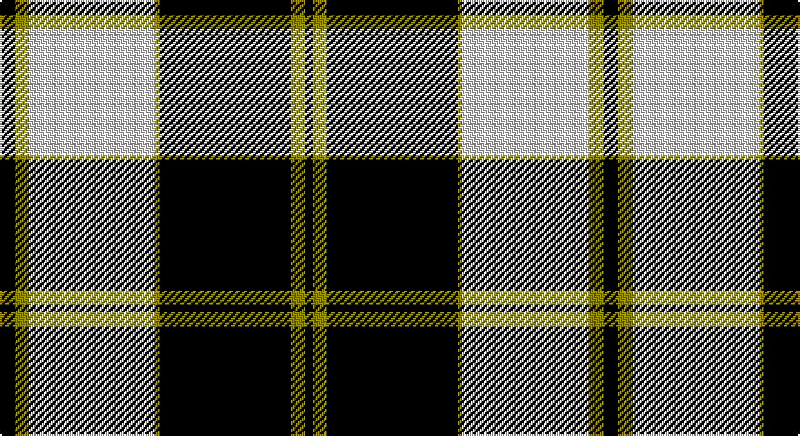

This page is one **sett** — a single exact thread-count. It belongs to the [tartan](/setts/k4y4w35y1k36y4k2/)
(the same proportion at any scale), whose colour order is pattern [KGKGWGK](/stripes/kgkgwgk/).

Sourced from weddslist.  It is a [7 stripe tartan](/stripes/stripes7/).

Original link http://www.weddslist.com/cgi-bin/tartans/pg.pl?source=sts

## Thread count
K/8 LG8 LN70 LG2 K72 LG8 K/4

One full sett is **332 threads**.

## Palette

Palette: <strong>Tartan Register</strong> <small style="color:#888">(2 of 3 colours)</small>
<table><thead><tr><th>Colour</th><th>Threads</th><th>Shade</th><th>Base</th><th>OKLCh</th></tr></thead><tbody><tr><td>K/</td><td style="text-align:right;font-variant-numeric:tabular-nums">8</td><td><code style="background-color:#000000;">#000000</code> <small style="color:#888">#000000</small></td><td>K <code style="background-color:#000000;">#000000</code></td><td><small style="color:#888">oklch(0.0% 0.000 0.0)</small></td></tr><tr><td>LG</td><td style="text-align:right;font-variant-numeric:tabular-nums">8</td><td><code style="background-color:#908000;">#908000</code> <small style="color:#888">#908000</small></td><td>G <code style="background-color:#006100;">#006100</code></td><td><small style="color:#888">oklch(59.6% 0.124 100.6)</small></td></tr><tr><td>LN</td><td style="text-align:right;font-variant-numeric:tabular-nums">70</td><td><code style="background-color:#E0E0E0;">#E0E0E0</code> <small style="color:#888">#E0E0E0</small></td><td>W <code style="background-color:#F7F7F7;">#F7F7F7</code></td><td><small style="color:#888">oklch(90.7% 0.000 89.9)</small></td></tr><tr><td>LG</td><td style="text-align:right;font-variant-numeric:tabular-nums">2</td><td><code style="background-color:#908000;">#908000</code> <small style="color:#888">#908000</small></td><td>G <code style="background-color:#006100;">#006100</code></td><td><small style="color:#888">oklch(59.6% 0.124 100.6)</small></td></tr><tr><td>K</td><td style="text-align:right;font-variant-numeric:tabular-nums">72</td><td><code style="background-color:#000000;">#000000</code> <small style="color:#888">#000000</small></td><td>K <code style="background-color:#000000;">#000000</code></td><td><small style="color:#888">oklch(0.0% 0.000 0.0)</small></td></tr><tr><td>LG</td><td style="text-align:right;font-variant-numeric:tabular-nums">8</td><td><code style="background-color:#908000;">#908000</code> <small style="color:#888">#908000</small></td><td>G <code style="background-color:#006100;">#006100</code></td><td><small style="color:#888">oklch(59.6% 0.124 100.6)</small></td></tr><tr><td>K/</td><td style="text-align:right;font-variant-numeric:tabular-nums">4</td><td><code style="background-color:#000000;">#000000</code> <small style="color:#888">#000000</small></td><td>K <code style="background-color:#000000;">#000000</code></td><td><small style="color:#888">oklch(0.0% 0.000 0.0)</small></td></tr></tbody></table>

# Sample pattern

## Nearest tartans

The nearest existing variants by ΔTartan distance, with this tartan at the top so the swatches line up against it.

ΔTartan

Tartan

Sett

—

<a href="/ttd/edit/#slug=k4y4w35y1k36y4k2~x2">Gleneagles, Hotel</a> <a class="nn-out" href="/variants/s7/k4y4w35y1k36y4k2~x2/" title="open its dictionary page">↗</a>

0.35

<a href="/ttd/edit/#slug=k4o4w35o1k36o4k2~x2&amp;base=k4y4w35y1k36y4k2~x2">Gleneagles</a> <a class="nn-out" href="/variants/s7/k4o4w35o1k36o4k2~x2/" title="open its dictionary page">↗</a>

0.67

<a href="/ttd/edit/#slug=k4lo4lb32lo1k32lo4k2~x4&amp;base=k4y4w35y1k36y4k2~x2">Gleneagles Gold (Dalgleish)</a> <a class="nn-out" href="/variants/s7/k4lo4lb32lo1k32lo4k2~x4/" title="open its dictionary page">↗</a>

1.19

<a href="/ttd/edit/#slug=lr3r1lr30k20lr3k9ly1~x2&amp;base=k4y4w35y1k36y4k2~x2">MacPherson Dress</a> <a class="nn-out" href="/variants/s7/lr3r1lr30k20lr3k9ly1~x2/" title="open its dictionary page">↗</a>

1.19

<a href="/ttd/edit/#slug=lr3r1lr30k20lr3k9ly1&amp;base=k4y4w35y1k36y4k2~x2">MacPherson Dress</a> <a class="nn-out" href="/variants/s7/lr3r1lr30k20lr3k9ly1/" title="open its dictionary page">↗</a>

1.24

<a href="/ttd/edit/#slug=w4k30r1k1r3w12ly3~x2&amp;base=k4y4w35y1k36y4k2~x2">Richecourt, Baron of (Personal)</a> <a class="nn-out" href="/variants/s7/w4k30r1k1r3w12ly3~x2/" title="open its dictionary page">↗</a>

1.25

<a href="/ttd/edit/#slug=lb3r1lb30k20lb3k9ly1&amp;base=k4y4w35y1k36y4k2~x2">MacPherson Dress</a> <a class="nn-out" href="/variants/s7/lb3r1lb30k20lb3k9ly1/" title="open its dictionary page">↗</a>

1.28

<a href="/ttd/edit/#slug=r2lb3r1lb9k4lb13k33lb1k4r1~x2&amp;base=k4y4w35y1k36y4k2~x2">Myles, Lee (Name)</a> <a class="nn-out" href="/variants/s10/r2lb3r1lb9k4lb13k33lb1k4r1~x2/" title="open its dictionary page">↗</a>

1.28

<a href="/ttd/edit/#slug=w36k8w36k95w4k4r6&amp;base=k4y4w35y1k36y4k2~x2">Gretna Football Club (Corporate)</a> <a class="nn-out" href="/variants/s7/w36k8w36k95w4k4r6/" title="open its dictionary page">↗</a>

1.37

<a href="/ttd/edit/#slug=k2n2w4n6w27n15k42n2w2&amp;base=k4y4w35y1k36y4k2~x2">Swansea City AFC</a> <a class="nn-out" href="/variants/s9/k2n2w4n6w27n15k42n2w2/" title="open its dictionary page">↗</a>

1.46

<a href="/ttd/edit/#slug=w40k11o8w2o8k6w2k16w1k16~x2&amp;base=k4y4w35y1k36y4k2~x2">Lebrun</a> <a class="nn-out" href="/variants/s10/w40k11o8w2o8k6w2k16w1k16~x2/" title="open its dictionary page">↗</a>

## Neighbour map

Every grey dot is one of 14360 variants placed by the first two principal components of the ΔTartan feature space (44% of its variance). Red is this tartan; blue dots are its nearest — click one to open its page.

<svg viewBox="0 0 640 380" role="img" style="max-width:100%;height:auto;border:1px solid #e0e0e0;border-radius:4px;display:block" xmlns="http://www.w3.org/2000/svg"><image href="/nn/cloud.v1.png" width="640" height="380"/><a href="/variants/s7/k4o4w35o1k36o4k2~x2/"><circle cx="311.8" cy="125.5" r="4" fill="#3465a4"><title>Gleneagles</title></circle></a><a href="/variants/s7/k4lo4lb32lo1k32lo4k2~x4/"><circle cx="312.9" cy="135.9" r="4" fill="#3465a4"><title>Gleneagles Gold (Dalgleish)</title></circle></a><a href="/variants/s7/lr3r1lr30k20lr3k9ly1~x2/"><circle cx="328.4" cy="132.1" r="4" fill="#3465a4"><title>MacPherson Dress</title></circle></a><a href="/variants/s7/lr3r1lr30k20lr3k9ly1/"><circle cx="328.4" cy="132.1" r="4" fill="#3465a4"><title>MacPherson Dress</title></circle></a><a href="/variants/s7/w4k30r1k1r3w12ly3~x2/"><circle cx="328.7" cy="113.1" r="4" fill="#3465a4"><title>Richecourt, Baron of (Personal)</title></circle></a><a href="/variants/s7/lb3r1lb30k20lb3k9ly1/"><circle cx="321.6" cy="125.9" r="4" fill="#3465a4"><title>MacPherson Dress</title></circle></a><a href="/variants/s10/r2lb3r1lb9k4lb13k33lb1k4r1~x2/"><circle cx="372.8" cy="116.5" r="4" fill="#3465a4"><title>Myles, Lee (Name)</title></circle></a><a href="/variants/s7/w36k8w36k95w4k4r6/"><circle cx="345.3" cy="144.6" r="4" fill="#3465a4"><title>Gretna Football Club (Corporate)</title></circle></a><a href="/variants/s9/k2n2w4n6w27n15k42n2w2/"><circle cx="254.7" cy="137.3" r="4" fill="#3465a4"><title>Swansea City AFC</title></circle></a><a href="/variants/s10/w40k11o8w2o8k6w2k16w1k16~x2/"><circle cx="274.6" cy="115.3" r="4" fill="#3465a4"><title>Lebrun</title></circle></a><circle cx="314.2" cy="128.9" r="5" fill="#c00000"/></svg>

ID: /variants/s7/k4y4w35y1k36y4k2~x2/
