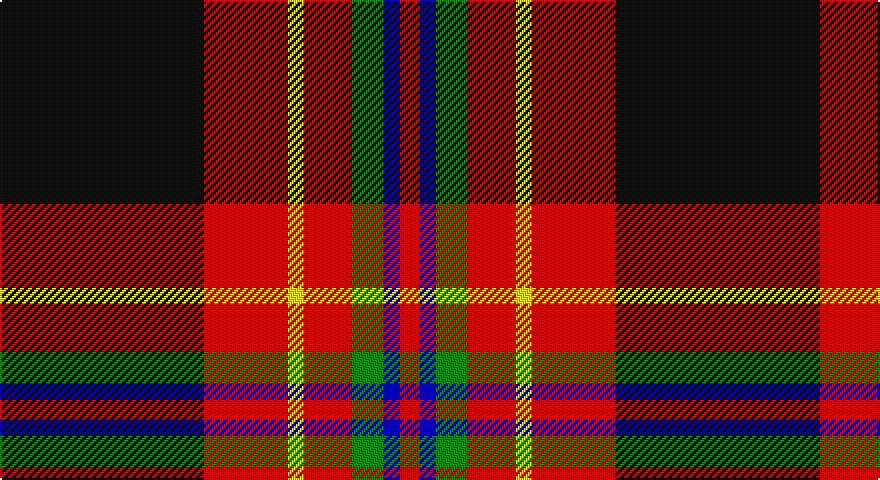

This page is one **sett** — a single exact thread-count. It belongs to the [tartan](/setts/k51r21ly4r12g8db4r5/)
(the same proportion at any scale), whose colour order is pattern [KRYRGBR](/stripes/kryrgbr/).

Sourced from register-of-tartans.  It is a [7 stripe tartan](/stripes/stripes7/).

Original link https://www.tartanregister.gov.uk/tartanDetails.aspx?ref=10770

## Also known as

This cloth is also recorded under:

- Totté

2 attestations — the source records this cloth was collapsed from (oldest owns this page)

<ul>
<li>22/01/2013 — Totté (from Hofstade de Baerebeeck) (Personal) (register-of-tartans, <a href="https://www.tartanregister.gov.uk/tartanDetails.aspx?ref=10770">record</a>)</li>
<li>22/01/2013 — Tott (Personal)) (tartans-authority, <a href="http://www.tartansauthority.com/tartan-ferret/display/10770/">record</a>)</li>
</ul>

## Register references

External register numbers recorded for this tartan.

- Scottish Register of Tartans: [10770](https://www.tartanregister.gov.uk/tartanDetails?ref=10770)
- Scottish Tartans Authority (ITI): 10770

## Thread count
K/102 R42 Y8 R24 G16 B8 R/10

One full sett is **308 threads**.

## Palette

Palette: <strong>Tartan Register</strong>
<table><thead><tr><th>Colour</th><th>Threads</th><th>Shade</th><th>Base</th><th>OKLCh</th></tr></thead><tbody><tr><td>K/</td><td style="text-align:right;font-variant-numeric:tabular-nums">102</td><td><code style="background-color:#101010;">#101010</code> <small style="color:#888">#101010</small></td><td>K <code style="background-color:#000000;">#000000</code></td><td><small style="color:#888">oklch(17.3% 0.000 89.9)</small></td></tr><tr><td>R</td><td style="text-align:right;font-variant-numeric:tabular-nums">42</td><td><code style="background-color:#FF0000;">#FF0000</code> <small style="color:#888">#FF0000</small></td><td>R <code style="background-color:#CC0000;">#CC0000</code></td><td><small style="color:#888">oklch(62.8% 0.258 29.2)</small></td></tr><tr><td>Y</td><td style="text-align:right;font-variant-numeric:tabular-nums">8</td><td><code style="background-color:#FFE600;">#FFE600</code> <small style="color:#888">#FFE600</small></td><td>Y <code style="background-color:#F2BF00;">#F2BF00</code></td><td><small style="color:#888">oklch(91.7% 0.192 101.4)</small></td></tr><tr><td>R</td><td style="text-align:right;font-variant-numeric:tabular-nums">24</td><td><code style="background-color:#FF0000;">#FF0000</code> <small style="color:#888">#FF0000</small></td><td>R <code style="background-color:#CC0000;">#CC0000</code></td><td><small style="color:#888">oklch(62.8% 0.258 29.2)</small></td></tr><tr><td>G</td><td style="text-align:right;font-variant-numeric:tabular-nums">16</td><td><code style="background-color:#008B00;">#008B00</code> <small style="color:#888">#008B00</small></td><td>G <code style="background-color:#006100;">#006100</code></td><td><small style="color:#888">oklch(55.2% 0.188 142.5)</small></td></tr><tr><td>B</td><td style="text-align:right;font-variant-numeric:tabular-nums">8</td><td><code style="background-color:#0000CD;">#0000CD</code> <small style="color:#888">#0000CD</small></td><td>B <code style="background-color:#2A418A;">#2A418A</code></td><td><small style="color:#888">oklch(38.3% 0.266 264.1)</small></td></tr><tr><td>R/</td><td style="text-align:right;font-variant-numeric:tabular-nums">10</td><td><code style="background-color:#FF0000;">#FF0000</code> <small style="color:#888">#FF0000</small></td><td>R <code style="background-color:#CC0000;">#CC0000</code></td><td><small style="color:#888">oklch(62.8% 0.258 29.2)</small></td></tr></tbody></table>

# Sample pattern

## Nearest tartans

The nearest existing variants by ΔTartan distance, with this tartan at the top so the swatches line up against it.

ΔTartan

Tartan

Sett

—

<a href="/ttd/edit/#slug=k51r21ly4r12g8db4r5~x2">Totté (from Hofstade de Baerebeeck) (Personal)</a> <a class="nn-out" href="/variants/s7/k51r21ly4r12g8db4r5~x2/" title="open its dictionary page">↗</a>

0.93

<a href="/ttd/edit/#slug=w6r36k48lo4k5ly6&amp;base=k51r21ly4r12g8db4r5~x2">Drambuie</a> <a class="nn-out" href="/variants/s6/w6r36k48lo4k5ly6/" title="open its dictionary page">↗</a>

0.99

<a href="/ttd/edit/#slug=k22o4k4g4k16r36y3r6~x2&amp;base=k51r21ly4r12g8db4r5~x2">Dean Brae</a> <a class="nn-out" href="/variants/s8/k22o4k4g4k16r36y3r6~x2/" title="open its dictionary page">↗</a>

1.02

<a href="/ttd/edit/#slug=k23r27db3r5w3k14ly6~x2&amp;base=k51r21ly4r12g8db4r5~x2">Hoffman Texas German</a> <a class="nn-out" href="/variants/s7/k23r27db3r5w3k14ly6~x2/" title="open its dictionary page">↗</a>

1.04

<a href="/ttd/edit/#slug=r60lo4k22g5k25t8k4r4k4~x2&amp;base=k51r21ly4r12g8db4r5~x2">State Seal of Alabama (Fashion)</a> <a class="nn-out" href="/variants/s9/r60lo4k22g5k25t8k4r4k4~x2/" title="open its dictionary page">↗</a>

1.11

<a href="/ttd/edit/#slug=lo4r2k9r25k3r2k3r4db15w3~x2&amp;base=k51r21ly4r12g8db4r5~x2">Golfers</a> <a class="nn-out" href="/variants/s10/lo4r2k9r25k3r2k3r4db15w3~x2/" title="open its dictionary page">↗</a>

1.15

<a href="/ttd/edit/#slug=lo7k3db4k3r21k2r4k2w4~x2&amp;base=k51r21ly4r12g8db4r5~x2">Castle Stewart (District)</a> <a class="nn-out" href="/variants/s9/lo7k3db4k3r21k2r4k2w4~x2/" title="open its dictionary page">↗</a>

1.19

<a href="/ttd/edit/#slug=db4lo4r33k30w2~x2&amp;base=k51r21ly4r12g8db4r5~x2">Wormeck (2013) Germany</a> <a class="nn-out" href="/variants/s5/db4lo4r33k30w2~x2/" title="open its dictionary page">↗</a>

1.24

<a href="/ttd/edit/#slug=do47r8k22r7w3r24do9r10ly3~x2&amp;base=k51r21ly4r12g8db4r5~x2">Ulster Ancestry</a> <a class="nn-out" href="/variants/s9/do47r8k22r7w3r24do9r10ly3~x2/" title="open its dictionary page">↗</a>

1.24

<a href="/ttd/edit/#slug=w4dg20dgi10r25b2r2dgi2~x2&amp;base=k51r21ly4r12g8db4r5~x2">Caledonian Brewery (Corporate)</a> <a class="nn-out" href="/variants/s7/w4dg20dgi10r25b2r2dgi2~x2/" title="open its dictionary page">↗</a>

1.25

<a href="/ttd/edit/#slug=r6k3r29k23w4k7ly3~x2&amp;base=k51r21ly4r12g8db4r5~x2">MacPherson Red Cluny</a> <a class="nn-out" href="/variants/s7/r6k3r29k23w4k7ly3~x2/" title="open its dictionary page">↗</a>

## Neighbour map

Every grey dot is one of 14360 variants placed by the first two principal components of the ΔTartan feature space (44% of its variance). Red is this tartan; blue dots are its nearest — click one to open its page.

<svg viewBox="0 0 640 380" role="img" style="max-width:100%;height:auto;border:1px solid #e0e0e0;border-radius:4px;display:block" xmlns="http://www.w3.org/2000/svg"><image href="/nn/cloud.v1.png" width="640" height="380"/><a href="/variants/s6/w6r36k48lo4k5ly6/"><circle cx="265.6" cy="167.5" r="4" fill="#3465a4"><title>Drambuie</title></circle></a><a href="/variants/s8/k22o4k4g4k16r36y3r6~x2/"><circle cx="224.2" cy="143.4" r="4" fill="#3465a4"><title>Dean Brae</title></circle></a><a href="/variants/s7/k23r27db3r5w3k14ly6~x2/"><circle cx="206.5" cy="174.1" r="4" fill="#3465a4"><title>Hoffman Texas German</title></circle></a><a href="/variants/s9/r60lo4k22g5k25t8k4r4k4~x2/"><circle cx="278.6" cy="128.8" r="4" fill="#3465a4"><title>State Seal of Alabama (Fashion)</title></circle></a><a href="/variants/s10/lo4r2k9r25k3r2k3r4db15w3~x2/"><circle cx="217.4" cy="129.1" r="4" fill="#3465a4"><title>Golfers</title></circle></a><a href="/variants/s9/lo7k3db4k3r21k2r4k2w4~x2/"><circle cx="237.5" cy="146.6" r="4" fill="#3465a4"><title>Castle Stewart (District)</title></circle></a><a href="/variants/s5/db4lo4r33k30w2~x2/"><circle cx="267.0" cy="164.4" r="4" fill="#3465a4"><title>Wormeck (2013) Germany</title></circle></a><a href="/variants/s9/do47r8k22r7w3r24do9r10ly3~x2/"><circle cx="227.4" cy="143.1" r="4" fill="#3465a4"><title>Ulster Ancestry</title></circle></a><a href="/variants/s7/w4dg20dgi10r25b2r2dgi2~x2/"><circle cx="202.2" cy="154.6" r="4" fill="#3465a4"><title>Caledonian Brewery (Corporate)</title></circle></a><a href="/variants/s7/r6k3r29k23w4k7ly3~x2/"><circle cx="260.4" cy="175.4" r="4" fill="#3465a4"><title>MacPherson Red Cluny</title></circle></a><circle cx="245.5" cy="142.2" r="5" fill="#c00000"/></svg>

ID: /variants/s7/k51r21ly4r12g8db4r5~x2/
