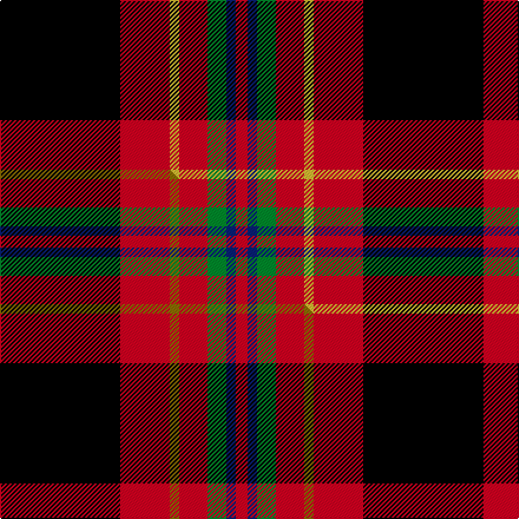

This page is one **sett** — a single exact thread-count. It belongs to the [tartan](/setts/k51r21ly4r12g8db4r5/)
(the same proportion at any scale), whose colour order is pattern [KRYRGBR](/stripes/kryrgbr/).

Part of the [Totté](/tartans/tott/) tartan — the named design grouping this sett with its other cloths.

Sourced from tartans-authority.  It is a [7 stripe tartan](/stripes/stripes7/).

Original link http://www.tartansauthority.com/tartan-ferret/display/10770/

## Register references

External register numbers recorded for this tartan.

- Scottish Register of Tartans: [10770](https://www.tartanregister.gov.uk/tartanDetails?ref=10770)
- Scottish Tartans Authority (ITI): 10770

## Thread count
K/102 R42 LY8 R24 G16 DB8 R/10

One full sett is **308 threads**.

## Palette
<table><thead><tr><th>Colour</th><th>Shade</th><th>OKLCh</th></tr></thead><tbody><tr><td>DB</td><td><code style="background-color:#082077;">#082077</code> <small style="color:#888">#082077</small></td><td><small style="color:#888">oklch(30.0% 0.149 265.1)</small></td></tr><tr><td>G</td><td><code style="background-color:#008B2A;">#008B2A</code> <small style="color:#888">#008B2A</small></td><td><small style="color:#888">oklch(55.4% 0.170 145.9)</small></td></tr><tr><td>K</td><td><code style="background-color:#000000;">#000000</code> <small style="color:#888">#000000</small></td><td><small style="color:#888">oklch(0.0% 0.000 0.0)</small></td></tr><tr><td>LY</td><td><code style="background-color:#DCBC32;">#DCBC32</code> <small style="color:#888">#DCBC32</small></td><td><small style="color:#888">oklch(80.0% 0.150 95.2)</small></td></tr><tr><td>R</td><td><code style="background-color:#D60020;">#D60020</code> <small style="color:#888">#D60020</small></td><td><small style="color:#888">oklch(55.2% 0.224 25.5)</small></td></tr></tbody></table>

# Sample pattern

## Compared to the master

This cloth is one sett of its design; the master sett (the exemplar the design is anchored on) is below for comparison.

Its **ΔTartan distance** from the master is **0.12** — the same measure the nearest-tartans table ranks by (0 is identical; a re-scale of the same cloth is near 0, a recolour or a different proportion further).

<figure class="master-compare" style="margin:0">

this sett
master sett ★

<figcaption style="color:#888;font-size:smaller">One weave of this sett against the <a href="/setts/k51r21y4r12g8db4r5/">master sett ★</a>, split on the diagonal: a shared proportion runs seamlessly across it with only the shades shifting; a different proportion breaks on it.</figcaption>
</figure>

## Nearest variants

The nearest existing variants by ΔTartan distance, with this cloth at the top so the swatches line up against it.

ΔTartan

Threads

Variant

Sett

—

308

<a href="/variants/s7/k51r21ly4r12g8db4r5~x2/">Tott (Personal))</a>

<a href="/ttd/edit/#slug=k51r21y4r12g8db4r5~x2&amp;base=k51r21ly4r12g8db4r5~x2" title="compare in the TTD">0.00</a>

308

<a href="/variants/s7/k51r21y4r12g8db4r5~x2/">Totté (from Hofstade de Baerebeeck) (Personal)</a>

<a href="/ttd/edit/#slug=t4r1k11r20k20r20g4ly1~x2&amp;base=k51r21ly4r12g8db4r5~x2" title="compare in the TTD">2.08</a>

314

<a href="/variants/s8/t4r1k11r20k20r20g4ly1~x2/">Templeton (Name?)</a>

<a href="/ttd/edit/#slug=k23r27db3r5w3k14y6~x2&amp;base=k51r21ly4r12g8db4r5~x2" title="compare in the TTD">2.44</a>

266

<a href="/variants/s7/k23r27db3r5w3k14y6~x2/">Hoffman Texas German</a>

<a href="/ttd/edit/#slug=g3y5r14k36w3~x2&amp;base=k51r21ly4r12g8db4r5~x2" title="compare in the TTD">2.82</a>

232

<a href="/variants/s5/g3y5r14k36w3~x2/">Papua New Guinea</a>

<a href="/ttd/edit/#slug=db4y4r33k30w2~x2&amp;base=k51r21ly4r12g8db4r5~x2" title="compare in the TTD">2.91</a>

280

<a href="/variants/s5/db4y4r33k30w2~x2/">Wormeck (2013) Germany</a>

<a href="/ttd/edit/#slug=db1r1k2r7k7r1k2w1~x6&amp;base=k51r21ly4r12g8db4r5~x2" title="compare in the TTD">2.92</a>

252

<a href="/variants/s8/db1r1k2r7k7r1k2w1~x6/">Nakayama (Personal)</a>

<a href="/ttd/edit/#slug=b1r1k2r7k7r1k2w1~x6&amp;base=k51r21ly4r12g8db4r5~x2" title="compare in the TTD">2.92</a>

252

<a href="/variants/s8/b1r1k2r7k7r1k2w1~x6/">Nakayama (Fashion)</a>

<a href="/ttd/edit/#slug=g3y5r13k33w2~x2&amp;base=k51r21ly4r12g8db4r5~x2" title="compare in the TTD">2.92</a>

214

<a href="/variants/s5/g3y5r13k33w2~x2/">Papua New Guinea Pipes and Drums</a>

<a href="/ttd/edit/#slug=db1r12k6y1k6db1~x4&amp;base=k51r21ly4r12g8db4r5~x2" title="compare in the TTD">2.96</a>

208

<a href="/variants/s6/db1r12k6y1k6db1~x4/">Cetoloni (Personal)</a>

## Neighbour map

Every grey dot is one of 13620 variants placed by the first two principal components of the ΔTartan feature space (42% of its variance). Red is this tartan; blue dots are its nearest — click one to open its page.

<svg viewBox="0 0 640 380" role="img" style="max-width:100%;height:auto;border:1px solid #e0e0e0;border-radius:4px;display:block" xmlns="http://www.w3.org/2000/svg"><image href="/nn/cloud.v1.png" width="640" height="380"/><a href="/variants/s7/k51r21y4r12g8db4r5~x2/"><circle cx="216.4" cy="133.9" r="4" fill="#3465a4"><title>Totté (from Hofstade de Baerebeeck) (Personal)</title></circle></a><a href="/variants/s8/t4r1k11r20k20r20g4ly1~x2/"><circle cx="229.7" cy="127.6" r="4" fill="#3465a4"><title>Templeton (Name?)</title></circle></a><a href="/variants/s7/k23r27db3r5w3k14y6~x2/"><circle cx="178.5" cy="165.0" r="4" fill="#3465a4"><title>Hoffman Texas German</title></circle></a><a href="/variants/s5/g3y5r14k36w3~x2/"><circle cx="257.3" cy="147.8" r="4" fill="#3465a4"><title>Papua New Guinea</title></circle></a><a href="/variants/s5/db4y4r33k30w2~x2/"><circle cx="218.6" cy="142.9" r="4" fill="#3465a4"><title>Wormeck (2013) Germany</title></circle></a><a href="/variants/s8/db1r1k2r7k7r1k2w1~x6/"><circle cx="218.1" cy="170.4" r="4" fill="#3465a4"><title>Nakayama (Personal)</title></circle></a><a href="/variants/s8/b1r1k2r7k7r1k2w1~x6/"><circle cx="217.2" cy="170.2" r="4" fill="#3465a4"><title>Nakayama (Fashion)</title></circle></a><a href="/variants/s5/g3y5r13k33w2~x2/"><circle cx="268.8" cy="136.5" r="4" fill="#3465a4"><title>Papua New Guinea Pipes and Drums</title></circle></a><a href="/variants/s6/db1r12k6y1k6db1~x4/"><circle cx="227.4" cy="166.7" r="4" fill="#3465a4"><title>Cetoloni (Personal)</title></circle></a><circle cx="213.9" cy="133.5" r="5" fill="#c00000"/><text x="320" y="376" text-anchor="middle" font-size="11" fill="#999">ground</text><text x="11" y="190" text-anchor="middle" font-size="11" fill="#999" transform="rotate(-90 11 190)">complexity</text></svg>

ID: /variants/s7/k51r21ly4r12g8db4r5~x2/
