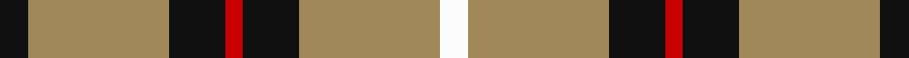
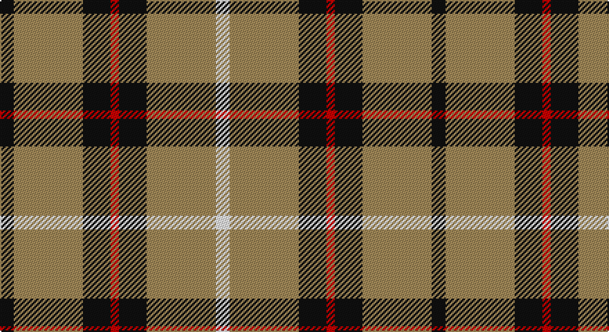

This page is one **sett** — a single exact thread-count. It belongs to the [tartan](/setts/k5lo25k10r3k10lo25w5/)
(the same proportion at any scale), whose colour order is pattern [KYKRKYW](/stripes/kykrkyw/).

Sourced from register-of-tartans.  It is a [7 stripe tartan](/stripes/stripes7/).

Original link https://www.tartanregister.gov.uk/tartanDetails.aspx?ref=3510

2 attestations — the source records this cloth was collapsed from (oldest owns this page)

<ul>
<li>09/01/1999 — Richmond de Ellel (Personal) (register-of-tartans, <a href="https://www.tartanregister.gov.uk/tartanDetails.aspx?ref=3510">record</a>)</li>
<li>pre 2004 — Richmond de Ellel (Personal) (tartans-authority, <a href="http://www.tartansauthority.com/tartan-ferret/display/6226/">record</a>)</li>
</ul>

## Register references

External register numbers recorded for this tartan.

- Scottish Register of Tartans: [3510](https://www.tartanregister.gov.uk/tartanDetails.aspx?ref=3510)
- Scottish Tartans Authority (ITI): 6226
- Scottish Tartans World Register: 2777

## Thread count
K/10 LT50 K20 R6 K20 LT50 W/10

One full sett is **312 threads**.

## Palette

Palette: <strong>Tartan Register</strong>
<table><thead><tr><th>Colour</th><th>Threads</th><th>Shade</th><th>Base</th><th>OKLCh</th></tr></thead><tbody><tr><td>K/</td><td style="text-align:right;font-variant-numeric:tabular-nums">10</td><td><code style="background-color:#101010;">#101010</code> <small style="color:#888">#101010</small></td><td>K <code style="background-color:#000000;">#000000</code></td><td><small style="color:#888">oklch(17.3% 0.000 89.9)</small></td></tr><tr><td>LT</td><td style="text-align:right;font-variant-numeric:tabular-nums">50</td><td><code style="background-color:#A08858;">#A08858</code> <small style="color:#888">#A08858</small></td><td>Y <code style="background-color:#F2BF00;">#F2BF00</code></td><td><small style="color:#888">oklch(63.7% 0.071 84.0)</small></td></tr><tr><td>K</td><td style="text-align:right;font-variant-numeric:tabular-nums">20</td><td><code style="background-color:#101010;">#101010</code> <small style="color:#888">#101010</small></td><td>K <code style="background-color:#000000;">#000000</code></td><td><small style="color:#888">oklch(17.3% 0.000 89.9)</small></td></tr><tr><td>R</td><td style="text-align:right;font-variant-numeric:tabular-nums">6</td><td><code style="background-color:#C80000;">#C80000</code> <small style="color:#888">#C80000</small></td><td>R <code style="background-color:#CC0000;">#CC0000</code></td><td><small style="color:#888">oklch(52.3% 0.215 29.2)</small></td></tr><tr><td>K</td><td style="text-align:right;font-variant-numeric:tabular-nums">20</td><td><code style="background-color:#101010;">#101010</code> <small style="color:#888">#101010</small></td><td>K <code style="background-color:#000000;">#000000</code></td><td><small style="color:#888">oklch(17.3% 0.000 89.9)</small></td></tr><tr><td>LT</td><td style="text-align:right;font-variant-numeric:tabular-nums">50</td><td><code style="background-color:#A08858;">#A08858</code> <small style="color:#888">#A08858</small></td><td>Y <code style="background-color:#F2BF00;">#F2BF00</code></td><td><small style="color:#888">oklch(63.7% 0.071 84.0)</small></td></tr><tr><td>W/</td><td style="text-align:right;font-variant-numeric:tabular-nums">10</td><td><code style="background-color:#FCFCFC;">#FCFCFC</code> <small style="color:#888">#FCFCFC</small></td><td>W <code style="background-color:#F7F7F7;">#F7F7F7</code></td><td><small style="color:#888">oklch(99.1% 0.000 89.9)</small></td></tr></tbody></table>

# Sample pattern

## Nearest tartans

The nearest existing variants by ΔTartan distance, with this tartan at the top so the swatches line up against it.

ΔTartan

Tartan

Sett

—

<a href="/ttd/edit/#slug=k5lo25k10r3k10lo25w5~x2">Richmond de Ellel (Personal)</a> <a class="nn-out" href="/variants/s7/k5lo25k10r3k10lo25w5~x2/" title="open its dictionary page">↗</a>

1.09

<a href="/ttd/edit/#slug=n27lr3n14k3n13k3ly23~x2&amp;base=k5lo25k10r3k10lo25w5~x2">Grange School</a> <a class="nn-out" href="/variants/s7/n27lr3n14k3n13k3ly23~x2/" title="open its dictionary page">↗</a>

1.20

<a href="/ttd/edit/#slug=r8ly6k11ly6k11ly30r3~x2&amp;base=k5lo25k10r3k10lo25w5~x2">Blackberry (Fashion)</a> <a class="nn-out" href="/variants/s7/r8ly6k11ly6k11ly30r3~x2/" title="open its dictionary page">↗</a>

1.24

<a href="/ttd/edit/#slug=lr2dr4lr2dr4lr9k1~x2&amp;base=k5lo25k10r3k10lo25w5~x2">Buchanan VS</a> <a class="nn-out" href="/variants/s6/lr2dr4lr2dr4lr9k1~x2/" title="open its dictionary page">↗</a>

1.36

<a href="/ttd/edit/#slug=lo10w1lo12k7w2k7lo12w1r4w1lo12k2~x2&amp;base=k5lo25k10r3k10lo25w5~x2">Unidentified (GMG 2002)</a> <a class="nn-out" href="/variants/s12/lo10w1lo12k7w2k7lo12w1r4w1lo12k2~x2/" title="open its dictionary page">↗</a>

1.37

<a href="/ttd/edit/#slug=k6w6k6lo21r2~x4&amp;base=k5lo25k10r3k10lo25w5~x2">Burberry Check Corporate Tartan</a> <a class="nn-out" href="/variants/s5/k6w6k6lo21r2~x4/" title="open its dictionary page">↗</a>

1.37

<a href="/ttd/edit/#slug=dy22b2dy3ly4dy3b2dy12b4w19dy3~x2&amp;base=k5lo25k10r3k10lo25w5~x2">Burns Battalion (Fashion)</a> <a class="nn-out" href="/variants/s10/dy22b2dy3ly4dy3b2dy12b4w19dy3~x2/" title="open its dictionary page">↗</a>

1.42

<a href="/ttd/edit/#slug=dg50r5dg8w10dg8db8dg8lo21~x2&amp;base=k5lo25k10r3k10lo25w5~x2">St Patrick's Krewe</a> <a class="nn-out" href="/variants/s8/dg50r5dg8w10dg8db8dg8lo21~x2/" title="open its dictionary page">↗</a>

1.43

<a href="/ttd/edit/#slug=r5k3t22k17t22k3ly5~x2&amp;base=k5lo25k10r3k10lo25w5~x2">MacCrimmon from Skye</a> <a class="nn-out" href="/variants/s7/r5k3t22k17t22k3ly5~x2/" title="open its dictionary page">↗</a>

1.44

<a href="/ttd/edit/#slug=k10ly2k10w2k2ly13w3~x2&amp;base=k5lo25k10r3k10lo25w5~x2">Nooten-Boom (Personal)</a> <a class="nn-out" href="/variants/s7/k10ly2k10w2k2ly13w3~x2/" title="open its dictionary page">↗</a>

1.47

<a href="/ttd/edit/#slug=dy1w2k5dy3k1lo5k1lo11k1lo1~x4&amp;base=k5lo25k10r3k10lo25w5~x2">Braemar or Blair Atholl Trade Tartan</a> <a class="nn-out" href="/variants/s10/dy1w2k5dy3k1lo5k1lo11k1lo1~x4/" title="open its dictionary page">↗</a>

## Neighbour map

Every grey dot is one of 14360 variants placed by the first two principal components of the ΔTartan feature space (44% of its variance). Red is this tartan; blue dots are its nearest — click one to open its page.

<svg viewBox="0 0 640 380" role="img" style="max-width:100%;height:auto;border:1px solid #e0e0e0;border-radius:4px;display:block" xmlns="http://www.w3.org/2000/svg"><image href="/nn/cloud.v1.png" width="640" height="380"/><a href="/variants/s7/n27lr3n14k3n13k3ly23~x2/"><circle cx="333.5" cy="217.0" r="4" fill="#3465a4"><title>Grange School</title></circle></a><a href="/variants/s7/r8ly6k11ly6k11ly30r3~x2/"><circle cx="276.4" cy="198.9" r="4" fill="#3465a4"><title>Blackberry (Fashion)</title></circle></a><a href="/variants/s6/lr2dr4lr2dr4lr9k1~x2/"><circle cx="316.3" cy="222.8" r="4" fill="#3465a4"><title>Buchanan VS</title></circle></a><a href="/variants/s12/lo10w1lo12k7w2k7lo12w1r4w1lo12k2~x2/"><circle cx="322.4" cy="170.3" r="4" fill="#3465a4"><title>Unidentified (GMG 2002)</title></circle></a><a href="/variants/s5/k6w6k6lo21r2~x4/"><circle cx="243.9" cy="198.7" r="4" fill="#3465a4"><title>Burberry Check Corporate Tartan</title></circle></a><a href="/variants/s10/dy22b2dy3ly4dy3b2dy12b4w19dy3~x2/"><circle cx="281.0" cy="154.9" r="4" fill="#3465a4"><title>Burns Battalion (Fashion)</title></circle></a><a href="/variants/s8/dg50r5dg8w10dg8db8dg8lo21~x2/"><circle cx="293.5" cy="165.6" r="4" fill="#3465a4"><title>St Patrick's Krewe</title></circle></a><a href="/variants/s7/r5k3t22k17t22k3ly5~x2/"><circle cx="264.1" cy="215.5" r="4" fill="#3465a4"><title>MacCrimmon from Skye</title></circle></a><a href="/variants/s7/k10ly2k10w2k2ly13w3~x2/"><circle cx="234.8" cy="220.3" r="4" fill="#3465a4"><title>Nooten-Boom (Personal)</title></circle></a><a href="/variants/s10/dy1w2k5dy3k1lo5k1lo11k1lo1~x4/"><circle cx="275.8" cy="162.8" r="4" fill="#3465a4"><title>Braemar or Blair Atholl Trade Tartan</title></circle></a><circle cx="287.4" cy="205.0" r="5" fill="#c00000"/></svg>

ID: /variants/s7/k5lo25k10r3k10lo25w5~x2/
