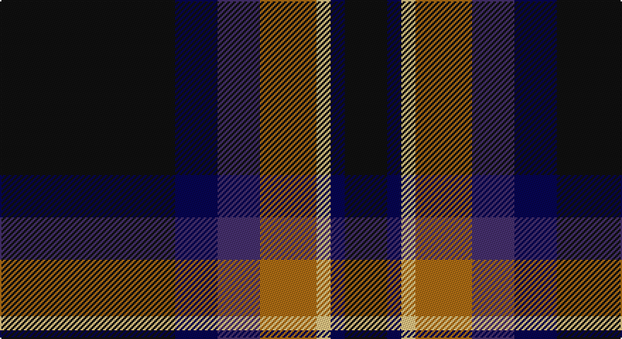

This page is one **sett** — a single exact thread-count. It belongs to the [tartan](/setts/k62db15dp15o20ly5db5k15/)
(the same proportion at any scale), whose colour order is pattern [KBBRYBK](/stripes/kbbrybk/).

Part of the [Black Raven](/tartans/black-raven/) tartan — the named design grouping this sett with its other cloths.

Sourced from register-of-tartans.  It is a [7 stripe tartan](/stripes/stripes7/).

Original link https://www.tartanregister.gov.uk/tartanDetails.aspx?ref=10166

## Register references

External register numbers recorded for this tartan.

- Scottish Register of Tartans: [10166](https://www.tartanregister.gov.uk/tartanDetails.aspx?ref=10166)

## Thread count
K/124 DB30 DBa30 LT40 LY10 DB10 K/30

One full sett is **394 threads**.

## Palette

Palette: <strong>Logan (The Scottish Gael, 1831)</strong> <small style="color:#888">(1 of 5 colours)</small>
<table><thead><tr><th>Colour</th><th>Threads</th><th>Shade</th><th>Base</th><th>OKLCh</th></tr></thead><tbody><tr><td>K/</td><td style="text-align:right;font-variant-numeric:tabular-nums">124</td><td><code style="background-color:#101010;">#101010</code> <small style="color:#888">#101010</small></td><td>K <code style="background-color:#000000;">#000000</code></td><td><small style="color:#888">oklch(17.3% 0.000 89.9)</small></td></tr><tr><td>DB</td><td style="text-align:right;font-variant-numeric:tabular-nums">30</td><td><code style="background-color:#070552;">#070552</code> <small style="color:#888">#070552</small></td><td>B <code style="background-color:#2A418A;">#2A418A</code></td><td><small style="color:#888">oklch(21.1% 0.129 268.9)</small></td></tr><tr><td>DBa</td><td style="text-align:right;font-variant-numeric:tabular-nums">30</td><td><code style="background-color:#46306E;">#46306E</code> <small style="color:#888">#46306E</small></td><td>B <code style="background-color:#2A418A;">#2A418A</code></td><td><small style="color:#888">oklch(36.7% 0.104 297.4)</small></td></tr><tr><td>LT</td><td style="text-align:right;font-variant-numeric:tabular-nums">40</td><td><code style="background-color:#AD6D14;">#AD6D14</code> <small style="color:#888">#AD6D14</small></td><td>R <code style="background-color:#CC0000;">#CC0000</code></td><td><small style="color:#888">oklch(59.1% 0.124 67.7)</small></td></tr><tr><td>LY</td><td style="text-align:right;font-variant-numeric:tabular-nums">10</td><td><code style="background-color:#FBC684;">#FBC684</code> <small style="color:#888">#FBC684</small></td><td>Y <code style="background-color:#F2BF00;">#F2BF00</code></td><td><small style="color:#888">oklch(85.9% 0.103 71.9)</small></td></tr><tr><td>DB</td><td style="text-align:right;font-variant-numeric:tabular-nums">10</td><td><code style="background-color:#070552;">#070552</code> <small style="color:#888">#070552</small></td><td>B <code style="background-color:#2A418A;">#2A418A</code></td><td><small style="color:#888">oklch(21.1% 0.129 268.9)</small></td></tr><tr><td>K/</td><td style="text-align:right;font-variant-numeric:tabular-nums">30</td><td><code style="background-color:#101010;">#101010</code> <small style="color:#888">#101010</small></td><td>K <code style="background-color:#000000;">#000000</code></td><td><small style="color:#888">oklch(17.3% 0.000 89.9)</small></td></tr></tbody></table>

# Sample pattern

## Nearest tartans

The nearest existing variants by ΔTartan distance, with this tartan at the top so the swatches line up against it.

ΔTartan

Tartan

Sett

—

<a href="/ttd/edit/#slug=k62db15dp15o20ly5db5k15~x2">Black Raven</a> <a class="nn-out" href="/variants/s7/k62db15dp15o20ly5db5k15~x2/" title="open its dictionary page">↗</a>

0.68

<a href="/ttd/edit/#slug=k62db15b15dy20ly5db5k15~x2&amp;base=k62db15dp15o20ly5db5k15~x2">Black Raven (Fashion)</a> <a class="nn-out" href="/variants/s7/k62db15b15dy20ly5db5k15~x2/" title="open its dictionary page">↗</a>

1.03

<a href="/variants/s7/k3dy3yi6k12y1dyi2dy2~x4/">Joe Strummer Commemorative</a>

1.03

<a href="/ttd/edit/#slug=r12lo6k88db45k6db6ly6&amp;base=k62db15dp15o20ly5db5k15~x2">City of Rome Pipe Band (Corporate)</a> <a class="nn-out" href="/variants/s7/r12lo6k88db45k6db6ly6/" title="open its dictionary page">↗</a>

1.04

<a href="/ttd/edit/#slug=n10k7lt2lb2k27b7lt2b7~x2&amp;base=k62db15dp15o20ly5db5k15~x2">Croy, Jake (Personal)</a> <a class="nn-out" href="/variants/s8/n10k7lt2lb2k27b7lt2b7~x2/" title="open its dictionary page">↗</a>

1.20

<a href="/ttd/edit/#slug=k4dt16k3dt3k32lo7k3r10k2w4~x2&amp;base=k62db15dp15o20ly5db5k15~x2">Model T Ford (Corporate)</a> <a class="nn-out" href="/variants/s10/k4dt16k3dt3k32lo7k3r10k2w4~x2/" title="open its dictionary page">↗</a>

1.21

<a href="/ttd/edit/#slug=n6dp4n2w2n25k26ly4~x2&amp;base=k62db15dp15o20ly5db5k15~x2">New York State Troopers</a> <a class="nn-out" href="/variants/s7/n6dp4n2w2n25k26ly4~x2/" title="open its dictionary page">↗</a>

1.26

<a href="/ttd/edit/#slug=k15db7o3k13o3db7k23o3db7ly2dp4ly2~x2&amp;base=k62db15dp15o20ly5db5k15~x2">Apache</a> <a class="nn-out" href="/variants/s12/k15db7o3k13o3db7k23o3db7ly2dp4ly2~x2/" title="open its dictionary page">↗</a>

1.28

<a href="/ttd/edit/#slug=m11dr5dg5k40ly3~x2&amp;base=k62db15dp15o20ly5db5k15~x2">MacShimsi Personal Tartan</a> <a class="nn-out" href="/variants/s5/m11dr5dg5k40ly3~x2/" title="open its dictionary page">↗</a>

1.29

<a href="/ttd/edit/#slug=r4g2r2k5dt22w2~x4&amp;base=k62db15dp15o20ly5db5k15~x2">Reese (Personal)</a> <a class="nn-out" href="/variants/s6/r4g2r2k5dt22w2~x4/" title="open its dictionary page">↗</a>

1.30

<a href="/ttd/edit/#slug=lo6k5r4k48dy36loi6&amp;base=k62db15dp15o20ly5db5k15~x2">Drambuie Hunting</a> <a class="nn-out" href="/variants/s6/lo6k5r4k48dy36loi6/" title="open its dictionary page">↗</a>

## Neighbour map

Every grey dot is one of 14360 variants placed by the first two principal components of the ΔTartan feature space (44% of its variance). Red is this tartan; blue dots are its nearest — click one to open its page.

<svg viewBox="0 0 640 380" role="img" style="max-width:100%;height:auto;border:1px solid #e0e0e0;border-radius:4px;display:block" xmlns="http://www.w3.org/2000/svg"><image href="/nn/cloud.v1.png" width="640" height="380"/><a href="/variants/s7/k62db15b15dy20ly5db5k15~x2/"><circle cx="304.5" cy="196.8" r="4" fill="#3465a4"><title>Black Raven (Fashion)</title></circle></a><a href="/variants/s7/k3dy3yi6k12y1dyi2dy2~x4/"><circle cx="284.7" cy="206.9" r="4" fill="#3465a4"><title>Joe Strummer Commemorative</title></circle></a><a href="/variants/s7/r12lo6k88db45k6db6ly6/"><circle cx="336.3" cy="167.9" r="4" fill="#3465a4"><title>City of Rome Pipe Band (Corporate)</title></circle></a><a href="/variants/s8/n10k7lt2lb2k27b7lt2b7~x2/"><circle cx="266.5" cy="169.9" r="4" fill="#3465a4"><title>Croy, Jake (Personal)</title></circle></a><a href="/variants/s10/k4dt16k3dt3k32lo7k3r10k2w4~x2/"><circle cx="264.1" cy="141.0" r="4" fill="#3465a4"><title>Model T Ford (Corporate)</title></circle></a><a href="/variants/s7/n6dp4n2w2n25k26ly4~x2/"><circle cx="257.6" cy="167.8" r="4" fill="#3465a4"><title>New York State Troopers</title></circle></a><a href="/variants/s12/k15db7o3k13o3db7k23o3db7ly2dp4ly2~x2/"><circle cx="280.0" cy="174.0" r="4" fill="#3465a4"><title>Apache</title></circle></a><a href="/variants/s5/m11dr5dg5k40ly3~x2/"><circle cx="365.8" cy="192.1" r="4" fill="#3465a4"><title>MacShimsi Personal Tartan</title></circle></a><a href="/variants/s6/r4g2r2k5dt22w2~x4/"><circle cx="321.8" cy="177.6" r="4" fill="#3465a4"><title>Reese (Personal)</title></circle></a><a href="/variants/s6/lo6k5r4k48dy36loi6/"><circle cx="300.3" cy="190.7" r="4" fill="#3465a4"><title>Drambuie Hunting</title></circle></a><circle cx="289.6" cy="186.7" r="5" fill="#c00000"/></svg>

ID: /variants/s7/k62db15dp15o20ly5db5k15~x2/
