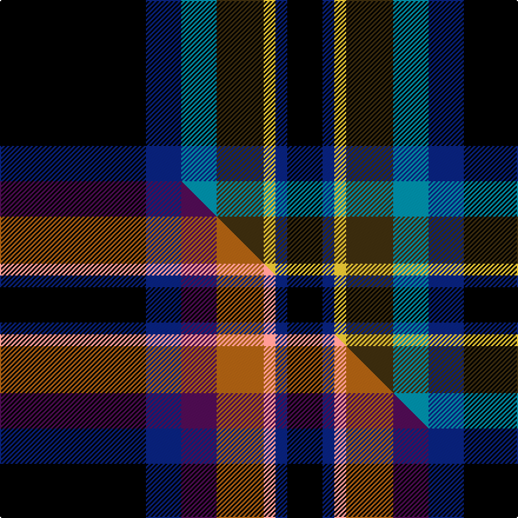

This page is one **sett** — a single exact thread-count. It belongs to the [tartan](/setts/k62db15t15dy20ly5db5k15/)
(the same proportion at any scale), whose colour order is pattern [KBBGYBK](/stripes/kbbgybk/).

Part of the [Black Raven](/tartans/black-raven/) tartan — the named design grouping this sett with its other cloths.

Sourced from tartans-authority.  It is a [7 stripe tartan](/stripes/stripes7/).

Original link http://www.tartansauthority.com/tartan-ferret/display/10166/

## Register references

External register numbers recorded for this tartan.

- Scottish Register of Tartans: [10166](https://www.tartanregister.gov.uk/tartanDetails?ref=10166)
- Scottish Tartans Authority (ITI): 10166

## Thread count
K/124 DB30 T30 DY40 LY10 DB10 K/30

One full sett is **394 threads**.

## Palette
<table><thead><tr><th>Colour</th><th>Shade</th><th>OKLCh</th></tr></thead><tbody><tr><td>T</td><td><code style="background-color:#00879F;">#00879F</code> <small style="color:#888">#00879F</small></td><td><small style="color:#888">oklch(57.4% 0.102 216.1)</small></td></tr><tr><td>DB</td><td><code style="background-color:#082077;">#082077</code> <small style="color:#888">#082077</small></td><td><small style="color:#888">oklch(30.0% 0.149 265.1)</small></td></tr><tr><td>K</td><td><code style="background-color:#000000;">#000000</code> <small style="color:#888">#000000</small></td><td><small style="color:#888">oklch(0.0% 0.000 0.0)</small></td></tr><tr><td>LY</td><td><code style="background-color:#DCBC32;">#DCBC32</code> <small style="color:#888">#DCBC32</small></td><td><small style="color:#888">oklch(80.0% 0.150 95.2)</small></td></tr><tr><td>DY</td><td><code style="background-color:#3A2B0D;">#3A2B0D</code> <small style="color:#888">#3A2B0D</small></td><td><small style="color:#888">oklch(30.0% 0.049 82.0)</small></td></tr></tbody></table>

# Sample pattern

## Compared to the master

This cloth is one sett of its design; the master sett (the exemplar the design is anchored on) is below for comparison.

Its **ΔTartan distance** from the master is **0.70** — the same measure the nearest-tartans table ranks by (0 is identical; a re-scale of the same cloth is near 0, a recolour or a different proportion further).

<figure class="master-compare" style="margin:0">

this sett
master sett ★

<figcaption style="color:#888;font-size:smaller">One weave of this sett against the <a href="/setts/k62db15dp15o20lr5db5k15/">master sett ★</a>, split on the diagonal: a shared proportion runs seamlessly across it with only the shades shifting; a different proportion breaks on it.</figcaption>
</figure>

## Nearest tartan variants

The nearest existing variants by ΔTartan distance, with this cloth at the top so the swatches line up against it.

ΔTartan

Threads

Variant

Sett

—

394

<a href="/variants/s7/k62db15t15dy20ly5db5k15~x2/">Black Raven (Fashion)</a>

<a href="/ttd/edit/#slug=k62db15dp15o20lr5db5k15~x2&amp;base=k62db15t15dy20ly5db5k15~x2" title="compare in the TTD">0.90</a>

394

<a href="/variants/s7/k62db15dp15o20lr5db5k15~x2/">Black Raven</a>

<a href="/ttd/edit/#slug=k5r3k27ki37r5g2y2~x2~ki0604259&amp;base=k62db15t15dy20ly5db5k15~x2" title="compare in the TTD">1.87</a>

310

<a href="/variants/s7/k5r3k27ki37r5g2y2~x2~ki0604259/">Royal Marines Condor</a>

2.26

—

<a href="/variants/s6/ly6do36k48r4k5lyi6~ly2503076-lyi2705081/">Drambuie Hunting</a>

<a href="/ttd/edit/#slug=k40dp5k6y26n13k9dy3~x2&amp;base=k62db15t15dy20ly5db5k15~x2" title="compare in the TTD">2.42</a>

322

<a href="/variants/s7/k40dp5k6y26n13k9dy3~x2/">de Meuron (Neuchâtel) Dress, The</a>

<a href="/ttd/edit/#slug=dr12lo6k88db45k6db6y6&amp;base=k62db15t15dy20ly5db5k15~x2" title="compare in the TTD">2.50</a>

320

<a href="/variants/s7/dr12lo6k88db45k6db6y6/">City of Rome Pipe Band (Corporate)</a>

<a href="/ttd/edit/#slug=dr12lo6k88db45k6db6y6~db1406275&amp;base=k62db15t15dy20ly5db5k15~x2" title="compare in the TTD">2.50</a>

320

<a href="/variants/s7/dr12lo6k88db45k6db6y6~db1406275/">City of Rome Pipe Band</a>

<a href="/ttd/edit/#slug=k10dp3db4dp3k7b3g8k17y2~x2&amp;base=k62db15t15dy20ly5db5k15~x2" title="compare in the TTD">2.61</a>

204

<a href="/variants/s9/k10dp3db4dp3k7b3g8k17y2~x2/">Ayrshire Tourist Board</a>

<a href="/ttd/edit/#slug=r4k21w2k20db21k2db2~x2&amp;base=k62db15t15dy20ly5db5k15~x2" title="compare in the TTD">2.64</a>

276

<a href="/variants/s7/r4k21w2k20db21k2db2~x2/">St. Georges, Edgbaston</a>

<a href="/ttd/edit/#slug=db25k84w5g23y5dp8~x2&amp;base=k62db15t15dy20ly5db5k15~x2" title="compare in the TTD">2.65</a>

534

<a href="/variants/s6/db25k84w5g23y5dp8~x2/">Woodward, R Glenn (Personal)</a>

<a href="/ttd/edit/#slug=db25k84w5g32y5dp8~x2&amp;base=k62db15t15dy20ly5db5k15~x2" title="compare in the TTD">2.65</a>

570

<a href="/variants/s6/db25k84w5g32y5dp8~x2/">Woodward, R Glenn</a>

## Neighbour map

Every grey dot is one of 13620 variants placed by the first two principal components of the ΔTartan feature space (42% of its variance). Red is this tartan; blue dots are its nearest — click one to open its page.

<svg viewBox="0 0 640 380" role="img" style="max-width:100%;height:auto;border:1px solid #e0e0e0;border-radius:4px;display:block" xmlns="http://www.w3.org/2000/svg"><image href="/nn/cloud.v1.png" width="640" height="380"/><a href="/variants/s7/k62db15dp15o20lr5db5k15~x2/"><circle cx="241.4" cy="149.2" r="4" fill="#3465a4"><title>Black Raven</title></circle></a><a href="/variants/s7/k5r3k27ki37r5g2y2~x2~ki0604259/"><circle cx="266.7" cy="133.1" r="4" fill="#3465a4"><title>Royal Marines Condor</title></circle></a><a href="/variants/s6/ly6do36k48r4k5lyi6~ly2503076-lyi2705081/"><circle cx="244.7" cy="155.5" r="4" fill="#3465a4"><title>Drambuie Hunting</title></circle></a><a href="/variants/s7/k40dp5k6y26n13k9dy3~x2/"><circle cx="232.7" cy="155.5" r="4" fill="#3465a4"><title>de Meuron (Neuchâtel) Dress, The</title></circle></a><a href="/variants/s7/dr12lo6k88db45k6db6y6/"><circle cx="295.8" cy="136.1" r="4" fill="#3465a4"><title>City of Rome Pipe Band (Corporate)</title></circle></a><a href="/variants/s7/dr12lo6k88db45k6db6y6~db1406275/"><circle cx="290.9" cy="133.5" r="4" fill="#3465a4"><title>City of Rome Pipe Band</title></circle></a><a href="/variants/s9/k10dp3db4dp3k7b3g8k17y2~x2/"><circle cx="213.1" cy="162.7" r="4" fill="#3465a4"><title>Ayrshire Tourist Board</title></circle></a><a href="/variants/s7/r4k21w2k20db21k2db2~x2/"><circle cx="298.3" cy="176.6" r="4" fill="#3465a4"><title>St. Georges, Edgbaston</title></circle></a><a href="/variants/s6/db25k84w5g23y5dp8~x2/"><circle cx="242.8" cy="124.9" r="4" fill="#3465a4"><title>Woodward, R Glenn (Personal)</title></circle></a><a href="/variants/s6/db25k84w5g32y5dp8~x2/"><circle cx="220.2" cy="129.8" r="4" fill="#3465a4"><title>Woodward, R Glenn</title></circle></a><circle cx="242.7" cy="153.7" r="5" fill="#c00000"/><text x="320" y="376" text-anchor="middle" font-size="11" fill="#999">ground</text><text x="11" y="190" text-anchor="middle" font-size="11" fill="#999" transform="rotate(-90 11 190)">complexity</text></svg>

ID: /variants/s7/k62db15t15dy20ly5db5k15~x2/
