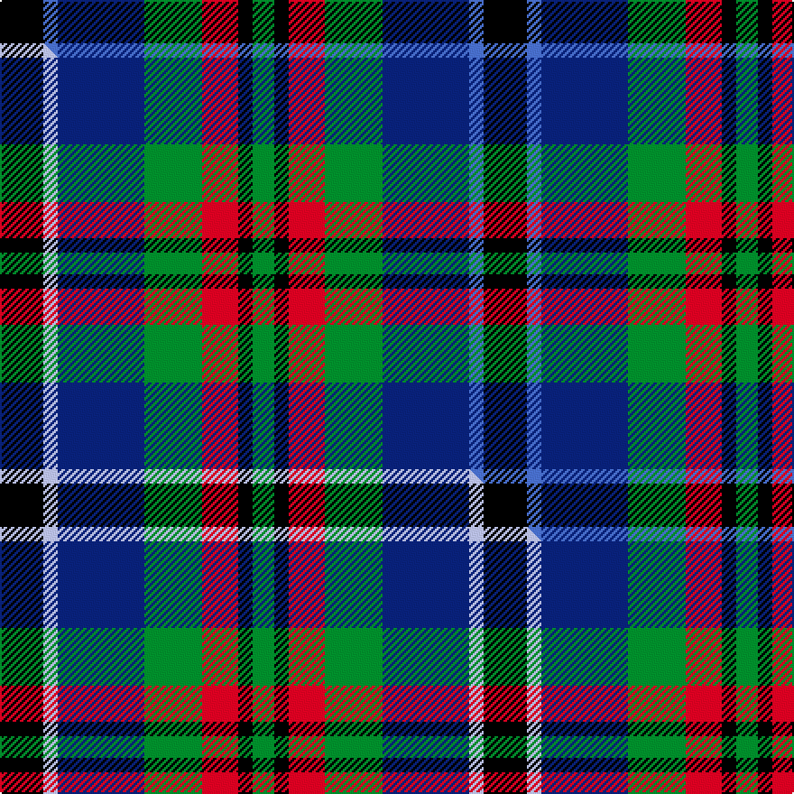

This page is one **sett** — a single exact thread-count. It belongs to the [tartan](/setts/k6b2db12g8r5k2g3/)
(the same proportion at any scale), whose colour order is pattern [GKRGBBK](/stripes/gkrgbbk/).

Part of the [Cooke](/tartans/cooke/) tartan — the named design grouping this sett with its other cloths.

Sourced from weddslist.  It is a [7 stripe tartan](/stripes/stripes7/).

Original link http://www.weddslist.com/cgi-bin/tartans/pg.pl?source=sts

## Thread count
K/24 B8 DB48 G32 R20 K8 G/12

One full sett is **268 threads**.

## Palette
<table><thead><tr><th>Colour</th><th>Shade</th><th>OKLCh</th></tr></thead><tbody><tr><td>B</td><td><code style="background-color:#466CC8;">#466CC8</code> <small style="color:#888">#466CC8</small></td><td><small style="color:#888">oklch(55.1% 0.149 265.0)</small></td></tr><tr><td>DB</td><td><code style="background-color:#082077;">#082077</code> <small style="color:#888">#082077</small></td><td><small style="color:#888">oklch(30.0% 0.149 265.1)</small></td></tr><tr><td>G</td><td><code style="background-color:#008B2A;">#008B2A</code> <small style="color:#888">#008B2A</small></td><td><small style="color:#888">oklch(55.4% 0.170 145.9)</small></td></tr><tr><td>K</td><td><code style="background-color:#000000;">#000000</code> <small style="color:#888">#000000</small></td><td><small style="color:#888">oklch(0.0% 0.000 0.0)</small></td></tr><tr><td>R</td><td><code style="background-color:#D60020;">#D60020</code> <small style="color:#888">#D60020</small></td><td><small style="color:#888">oklch(55.2% 0.224 25.5)</small></td></tr></tbody></table>

# Sample pattern

## Compared to the master

This cloth is one sett of its design; the master sett (the exemplar the design is anchored on) is below for comparison.

Its **ΔTartan distance** from the master is **0.03** — the same measure the nearest-tartans table ranks by (0 is identical; a re-scale of the same cloth is near 0, a recolour or a different proportion further).

<figure class="master-compare" style="margin:0">

this sett
master sett ★

<figcaption style="color:#888;font-size:smaller">One weave of this sett against the <a href="/setts/k6lb2db12g8r5k2g3/">master sett ★</a>, split on the diagonal: a shared proportion runs seamlessly across it with only the shades shifting; a different proportion breaks on it.</figcaption>
</figure>

## Nearest tartan variants

The nearest existing variants by ΔTartan distance, with this cloth at the top so the swatches line up against it.

ΔTartan

Threads

Variant

Sett

—

268

<a href="/variants/s7/k6b2db12g8r5k2g3~x4/">Cooke</a>

<a href="/ttd/edit/#slug=k6lb2db12g8r5k2g3~x4&amp;base=k6b2db12g8r5k2g3~x4" title="compare in the TTD">0.03</a>

268

<a href="/variants/s7/k6lb2db12g8r5k2g3~x4/">Cooke (Personal)</a>

<a href="/ttd/edit/#slug=y8g4db16g4k14y14db4t3~x2&amp;base=k6b2db12g8r5k2g3~x4" title="compare in the TTD">1.26</a>

246

<a href="/variants/s8/y8g4db16g4k14y14db4t3~x2/">Hinnigan (Personal)</a>

<a href="/ttd/edit/#slug=r4g11k11g2db11dg3~x4&amp;base=k6b2db12g8r5k2g3~x4" title="compare in the TTD">1.48</a>

308

<a href="/variants/s6/r4g11k11g2db11dg3~x4/">Casely</a>

<a href="/ttd/edit/#slug=db4lg2db10k12dg10lr3dg2lr4~x2~lg2909145-dg1405139&amp;base=k6b2db12g8r5k2g3~x4" title="compare in the TTD">1.80</a>

172

<a href="/variants/s8/db4lg2db10k12dg10lr3dg2lr4~x2~lg2909145-dg1405139/">Business Air</a>

<a href="/ttd/edit/#slug=k4t21dy10y4k20r6t3~x2&amp;base=k6b2db12g8r5k2g3~x4" title="compare in the TTD">1.83</a>

258

<a href="/variants/s7/k4t21dy10y4k20r6t3~x2/">Swankie (Personal)</a>

<a href="/ttd/edit/#slug=k4g16k14y3db16r4~x2&amp;base=k6b2db12g8r5k2g3~x4" title="compare in the TTD">1.86</a>

212

<a href="/variants/s6/k4g16k14y3db16r4~x2/">Birse</a>

<a href="/ttd/edit/#slug=k4dg16k14ly3t16r4~x2&amp;base=k6b2db12g8r5k2g3~x4" title="compare in the TTD">1.86</a>

212

<a href="/variants/s6/k4dg16k14ly3t16r4~x2/">Birse</a>

<a href="/ttd/edit/#slug=k1g6k6g1dp2dy2db6w1~x4&amp;base=k6b2db12g8r5k2g3~x4" title="compare in the TTD">1.88</a>

192

<a href="/variants/s8/k1g6k6g1dp2dy2db6w1~x4/">Hebridean Celebration</a>

<a href="/ttd/edit/#slug=dr1k1g6k6db6lr1~x4&amp;base=k6b2db12g8r5k2g3~x4" title="compare in the TTD">1.89</a>

160

<a href="/variants/s6/dr1k1g6k6db6lr1~x4/">Gaines Center for the Humanities</a>

<a href="/ttd/edit/#slug=k2g17k16r2db17w2~x2&amp;base=k6b2db12g8r5k2g3~x4" title="compare in the TTD">1.97</a>

216

<a href="/variants/s6/k2g17k16r2db17w2~x2/">Galbraith</a>

## Neighbour map

Every grey dot is one of 13620 variants placed by the first two principal components of the ΔTartan feature space (42% of its variance). Red is this tartan; blue dots are its nearest — click one to open its page.

<svg viewBox="0 0 640 380" role="img" style="max-width:100%;height:auto;border:1px solid #e0e0e0;border-radius:4px;display:block" xmlns="http://www.w3.org/2000/svg"><image href="/nn/cloud.v1.png" width="640" height="380"/><a href="/variants/s7/k6lb2db12g8r5k2g3~x4/"><circle cx="70.8" cy="214.3" r="4" fill="#3465a4"><title>Cooke (Personal)</title></circle></a><a href="/variants/s8/y8g4db16g4k14y14db4t3~x2/"><circle cx="86.2" cy="222.2" r="4" fill="#3465a4"><title>Hinnigan (Personal)</title></circle></a><a href="/variants/s6/r4g11k11g2db11dg3~x4/"><circle cx="73.2" cy="233.3" r="4" fill="#3465a4"><title>Casely</title></circle></a><a href="/variants/s8/db4lg2db10k12dg10lr3dg2lr4~x2~lg2909145-dg1405139/"><circle cx="65.4" cy="208.7" r="4" fill="#3465a4"><title>Business Air</title></circle></a><a href="/variants/s7/k4t21dy10y4k20r6t3~x2/"><circle cx="108.7" cy="195.2" r="4" fill="#3465a4"><title>Swankie (Personal)</title></circle></a><a href="/variants/s6/k4g16k14y3db16r4~x2/"><circle cx="78.8" cy="226.5" r="4" fill="#3465a4"><title>Birse</title></circle></a><a href="/variants/s6/k4dg16k14ly3t16r4~x2/"><circle cx="77.4" cy="226.2" r="4" fill="#3465a4"><title>Birse</title></circle></a><a href="/variants/s8/k1g6k6g1dp2dy2db6w1~x4/"><circle cx="45.6" cy="189.4" r="4" fill="#3465a4"><title>Hebridean Celebration</title></circle></a><a href="/variants/s6/dr1k1g6k6db6lr1~x4/"><circle cx="99.9" cy="212.9" r="4" fill="#3465a4"><title>Gaines Center for the Humanities</title></circle></a><a href="/variants/s6/k2g17k16r2db17w2~x2/"><circle cx="109.5" cy="191.6" r="4" fill="#3465a4"><title>Galbraith</title></circle></a><circle cx="76.0" cy="216.1" r="5" fill="#c00000"/><text x="320" y="376" text-anchor="middle" font-size="11" fill="#999">ground</text><text x="11" y="190" text-anchor="middle" font-size="11" fill="#999" transform="rotate(-90 11 190)">complexity</text></svg>

ID: /variants/s7/k6b2db12g8r5k2g3~x4/
