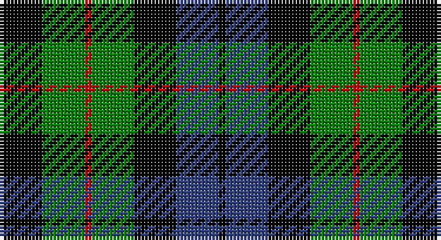

This page is one **sett** — a single exact thread-count. It belongs to the [tartan](/setts/k6g6r1g6k6db6k1/)
(the same proportion at any scale), whose colour order is pattern [KBKGRGK](/stripes/kbkgrgk/).

Part of the [MacCallum](/tartans/maccallum/) tartan — the named design grouping this sett with its other cloths.

Sourced from weddslist.  It is a [7 stripe tartan](/stripes/stripes7/).

Original link http://www.weddslist.com/cgi-bin/tartans/pg.pl?source=sts

## Thread count
K/12 G12 R2 G12 K12 B12 K/2

One full sett is **114 threads**.

## Palette

Palette: <strong>Ingles Buchan</strong> <small style="color:#888">(1 of 4 colours)</small>
<table><thead><tr><th>Colour</th><th>Threads</th><th>Shade</th><th>Base</th><th>OKLCh</th></tr></thead><tbody><tr><td>K/</td><td style="text-align:right;font-variant-numeric:tabular-nums">12</td><td><code style="background-color:#000000;">#000000</code> <small style="color:#888">#000000</small></td><td>K <code style="background-color:#000000;">#000000</code></td><td><small style="color:#888">oklch(0.0% 0.000 0.0)</small></td></tr><tr><td>G</td><td style="text-align:right;font-variant-numeric:tabular-nums">12</td><td><code style="background-color:#008000;">#008000</code> <small style="color:#888">#008000</small></td><td>G <code style="background-color:#006100;">#006100</code></td><td><small style="color:#888">oklch(52.0% 0.177 142.5)</small></td></tr><tr><td>R</td><td style="text-align:right;font-variant-numeric:tabular-nums">2</td><td><code style="background-color:#C00000;">#C00000</code> <small style="color:#888">#C00000</small></td><td>R <code style="background-color:#CC0000;">#CC0000</code></td><td><small style="color:#888">oklch(50.7% 0.208 29.2)</small></td></tr><tr><td>G</td><td style="text-align:right;font-variant-numeric:tabular-nums">12</td><td><code style="background-color:#008000;">#008000</code> <small style="color:#888">#008000</small></td><td>G <code style="background-color:#006100;">#006100</code></td><td><small style="color:#888">oklch(52.0% 0.177 142.5)</small></td></tr><tr><td>K</td><td style="text-align:right;font-variant-numeric:tabular-nums">12</td><td><code style="background-color:#000000;">#000000</code> <small style="color:#888">#000000</small></td><td>K <code style="background-color:#000000;">#000000</code></td><td><small style="color:#888">oklch(0.0% 0.000 0.0)</small></td></tr><tr><td>B</td><td style="text-align:right;font-variant-numeric:tabular-nums">12</td><td><code style="background-color:#304080;">#304080</code> <small style="color:#888">#304080</small></td><td>B <code style="background-color:#2A418A;">#2A418A</code></td><td><small style="color:#888">oklch(39.4% 0.109 270.2)</small></td></tr><tr><td>K/</td><td style="text-align:right;font-variant-numeric:tabular-nums">2</td><td><code style="background-color:#000000;">#000000</code> <small style="color:#888">#000000</small></td><td>K <code style="background-color:#000000;">#000000</code></td><td><small style="color:#888">oklch(0.0% 0.000 0.0)</small></td></tr></tbody></table>

# Sample pattern

## Compared to the master

This cloth is one sett of its design; the master sett (the exemplar the design is anchored on) is below for comparison.

<figure style="margin:0"><figcaption style="color:#888;font-size:smaller">this sett</figcaption></figure>
<figure style="margin:0"><figcaption style="color:#888;font-size:smaller"><a href="/setts/dg8k2b1dg4k6db6k1/">master sett →</a></figcaption></figure>

## Nearest tartans

The nearest existing variants by ΔTartan distance, with this tartan at the top so the swatches line up against it.

ΔTartan

Tartan

Sett

—

<a href="/ttd/edit/#slug=k6g6r1g6k6db6k1~x2">MacCallum</a> <a class="nn-out" href="/variants/s7/k6g6r1g6k6db6k1~x2/" title="open its dictionary page">↗</a>

0.28

<a href="/ttd/edit/#slug=k12g12k2g12k12db12t3~x2&amp;base=k6g6r1g6k6db6k1~x2">MacIntyre</a> <a class="nn-out" href="/variants/s7/k12g12k2g12k12db12t3~x2/" title="open its dictionary page">↗</a>

0.37

<a href="/ttd/edit/#slug=k7g6w1g6k7db7k1~x4&amp;base=k6g6r1g6k6db6k1~x2">MacLaggan</a> <a class="nn-out" href="/variants/s7/k7g6w1g6k7db7k1~x4/" title="open its dictionary page">↗</a>

0.61

<a href="/ttd/edit/#slug=k6g6ly1g6k6p6k1~x4&amp;base=k6g6r1g6k6db6k1~x2">Abercrombie, (Wilson's No 64)</a> <a class="nn-out" href="/variants/s7/k6g6ly1g6k6p6k1~x4/" title="open its dictionary page">↗</a>

0.62

<a href="/ttd/edit/#slug=k6g6w1g6k6p6k1~x4&amp;base=k6g6r1g6k6db6k1~x2">Wilson's, No 64 or Abercrombie</a> <a class="nn-out" href="/variants/s7/k6g6w1g6k6p6k1~x4/" title="open its dictionary page">↗</a>

0.71

<a href="/ttd/edit/#slug=k11g12k2g12k12p12w3~x2&amp;base=k6g6r1g6k6db6k1~x2">Wilson's, No 97</a> <a class="nn-out" href="/variants/s7/k11g12k2g12k12p12w3~x2/" title="open its dictionary page">↗</a>

0.74

<a href="/ttd/edit/#slug=k4g4ly1g4k4db4k1~x2&amp;base=k6g6r1g6k6db6k1~x2">MacKay, Coat</a> <a class="nn-out" href="/variants/s7/k4g4ly1g4k4db4k1~x2/" title="open its dictionary page">↗</a>

0.74

<a href="/ttd/edit/#slug=k4g4k1g4k4db4ly1~x2&amp;base=k6g6r1g6k6db6k1~x2">Unnamed, No 39</a> <a class="nn-out" href="/variants/s7/k4g4k1g4k4db4ly1~x2/" title="open its dictionary page">↗</a>

0.74

<a href="/ttd/edit/#slug=k9g9ly2g9k9db9k3~x2&amp;base=k6g6r1g6k6db6k1~x2">Campbell of Breadalbane (Clan)</a> <a class="nn-out" href="/variants/s7/k9g9ly2g9k9db9k3~x2/" title="open its dictionary page">↗</a>

0.75

<a href="/ttd/edit/#slug=k4g4w1g4k4db4k1~x4&amp;base=k6g6r1g6k6db6k1~x2">Graham of Montrose</a> <a class="nn-out" href="/variants/s7/k4g4w1g4k4db4k1~x4/" title="open its dictionary page">↗</a>

0.80

<a href="/ttd/edit/#slug=db4g6w1g6k6db6k2~x4&amp;base=k6g6r1g6k6db6k1~x2">MacNeil of Colonsay</a> <a class="nn-out" href="/variants/s7/db4g6w1g6k6db6k2~x4/" title="open its dictionary page">↗</a>

## Neighbour map

Every grey dot is one of 14360 variants placed by the first two principal components of the ΔTartan feature space (44% of its variance). Red is this tartan; blue dots are its nearest — click one to open its page.

<svg viewBox="0 0 640 380" role="img" style="max-width:100%;height:auto;border:1px solid #e0e0e0;border-radius:4px;display:block" xmlns="http://www.w3.org/2000/svg"><image href="/nn/cloud.v1.png" width="640" height="380"/><a href="/variants/s7/k12g12k2g12k12db12t3~x2/"><circle cx="130.6" cy="263.7" r="4" fill="#3465a4"><title>MacIntyre</title></circle></a><a href="/variants/s7/k7g6w1g6k7db7k1~x4/"><circle cx="152.4" cy="250.4" r="4" fill="#3465a4"><title>MacLaggan</title></circle></a><a href="/variants/s7/k6g6ly1g6k6p6k1~x4/"><circle cx="137.4" cy="252.0" r="4" fill="#3465a4"><title>Abercrombie, (Wilson's No 64)</title></circle></a><a href="/variants/s7/k6g6w1g6k6p6k1~x4/"><circle cx="136.4" cy="251.7" r="4" fill="#3465a4"><title>Wilson's, No 64 or Abercrombie</title></circle></a><a href="/variants/s7/k11g12k2g12k12p12w3~x2/"><circle cx="121.3" cy="253.9" r="4" fill="#3465a4"><title>Wilson's, No 97</title></circle></a><a href="/variants/s7/k4g4ly1g4k4db4k1~x2/"><circle cx="110.8" cy="279.0" r="4" fill="#3465a4"><title>MacKay, Coat</title></circle></a><a href="/variants/s7/k4g4k1g4k4db4ly1~x2/"><circle cx="110.8" cy="279.0" r="4" fill="#3465a4"><title>Unnamed, No 39</title></circle></a><a href="/variants/s7/k9g9ly2g9k9db9k3~x2/"><circle cx="129.0" cy="283.4" r="4" fill="#3465a4"><title>Campbell of Breadalbane (Clan)</title></circle></a><a href="/variants/s7/k4g4w1g4k4db4k1~x4/"><circle cx="109.2" cy="278.4" r="4" fill="#3465a4"><title>Graham of Montrose</title></circle></a><a href="/variants/s7/db4g6w1g6k6db6k2~x4/"><circle cx="119.8" cy="262.7" r="4" fill="#3465a4"><title>MacNeil of Colonsay</title></circle></a><circle cx="141.2" cy="259.4" r="5" fill="#c00000"/></svg>

ID: /variants/s7/k6g6r1g6k6db6k1~x2/
