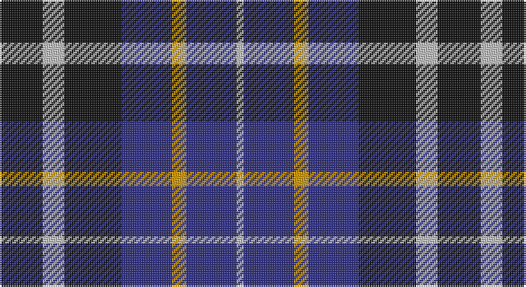

This page is one **sett** — a single exact thread-count. It belongs to the [tartan](/setts/k6lb3k8db7lo2db7lb1/)
(the same proportion at any scale), whose colour order is pattern [KWKBYBW](/stripes/kwkbybw/).

Sourced from tartans-authority.  It is a [7 stripe tartan](/stripes/stripes7/).

Original link http://www.tartansauthority.com/tartan-ferret/display/2425/

## Also known as

This cloth is also recorded under:

- St. Johnstone F.C.
- St. Johnstone Football Club

## Register references

External register numbers recorded for this tartan.

- Scottish Tartans Authority (ITI): 2425

## Thread count
K/24 N12 K32 DB28 DY8 DB28 N/4

One full sett is **244 threads**.

## Palette

Palette: <strong>Tartan Register</strong> <small style="color:#888">(3 of 4 colours)</small>
<table><thead><tr><th>Colour</th><th>Threads</th><th>Shade</th><th>Base</th><th>OKLCh</th></tr></thead><tbody><tr><td>K/</td><td style="text-align:right;font-variant-numeric:tabular-nums">24</td><td><code style="background-color:#101010;">#101010</code> <small style="color:#888">#101010</small></td><td>K <code style="background-color:#000000;">#000000</code></td><td><small style="color:#888">oklch(17.3% 0.000 89.9)</small></td></tr><tr><td>N</td><td style="text-align:right;font-variant-numeric:tabular-nums">12</td><td><code style="background-color:#C0C0C0;">#C0C0C0</code> <small style="color:#888">#C0C0C0</small></td><td>W <code style="background-color:#F7F7F7;">#F7F7F7</code></td><td><small style="color:#888">oklch(80.8% 0.000 89.9)</small></td></tr><tr><td>K</td><td style="text-align:right;font-variant-numeric:tabular-nums">32</td><td><code style="background-color:#101010;">#101010</code> <small style="color:#888">#101010</small></td><td>K <code style="background-color:#000000;">#000000</code></td><td><small style="color:#888">oklch(17.3% 0.000 89.9)</small></td></tr><tr><td>DB</td><td style="text-align:right;font-variant-numeric:tabular-nums">28</td><td><code style="background-color:#2C2C80;">#2C2C80</code> <small style="color:#888">#2C2C80</small></td><td>B <code style="background-color:#2A418A;">#2A418A</code></td><td><small style="color:#888">oklch(35.0% 0.138 276.6)</small></td></tr><tr><td>DY</td><td style="text-align:right;font-variant-numeric:tabular-nums">8</td><td><code style="background-color:#D09800;">#D09800</code> <small style="color:#888">#D09800</small></td><td>Y <code style="background-color:#F2BF00;">#F2BF00</code></td><td><small style="color:#888">oklch(71.4% 0.147 82.1)</small></td></tr><tr><td>DB</td><td style="text-align:right;font-variant-numeric:tabular-nums">28</td><td><code style="background-color:#2C2C80;">#2C2C80</code> <small style="color:#888">#2C2C80</small></td><td>B <code style="background-color:#2A418A;">#2A418A</code></td><td><small style="color:#888">oklch(35.0% 0.138 276.6)</small></td></tr><tr><td>N/</td><td style="text-align:right;font-variant-numeric:tabular-nums">4</td><td><code style="background-color:#C0C0C0;">#C0C0C0</code> <small style="color:#888">#C0C0C0</small></td><td>W <code style="background-color:#F7F7F7;">#F7F7F7</code></td><td><small style="color:#888">oklch(80.8% 0.000 89.9)</small></td></tr></tbody></table>

# Sample pattern

## Nearest tartans

The nearest existing variants by ΔTartan distance, with this tartan at the top so the swatches line up against it.

ΔTartan

Tartan

Sett

—

<a href="/ttd/edit/#slug=k6lb3k8db7lo2db7lb1~x4">St. Johnstone F.C. (Sports)</a> <a class="nn-out" href="/variants/s7/k6lb3k8db7lo2db7lb1~x4/" title="open its dictionary page">↗</a>

0.81

<a href="/ttd/edit/#slug=db9k7o5r1o5k1o2~x4&amp;base=k6lb3k8db7lo2db7lb1~x4">Greyhound Grenadiers (Corporate)</a> <a class="nn-out" href="/variants/s7/db9k7o5r1o5k1o2~x4/" title="open its dictionary page">↗</a>

1.02

<a href="/ttd/edit/#slug=dp3k1dp8k6dg8k1w2~x2&amp;base=k6lb3k8db7lo2db7lb1~x4">Baillie (Highland Society)</a> <a class="nn-out" href="/variants/s7/dp3k1dp8k6dg8k1w2~x2/" title="open its dictionary page">↗</a>

1.11

<a href="/variants/s8/db3w3db5k6ly1~x4/">Kilmarnock Football Club (Old)</a>

1.18

<a href="/variants/s12/k6lb3k8db7lo2db7lb1~x4/">St. Johnstone Football Club</a>

1.19

<a href="/ttd/edit/#slug=db9k9r3db9k9ly1~x4&amp;base=k6lb3k8db7lo2db7lb1~x4">Old Brigade</a> <a class="nn-out" href="/variants/s6/db9k9r3db9k9ly1~x4/" title="open its dictionary page">↗</a>

1.28

<a href="/ttd/edit/#slug=n6db3n6db20k20db8w4~x2&amp;base=k6lb3k8db7lo2db7lb1~x4">Allianz Deutschland 2012</a> <a class="nn-out" href="/variants/s7/n6db3n6db20k20db8w4~x2/" title="open its dictionary page">↗</a>

1.31

<a href="/ttd/edit/#slug=lg16k3lg16k26dp4k26o20k3o8&amp;base=k6lb3k8db7lo2db7lb1~x4">Scotsburn Croft</a> <a class="nn-out" href="/variants/s9/lg16k3lg16k26dp4k26o20k3o8/" title="open its dictionary page">↗</a>

1.32

<a href="/ttd/edit/#slug=db14dg21db4r21db14ly2~x2&amp;base=k6lb3k8db7lo2db7lb1~x4">Kilgour</a> <a class="nn-out" href="/variants/s6/db14dg21db4r21db14ly2~x2/" title="open its dictionary page">↗</a>

1.33

<a href="/ttd/edit/#slug=db2ly1db7w1k7w2~x6&amp;base=k6lb3k8db7lo2db7lb1~x4">Hawick Rugby Club (Corporate)</a> <a class="nn-out" href="/variants/s6/db2ly1db7w1k7w2~x6/" title="open its dictionary page">↗</a>

1.33

<a href="/ttd/edit/#slug=db14g21db4r21db14ly2~x2&amp;base=k6lb3k8db7lo2db7lb1~x4">Kilgour</a> <a class="nn-out" href="/variants/s6/db14g21db4r21db14ly2~x2/" title="open its dictionary page">↗</a>

## Neighbour map

Every grey dot is one of 14360 variants placed by the first two principal components of the ΔTartan feature space (44% of its variance). Red is this tartan; blue dots are its nearest — click one to open its page.

<svg viewBox="0 0 640 380" role="img" style="max-width:100%;height:auto;border:1px solid #e0e0e0;border-radius:4px;display:block" xmlns="http://www.w3.org/2000/svg"><image href="/nn/cloud.v1.png" width="640" height="380"/><a href="/variants/s7/db9k7o5r1o5k1o2~x4/"><circle cx="185.3" cy="222.0" r="4" fill="#3465a4"><title>Greyhound Grenadiers (Corporate)</title></circle></a><a href="/variants/s7/dp3k1dp8k6dg8k1w2~x2/"><circle cx="177.0" cy="227.0" r="4" fill="#3465a4"><title>Baillie (Highland Society)</title></circle></a><a href="/variants/s8/db3w3db5k6ly1~x4/"><circle cx="124.5" cy="251.7" r="4" fill="#3465a4"><title>Kilmarnock Football Club (Old)</title></circle></a><a href="/variants/s12/k6lb3k8db7lo2db7lb1~x4/"><circle cx="181.3" cy="225.7" r="4" fill="#3465a4"><title>St. Johnstone Football Club</title></circle></a><a href="/variants/s6/db9k9r3db9k9ly1~x4/"><circle cx="233.7" cy="265.4" r="4" fill="#3465a4"><title>Old Brigade</title></circle></a><a href="/variants/s7/n6db3n6db20k20db8w4~x2/"><circle cx="199.7" cy="237.6" r="4" fill="#3465a4"><title>Allianz Deutschland 2012</title></circle></a><a href="/variants/s9/lg16k3lg16k26dp4k26o20k3o8/"><circle cx="197.2" cy="210.7" r="4" fill="#3465a4"><title>Scotsburn Croft</title></circle></a><a href="/variants/s6/db14dg21db4r21db14ly2~x2/"><circle cx="197.4" cy="228.2" r="4" fill="#3465a4"><title>Kilgour</title></circle></a><a href="/variants/s6/db2ly1db7w1k7w2~x6/"><circle cx="196.8" cy="218.7" r="4" fill="#3465a4"><title>Hawick Rugby Club (Corporate)</title></circle></a><a href="/variants/s6/db14g21db4r21db14ly2~x2/"><circle cx="185.2" cy="225.7" r="4" fill="#3465a4"><title>Kilgour</title></circle></a><circle cx="180.5" cy="244.1" r="5" fill="#c00000"/></svg>

ID: /variants/s7/k6lb3k8db7lo2db7lb1~x4/
