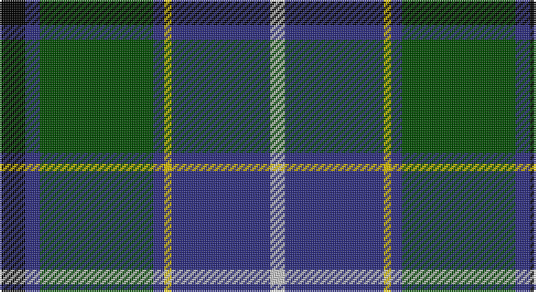

This page is one **sett** — a single exact thread-count. It belongs to the [tartan](/setts/k7db4dg31db3ly2db27lb4/)
(the same proportion at any scale), whose colour order is pattern [KBGBYBW](/stripes/kbgbybw/).

Part of the [Wishart, hunting](/tartans/wishart-hunting/) tartan — the named design grouping this sett with its other cloths.

Sourced from tartans-authority.  It is a [7 stripe tartan](/stripes/stripes7/).

Original link http://www.tartansauthority.com/tartan-ferret/display/2105/

## Also known as

This cloth is also recorded under:

- Wishart Htg
- Wishart Hunting

## Register references

External register numbers recorded for this tartan.

- Scottish Tartans Authority (ITI): 2105

## Thread count
K/14 DB8 G62 DB6 Y4 DB54 N/8

One full sett is **290 threads**.

## Palette

Palette: <strong>Tartan Register</strong>
<table><thead><tr><th>Colour</th><th>Threads</th><th>Shade</th><th>Base</th><th>OKLCh</th></tr></thead><tbody><tr><td>K/</td><td style="text-align:right;font-variant-numeric:tabular-nums">14</td><td><code style="background-color:#000000;">#000000</code> <small style="color:#888">#000000</small></td><td>K <code style="background-color:#000000;">#000000</code></td><td><small style="color:#888">oklch(0.0% 0.000 0.0)</small></td></tr><tr><td>DB</td><td style="text-align:right;font-variant-numeric:tabular-nums">8</td><td><code style="background-color:#2C2C80;">#2C2C80</code> <small style="color:#888">#2C2C80</small></td><td>B <code style="background-color:#2A418A;">#2A418A</code></td><td><small style="color:#888">oklch(35.0% 0.138 276.6)</small></td></tr><tr><td>G</td><td style="text-align:right;font-variant-numeric:tabular-nums">62</td><td><code style="background-color:#004C00;">#004C00</code> <small style="color:#888">#004C00</small></td><td>G <code style="background-color:#006100;">#006100</code></td><td><small style="color:#888">oklch(36.1% 0.123 142.5)</small></td></tr><tr><td>DB</td><td style="text-align:right;font-variant-numeric:tabular-nums">6</td><td><code style="background-color:#2C2C80;">#2C2C80</code> <small style="color:#888">#2C2C80</small></td><td>B <code style="background-color:#2A418A;">#2A418A</code></td><td><small style="color:#888">oklch(35.0% 0.138 276.6)</small></td></tr><tr><td>Y</td><td style="text-align:right;font-variant-numeric:tabular-nums">4</td><td><code style="background-color:#E8C000;">#E8C000</code> <small style="color:#888">#E8C000</small></td><td>Y <code style="background-color:#F2BF00;">#F2BF00</code></td><td><small style="color:#888">oklch(81.9% 0.168 93.7)</small></td></tr><tr><td>DB</td><td style="text-align:right;font-variant-numeric:tabular-nums">54</td><td><code style="background-color:#2C2C80;">#2C2C80</code> <small style="color:#888">#2C2C80</small></td><td>B <code style="background-color:#2A418A;">#2A418A</code></td><td><small style="color:#888">oklch(35.0% 0.138 276.6)</small></td></tr><tr><td>N/</td><td style="text-align:right;font-variant-numeric:tabular-nums">8</td><td><code style="background-color:#C8C8C8;">#C8C8C8</code> <small style="color:#888">#C8C8C8</small></td><td>W <code style="background-color:#F7F7F7;">#F7F7F7</code></td><td><small style="color:#888">oklch(83.3% 0.000 89.9)</small></td></tr></tbody></table>

# Sample pattern

## Compared to the master

This cloth is one sett of its design; the master sett (the exemplar the design is anchored on) is below for comparison.

<figure style="margin:0"><figcaption style="color:#888;font-size:smaller">this sett</figcaption></figure>
<figure style="margin:0"><figcaption style="color:#888;font-size:smaller"><a href="/setts/k2db2g16dbi2ly1dbi13w2/">master sett →</a></figcaption></figure>

## Nearest tartans

The nearest existing variants by ΔTartan distance, with this tartan at the top so the swatches line up against it.

ΔTartan

Tartan

Sett

—

<a href="/ttd/edit/#slug=k7db4dg31db3ly2db27lb4~x2">Wishart Htg (Clan)</a> <a class="nn-out" href="/variants/s7/k7db4dg31db3ly2db27lb4~x2/" title="open its dictionary page">↗</a>

0.77

<a href="/ttd/edit/#slug=k5g32db32r3db3ly3~x2&amp;base=k7db4dg31db3ly2db27lb4~x2">Carmichael</a> <a class="nn-out" href="/variants/s6/k5g32db32r3db3ly3~x2/" title="open its dictionary page">↗</a>

0.79

<a href="/ttd/edit/#slug=db18dp2db16k13g3k2g42lo3~x2&amp;base=k7db4dg31db3ly2db27lb4~x2">McFadden (Personal)</a> <a class="nn-out" href="/variants/s8/db18dp2db16k13g3k2g42lo3~x2/" title="open its dictionary page">↗</a>

0.85

<a href="/ttd/edit/#slug=g35k3dbi26k4db4w3~x2&amp;base=k7db4dg31db3ly2db27lb4~x2">Pride of Yorkland (Fashion)</a> <a class="nn-out" href="/variants/s6/g35k3dbi26k4db4w3~x2/" title="open its dictionary page">↗</a>

0.86

<a href="/ttd/edit/#slug=db12k4g4dp1g4k1w1~x4&amp;base=k7db4dg31db3ly2db27lb4~x2">Alexander - 2000 (Name)</a> <a class="nn-out" href="/variants/s7/db12k4g4dp1g4k1w1~x4/" title="open its dictionary page">↗</a>

0.91

<a href="/ttd/edit/#slug=r6db27t2g2t2g30w4~x2&amp;base=k7db4dg31db3ly2db27lb4~x2">MX-5 Owners' Club</a> <a class="nn-out" href="/variants/s7/r6db27t2g2t2g30w4~x2/" title="open its dictionary page">↗</a>

0.93

<a href="/ttd/edit/#slug=g26r2g3db15dbi26ri2dbi3db4~x2&amp;base=k7db4dg31db3ly2db27lb4~x2">Grampian</a> <a class="nn-out" href="/variants/s8/g26r2g3db15dbi26ri2dbi3db4~x2/" title="open its dictionary page">↗</a>

0.95

<a href="/ttd/edit/#slug=k6g15w2db22r2k4~x2&amp;base=k7db4dg31db3ly2db27lb4~x2">Leslie, Hebridean</a> <a class="nn-out" href="/variants/s6/k6g15w2db22r2k4~x2/" title="open its dictionary page">↗</a>

0.96

<a href="/ttd/edit/#slug=n10k7lt2lb2k27b7lt2b7~x2&amp;base=k7db4dg31db3ly2db27lb4~x2">Croy, Jake (Personal)</a> <a class="nn-out" href="/variants/s8/n10k7lt2lb2k27b7lt2b7~x2/" title="open its dictionary page">↗</a>

0.97

<a href="/ttd/edit/#slug=r2db6g15b9db30b9g6lo2~x2&amp;base=k7db4dg31db3ly2db27lb4~x2">Miller</a> <a class="nn-out" href="/variants/s8/r2db6g15b9db30b9g6lo2~x2/" title="open its dictionary page">↗</a>

0.98

<a href="/ttd/edit/#slug=db24k8g8dp2g8k1w2~x2&amp;base=k7db4dg31db3ly2db27lb4~x2">Alexander</a> <a class="nn-out" href="/variants/s7/db24k8g8dp2g8k1w2~x2/" title="open its dictionary page">↗</a>

## Neighbour map

Every grey dot is one of 14360 variants placed by the first two principal components of the ΔTartan feature space (44% of its variance). Red is this tartan; blue dots are its nearest — click one to open its page.

<svg viewBox="0 0 640 380" role="img" style="max-width:100%;height:auto;border:1px solid #e0e0e0;border-radius:4px;display:block" xmlns="http://www.w3.org/2000/svg"><image href="/nn/cloud.v1.png" width="640" height="380"/><a href="/variants/s6/k5g32db32r3db3ly3~x2/"><circle cx="250.5" cy="189.2" r="4" fill="#3465a4"><title>Carmichael</title></circle></a><a href="/variants/s8/db18dp2db16k13g3k2g42lo3~x2/"><circle cx="270.3" cy="160.7" r="4" fill="#3465a4"><title>McFadden (Personal)</title></circle></a><a href="/variants/s6/g35k3dbi26k4db4w3~x2/"><circle cx="252.4" cy="188.9" r="4" fill="#3465a4"><title>Pride of Yorkland (Fashion)</title></circle></a><a href="/variants/s7/db12k4g4dp1g4k1w1~x4/"><circle cx="223.0" cy="186.9" r="4" fill="#3465a4"><title>Alexander - 2000 (Name)</title></circle></a><a href="/variants/s7/r6db27t2g2t2g30w4~x2/"><circle cx="242.4" cy="159.2" r="4" fill="#3465a4"><title>MX-5 Owners' Club</title></circle></a><a href="/variants/s8/g26r2g3db15dbi26ri2dbi3db4~x2/"><circle cx="194.9" cy="175.6" r="4" fill="#3465a4"><title>Grampian</title></circle></a><a href="/variants/s6/k6g15w2db22r2k4~x2/"><circle cx="214.4" cy="198.6" r="4" fill="#3465a4"><title>Leslie, Hebridean</title></circle></a><a href="/variants/s8/n10k7lt2lb2k27b7lt2b7~x2/"><circle cx="266.5" cy="169.9" r="4" fill="#3465a4"><title>Croy, Jake (Personal)</title></circle></a><a href="/variants/s8/r2db6g15b9db30b9g6lo2~x2/"><circle cx="229.9" cy="181.6" r="4" fill="#3465a4"><title>Miller</title></circle></a><a href="/variants/s7/db24k8g8dp2g8k1w2~x2/"><circle cx="254.8" cy="159.8" r="4" fill="#3465a4"><title>Alexander</title></circle></a><circle cx="246.6" cy="169.8" r="5" fill="#c00000"/></svg>

ID: /variants/s7/k7db4dg31db3ly2db27lb4~x2/
