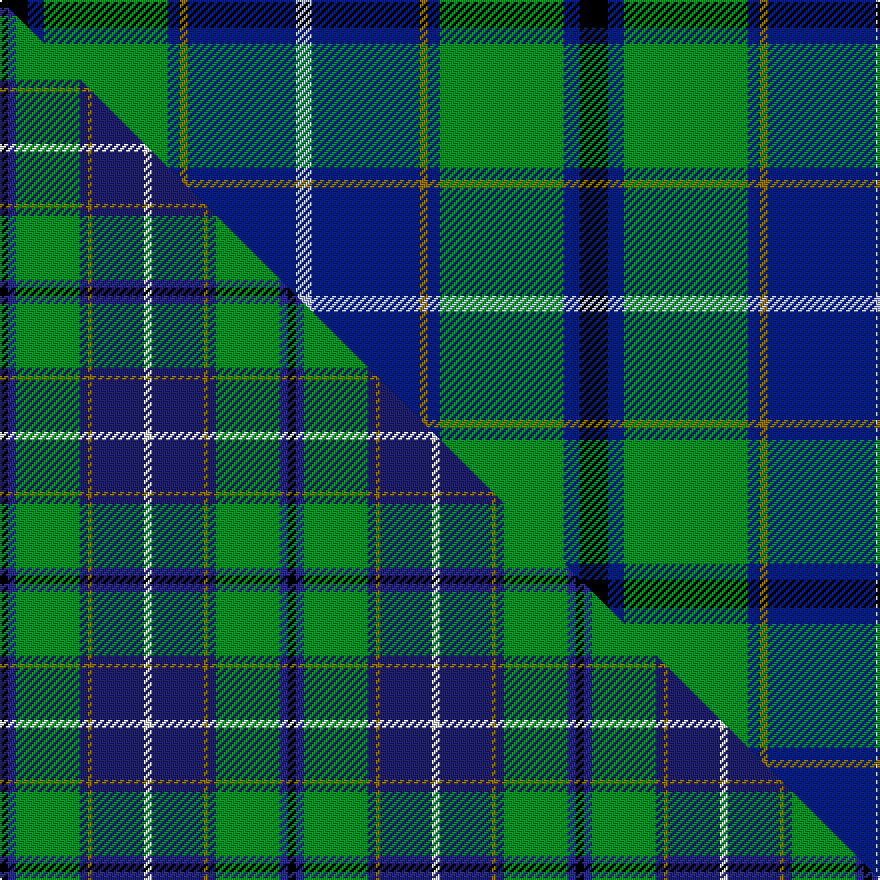

This is one **variant** — a specific cloth: this exact thread count and colourway, with its own
provenance below. It is one weaving of the [sett](/tartans/w/wi/wishart-hunting/) (the scale-free proportion — the
same cloth at any scale or shade), whose colour order is pattern [KBGBGBW](/stripes/kbgbgbw/).

Part of the [Wishart Hunting](/tartans/w/wi/wishart-hunting/) tartan — the named design grouping this sett with its other cloths.

Sourced from tartans-authority.  It is a [7 stripe tartan](/stripes/stripes7/).

Original link <code>http://www.tartansauthority.com/tartan-ferret/display/2105/</code> — retired · [Internet Archive copy](https://web.archive.org/web/*/http://www.tartansauthority.com/tartan-ferret/display/2105/*)

Dataset <small>— provenance for this record, inherited from the source manifest</small>

<dl class="dataset-prov">
<dt>source</dt><dd><a href="/sources/tartans-authority/">Scottish Tartans Authority</a></dd>
<dt>data captured from</dt><dd><a href="https://github.com/thetartan/tartan-database/blob/master/data/tartans-authority/data.csv">https://github.com/thetartan/tartan-database/blob/master/data/tartans-authority/data.csv</a></dd>
<dt>data date</dt><dd>1990 <small>(this record)</small></dd>
<dt>licence</dt><dd><a href="https://creativecommons.org/licenses/by-nc-nd/4.0/">CC BY-NC-ND 4.0</a></dd>
</dl>

Capture chain <small>— the hands this data passed through, oldest first; each capture carries its own licence</small>

<ol class="capture-chain">
<li><a href="https://www.tartansauthority.com/">Scottish Tartans Authority</a> <small>the heritage body’s archive — its tartan-ferret record browser is retired; dead record links are shown unlinked, with an Internet Archive copy (ITI numbers are not SRT references)</small></li>
<li><a href="https://github.com/thetartan/tartan-database">thetartan/tartan-database</a> <small>2016-2017</small> · <a href="https://creativecommons.org/licenses/by-nc-nd/4.0/">CC BY-NC-ND 4.0</a> <small>Levko Kravets's frozen compilation — the capture we vendored, and where its CC licence text came from</small></li>
<li>this dictionary <small>captured 2026-06-10 · commit 5bf86c7566</small> <small>each re-capture is a git commit to data/sources</small></li>
</ol>

## Register references

External register numbers recorded for this tartan.

- Scottish Tartans Authority (ITI): 2105

## Thread count
K/14 DB8 G62 DB6 Y4 DB54 LB/8

One full sett is **290 threads**.

## Palette
<table><thead><tr><th>Colour</th><th>Shade</th><th>OKLCh</th></tr></thead><tbody><tr><td>DB</td><td><code style="background-color:#082077;">#082077</code> <small style="color:#888">#082077</small></td><td><small style="color:#888">oklch(30.0% 0.149 265.1)</small></td></tr><tr><td>G</td><td><code style="background-color:#008B2A;">#008B2A</code> <small style="color:#888">#008B2A</small></td><td><small style="color:#888">oklch(55.4% 0.170 145.9)</small></td></tr><tr><td>K</td><td><code style="background-color:#000000;">#000000</code> <small style="color:#888">#000000</small></td><td><small style="color:#888">oklch(0.0% 0.000 0.0)</small></td></tr><tr><td>LB</td><td><code style="background-color:#B5BBDE;">#B5BBDE</code> <small style="color:#888">#B5BBDE</small></td><td><small style="color:#888">oklch(79.9% 0.050 277.6)</small></td></tr><tr><td>Y</td><td><code style="background-color:#8B6E00;">#8B6E00</code> <small style="color:#888">#8B6E00</small></td><td><small style="color:#888">oklch(55.1% 0.113 90.4)</small></td></tr></tbody></table>

# Sample pattern

## Compared to the master

This cloth is one sett of its design; the master sett (the exemplar the design is anchored on) is below for comparison.

Its **ΔTartan distance** from the master is **1.50** — the same measure the nearest-tartans table ranks by (0 is identical; a re-scale of the same cloth is near 0, a recolour or a different proportion further).

<figure class="master-compare" style="margin:0">

this sett
master sett ★

<figcaption style="color:#888;font-size:smaller">One weave of this sett against the <a href="/setts/k2dbi2g16db2y1db13w2/">master sett ★</a>, split on the diagonal: a shared proportion runs seamlessly across it with only the shades shifting; a different proportion breaks on it.</figcaption>
</figure>

## Nearest tartan variants

The nearest existing variants by ΔTartan distance, with this cloth at the top so the swatches line up against it.

ΔTartan

Threads

Variant

Sett

—

290

<a href="/variants/s7/k7db4g31db3y2db27lb4~x2/">Wishart Htg (Clan)</a>

<a href="/ttd/edit/#slug=g26db10k3db2dy2db10~x4&amp;base=k7db4g31db3y2db27lb4~x2" title="compare in the TTD">0.95</a>

280

<a href="/variants/s6/g26db10k3db2dy2db10~x4/">St. Andrews Old Course Hotel (Corp)</a>

<a href="/ttd/edit/#slug=k2n2g16db2y1db13w2~x2~n1604274-db0805267&amp;base=k7db4g31db3y2db27lb4~x2" title="compare in the TTD">1.50</a>

144

<a href="/variants/s7/k2dbi2g16db2y1db13w2~x2~dbi1604274-db0805267/">Wishart, hunting</a>

<a href="/ttd/edit/#slug=k2db2g16dt2y1dt13w2~x2~db1406275-dt1204274&amp;base=k7db4g31db3y2db27lb4~x2" title="compare in the TTD">1.50</a>

144

<a href="/variants/s7/k2dbi2g16db2y1db13w2~x2~dbi1406275-db1204274/">Wishart Hunting Family Tartan</a>

<a href="/ttd/edit/#slug=k3db3k3db22g26k2db1y3~x2&amp;base=k7db4g31db3y2db27lb4~x2" title="compare in the TTD">1.51</a>

240

<a href="/variants/s8/k3db3k3db22g26k2db1y3~x2/">Johnstone Clan Tartan</a>

<a href="/ttd/edit/#slug=g35k3dbi26k4db4w3~x2~dbi1406275-db1106275&amp;base=k7db4g31db3y2db27lb4~x2" title="compare in the TTD">1.78</a>

224

<a href="/variants/s6/g35k3dbi26k4db4w3~x2~dbi1406275-db1106275/">Pride of Yorkland (Fashion)</a>

<a href="/ttd/edit/#slug=w2dbi19k4dbi4k4g9db2k1~x4~dbi1705244-db1106275&amp;base=k7db4g31db3y2db27lb4~x2" title="compare in the TTD">1.91</a>

348

<a href="/variants/s8/w2dbi19k4dbi4k4g9db2k1~x4~dbi1705244-db1106275/">Dollar Academy (1999) (Corporate)</a>

<a href="/ttd/edit/#slug=db44ly3k20dr3db8lg34db5lg15~x2&amp;base=k7db4g31db3y2db27lb4~x2" title="compare in the TTD">1.92</a>

410

<a href="/variants/s8/db44ly3k20dr3db8lg34db5lg15~x2/">US Air Force Reserve Pipe Band</a>

<a href="/ttd/edit/#slug=db18dp2db16k13g3k2g42lo3~x2&amp;base=k7db4g31db3y2db27lb4~x2" title="compare in the TTD">1.95</a>

354

<a href="/variants/s8/db18dp2db16k13g3k2g42lo3~x2/">McFadden (Personal)</a>

<a href="/ttd/edit/#slug=k3db3g23db21w2~x2~db1406275&amp;base=k7db4g31db3y2db27lb4~x2" title="compare in the TTD">1.96</a>

198

<a href="/variants/s5/k3db3g23db21w2~x2~db1406275/">Douglas Clan Tartan</a>

<a href="/ttd/edit/#slug=g5db24g7k10g24dy2db2dy2r2~x2&amp;base=k7db4g31db3y2db27lb4~x2" title="compare in the TTD">2.04</a>

298

<a href="/variants/s9/g5db24g7k10g24dy2db2dy2r2~x2/">Maitland Chief</a>

## Neighbour map

Every grey dot is one of 13657 variants placed by the first two principal components of the ΔTartan feature space (42% of its variance). Red is this tartan; blue dots are its nearest — click one to open its page. The map is a flat projection of a many-dimensional space — [how to read it](/posts/neighbourhood-maps/).

<svg viewBox="0 0 640 380" role="img" style="max-width:100%;height:auto;border:1px solid #e0e0e0;border-radius:4px;display:block" xmlns="http://www.w3.org/2000/svg"><image href="/nn/cloud.v1.png" width="640" height="380"/><a href="/variants/s6/g26db10k3db2dy2db10~x4/"><circle cx="281.9" cy="190.9" r="4" fill="#3465a4"><title>St. Andrews Old Course Hotel (Corp)</title></circle></a><a href="/variants/s7/k2dbi2g16db2y1db13w2~x2~dbi1604274-db0805267/"><circle cx="185.3" cy="134.3" r="4" fill="#3465a4"><title>Wishart, hunting</title></circle></a><a href="/variants/s7/k2dbi2g16db2y1db13w2~x2~dbi1406275-db1204274/"><circle cx="199.1" cy="137.8" r="4" fill="#3465a4"><title>Wishart Hunting Family Tartan</title></circle></a><a href="/variants/s8/k3db3k3db22g26k2db1y3~x2/"><circle cx="252.1" cy="133.2" r="4" fill="#3465a4"><title>Johnstone Clan Tartan</title></circle></a><a href="/variants/s6/g35k3dbi26k4db4w3~x2~dbi1406275-db1106275/"><circle cx="219.1" cy="167.8" r="4" fill="#3465a4"><title>Pride of Yorkland (Fashion)</title></circle></a><a href="/variants/s8/w2dbi19k4dbi4k4g9db2k1~x4~dbi1705244-db1106275/"><circle cx="231.9" cy="138.6" r="4" fill="#3465a4"><title>Dollar Academy (1999) (Corporate)</title></circle></a><a href="/variants/s8/db44ly3k20dr3db8lg34db5lg15~x2/"><circle cx="173.5" cy="154.0" r="4" fill="#3465a4"><title>US Air Force Reserve Pipe Band</title></circle></a><a href="/variants/s8/db18dp2db16k13g3k2g42lo3~x2/"><circle cx="219.1" cy="132.7" r="4" fill="#3465a4"><title>McFadden (Personal)</title></circle></a><a href="/variants/s5/k3db3g23db21w2~x2~db1406275/"><circle cx="226.7" cy="190.1" r="4" fill="#3465a4"><title>Douglas Clan Tartan</title></circle></a><a href="/variants/s9/g5db24g7k10g24dy2db2dy2r2~x2/"><circle cx="205.6" cy="154.7" r="4" fill="#3465a4"><title>Maitland Chief</title></circle></a><circle cx="222.3" cy="155.6" r="5" fill="#c00000"/><text x="320" y="376" text-anchor="middle" font-size="11" fill="#999">ground</text><text x="11" y="190" text-anchor="middle" font-size="11" fill="#999" transform="rotate(-90 11 190)">complexity</text></svg>

ID: /variants/s7/k7db4g31db3y2db27lb4~x2/
