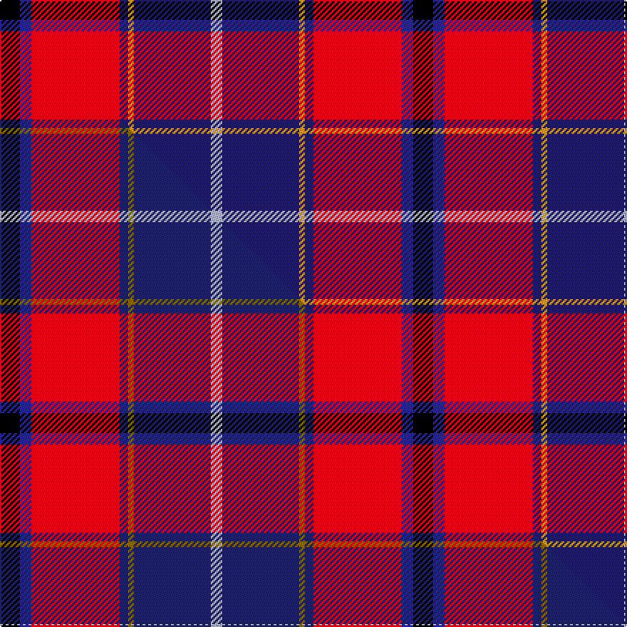

This page is one **sett** — a single exact thread-count. It belongs to the [tartan](/setts/k7dbi4r31db3lo2db27lb4/)
(the same proportion at any scale), whose colour order is pattern [KBRBYBW](/stripes/kbrbybw/).

Part of the [Wishart Dress](/tartans/wishart-dress/) tartan — the named design grouping this sett with its other cloths.

Sourced from tartans-authority.  It is a [7 stripe tartan](/stripes/stripes7/).

Original link https://www.tartanregister.gov.uk/tartanDetails.aspx?ref=2104

Dataset <small>— provenance for this record, inherited from the source manifest</small>

<dl class="dataset-prov">
<dt>source</dt><dd><a href="/sources/tartans-authority/">Scottish Tartans Authority</a></dd>
<dt>data captured from</dt><dd><a href="https://github.com/thetartan/tartan-database/blob/master/data/tartans-authority/data.csv">https://github.com/thetartan/tartan-database/blob/master/data/tartans-authority/data.csv</a></dd>
<dt>data date</dt><dd>1990 <small>(this record)</small></dd>
<dt>licence</dt><dd><a href="https://creativecommons.org/licenses/by-nc-nd/4.0/">CC BY-NC-ND 4.0</a></dd>
</dl>

Capture chain <small>— the hands this data passed through, oldest first; each capture carries its own licence</small>

<ol class="capture-chain">
<li><a href="https://www.tartansauthority.com/">Scottish Tartans Authority</a> <small>the heritage body's archive — its tartan-ferret record browser is retired (links repaired to the SRT, above)</small></li>
<li><a href="https://github.com/thetartan/tartan-database">thetartan/tartan-database</a> <small>2016-2017</small> · <a href="https://creativecommons.org/licenses/by-nc-nd/4.0/">CC BY-NC-ND 4.0</a> <small>Levko Kravets's frozen compilation — the capture we vendored, and where its CC licence text came from</small></li>
<li>this dictionary <small>captured 2026-06-10 · commit 5bf86c7566</small> <small>each re-capture is a git commit to data/sources</small></li>
</ol>

## Register references

External register numbers recorded for this tartan.

- Scottish Tartans Authority (ITI): 2104

## Thread count
K/14 DBi8 R62 DB6 LO4 DB54 LB/8

One full sett is **290 threads**.

## Palette
<table><thead><tr><th>Colour</th><th>Shade</th><th>OKLCh</th></tr></thead><tbody><tr><td>DB</td><td><code style="background-color:#2C2C80;">#2C2C80</code> <small style="color:#888">#2C2C80</small></td><td><small style="color:#888">oklch(35.0% 0.138 276.6)</small></td></tr><tr><td>DB</td><td><code style="background-color:#202060;">#202060</code> <small style="color:#888">#202060</small></td><td><small style="color:#888">oklch(28.9% 0.111 276.9)</small></td></tr><tr><td>K</td><td><code style="background-color:#000000;">#000000</code> <small style="color:#888">#000000</small></td><td><small style="color:#888">oklch(0.0% 0.000 0.0)</small></td></tr><tr><td>LB</td><td><code style="background-color:#B5BBDE;">#B5BBDE</code> <small style="color:#888">#B5BBDE</small></td><td><small style="color:#888">oklch(79.9% 0.050 277.6)</small></td></tr><tr><td>R</td><td><code style="background-color:#D60020;">#D60020</code> <small style="color:#888">#D60020</small></td><td><small style="color:#888">oklch(55.2% 0.224 25.5)</small></td></tr><tr><td>LO</td><td><code style="background-color:#FF9C34;">#FF9C34</code> <small style="color:#888">#FF9C34</small></td><td><small style="color:#888">oklch(77.9% 0.161 61.8)</small></td></tr></tbody></table>

# Sample pattern

## Compared to the master

This cloth is one sett of its design; the master sett (the exemplar the design is anchored on) is below for comparison.

Its **ΔTartan distance** from the master is **0.31** — the same measure the nearest-tartans table ranks by (0 is identical; a re-scale of the same cloth is near 0, a recolour or a different proportion further).

<figure class="master-compare" style="margin:0">

this sett
master sett ★

<figcaption style="color:#888;font-size:smaller">One weave of this sett against the <a href="/setts/k7dbi4r31db3y2db27lb4/">master sett ★</a>, split on the diagonal: a shared proportion runs seamlessly across it with only the shades shifting; a different proportion breaks on it.</figcaption>
</figure>

## Nearest tartan variants

The nearest existing variants by ΔTartan distance, with this cloth at the top so the swatches line up against it.

ΔTartan

Threads

Variant

Sett

—

290

<a href="/variants/s7/k7dbi4r31db3lo2db27lb4~x2~dbi1406275-db1204274/">Wishart Dress (Clan)</a>

<a href="/ttd/edit/#slug=k7db4r31dt3y2dt27lb4~x2~db1406275-dt1204274&amp;base=k7dbi4r31db3lo2db27lb4~x2~dbi1406275-db1204274" title="compare in the TTD">0.30</a>

290

<a href="/variants/s7/k7dbi4r31db3y2db27lb4~x2~dbi1406275-db1204274/">Wishart Dress</a>

<a href="/ttd/edit/#slug=k2db2r16dt2y1dt13w2~x2~db1406275-dt1204274&amp;base=k7dbi4r31db3lo2db27lb4~x2~dbi1406275-db1204274" title="compare in the TTD">0.73</a>

144

<a href="/variants/s7/k2dbi2r16db2y1db13w2~x2~dbi1406275-db1204274/">Wishart Dress Family Tartan</a>

<a href="/ttd/edit/#slug=k2n2r16db2y1db13w2~x2~n1604274-db0805267&amp;base=k7dbi4r31db3lo2db27lb4~x2~dbi1406275-db1204274" title="compare in the TTD">0.76</a>

144

<a href="/variants/s7/k2dbi2r16db2y1db13w2~x2~dbi1604274-db0805267/">Wishart, dress</a>

<a href="/ttd/edit/#slug=k2y1k2y8r29n9db24w2db2~x2&amp;base=k7dbi4r31db3lo2db27lb4~x2~dbi1406275-db1204274" title="compare in the TTD">2.13</a>

308

<a href="/variants/s9/k2y1k2y8r29n9db24w2db2~x2/">Lermontov</a>

<a href="/ttd/edit/#slug=k2dy1k2dy8r29n9dt24w2dt2~x2~dt1204274&amp;base=k7dbi4r31db3lo2db27lb4~x2~dbi1406275-db1204274" title="compare in the TTD">2.13</a>

308

<a href="/variants/s9/k2dy1k2dy8r29n9db24w2db2~x2~db1204274/">Lermontov Family Tartan</a>

<a href="/ttd/edit/#slug=dg3b3r22k5ki22y2~x2~ki0604259&amp;base=k7dbi4r31db3lo2db27lb4~x2~dbi1406275-db1204274" title="compare in the TTD">2.22</a>

218

<a href="/variants/s6/dg3b3r22k5ki22y2~x2~ki0604259/">Clan MacLeod Society of Scotland, Centenary</a>

<a href="/ttd/edit/#slug=dg3g3r22k5db22dy2~x2~dg1806142-g2408144&amp;base=k7dbi4r31db3lo2db27lb4~x2~dbi1406275-db1204274" title="compare in the TTD">2.44</a>

218

<a href="/variants/s6/dg3g3r22k5db22dy2~x2~dg1806142-g2408144/">MacLeod Society of Scotland</a>

<a href="/ttd/edit/#slug=k4db12lb3db4g8lo2r24db4r4~x2&amp;base=k7dbi4r31db3lo2db27lb4~x2~dbi1406275-db1204274" title="compare in the TTD">2.45</a>

244

<a href="/variants/s9/k4db12lb3db4g8lo2r24db4r4~x2/">MacCreary (Personal)</a>

<a href="/ttd/edit/#slug=k3g1r1db6n2db1n1db1r10w1~x4&amp;base=k7dbi4r31db3lo2db27lb4~x2~dbi1406275-db1204274" title="compare in the TTD">2.47</a>

200

<a href="/variants/s10/k3g1r1db6n2db1n1db1r10w1~x4/">Crieff Primary School</a>

<a href="/ttd/edit/#slug=db4dy3db22n6w2k6w2r26k3r4~x2~db1406275&amp;base=k7dbi4r31db3lo2db27lb4~x2~dbi1406275-db1204274" title="compare in the TTD">2.52</a>

296

<a href="/variants/s10/db4dy3db22n6w2k6w2r26k3r4~x2~db1406275/">Asman Red (Personal)</a>

## Neighbour map

Every grey dot is one of 13620 variants placed by the first two principal components of the ΔTartan feature space (42% of its variance). Red is this tartan; blue dots are its nearest — click one to open its page.

<svg viewBox="0 0 640 380" role="img" style="max-width:100%;height:auto;border:1px solid #e0e0e0;border-radius:4px;display:block" xmlns="http://www.w3.org/2000/svg"><image href="/nn/cloud.v1.png" width="640" height="380"/><a href="/variants/s7/k7dbi4r31db3y2db27lb4~x2~dbi1406275-db1204274/"><circle cx="213.9" cy="112.6" r="4" fill="#3465a4"><title>Wishart Dress</title></circle></a><a href="/variants/s7/k2dbi2r16db2y1db13w2~x2~dbi1406275-db1204274/"><circle cx="208.1" cy="123.0" r="4" fill="#3465a4"><title>Wishart Dress Family Tartan</title></circle></a><a href="/variants/s7/k2dbi2r16db2y1db13w2~x2~dbi1604274-db0805267/"><circle cx="193.4" cy="119.2" r="4" fill="#3465a4"><title>Wishart, dress</title></circle></a><a href="/variants/s9/k2y1k2y8r29n9db24w2db2~x2/"><circle cx="187.6" cy="91.8" r="4" fill="#3465a4"><title>Lermontov</title></circle></a><a href="/variants/s9/k2dy1k2dy8r29n9db24w2db2~x2~db1204274/"><circle cx="195.9" cy="93.2" r="4" fill="#3465a4"><title>Lermontov Family Tartan</title></circle></a><a href="/variants/s6/dg3b3r22k5ki22y2~x2~ki0604259/"><circle cx="153.0" cy="145.1" r="4" fill="#3465a4"><title>Clan MacLeod Society of Scotland, Centenary</title></circle></a><a href="/variants/s6/dg3g3r22k5db22dy2~x2~dg1806142-g2408144/"><circle cx="164.6" cy="152.1" r="4" fill="#3465a4"><title>MacLeod Society of Scotland</title></circle></a><a href="/variants/s9/k4db12lb3db4g8lo2r24db4r4~x2/"><circle cx="161.5" cy="132.0" r="4" fill="#3465a4"><title>MacCreary (Personal)</title></circle></a><a href="/variants/s10/k3g1r1db6n2db1n1db1r10w1~x4/"><circle cx="148.4" cy="124.5" r="4" fill="#3465a4"><title>Crieff Primary School</title></circle></a><a href="/variants/s10/db4dy3db22n6w2k6w2r26k3r4~x2~db1406275/"><circle cx="151.0" cy="114.2" r="4" fill="#3465a4"><title>Asman Red (Personal)</title></circle></a><circle cx="190.6" cy="128.0" r="5" fill="#c00000"/><text x="320" y="376" text-anchor="middle" font-size="11" fill="#999">ground</text><text x="11" y="190" text-anchor="middle" font-size="11" fill="#999" transform="rotate(-90 11 190)">complexity</text></svg>

ID: /variants/s7/k7dbi4r31db3lo2db27lb4~x2~dbi1406275-db1204274/
