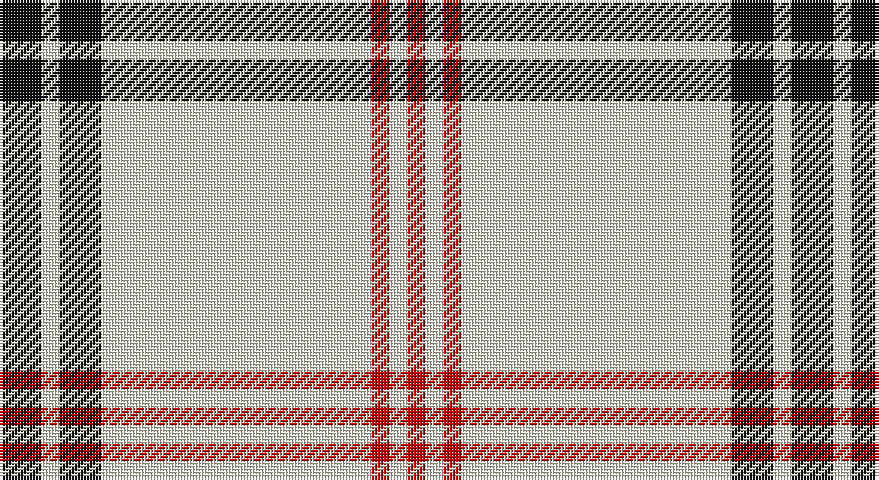

This page is one **sett** — a single exact thread-count. It belongs to the [tartan](/setts/k7w3k7w45r3w3r3/)
(the same proportion at any scale), whose colour order is pattern [KWKWRWR](/stripes/kwkwrwr/).

Sourced from tartans-authority.  It is a [7 stripe tartan](/stripes/stripes7/).

Original link http://www.tartansauthority.com/tartan-ferret/display/7461/

## Also known as

This cloth is also recorded under:

- White Stripes, The

2 attestations — the source records this cloth was collapsed from (oldest owns this page)

<ul>
<li>pre 2008 — White Stripes (Corporate) (tartans-authority, <a href="http://www.tartansauthority.com/tartan-ferret/display/7461/">record</a>)</li>
<li>undated — White Stripes, The (register-of-tartans, <a href="https://www.tartanregister.gov.uk/tartanDetails.aspx?ref=5507">record</a>)</li>
</ul>

## Register references

External register numbers recorded for this tartan.

- Scottish Register of Tartans: [5507](https://www.tartanregister.gov.uk/tartanDetails.aspx?ref=5507)
- Scottish Tartans Authority (ITI): 7461

## Thread count
K/14 LY6 K14 LY90 R6 LY6 R/6

One full sett is **264 threads**.

## Palette

Palette: <strong>Tartan Register</strong> <small style="color:#888">(2 of 3 colours)</small>
<table><thead><tr><th>Colour</th><th>Threads</th><th>Shade</th><th>Base</th><th>OKLCh</th></tr></thead><tbody><tr><td>K/</td><td style="text-align:right;font-variant-numeric:tabular-nums">14</td><td><code style="background-color:#101010;">#101010</code> <small style="color:#888">#101010</small></td><td>K <code style="background-color:#000000;">#000000</code></td><td><small style="color:#888">oklch(17.3% 0.000 89.9)</small></td></tr><tr><td>LY</td><td style="text-align:right;font-variant-numeric:tabular-nums">6</td><td><code style="background-color:#F0F0D8;">#F0F0D8</code> <small style="color:#888">#F0F0D8</small></td><td>W <code style="background-color:#F7F7F7;">#F7F7F7</code></td><td><small style="color:#888">oklch(94.9% 0.032 107.0)</small></td></tr><tr><td>K</td><td style="text-align:right;font-variant-numeric:tabular-nums">14</td><td><code style="background-color:#101010;">#101010</code> <small style="color:#888">#101010</small></td><td>K <code style="background-color:#000000;">#000000</code></td><td><small style="color:#888">oklch(17.3% 0.000 89.9)</small></td></tr><tr><td>LY</td><td style="text-align:right;font-variant-numeric:tabular-nums">90</td><td><code style="background-color:#F0F0D8;">#F0F0D8</code> <small style="color:#888">#F0F0D8</small></td><td>W <code style="background-color:#F7F7F7;">#F7F7F7</code></td><td><small style="color:#888">oklch(94.9% 0.032 107.0)</small></td></tr><tr><td>R</td><td style="text-align:right;font-variant-numeric:tabular-nums">6</td><td><code style="background-color:#C80000;">#C80000</code> <small style="color:#888">#C80000</small></td><td>R <code style="background-color:#CC0000;">#CC0000</code></td><td><small style="color:#888">oklch(52.3% 0.215 29.2)</small></td></tr><tr><td>LY</td><td style="text-align:right;font-variant-numeric:tabular-nums">6</td><td><code style="background-color:#F0F0D8;">#F0F0D8</code> <small style="color:#888">#F0F0D8</small></td><td>W <code style="background-color:#F7F7F7;">#F7F7F7</code></td><td><small style="color:#888">oklch(94.9% 0.032 107.0)</small></td></tr><tr><td>R/</td><td style="text-align:right;font-variant-numeric:tabular-nums">6</td><td><code style="background-color:#C80000;">#C80000</code> <small style="color:#888">#C80000</small></td><td>R <code style="background-color:#CC0000;">#CC0000</code></td><td><small style="color:#888">oklch(52.3% 0.215 29.2)</small></td></tr></tbody></table>

# Sample pattern

## Nearest tartans

The nearest existing variants by ΔTartan distance, with this tartan at the top so the swatches line up against it.

ΔTartan

Tartan

Sett

—

<a href="/ttd/edit/#slug=k7w3k7w45r3w3r3~x2">White Stripes (Corporate)</a> <a class="nn-out" href="/variants/s7/k7w3k7w45r3w3r3~x2/" title="open its dictionary page">↗</a>

1.38

<a href="/ttd/edit/#slug=r2w2k2w28k8w9k1ly2~x2&amp;base=k7w3k7w45r3w3r3~x2">Summer Spirit (Fashion)</a> <a class="nn-out" href="/variants/s8/r2w2k2w28k8w9k1ly2~x2/" title="open its dictionary page">↗</a>

1.40

<a href="/ttd/edit/#slug=w20k2w20lo5k3w3lo4k2&amp;base=k7w3k7w45r3w3r3~x2">Guzzo Dress (Personal)</a> <a class="nn-out" href="/variants/s8/w20k2w20lo5k3w3lo4k2/" title="open its dictionary page">↗</a>

1.42

<a href="/ttd/edit/#slug=w93o6w13db35w12o6&amp;base=k7w3k7w45r3w3r3~x2">Butties</a> <a class="nn-out" href="/variants/s6/w93o6w13db35w12o6/" title="open its dictionary page">↗</a>

1.69

<a href="/ttd/edit/#slug=w20k2w20ly5k3w3ly4k2&amp;base=k7w3k7w45r3w3r3~x2">Guzzo Dress (Montreal, Canada) (Personal)</a> <a class="nn-out" href="/variants/s8/w20k2w20ly5k3w3ly4k2/" title="open its dictionary page">↗</a>

1.73

<a href="/ttd/edit/#slug=lr18k1ly3k1lr2r2k2r2lr2~x4&amp;base=k7w3k7w45r3w3r3~x2">Anthony Plaid Ecru</a> <a class="nn-out" href="/variants/s9/lr18k1ly3k1lr2r2k2r2lr2~x4/" title="open its dictionary page">↗</a>

1.80

<a href="/ttd/edit/#slug=db6db3ly3db2ly3db4ly48db4&amp;base=k7w3k7w45r3w3r3~x2">Morris (Welsh Name)</a> <a class="nn-out" href="/variants/s8/db6db3ly3db2ly3db4ly48db4/" title="open its dictionary page">↗</a>

1.84

<a href="/ttd/edit/#slug=w15do6w1do3o3w1~x4&amp;base=k7w3k7w45r3w3r3~x2">Burns (Fashion)</a> <a class="nn-out" href="/variants/s6/w15do6w1do3o3w1~x4/" title="open its dictionary page">↗</a>

1.87

<a href="/variants/s4/w35ni12r2n2~x2/">Triplett, Jack Arnold</a>

1.89

<a href="/ttd/edit/#slug=w81dg6lo8dg8~x2&amp;base=k7w3k7w45r3w3r3~x2">Young in Australia</a> <a class="nn-out" href="/variants/s4/w81dg6lo8dg8~x2/" title="open its dictionary page">↗</a>

1.92

<a href="/ttd/edit/#slug=o8lb46db4lb4db4lb5y7lb7y7lb4db2~x2&amp;base=k7w3k7w45r3w3r3~x2">Shaw of Tordarroch, Mrs (Personal)</a> <a class="nn-out" href="/variants/s11/o8lb46db4lb4db4lb5y7lb7y7lb4db2~x2/" title="open its dictionary page">↗</a>

## Neighbour map

Every grey dot is one of 14360 variants placed by the first two principal components of the ΔTartan feature space (44% of its variance). Red is this tartan; blue dots are its nearest — click one to open its page.

<svg viewBox="0 0 640 380" role="img" style="max-width:100%;height:auto;border:1px solid #e0e0e0;border-radius:4px;display:block" xmlns="http://www.w3.org/2000/svg"><image href="/nn/cloud.v1.png" width="640" height="380"/><a href="/variants/s8/r2w2k2w28k8w9k1ly2~x2/"><circle cx="412.5" cy="97.2" r="4" fill="#3465a4"><title>Summer Spirit (Fashion)</title></circle></a><a href="/variants/s8/w20k2w20lo5k3w3lo4k2/"><circle cx="399.2" cy="174.6" r="4" fill="#3465a4"><title>Guzzo Dress (Personal)</title></circle></a><a href="/variants/s6/w93o6w13db35w12o6/"><circle cx="405.8" cy="156.5" r="4" fill="#3465a4"><title>Butties</title></circle></a><a href="/variants/s8/w20k2w20ly5k3w3ly4k2/"><circle cx="384.3" cy="165.3" r="4" fill="#3465a4"><title>Guzzo Dress (Montreal, Canada) (Personal)</title></circle></a><a href="/variants/s9/lr18k1ly3k1lr2r2k2r2lr2~x4/"><circle cx="381.9" cy="115.8" r="4" fill="#3465a4"><title>Anthony Plaid Ecru</title></circle></a><a href="/variants/s8/db6db3ly3db2ly3db4ly48db4/"><circle cx="471.7" cy="113.0" r="4" fill="#3465a4"><title>Morris (Welsh Name)</title></circle></a><a href="/variants/s6/w15do6w1do3o3w1~x4/"><circle cx="321.6" cy="166.6" r="4" fill="#3465a4"><title>Burns (Fashion)</title></circle></a><a href="/variants/s4/w35ni12r2n2~x2/"><circle cx="391.9" cy="163.4" r="4" fill="#3465a4"><title>Triplett, Jack Arnold</title></circle></a><a href="/variants/s4/w81dg6lo8dg8~x2/"><circle cx="495.6" cy="184.1" r="4" fill="#3465a4"><title>Young in Australia</title></circle></a><a href="/variants/s11/o8lb46db4lb4db4lb5y7lb7y7lb4db2~x2/"><circle cx="395.2" cy="100.3" r="4" fill="#3465a4"><title>Shaw of Tordarroch, Mrs (Personal)</title></circle></a><circle cx="418.5" cy="134.0" r="5" fill="#c00000"/></svg>

ID: /variants/s7/k7w3k7w45r3w3r3~x2/
