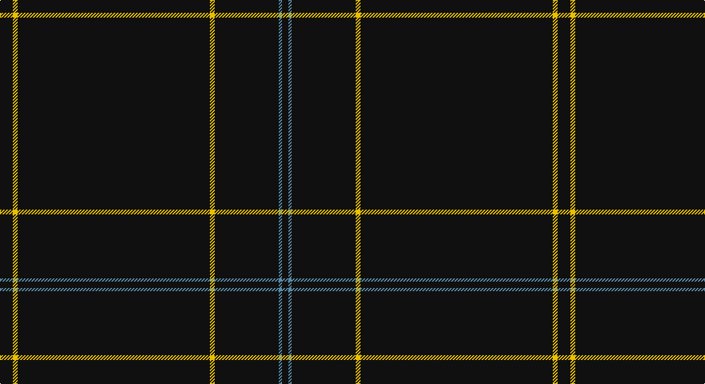

This page is one **sett** — a single exact thread-count. It belongs to the [tartan](/setts/k8ly3k120ly3k40t2k4/)
(the same proportion at any scale), whose colour order is pattern [KBKYKYK](/stripes/kbkykyk/).

Part of the [Lochaber](/tartans/lochaber/) tartan — the named design grouping this sett with its other cloths.

Sourced from register-of-tartans.  It is a [7 stripe tartan](/stripes/stripes7/).

Original link https://www.tartanregister.gov.uk/tartanDetails.aspx?ref=2162

## Also known as

This cloth is also recorded under:

- Lochaber #2
- Lochaber #3

## Register references

External register numbers recorded for this tartan.

- Scottish Register of Tartans: [2162](https://www.tartanregister.gov.uk/tartanDetails.aspx?ref=2162)
- Scottish Tartans Authority (ITI): 5712

## Thread count
K/16 Y6 K240 Y6 K80 B4 K/8

One full sett is **696 threads**.

## Palette

Palette: <strong>Tartan Register</strong>
<table><thead><tr><th>Colour</th><th>Threads</th><th>Shade</th><th>Base</th><th>OKLCh</th></tr></thead><tbody><tr><td>K/</td><td style="text-align:right;font-variant-numeric:tabular-nums">16</td><td><code style="background-color:#101010;">#101010</code> <small style="color:#888">#101010</small></td><td>K <code style="background-color:#000000;">#000000</code></td><td><small style="color:#888">oklch(17.3% 0.000 89.9)</small></td></tr><tr><td>Y</td><td style="text-align:right;font-variant-numeric:tabular-nums">6</td><td><code style="background-color:#E8C000;">#E8C000</code> <small style="color:#888">#E8C000</small></td><td>Y <code style="background-color:#F2BF00;">#F2BF00</code></td><td><small style="color:#888">oklch(81.9% 0.168 93.7)</small></td></tr><tr><td>K</td><td style="text-align:right;font-variant-numeric:tabular-nums">240</td><td><code style="background-color:#101010;">#101010</code> <small style="color:#888">#101010</small></td><td>K <code style="background-color:#000000;">#000000</code></td><td><small style="color:#888">oklch(17.3% 0.000 89.9)</small></td></tr><tr><td>Y</td><td style="text-align:right;font-variant-numeric:tabular-nums">6</td><td><code style="background-color:#E8C000;">#E8C000</code> <small style="color:#888">#E8C000</small></td><td>Y <code style="background-color:#F2BF00;">#F2BF00</code></td><td><small style="color:#888">oklch(81.9% 0.168 93.7)</small></td></tr><tr><td>K</td><td style="text-align:right;font-variant-numeric:tabular-nums">80</td><td><code style="background-color:#101010;">#101010</code> <small style="color:#888">#101010</small></td><td>K <code style="background-color:#000000;">#000000</code></td><td><small style="color:#888">oklch(17.3% 0.000 89.9)</small></td></tr><tr><td>B</td><td style="text-align:right;font-variant-numeric:tabular-nums">4</td><td><code style="background-color:#5C8CA8;">#5C8CA8</code> <small style="color:#888">#5C8CA8</small></td><td>B <code style="background-color:#2A418A;">#2A418A</code></td><td><small style="color:#888">oklch(61.7% 0.067 235.0)</small></td></tr><tr><td>K/</td><td style="text-align:right;font-variant-numeric:tabular-nums">8</td><td><code style="background-color:#101010;">#101010</code> <small style="color:#888">#101010</small></td><td>K <code style="background-color:#000000;">#000000</code></td><td><small style="color:#888">oklch(17.3% 0.000 89.9)</small></td></tr></tbody></table>

# Sample pattern

## Compared to the master

This cloth is one sett of its design; the master sett (the exemplar the design is anchored on) is below for comparison.

<figure style="margin:0"><figcaption style="color:#888;font-size:smaller">this sett</figcaption></figure>
<figure style="margin:0"><figcaption style="color:#888;font-size:smaller"><a href="/setts/g4t2db33r2k35g33k1r2k1g4/">master sett →</a></figcaption></figure>

## Nearest tartans

The nearest existing variants by ΔTartan distance, with this tartan at the top so the swatches line up against it.

ΔTartan

Tartan

Sett

—

<a href="/ttd/edit/#slug=k8ly3k120ly3k40t2k4~x2">Lochaber (Hesketh)</a> <a class="nn-out" href="/variants/s7/k8ly3k120ly3k40t2k4~x2/" title="open its dictionary page">↗</a>

1.53

<a href="/ttd/edit/#slug=k160w6k2w3k3~x2&amp;base=k8ly3k120ly3k40t2k4~x2">Black Camel Tartan</a> <a class="nn-out" href="/variants/s5/k160w6k2w3k3~x2/" title="open its dictionary page">↗</a>

1.63

<a href="/ttd/edit/#slug=k31r2k10db1k1w1~x4&amp;base=k8ly3k120ly3k40t2k4~x2">NewGeneration Alchemy (NGA) Inc</a> <a class="nn-out" href="/variants/s6/k31r2k10db1k1w1~x4/" title="open its dictionary page">↗</a>

1.66

<a href="/ttd/edit/#slug=k200dy3lo3dy3lo3&amp;base=k8ly3k120ly3k40t2k4~x2">SmartWool</a> <a class="nn-out" href="/variants/s5/k200dy3lo3dy3lo3/" title="open its dictionary page">↗</a>

1.72

<a href="/ttd/edit/#slug=dg60r2dg8r1dg5w2&amp;base=k8ly3k120ly3k40t2k4~x2">St. David's Welsh District Tartan</a> <a class="nn-out" href="/variants/s6/dg60r2dg8r1dg5w2/" title="open its dictionary page">↗</a>

1.74

<a href="/ttd/edit/#slug=r2k50n2r1~x2&amp;base=k8ly3k120ly3k40t2k4~x2">Galloway (Name)</a> <a class="nn-out" href="/variants/s4/r2k50n2r1~x2/" title="open its dictionary page">↗</a>

1.84

<a href="/ttd/edit/#slug=k72r3k11t9k11r3k37&amp;base=k8ly3k120ly3k40t2k4~x2">Chafyn House (School)</a> <a class="nn-out" href="/variants/s7/k72r3k11t9k11r3k37/" title="open its dictionary page">↗</a>

1.90

<a href="/ttd/edit/#slug=k184r1k2r2k2r1k2w1k6w1k4r10k20&amp;base=k8ly3k120ly3k40t2k4~x2">Edinburgh International Film Festival</a> <a class="nn-out" href="/variants/s13/k184r1k2r2k2r1k2w1k6w1k4r10k20/" title="open its dictionary page">↗</a>

2.25

<a href="/ttd/edit/#slug=dg30r2dg8r1dg5w2dg5r1dg8r2dg30&amp;base=k8ly3k120ly3k40t2k4~x2">Brithwe Dewi Sant (Welsh)</a> <a class="nn-out" href="/variants/s11/dg30r2dg8r1dg5w2dg5r1dg8r2dg30/" title="open its dictionary page">↗</a>

2.33

<a href="/ttd/edit/#slug=do10ly1do30y3~x4&amp;base=k8ly3k120ly3k40t2k4~x2">Pasteur Fancy Tartan</a> <a class="nn-out" href="/variants/s4/do10ly1do30y3~x4/" title="open its dictionary page">↗</a>

2.35

<a href="/ttd/edit/#slug=r2k50y2r1~x2&amp;base=k8ly3k120ly3k40t2k4~x2">Galloway Family</a> <a class="nn-out" href="/variants/s4/r2k50y2r1~x2/" title="open its dictionary page">↗</a>

## Neighbour map

Every grey dot is one of 14360 variants placed by the first two principal components of the ΔTartan feature space (44% of its variance). Red is this tartan; blue dots are its nearest — click one to open its page.

<svg viewBox="0 0 640 380" role="img" style="max-width:100%;height:auto;border:1px solid #e0e0e0;border-radius:4px;display:block" xmlns="http://www.w3.org/2000/svg"><image href="/nn/cloud.v1.png" width="640" height="380"/><a href="/variants/s5/k160w6k2w3k3~x2/"><circle cx="626.0" cy="177.4" r="4" fill="#3465a4"><title>Black Camel Tartan</title></circle></a><a href="/variants/s6/k31r2k10db1k1w1~x4/"><circle cx="626.0" cy="172.5" r="4" fill="#3465a4"><title>NewGeneration Alchemy (NGA) Inc</title></circle></a><a href="/variants/s5/k200dy3lo3dy3lo3/"><circle cx="626.0" cy="190.9" r="4" fill="#3465a4"><title>SmartWool</title></circle></a><a href="/variants/s6/dg60r2dg8r1dg5w2/"><circle cx="626.0" cy="171.0" r="4" fill="#3465a4"><title>St. David's Welsh District Tartan</title></circle></a><a href="/variants/s4/r2k50n2r1~x2/"><circle cx="626.0" cy="204.2" r="4" fill="#3465a4"><title>Galloway (Name)</title></circle></a><a href="/variants/s7/k72r3k11t9k11r3k37/"><circle cx="626.0" cy="214.1" r="4" fill="#3465a4"><title>Chafyn House (School)</title></circle></a><a href="/variants/s13/k184r1k2r2k2r1k2w1k6w1k4r10k20/"><circle cx="626.0" cy="111.8" r="4" fill="#3465a4"><title>Edinburgh International Film Festival</title></circle></a><a href="/variants/s11/dg30r2dg8r1dg5w2dg5r1dg8r2dg30/"><circle cx="626.0" cy="181.5" r="4" fill="#3465a4"><title>Brithwe Dewi Sant (Welsh)</title></circle></a><a href="/variants/s4/do10ly1do30y3~x4/"><circle cx="626.0" cy="232.1" r="4" fill="#3465a4"><title>Pasteur Fancy Tartan</title></circle></a><a href="/variants/s4/r2k50y2r1~x2/"><circle cx="626.0" cy="184.7" r="4" fill="#3465a4"><title>Galloway Family</title></circle></a><circle cx="626.0" cy="169.4" r="5" fill="#c00000"/></svg>

ID: /variants/s7/k8ly3k120ly3k40t2k4~x2/
