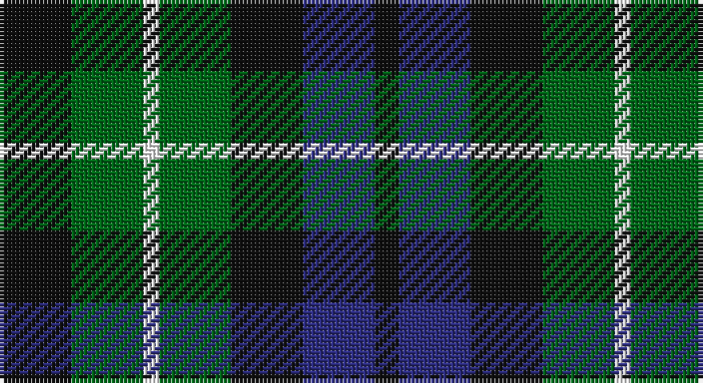

This page is one **sett** — a single exact thread-count. It belongs to the [tartan](/setts/k9g9w2g9k9db9k3/)
(the same proportion at any scale), whose colour order is pattern [KBKGWGK](/stripes/kbkgwgk/).

Part of the [Graham of Montrose](/tartans/graham-of-montrose/) tartan — the named design grouping this sett with its other cloths.

Sourced from tartans-authority.  It is a [7 stripe tartan](/stripes/stripes7/).

Original link http://www.tartansauthority.com/tartan-ferret/display/1044/

## Also known as

This cloth is also recorded under:

- Graham of Montrose #2
- Graham of Montrose #3
- Graham of Montrose Red

## Register references

External register numbers recorded for this tartan.

- Scottish Tartans Authority (ITI): 1044

## Thread count
K/18 G18 W4 G18 K18 DB18 K/6

One full sett is **176 threads**.

## Palette

Palette: <strong>Tartan Register</strong>
<table><thead><tr><th>Colour</th><th>Threads</th><th>Shade</th><th>Base</th><th>OKLCh</th></tr></thead><tbody><tr><td>K/</td><td style="text-align:right;font-variant-numeric:tabular-nums">18</td><td><code style="background-color:#101010;">#101010</code> <small style="color:#888">#101010</small></td><td>K <code style="background-color:#000000;">#000000</code></td><td><small style="color:#888">oklch(17.3% 0.000 89.9)</small></td></tr><tr><td>G</td><td style="text-align:right;font-variant-numeric:tabular-nums">18</td><td><code style="background-color:#006818;">#006818</code> <small style="color:#888">#006818</small></td><td>G <code style="background-color:#006100;">#006100</code></td><td><small style="color:#888">oklch(45.0% 0.142 145.0)</small></td></tr><tr><td>W</td><td style="text-align:right;font-variant-numeric:tabular-nums">4</td><td><code style="background-color:#FCFCFC;">#FCFCFC</code> <small style="color:#888">#FCFCFC</small></td><td>W <code style="background-color:#F7F7F7;">#F7F7F7</code></td><td><small style="color:#888">oklch(99.1% 0.000 89.9)</small></td></tr><tr><td>G</td><td style="text-align:right;font-variant-numeric:tabular-nums">18</td><td><code style="background-color:#006818;">#006818</code> <small style="color:#888">#006818</small></td><td>G <code style="background-color:#006100;">#006100</code></td><td><small style="color:#888">oklch(45.0% 0.142 145.0)</small></td></tr><tr><td>K</td><td style="text-align:right;font-variant-numeric:tabular-nums">18</td><td><code style="background-color:#101010;">#101010</code> <small style="color:#888">#101010</small></td><td>K <code style="background-color:#000000;">#000000</code></td><td><small style="color:#888">oklch(17.3% 0.000 89.9)</small></td></tr><tr><td>DB</td><td style="text-align:right;font-variant-numeric:tabular-nums">18</td><td><code style="background-color:#2C2C80;">#2C2C80</code> <small style="color:#888">#2C2C80</small></td><td>B <code style="background-color:#2A418A;">#2A418A</code></td><td><small style="color:#888">oklch(35.0% 0.138 276.6)</small></td></tr><tr><td>K/</td><td style="text-align:right;font-variant-numeric:tabular-nums">6</td><td><code style="background-color:#101010;">#101010</code> <small style="color:#888">#101010</small></td><td>K <code style="background-color:#000000;">#000000</code></td><td><small style="color:#888">oklch(17.3% 0.000 89.9)</small></td></tr></tbody></table>

# Sample pattern

## Compared to the master

This cloth is one sett of its design; the master sett (the exemplar the design is anchored on) is below for comparison.

<figure style="margin:0"><figcaption style="color:#888;font-size:smaller">this sett</figcaption></figure>
<figure style="margin:0"><figcaption style="color:#888;font-size:smaller"><a href="/setts/db9k9g9w2g9k9g9w2g9k9db9k3/">master sett →</a></figcaption></figure>

## Nearest tartans

The nearest existing variants by ΔTartan distance, with this tartan at the top so the swatches line up against it.

ΔTartan

Tartan

Sett

—

<a href="/ttd/edit/#slug=k9g9w2g9k9db9k3~x2">Graham of Montrose - 1850 (Clan)</a> <a class="nn-out" href="/variants/s7/k9g9w2g9k9db9k3~x2/" title="open its dictionary page">↗</a>

0.89

<a href="/ttd/edit/#slug=db4dg6w1dg6k6db6k2~x2&amp;base=k9g9w2g9k9db9k3~x2">MacNeil of Colonsay</a> <a class="nn-out" href="/variants/s7/db4dg6w1dg6k6db6k2~x2/" title="open its dictionary page">↗</a>

0.89

<a href="/ttd/edit/#slug=k13g12w2g12k13dp12k2~x2&amp;base=k9g9w2g9k9db9k3~x2">MacLaggan</a> <a class="nn-out" href="/variants/s7/k13g12w2g12k13dp12k2~x2/" title="open its dictionary page">↗</a>

0.91

<a href="/ttd/edit/#slug=k11dg12k2dg12k12dp12w3~x2&amp;base=k9g9w2g9k9db9k3~x2">Wilson's No 97</a> <a class="nn-out" href="/variants/s7/k11dg12k2dg12k12dp12w3~x2/" title="open its dictionary page">↗</a>

1.00

<a href="/ttd/edit/#slug=k4dg4ly1dg4k4db4k1~x2&amp;base=k9g9w2g9k9db9k3~x2">MacKay Coat</a> <a class="nn-out" href="/variants/s7/k4dg4ly1dg4k4db4k1~x2/" title="open its dictionary page">↗</a>

1.00

<a href="/ttd/edit/#slug=k4dg4k1dg4k4db4ly1~x2&amp;base=k9g9w2g9k9db9k3~x2">Unidentified No 39</a> <a class="nn-out" href="/variants/s7/k4dg4k1dg4k4db4ly1~x2/" title="open its dictionary page">↗</a>

1.06

<a href="/ttd/edit/#slug=k9g9ly2g9k9db9k3~x2&amp;base=k9g9w2g9k9db9k3~x2">Campbell of Breadalbane (Clan)</a> <a class="nn-out" href="/variants/s7/k9g9ly2g9k9db9k3~x2/" title="open its dictionary page">↗</a>

1.07

<a href="/ttd/edit/#slug=db4g6w1g6k6db6k2~x4&amp;base=k9g9w2g9k9db9k3~x2">MacNeil of Colonsay</a> <a class="nn-out" href="/variants/s7/db4g6w1g6k6db6k2~x4/" title="open its dictionary page">↗</a>

1.13

<a href="/ttd/edit/#slug=db9k9g9w2g9k9g9w2g9k9db9k3~x2&amp;base=k9g9w2g9k9db9k3~x2">Graham of Montrose #2</a> <a class="nn-out" href="/variants/s12/db9k9g9w2g9k9g9w2g9k9db9k3~x2/" title="open its dictionary page">↗</a>

1.14

<a href="/ttd/edit/#slug=db4dg6lb1dg6k6db6k2~x2&amp;base=k9g9w2g9k9db9k3~x2">MacNeil of Colonsay</a> <a class="nn-out" href="/variants/s7/db4dg6lb1dg6k6db6k2~x2/" title="open its dictionary page">↗</a>

1.16

<a href="/ttd/edit/#slug=k8dg8k1dg8k8b8w2~x2&amp;base=k9g9w2g9k9db9k3~x2">Unidentified No 31</a> <a class="nn-out" href="/variants/s7/k8dg8k1dg8k8b8w2~x2/" title="open its dictionary page">↗</a>

## Neighbour map

Every grey dot is one of 14360 variants placed by the first two principal components of the ΔTartan feature space (44% of its variance). Red is this tartan; blue dots are its nearest — click one to open its page.

<svg viewBox="0 0 640 380" role="img" style="max-width:100%;height:auto;border:1px solid #e0e0e0;border-radius:4px;display:block" xmlns="http://www.w3.org/2000/svg"><image href="/nn/cloud.v1.png" width="640" height="380"/><a href="/variants/s7/db4dg6w1dg6k6db6k2~x2/"><circle cx="161.7" cy="281.1" r="4" fill="#3465a4"><title>MacNeil of Colonsay</title></circle></a><a href="/variants/s7/k13g12w2g12k13dp12k2~x2/"><circle cx="185.4" cy="267.6" r="4" fill="#3465a4"><title>MacLaggan</title></circle></a><a href="/variants/s7/k11dg12k2dg12k12dp12w3~x2/"><circle cx="165.1" cy="276.2" r="4" fill="#3465a4"><title>Wilson's No 97</title></circle></a><a href="/variants/s7/k4dg4ly1dg4k4db4k1~x2/"><circle cx="169.1" cy="306.5" r="4" fill="#3465a4"><title>MacKay Coat</title></circle></a><a href="/variants/s7/k4dg4k1dg4k4db4ly1~x2/"><circle cx="169.1" cy="306.5" r="4" fill="#3465a4"><title>Unidentified No 39</title></circle></a><a href="/variants/s7/k9g9ly2g9k9db9k3~x2/"><circle cx="129.0" cy="283.4" r="4" fill="#3465a4"><title>Campbell of Breadalbane (Clan)</title></circle></a><a href="/variants/s7/db4g6w1g6k6db6k2~x4/"><circle cx="119.8" cy="262.7" r="4" fill="#3465a4"><title>MacNeil of Colonsay</title></circle></a><a href="/variants/s12/db9k9g9w2g9k9g9w2g9k9db9k3~x2/"><circle cx="123.5" cy="268.3" r="4" fill="#3465a4"><title>Graham of Montrose #2</title></circle></a><a href="/variants/s7/db4dg6lb1dg6k6db6k2~x2/"><circle cx="145.7" cy="280.2" r="4" fill="#3465a4"><title>MacNeil of Colonsay</title></circle></a><a href="/variants/s7/k8dg8k1dg8k8b8w2~x2/"><circle cx="152.2" cy="253.5" r="4" fill="#3465a4"><title>Unidentified No 31</title></circle></a><circle cx="148.3" cy="290.3" r="5" fill="#c00000"/></svg>

ID: /variants/s7/k9g9w2g9k9db9k3~x2/
