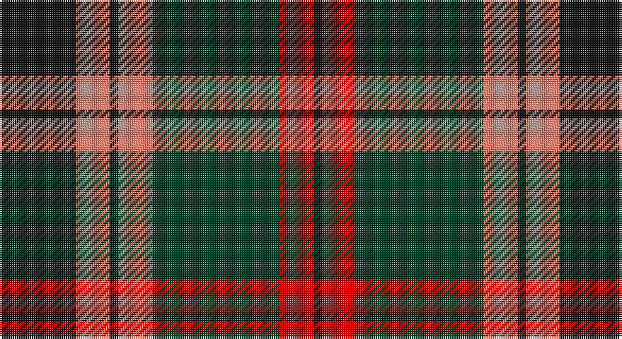

This page is one **sett** — a single exact thread-count. It belongs to the [tartan](/setts/k9lr4k1lr4dg15r4k1/)
(the same proportion at any scale), whose colour order is pattern [KRGYKYK](/stripes/krgykyk/).

Part of the [Logan](/tartans/logan/) tartan — the named design grouping this sett with its other cloths.

Sourced from tartans-authority.  It is a [7 stripe tartan](/stripes/stripes7/).

Original link http://www.tartansauthority.com/tartan-ferret/display/1150/

## Also known as

This cloth is also recorded under:

- Logan #2
- Logan #4
- Logan #5
- Logan #6
- Logan with Yellow
- Logan, with Yellow

## Register references

External register numbers recorded for this tartan.

- Scottish Tartans Authority (ITI): 1150

## Thread count
K/36 LR16 K4 LR16 DG60 R16 K/4

One full sett is **264 threads**.

## Palette

Palette: <strong>Tartan Register</strong> <small style="color:#888">(3 of 4 colours)</small>
<table><thead><tr><th>Colour</th><th>Threads</th><th>Shade</th><th>Base</th><th>OKLCh</th></tr></thead><tbody><tr><td>K/</td><td style="text-align:right;font-variant-numeric:tabular-nums">36</td><td><code style="background-color:#101010;">#101010</code> <small style="color:#888">#101010</small></td><td>K <code style="background-color:#000000;">#000000</code></td><td><small style="color:#888">oklch(17.3% 0.000 89.9)</small></td></tr><tr><td>LR</td><td style="text-align:right;font-variant-numeric:tabular-nums">16</td><td><code style="background-color:#E08070;">#E08070</code> <small style="color:#888">#E08070</small></td><td>Y <code style="background-color:#F2BF00;">#F2BF00</code></td><td><small style="color:#888">oklch(70.1% 0.122 30.4)</small></td></tr><tr><td>K</td><td style="text-align:right;font-variant-numeric:tabular-nums">4</td><td><code style="background-color:#101010;">#101010</code> <small style="color:#888">#101010</small></td><td>K <code style="background-color:#000000;">#000000</code></td><td><small style="color:#888">oklch(17.3% 0.000 89.9)</small></td></tr><tr><td>LR</td><td style="text-align:right;font-variant-numeric:tabular-nums">16</td><td><code style="background-color:#E08070;">#E08070</code> <small style="color:#888">#E08070</small></td><td>Y <code style="background-color:#F2BF00;">#F2BF00</code></td><td><small style="color:#888">oklch(70.1% 0.122 30.4)</small></td></tr><tr><td>DG</td><td style="text-align:right;font-variant-numeric:tabular-nums">60</td><td><code style="background-color:#003820;">#003820</code> <small style="color:#888">#003820</small></td><td>G <code style="background-color:#006100;">#006100</code></td><td><small style="color:#888">oklch(30.0% 0.070 158.3)</small></td></tr><tr><td>R</td><td style="text-align:right;font-variant-numeric:tabular-nums">16</td><td><code style="background-color:#C80000;">#C80000</code> <small style="color:#888">#C80000</small></td><td>R <code style="background-color:#CC0000;">#CC0000</code></td><td><small style="color:#888">oklch(52.3% 0.215 29.2)</small></td></tr><tr><td>K/</td><td style="text-align:right;font-variant-numeric:tabular-nums">4</td><td><code style="background-color:#101010;">#101010</code> <small style="color:#888">#101010</small></td><td>K <code style="background-color:#000000;">#000000</code></td><td><small style="color:#888">oklch(17.3% 0.000 89.9)</small></td></tr></tbody></table>

# Sample pattern

## Compared to the master

This cloth is one sett of its design; the master sett (the exemplar the design is anchored on) is below for comparison.

<figure style="margin:0"><figcaption style="color:#888;font-size:smaller">this sett</figcaption></figure>
<figure style="margin:0"><figcaption style="color:#888;font-size:smaller"><a href="/setts/dp8r3ly1r3dg14r3ly1/">master sett →</a></figcaption></figure>

## Nearest tartans

The nearest existing variants by ΔTartan distance, with this tartan at the top so the swatches line up against it.

ΔTartan

Tartan

Sett

—

<a href="/ttd/edit/#slug=k9lr4k1lr4dg15r4k1~x4">Logan - 1797 (Dark)</a> <a class="nn-out" href="/variants/s7/k9lr4k1lr4dg15r4k1~x4/" title="open its dictionary page">↗</a>

0.77

<a href="/ttd/edit/#slug=o2dr14o1k14o14ly2~x2&amp;base=k9lr4k1lr4dg15r4k1~x4">United Distillers</a> <a class="nn-out" href="/variants/s6/o2dr14o1k14o14ly2~x2/" title="open its dictionary page">↗</a>

0.78

<a href="/ttd/edit/#slug=w2k1dg16k12r12k1w2~x2&amp;base=k9lr4k1lr4dg15r4k1~x4">Prince Edward Island #2</a> <a class="nn-out" href="/variants/s7/w2k1dg16k12r12k1w2~x2/" title="open its dictionary page">↗</a>

0.86

<a href="/ttd/edit/#slug=dg12g6dg6r15k1r1k2~x2&amp;base=k9lr4k1lr4dg15r4k1~x4">Cook (Name)</a> <a class="nn-out" href="/variants/s7/dg12g6dg6r15k1r1k2~x2/" title="open its dictionary page">↗</a>

0.87

<a href="/ttd/edit/#slug=k3r8k3r8lo19r7dt36r3~x2&amp;base=k9lr4k1lr4dg15r4k1~x4">Private SA Club</a> <a class="nn-out" href="/variants/s8/k3r8k3r8lo19r7dt36r3~x2/" title="open its dictionary page">↗</a>

0.88

<a href="/ttd/edit/#slug=g8r2g12k6g3db6r24k4~x2&amp;base=k9lr4k1lr4dg15r4k1~x4">Dickie</a> <a class="nn-out" href="/variants/s8/g8r2g12k6g3db6r24k4~x2/" title="open its dictionary page">↗</a>

0.91

<a href="/ttd/edit/#slug=k3lo18dg6r17k31dg3~x2&amp;base=k9lr4k1lr4dg15r4k1~x4">MacMillan - 2002 (Black - Unofficial</a> <a class="nn-out" href="/variants/s6/k3lo18dg6r17k31dg3~x2/" title="open its dictionary page">↗</a>

0.94

<a href="/ttd/edit/#slug=g3r20g16k22lo6k3g2~x2&amp;base=k9lr4k1lr4dg15r4k1~x4">Wcwm 1062</a> <a class="nn-out" href="/variants/s7/g3r20g16k22lo6k3g2~x2/" title="open its dictionary page">↗</a>

0.97

<a href="/ttd/edit/#slug=k2r7k6g12ly1g1k2~x4&amp;base=k9lr4k1lr4dg15r4k1~x4">Blackstock Hunting</a> <a class="nn-out" href="/variants/s7/k2r7k6g12ly1g1k2~x4/" title="open its dictionary page">↗</a>

1.00

<a href="/ttd/edit/#slug=g22k3g1k3g2p8m1p8m16~x2&amp;base=k9lr4k1lr4dg15r4k1~x4">Queen of Scots</a> <a class="nn-out" href="/variants/s9/g22k3g1k3g2p8m1p8m16~x2/" title="open its dictionary page">↗</a>

1.00

<a href="/ttd/edit/#slug=dp9lr4dp1lr4g15r4dp1~x4&amp;base=k9lr4k1lr4dg15r4k1~x4">Logan #3</a> <a class="nn-out" href="/variants/s7/dp9lr4dp1lr4g15r4dp1~x4/" title="open its dictionary page">↗</a>

## Neighbour map

Every grey dot is one of 14360 variants placed by the first two principal components of the ΔTartan feature space (44% of its variance). Red is this tartan; blue dots are its nearest — click one to open its page.

<svg viewBox="0 0 640 380" role="img" style="max-width:100%;height:auto;border:1px solid #e0e0e0;border-radius:4px;display:block" xmlns="http://www.w3.org/2000/svg"><image href="/nn/cloud.v1.png" width="640" height="380"/><a href="/variants/s6/o2dr14o1k14o14ly2~x2/"><circle cx="204.0" cy="194.2" r="4" fill="#3465a4"><title>United Distillers</title></circle></a><a href="/variants/s7/w2k1dg16k12r12k1w2~x2/"><circle cx="191.0" cy="168.3" r="4" fill="#3465a4"><title>Prince Edward Island #2</title></circle></a><a href="/variants/s7/dg12g6dg6r15k1r1k2~x2/"><circle cx="252.7" cy="191.8" r="4" fill="#3465a4"><title>Cook (Name)</title></circle></a><a href="/variants/s8/k3r8k3r8lo19r7dt36r3~x2/"><circle cx="229.0" cy="173.9" r="4" fill="#3465a4"><title>Private SA Club</title></circle></a><a href="/variants/s8/g8r2g12k6g3db6r24k4~x2/"><circle cx="200.1" cy="181.3" r="4" fill="#3465a4"><title>Dickie</title></circle></a><a href="/variants/s6/k3lo18dg6r17k31dg3~x2/"><circle cx="217.6" cy="211.7" r="4" fill="#3465a4"><title>MacMillan - 2002 (Black - Unofficial</title></circle></a><a href="/variants/s7/g3r20g16k22lo6k3g2~x2/"><circle cx="179.2" cy="197.8" r="4" fill="#3465a4"><title>Wcwm 1062</title></circle></a><a href="/variants/s7/k2r7k6g12ly1g1k2~x4/"><circle cx="229.0" cy="196.0" r="4" fill="#3465a4"><title>Blackstock Hunting</title></circle></a><a href="/variants/s9/g22k3g1k3g2p8m1p8m16~x2/"><circle cx="230.8" cy="149.4" r="4" fill="#3465a4"><title>Queen of Scots</title></circle></a><a href="/variants/s7/dp9lr4dp1lr4g15r4dp1~x4/"><circle cx="210.4" cy="177.3" r="4" fill="#3465a4"><title>Logan #3</title></circle></a><circle cx="214.9" cy="186.2" r="5" fill="#c00000"/></svg>

ID: /variants/s7/k9lr4k1lr4dg15r4k1~x4/
